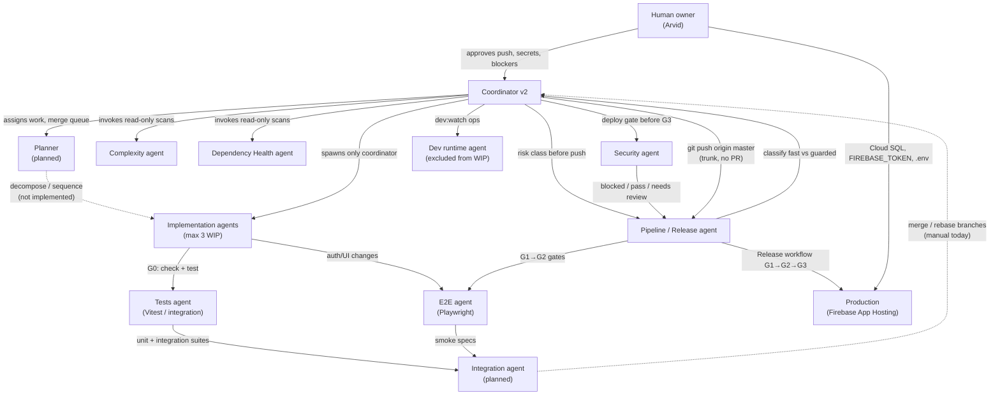
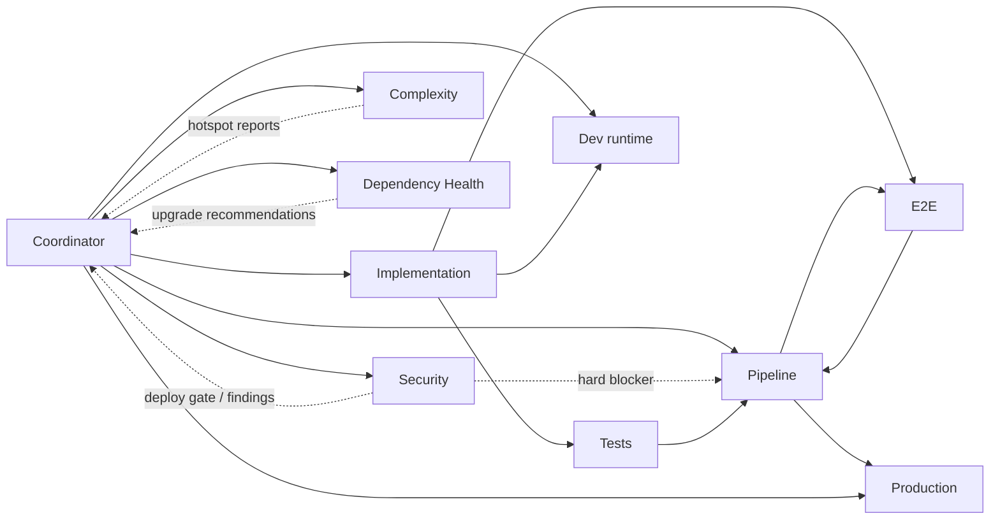

# Agent map

Visual index of the home-pantry multi-agent system: roles, permissions, worktrees, dependencies, and escalation.

**Maintained by:** Coordinator v2 — update this file whenever an agent is **added**, **paused**, **removed**, or **reassigned**.

**Related:** [AGENT_STATUS.md](./AGENT_STATUS.md) (live WIP) · [OWNERSHIP.md](./OWNERSHIP.md) · [MERGE_QUEUE.md](./MERGE_QUEUE.md) · [.cursor/rules/coordinator-v2.mdc](./.cursor/rules/coordinator-v2.mdc)

_Last updated: 2026-05-30 (Coordinator v2)._

---

## Purpose & maintenance

| Event | Coordinator action |
|-------|-------------------|
| New agent rule or `.cursor/agents/*.md` | Add row to catalog; add per-agent section; update Mermaid if role tier changes |
| Agent paused | Set status → **paused**; note in [AGENT_STATUS.md](./AGENT_STATUS.md) |
| Agent removed | Set status → **retired**; archive branch note; remove from active diagram edges |
| Worktree / branch reassignment | Update worktree map and OWNERSHIP row |
| Pipeline / infra change | Pipeline agent refreshes policy docs; coordinator updates status column here |

**Do not** treat this file as live queue status — use [AGENT_STATUS.md](./AGENT_STATUS.md) for slots, blockers, and base SHA.

---

## System diagram

**Delivery path (trunk-based):** G0 local → `git push origin master` → Actions **Release** (`quality` → `e2e` → `deploy`) → production. See [docs/CI_CD.md](./docs/CI_CD.md) · [RELEASE_PIPELINE.md](./RELEASE_PIPELINE.md).

---

## Agent catalog

| Agent | Category | Status | Rule / charter | Primary artifacts |
|-------|----------|--------|----------------|-------------------|
| **Human owner** | Governance | Active | — | `.env`, secrets, push approval, infra blockers |
| **Coordinator v2** | Orchestration | Active | [coordinator-v2.mdc](./.cursor/rules/coordinator-v2.mdc) | `AGENT_STATUS.md`, `MERGE_QUEUE.md`, `OWNERSHIP.md`, `AGENT_MAP.md`, `DELIVERY_METRICS.md` |
| **Planner** | Planning | Planned | — | Would own decomposition before impl spawn (no rule yet) |
| **Implementation agents** | Product | Active (dynamic) | Coordinator spawn + [OWNERSHIP.md](./OWNERSHIP.md) | Feature branches under `src/**`, routes, services |
| **Tests agent** | Testing | Active (ownership) | [OWNERSHIP.md](./OWNERSHIP.md) | `**/*.test.ts`, `src/lib/test/**`, integration scripts |
| **E2E agent** | Testing | Active | [e2e.md](./.cursor/agents/e2e.md) · [AGENTS-E2E.md](./AGENTS-E2E.md) | `e2e/**`, `playwright.config.ts` |
| **Integration agent** | Integration | Planned | — | Would own merge/rebase of parallel branches (today: coordinator + `merge-*` branches) |
| **Pipeline / Release** | Infra / CI | Active | [pipeline-release-agent.mdc](./.cursor/rules/pipeline-release-agent.mdc) | `DEPLOYMENT_POLICY.md`, `RELEASE_PIPELINE.md`, `.github/workflows/**` |
| **Complexity** | Analysis | Active | [complexity-agent.mdc](./.cursor/rules/complexity-agent.mdc) | `COMPLEXITY_REPORT.md` |
| **Dependency Health** | Analysis | Active | [dependency-health-agent.mdc](./.cursor/rules/dependency-health-agent.mdc) | `DEPENDENCY_HEALTH.md` |
| **Security** | Analysis / gate | Active | [security-agent.mdc](./.cursor/rules/security-agent.mdc) | `SECURITY_REPORT.md`, `SECURITY_DEPLOYMENT_CHECKLIST.md` |
| **Dev runtime** | Ops | Active | [dev-runtime.md](./.cursor/agents/dev-runtime.md) · [AGENTS-DEV-RUNTIME.md](./AGENTS-DEV-RUNTIME.md) | `scripts/dev-runtime/**`, `dev:*` npm scripts |

**Global rule (not an agent):** [dev-server-auto-restart.mdc](./.cursor/rules/dev-server-auto-restart.mdc) — all agents must not ask for manual dev restart when `dev:watch` runs.

**Coordinator sub-duty (not a separate agent):** [delivery-metrics.mdc](./.cursor/rules/delivery-metrics.mdc) — post-merge flow metrics in `DELIVERY_METRICS.md`.

---

## Per-agent detail

### Human owner (Arvid)

| | |
|--|--|
| **Responsibilities** | Push approval (`Approved to push [branch]`); `.env` and secrets; Cloud SQL / Firebase infra decisions; resolve ownership conflicts |
| **Permissions** | Full repo; production secrets; branch protection policy |
| **Allowed** | Approve overlap on shared areas; emergency `workflow_dispatch`; override guarded path |
| **Forbidden** | — (governance role) |
| **Worktree / branch** | Primary: `home-pantry` on `master` or feature branches |
| **Current status** | **Blocked:** Cloud SQL setup holds `feature/firebase-pipeline` ([AGENT_STATUS.md](./AGENT_STATUS.md)) |

---

### Coordinator v2

| | |
|--|--|
| **Responsibilities** | Merge queue; WIP limit (max **3** impl agents); spawn worktrees/agents; update coordination docs; invoke read-only specialists; classify push readiness |
| **Permissions** | Edit coordination docs; create implementation agents and worktrees; update `AGENT_MAP.md` on lifecycle changes |
| **Allowed** | Rebase guidance; merge order in `MERGE_QUEUE.md`; G0 checklist enforcement; link specialists |
| **Forbidden** | Implementation agents spawning peers; push without user approval; product code unless explicitly coordinating a fix |
| **Worktree / branch** | `chore/coordinator-v2`, `docs/agent-coordination` (superseded) |
| **Current status** | Active — WIP **3/3** ([AGENT_STATUS.md](./AGENT_STATUS.md)) |

---

### Planner *(planned)*

| | |
|--|--|
| **Responsibilities** | Decompose epics; sequence tasks; propose merge order before coordinator spawns impl agents |
| **Permissions** | Read-only on repo; write planning docs only when rule exists |
| **Allowed** | — |
| **Forbidden** | Spawning agents; editing `src/**` |
| **Worktree / branch** | Not assigned |
| **Current status** | **Planned** — coordinator performs planning inline via `MERGE_QUEUE.md` today |

---

### Implementation agents *(dynamic)*

| | |
|--|--|
| **Responsibilities** | Feature delivery in owned paths per [OWNERSHIP.md](./OWNERSHIP.md); G0 before commit; small single-purpose commits |
| **Permissions** | Edit owned paths; add focused tests with approval; rebase onto `master` |
| **Allowed** | Product code in dedicated ownership rows; read shared areas with coordinator approval |
| **Forbidden** | Spawn peer agents/worktrees; push without approval; touch restricted areas (E2E, dev-runtime scripts, admin if not owner); open PRs (trunk delivery) |
| **Worktree / branch** | See [Worktree map](#worktree-map) and OWNERSHIP dedicated table |
| **Current status** | **3 active slots:** `feature/modal-blur-consistency`, `feature/login-landing-redesign`, `feature/firebase-pipeline` (blocked) |

**Typical feature owners (spawn on demand):** Admin UI, AI/OpenAI, User profile, Analytics, Nav redesign, Dark theme, Shared household, Expiring soon, etc. — see [OWNERSHIP.md](./OWNERSHIP.md) § Dedicated ownership.

---

### Tests agent

| | |
|--|--|
| **Responsibilities** | Canonical Vitest and integration suites; `src/lib/test/**`; test scripts in `package.json` |
| **Permissions** | Own `**/*.test.ts`, `**/*.integration.test.ts` |
| **Allowed** | Expand integration coverage; PGlite test harness |
| **Forbidden** | Product UI except test IDs; broad changes without coordinator slot |
| **Worktree / branch** | `home-pantry-tests` · `feat/integration-test-suite` (largely on `master`) |
| **Current status** | **Active ownership** — no dedicated `.cursor/rules` file; coordinator assigns Vitest work |

---

### E2E agent

| | |
|--|--|
| **Responsibilities** | Playwright specs; auth/navigation/admin smoke; maintain `playwright.config.ts` |
| **Permissions** | `e2e/**`, E2E npm scripts, CI e2e job when assigned |
| **Allowed** | Minimal test hooks in `src/**` if required |
| **Forbidden** | Product feature changes; broad pipeline edits |
| **Worktree / branch** | `home-pantry-e2e` · `feat/e2e-playwright` |
| **Current status** | Active — consumed as **G2** gate by Pipeline agent |

---

### Integration agent *(planned)*

| | |
|--|--|
| **Responsibilities** | Merge parallel feature branches; resolve cross-feature conflicts; validate combined G0 before coordinator push |
| **Permissions** | Would own `merge-*` integration branches |
| **Allowed** | — |
| **Forbidden** | — |
| **Worktree / branch** | Today: `merge-scan-to-add` (**paused**, diverged) |
| **Current status** | **Planned** — coordinator handles integration manually |

---

### Pipeline / Release agent

| | |
|--|--|
| **Responsibilities** | CI/CD docs; G0–G3 gate map; deploy safety; rollback; fast vs guarded path; workflow alignment |
| **Permissions** | Edit `DEPLOYMENT_POLICY.md`, `RELEASE_PIPELINE.md`, `.github/workflows/**` when assigned |
| **Allowed** | Read-only product analysis; request E2E smoke from E2E agent; risk classification |
| **Forbidden** | `src/**` edits; broad E2E rewrites; secrets in git; direct prod deploy without policy; PR workflow |
| **Worktree / branch** | `chore/pipeline-release-program` |
| **Current status** | Active — last reviewed 2026-05-30 |

---

### Complexity agent

| | |
|--|--|
| **Responsibilities** | Read-only complexity scans; hotspot ranking; coordinator refactor recommendations |
| **Permissions** | Write `COMPLEXITY_REPORT.md`, process doc |
| **Allowed** | Read-only grep/line-count/git churn on `src/**` |
| **Forbidden** | Refactors; `src/**` edits; new agent types; PRs |
| **Worktree / branch** | `chore/complexity-agent-program` |
| **Current status** | Active — last scanned 2026-05-30 |

---

### Dependency Health agent

| | |
|--|--|
| **Responsibilities** | `npm outdated` / `npm audit`; dependency risk report |
| **Permissions** | Write `DEPENDENCY_HEALTH.md` |
| **Allowed** | Read-only import verification in `src/**` |
| **Forbidden** | `package.json` / lockfile edits; `npm install` / `npm audit fix`; PRs |
| **Worktree / branch** | `chore/dependency-health-program` |
| **Current status** | Active — read-only scans |

---

### Security agent

| | |
|--|--|
| **Responsibilities** | Read-only security scans; deploy gate (pass/blocked/needs review); pre-deploy checklist; auth/API/deps/CI posture |
| **Permissions** | Write `SECURITY_REPORT.md`, `SECURITY_DEPLOYMENT_CHECKLIST.md`, process doc |
| **Allowed** | Read-only grep/verification on `src/**`, workflows, deploy config |
| **Forbidden** | `src/**` edits; dependency bumps; secrets in git; PRs; new agent types |
| **Worktree / branch** | `chore/security-agent-program` |
| **Current status** | Active — last scanned 2026-05-30; deploy **blocked** (drizzle-orm high) |

---

### Dev runtime agent

| | |
|--|--|
| **Responsibilities** | Keep `dev:watch` running; auto-restart on `.env`, hooks, DB changes; `dev:health` |
| **Permissions** | `scripts/dev-runtime/**`, `dev:*` scripts, `nodemon.dev.json` |
| **Allowed** | Dev sections in `README.md` / `MULTITASK.md` |
| **Forbidden** | Feature `src/**`; merge; push without approval |
| **Worktree / branch** | `home-pantry-dev` · `chore/dev-runtime` |
| **Current status** | Active — **excluded from WIP limit** |

---

## Dependencies

| Consumer | Depends on | Nature |
|----------|------------|--------|
| **Coordinator** | Human owner | Push approval, infra blockers |
| **Implementation agents** | Dev runtime | Running dev server for manual verification |
| **Implementation agents** | Tests / E2E | G0 quality before commit |
| **Pipeline agent** | E2E agent | G2 gate specs (`smoke`, `auth`, `navigation`, `admin`) |
| **Pipeline agent** | Coordinator | Guarded-path approval for high-risk pushes |
| **Coordinator** | Complexity agent | Hotspot and merge-risk intelligence |
| **Coordinator** | Dependency Health agent | Outdated/vuln summary before releases |
| **Coordinator** | Security agent | Deploy gate before G3; review merge candidates |
| **Pipeline agent** | Security agent | Hard blocker when status is **blocked** |
| **Production deploy** | Pipeline (G1→G3) + Security gate | `.github/workflows/release.yml` + `SECURITY_REPORT.md` |
| **All agents** | dev-server-auto-restart rule | No manual restart when `dev:watch` active |

---

## Escalation paths

| Situation | Escalate to | Action |
|-----------|-------------|--------|
| Shared area owned by another agent | **Coordinator** → Human | Stop work; update [AGENT_STATUS.md](./AGENT_STATUS.md) blockers |
| WIP limit reached (3 impl agents) | **Coordinator** | Pause new spawns; finish or park a slot |
| Push / deploy decision | **Human owner** | Wait for `Approved to push [branch-name]` |
| High / uncertain release risk | **Pipeline agent** → **Coordinator** → Human | Guarded path per [DEPLOYMENT_POLICY.md](./DEPLOYMENT_POLICY.md) |
| G1/G2/G3 failure on `master` | **Pipeline agent** + **Coordinator** | Triage workflow; assign fix agent; consider revert |
| Cloud SQL / Firebase blocker | **Human owner** | Holds `feature/firebase-pipeline` |
| Diverged integration branch | **Coordinator** | Rebase/split (`feature/admin-health-usage`, `merge-scan-to-add`) |
| Dependency bumps needed | **Dependency Health** → **Coordinator** → separate impl agent | Health agent does not auto-fix |
| Security finding blocks deploy | **Security** → **Coordinator** → impl agent or human exception | Critical/high per `SECURITY_REPORT.md` |
| Refactor needed from complexity scan | **Complexity** → **Coordinator** → impl agent | No auto-refactor from complexity agent |
| Missing E2E smoke for auth/nav change | **Pipeline** → **E2E agent** | Request spec; do not rewrite E2E from pipeline |
| Port 5173 stuck / dev crash | **Dev runtime** → **Coordinator** → Human | Only if kill required |
| Secrets / `.env` | **Human owner only** | Never commit |

---

## Worktree map

| Worktree path | Agent / role | Branch (typical) | Notes |
|---------------|--------------|------------------|-------|
| `home-pantry` | Coordinator, impl agents (split WIP) | `master`, feature branches | Main repo root |
| `home-pantry-dev` | Dev runtime | `chore/dev-runtime` | Ops only — no feature `src/**` |
| `home-pantry-e2e` | E2E | `feat/e2e-playwright` | Playwright isolation |
| `home-pantry-tests` | Tests | `feat/integration-test-suite` | Mostly merged to `master` |
| `home-pantry-admin` | Admin UI (historical) | `feature/admin-interface` | Legacy worktree |
| Sibling clones | Feature impl | per [OWNERSHIP.md](./OWNERSHIP.md) | Coordinator proposes — **no auto-create** |

**Rule:** One active agent per shared hot zone unless human approves overlap ([OWNERSHIP.md](./OWNERSHIP.md)).

---

## Current system status (snapshot)

| Metric | Value |
|--------|-------|
| **WIP slots** | 3 / 3 (impl) |
| **Paused branches** | `feature/admin-health-usage`, `merge-scan-to-add` |
| **Active fixed agents** | 7 (Coordinator, Dev runtime, E2E, Pipeline, Complexity, Dependency Health, Security) |
| **Planned agents** | 3 (Planner, Integration, dedicated Tests rule optional) |
| **Delivery model** | Trunk on `master` — no PR ([docs/CI_CD.md](./docs/CI_CD.md)) |
| **Live detail** | [AGENT_STATUS.md](./AGENT_STATUS.md) · [MERGE_QUEUE.md](./MERGE_QUEUE.md) |
