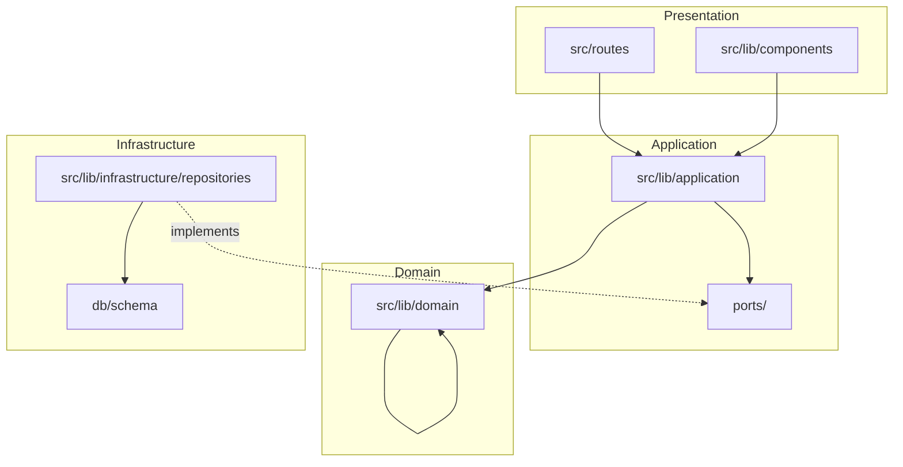

# Architecture

Skaffu (repo: `home-pantry`) följer hexagonal/lagerad arkitektur. **Feature-detaljer:** [docs/CODEBASE_MAP.md](docs/CODEBASE_MAP.md).

## Layers

| Layer | Path | Responsibility |
|-------|------|----------------|
| **Domain** | `src/lib/domain` | Entities, enums, pure logic — **no** Svelte/DB imports |
| **Application** | `src/lib/application` | Use cases (`*Service`), repository **interfaces** in `ports/` |
| **Infrastructure** | `src/lib/infrastructure` | Drizzle schema, repository implementations, Lucia |
| **Presentation** | `src/routes`, `src/lib/components` | SvelteKit routes, Atomic Design UI |

### Import rules

- **Domain** never imports from application, infrastructure, or routes.
- **Application** imports domain + port interfaces; never concrete Drizzle repos in services (wire in DI).
- **Infrastructure** implements ports; may import domain.
- **Routes** call services from `event.locals` (via hooks/DI); **Svelte components must not** import `*.server.ts` (enforced by `check:server-imports`).

## Composition root

[`src/lib/server/di.ts`](src/lib/server/di.ts) wires repositories → services. Loaded per-request in [`src/hooks.server.ts`](src/hooks.server.ts) onto `event.locals` (e.g. `locals.inventoryService`, `locals.shoppingListService`).

Add a new use case: define port → implement repo → service → register in `di.ts` → expose on `app.d.ts` locals.

## Atomic Design (Skaffu examples)

| Layer | Path | Examples in this codebase |
|-------|------|---------------------------|
| Atoms | `components/atoms` | `Button`, `Input`, `Card` |
| Molecules | `components/molecules` | `FormField`, `HomeBriefingChips`, `ScanFlowFooter` |
| Organisms | `components/organisms` | `ShoppingV2Page`, `PantryV2Page`, `ActivationOnboardingFlow`, `StatistikDashboard` |
| Templates | `components/templates` | `AppLayout`, `AuthLayout` |
| Pages | `src/routes/**/+page.svelte` | Compose templates + organisms; load data in `+page.server.ts` |

Pages stay thin: server load + delegate rendering to organisms.

## Auth

Lucia v3 sessions with HTTP-only cookies. [`src/hooks.server.ts`](src/hooks.server.ts) validates session, attaches `locals.user`. Inventory and household queries scope by authenticated user / active household.

## Database

PostgreSQL via Drizzle ORM. Local dev often uses PGlite (`USE_PGLITE=true`). Migrations: `npm run db:migrate`.

## Related docs

- [docs/CODEBASE_MAP.md](docs/CODEBASE_MAP.md) — feature → files map
- [docs/CURRENT_REALITY.md](docs/CURRENT_REALITY.md) — prod nav & flags
- [AGENTS.md](AGENTS.md) — agent entry point
