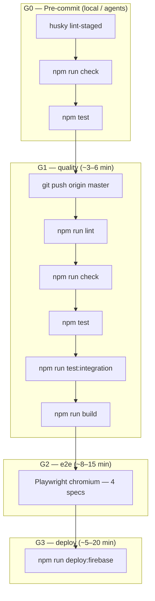
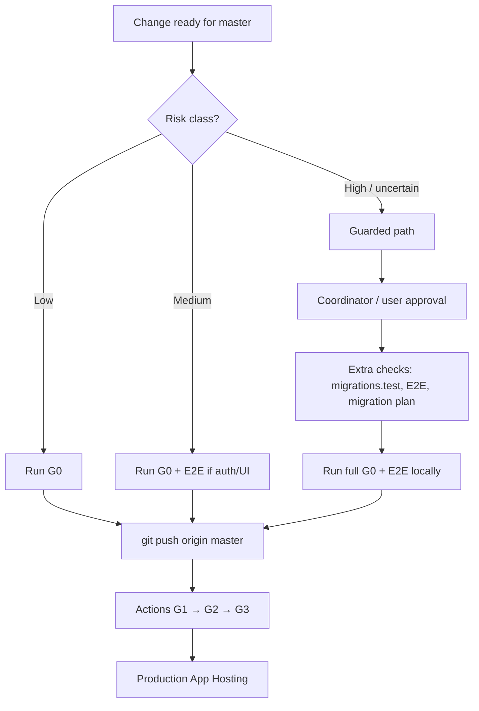

# Release pipeline

Canonical gate map, test integration, and agent delivery playbook for trunk-based releases.

**Last reviewed:** 2026-05-30

**Related:** [DEPLOYMENT_POLICY.md](./DEPLOYMENT_POLICY.md) · [docs/CI_CD.md](./docs/CI_CD.md) · [docs/FIREBASE_DEPLOY.md](./docs/FIREBASE_DEPLOY.md)

---

## Pipeline diagram



**Typical end-to-end:** ~15–25 minutes from push to live (no PR, no manual deploy step when `FIREBASE_TOKEN` is configured).

---

## Gate table

| Gate | When | Commands / job | Target time | Blocks |
|------|------|----------------|-------------|--------|
| **G0** | Before commit (agents) | husky `lint-staged`; `npm run check && npm test` | ~1–2 min | Local commit quality |
| **G1** | Push → `master`/`main` | Job `quality`: `lint`, `check`, `test`, `test:integration` (PGlite), `build` | ~3–6 min | G2, G3 |
| **G2** | After G1 success | Job `e2e`: `npx playwright install --with-deps chromium`; `npm run test:e2e` | ~8–15 min | G3 |
| **G3** | After G1+G2 success | Job `deploy`: `npm run deploy:firebase -- --non-interactive --project home-pantry-4bee5` | ~5–20 min | Production live |

**Workflow file:** [`.github/workflows/release.yml`](./.github/workflows/release.yml) (workflow name: **Release**)

**Triggers:**

| Trigger | Behavior |
|---------|----------|
| `push` → `master` or `main` | Full chain G1 → G2 → G3 |
| `workflow_dispatch` | Same chain; optional **Skip E2E** for emergency only |

**Concurrency:** `release-${{ github.ref }}` with `cancel-in-progress: true` — newer push cancels in-flight release.

**Node:** 20 (matches `.nvmrc` / `package.json` engines).

---

## Fast path vs guarded path

### Decision tree



### Fast path (low / medium risk)

Use for documentation, isolated UI, medium features with green local tests. After G0 (and E2E when auth/navigation touched), **commit + push to `master`**. Actions runs G1→G2→G3 automatically. **No PR.** Do not ask the user to open a PR unless they explicitly request it.

### Guarded path (high risk)

Required for schema migrations, auth/session, secrets, OpenAI routes, and infra YAML (see [DEPLOYMENT_POLICY.md](./DEPLOYMENT_POLICY.md)). Before push:

1. Coordinator or user approval recorded in chat / queue
2. `npm test -- src/lib/infrastructure/db/migrations.test.ts` when drizzle changes
3. Full `npm run test:e2e` locally
4. Production migration plan documented (apply before or with deploy)
5. Pipeline agent or coordinator confirms single deploy source (Actions only)

High-risk changes must **not** rely on auto-deploy alone without completing the guarded checklist.

---

## Test suite mapping

| Suite | Command | Runs in | PGlite / env | Specs / scope |
|-------|---------|---------|--------------|---------------|
| **Unit** | `npm test` | G0, G1 | Vitest default | `**/*.test.ts` (excludes integration config) |
| **Integration** | `npm run test:integration` | G1 | `USE_PGLITE=true` | `**/*.integration.test.ts`, DB repositories |
| **E2E smoke + flows** | `npm run test:e2e` | G2 (and G0 when auth/UI touched) | `USE_PGLITE=true`, seeded admin env vars in CI | All Playwright specs (4 files) |
| **Build** | `npm run build` | G1 | Placeholder `DATABASE_URL`, PGlite flag | Validates production build |

### E2E spec files (G2)

| File | Role |
|------|------|
| [`e2e/smoke.spec.ts`](./e2e/smoke.spec.ts) | Unauthenticated `/`, login page, authenticated dashboard |
| [`e2e/auth.spec.ts`](./e2e/auth.spec.ts) | Login, register, logout flows |
| [`e2e/navigation.spec.ts`](./e2e/navigation.spec.ts) | Main nav and route transitions |
| [`e2e/admin.spec.ts`](./e2e/admin.spec.ts) | Admin panel access and basics |

**Ownership:** E2E agent creates and maintains specs; pipeline agent consumes them as G2 gates. Request new smoke coverage from E2E agent — do not rewrite E2E broadly from pipeline agent.

### CI environment (G2 job)

```yaml
USE_PGLITE: 'true'
ADMIN_EMAIL: e2e-admin@example.com
ADMIN_PASSWORD: e2e-ci-password
PUBLIC_ORIGIN: http://localhost:5173
CI: 'true'
```

---

## Workflow reference

| File | Job | Needs | Deploy condition |
|------|-----|-------|------------------|
| [`.github/workflows/release.yml`](./.github/workflows/release.yml) | `quality` | — | — |
| same | `e2e` | `quality` | Skipped if `workflow_dispatch` + Skip E2E |
| same | `deploy` | `quality`, `e2e` | Runs if quality success and (e2e success or skipped); requires `FIREBASE_TOKEN` |

**Note:** Only `release.yml` is present in `.github/workflows/` today. Tiered `ci.yml` / `e2e.yml` / `deploy.yml` mentioned in older docs are **not** in the repo — this workflow is the single source of truth.

**GitHub Environment:** `production` (optional required reviewers for solo dev: leave empty for fully automatic G3).

---

## Agent delivery playbook

When a task is complete or the user says *commit push deploy*:

1. **Classify risk** — [DEPLOYMENT_POLICY.md](./DEPLOYMENT_POLICY.md); use guarded path if high or uncertain.
2. **G0 locally:** `npm run check && npm test`
3. **If auth, login, or nav touched:** `USE_PGLITE=true npm run test:e2e`
4. **If drizzle / deploy infra touched:** migration tests + coordinator approval
5. **Commit + push:** `git commit` → `git push origin master` (trunk — **no PR**)
6. **Actions:** Monitor **Release** workflow — report run URL when useful
7. **Verify:** Production URL responds; login smoke if auth changed

**Do not** instruct manual dev server restart when `dev:watch` is running.

---

## What blocks auto-deploy

| Blocker | Effect |
|---------|--------|
| G1 `quality` failure | G2 and G3 do not run |
| G2 `e2e` failure | G3 does not run |
| Missing `FIREBASE_TOKEN` | G3 skipped with Actions notice; G1+G2 still validate |
| High-risk change without guarded approval | Policy violation — coordinator must review before push |
| Firebase Console parallel auto-deploy | Risk of double deploy — disable Console GitHub hook |
| New push during run | Previous run cancelled (`cancel-in-progress`) |
| Production environment reviewers pending | G3 waits (if configured) |

---

## Future improvements (not implemented)

| Idea | Status |
|------|--------|
| Path filters (skip E2E on docs-only) | Not implemented |
| Shared npm cache artifacts between jobs | Not implemented |
| Preview deploy per commit | Not implemented |
| Risk-aware workflow (skip G3 for high-risk until manual approve) | Policy only; workflow always deploys on green gates |

See also [docs/CI_CD.md](./docs/CI_CD.md) framtida förbättringar section.
