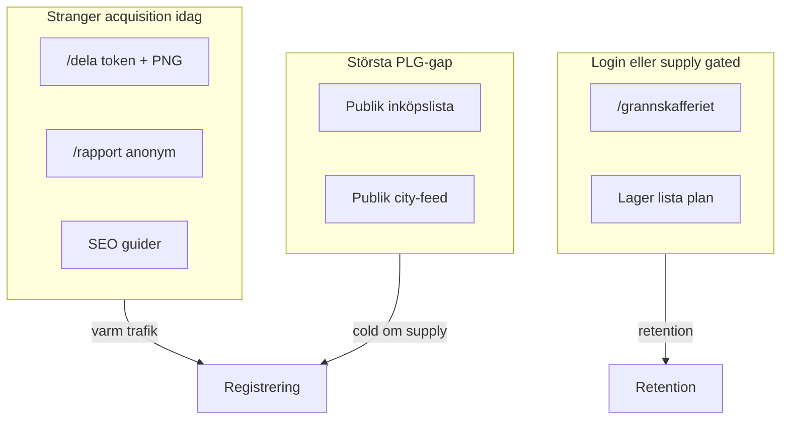

# Acquisition Wedges — Skaffu

*Version: juni 2026. Strategisk karta över vilka produkt-ytor som kan få främlingar och inbjudna att registrera sig utan betald distribution — efter att receipt-autopilot hanterats som activation, inte acquisition.*

**Relaterade dokument:** [`GROWTH_STRATEGY.md`](./GROWTH_STRATEGY.md) · [`PRODUCT_LED_GROWTH_ANALYSIS.md`](./PRODUCT_LED_GROWTH_ANALYSIS.md) · [`BREAKTHROUGH_GROWTH_OPPORTUNITIES.md`](./BREAKTHROUGH_GROWTH_OPPORTUNITIES.md) · [`COMPETITIVE_ANALYSIS.md`](./COMPETITIVE_ANALYSIS.md) · [`RECEIPT_AUTOPILOT_NO_KIVRA_PLAN.md`](./RECEIPT_AUTOPILOT_NO_KIVRA_PLAN.md) · [`GRANNSKAFFERIET_V0.md`](./GRANNSKAFFERIET_V0.md) · [`PMF_METRICS_LOG.md`](./PMF_METRICS_LOG.md)

**Avgränsning:** Detta dokument fokuserar på *acquisition wedges* — produktfeatures eller produkt-ytor som skapar pull utan betald reklam. **Uteslutet som fokus:** Kivra API, receipt autopilot, onboarding, activation, retention, mer parsing, generiska kanaler (LinkedIn, Facebook-grupper, SEO-kampanjer, hero A/B som kanal-strategi, UTM-playbooks). Receipt history och purchase patterns analyseras som *data-moat* och *compound* — **inte** som primär acquisition-wedge (align [`RECEIPT_AUTOPILOT_NO_KIVRA_PLAN.md`](./RECEIPT_AUTOPILOT_NO_KIVRA_PLAN.md) §8: validerar retention men inte stranger-install).

**Datagap (ärligt):** [`PMF_METRICS_LOG.md`](./PMF_METRICS_LOG.md) är i stort sett tom. All rankning bygger på produktlogik, shipped kod och konkurrentanalys — inte påhittade konverteringssiffror.

---

## 1. Executive summary

- **Acquisition-bottleneck efter receipt-autopilot som activation.** Digital kvitto-import (`ReceiptBulkAddFlow`, `/scan?mode=receipt`) minskar friktion för *registrerade* användare att fylla lager — men mottagaren av ett kvitto ser inget externt värde. [`RECEIPT_AUTOPILOT_NO_KIVRA_PLAN.md`](./RECEIPT_AUTOPILOT_NO_KIVRA_PLAN.md) placerar receipt MVP korrekt som activation; breakthrough kräver ytor där främlingar *ser* nytta innan konto.

- **Top 3 wedges (förväntat):** (1) **W1 — publik read-only inköpslista-länk** — familjevana utan geo, återanvänder `expiring_share_link`-infra. (2) **W2 — publik city-feed** av aktiva `/dela`-snapshots per stad utan login — *om* supply seedas. (3) **W3 + W4** — `/dela` conversion pass (varm trafik) och **kontextuell household-invite från `/inkop`** (invitee-registrering). Dessa ligger klart ovan Grannskafferiet-karta och generisk meal-plan för cold acquisition.

- **Vad som *inte* är en wedge:** Meal plan ensam (`/planer` — Mealime/Matbotten-substitut utan lager); purchase patterns / receipt history som stranger-hook (kräver konto + historik); Grannskafferiet-karta utan density (login + opt-in + tom nätverk — OLIO äger tom-karta-narrativ, [`COMPETITIVE_ANALYSIS.md`](./COMPETITIVE_ANALYSIS.md) §3G); publik pantry-kalkylator (B10 kill); mer AI-insights utan extern loop ([`BREAKTHROUGH_GROWTH_OPPORTUNITIES.md`](./BREAKTHROUGH_GROWTH_OPPORTUNITIES.md) §3).

- **$0-ad thesis:** Produkten ska skapa *varm trafik* (mottagare av delad länk) eller *sökintent-match* (publik utility) — inte betald distribution. Cross-user surfaces (`/dela`, invite, publik lista) = acquisition. Solo-hushålls-data (receipt, patterns, expiry push) = retention compound.

- **Prioriterad build-ordning:** W1 → W3 → W2 *eller* W4. Se §8 och Return block för nästa tre implementation tasks.

---

## 2. Capability scorecard (9 × 5)

För varje kapabilitet: **Ja / Delvis / Nej** på fem PLG-frågor, med 1–2 meningar och shipped evidence (route/event).

| Kapabilitet | Kod / route |
|-------------|-------------|
| Receipt history | `receipt_purchase_line`, `purchase-pattern.ts` |
| Purchase history / patterns | `ReceiptAutopilotSection`, `/inkop` suggestions |
| Pantry inventory | inventory routes, smart fill |
| Expiry data | `EatFirstSection`, expiry helpers |
| Meal planning | `/planer`, plan→lista |
| Shopping lists | `/inkop`, `ShoppingListPanel`, Bring export |
| Household collaboration | `/invite/[token]`, share-invite, roles |
| Grannskafferiet | `/grannskafferiet`, `/dela/[token]` |
| Location sharing | nearby opt-in, geo migrations, push |

### 2.1 Receipt history

| Fråga | Svar | Evidens |
|-------|------|---------|
| Attraherar ny användare (cold)? | **Nej** | Data ackumuleras per hushåll efter import; ingen publik yta. Event `receipt_parsed` = aktivering i PMF. |
| Orsakar invitations? | **Nej** | Kvitto syns inte för partner utan manuell sync. |
| Genererar publikt innehåll? | **Nej** | Privat per hushåll. |
| Genererar delning? | **Nej** | Ingen extern loop. |
| Nätverkseffekter? | **Nej** | Solo compound moat. |

**Mönster:** Compound efter activation — **inte** primary wedge.

### 2.2 Purchase history / patterns

| Fråga | Svar | Evidens |
|-------|------|---------|
| Attraherar ny användare (cold)? | **Nej** | `detectReceiptPatternSuggestions` kräver ≥2 imports / 90 dagar — stranger har noll data. |
| Orsakar invitations? | **Delvis** | Indirekt: bättre lista kan motivera partner-invite, men ingen inbyggd trigger. |
| Genererar publikt innehåll? | **Nej** | Personliga förslag på `/inkop`. |
| Genererar delning? | **Nej** | |
| Nätverkseffekter? | **Nej** | Intra-hushåll om invite finns. |

**Mönster:** Retention compound — stödjer W1 (smart fill) men inte stranger-pull.

### 2.3 Pantry inventory

| Fråga | Svar | Evidens |
|-------|------|---------|
| Attraherar ny användare (cold)? | **Nej** | `/hem`, `/inventory/[location]` bakom login. |
| Orsakar invitations? | **Delvis** | Delat lager via hushåll — kräver invite (W4). |
| Genererar publikt innehåll? | **Nej** | |
| Genererar delning? | **Delvis** | Indirekt via utgående-snapshot (`EatFirstSection` → `/dela`). |
| Nätverkseffekter? | **Delvis** | Intra-hushåll; grann-endast via opt-in delning. |

**Mönster:** Sanningskälla för wedges — inte wedge i sig.

### 2.4 Expiry data

| Fråga | Svar | Evidens |
|-------|------|---------|
| Attraherar ny användare (cold)? | **Delvis** | `/dela/[token]` exponerar utgående snapshot read-only; `expiring_share_viewed` (publikt event). |
| Orsakar invitations? | **Delvis** | Push/e-post till ägaren — inte till främling. |
| Genererar publikt innehåll? | **Ja** | GDPR-snapshot 48 h TTL, `noindex`. |
| Genererar delning? | **Ja** | PNG + native share från `EatFirstSection`; `expiring_share_created`. |
| Nätverkseffekter? | **Delvis** | Nearby push till opt-in-användare — retention, svag acquisition. |

**Mönster:** Delning av utgående = varm trafik (W3, W10); expiry push = retention.

### 2.5 Meal planning

| Fråga | Svar | Evidens |
|-------|------|---------|
| Attraherar ny användare (cold)? | **Nej** | `/planer` kräver konto; stranger får ChatGPT/Mealime-substitut. |
| Orsakar invitations? | **Delvis** | Familj kan dela plan — ej shipped som publik länk. |
| Genererar publikt innehåll? | **Nej** | |
| Genererar delning? | **Nej** | Plan→lista är intern ett-klicks-flöde. |
| Nätverkseffekter? | **Nej** | |

**Mönster:** Retention + differentiering vs Matbotten — **kill som cold wedge**.

### 2.6 Shopping lists

| Fråga | Svar | Evidens |
|-------|------|---------|
| Attraherar ny användare (cold)? | **Delvis** | Export till Bring/AnyList (`shopping_list_export`) — partner ser *extern* app, inte Skaffu. Publik länk **saknas** (W1-gap). |
| Orsakar invitations? | **Ja** | Naturlig familjekontext — O1/W4; idag CTA djupt i `/settings#household`. |
| Genererar publikt innehåll? | **Nej** (idag) | W1 skulle vända detta. |
| Genererar delning? | **Delvis** | Clipboard utåt — outbound only. |
| Nätverkseffekter? | **Delvis** | Hushållssync när ≥2 medlemmar. |

**Mönster:** Största outnyttjade acquisition-yta — W1.

### 2.7 Household collaboration

| Fråga | Svar | Evidens |
|-------|------|---------|
| Attraherar ny användare (cold)? | **Delvis** | Invitee är varm — `/invite/[token]`, `createShareInvite`, `SHARE_INVITE_EMAIL = '*'`. |
| Orsakar invitations? | **Ja** | Kärn-PLG-loop; `inviteRate` i `/admin` PMF (mål 30 %). |
| Genererar publikt innehåll? | **Nej** | Token-baserad, inte indexbar. |
| Genererar delning? | **Ja** | Email + share-link + `navigator.share` i Inställningar. |
| Nätverkseffekter? | **Ja** | Intra-hushåll: +1 registrerad per lyckad invite. |

**Mönster:** Acquisition via invitee — behöver **kontext** (W4), inte bara Inställningar.

### 2.8 Grannskafferiet

| Fråga | Svar | Evidens |
|-------|------|---------|
| Attraherar ny användare (cold)? | **Nej** | `/grannskafferiet` redirectar till login; density-gate ≥5–10 delningar/500 m. |
| Orsakar invitations? | **Nej** | Opt-in geo — inte hushållsinvite. |
| Genererar publikt innehåll? | **Delvis** | `/dela/[token]` ja; karta nej. |
| Genererar delning? | **Ja** | Utgående-länk + PNG; W2 skulle aggregera publikt. |
| Nätverkseffekter? | **Delvis** | Kräver density; OLIO har head start ([`COMPETITIVE_ANALYSIS.md`](./COMPETITIVE_ANALYSIS.md) §3G). |

**Mönster:** `/dela` = acquisition (varm); karta = retention/network — **inte cold wedge**.

### 2.9 Location sharing

| Fråga | Svar | Evidens |
|-------|------|---------|
| Attraherar ny användare (cold)? | **Nej** | Opt-in grov plats (~111 m), jitter-karta; kräver konto + samtycke. |
| Orsakar invitations? | **Nej** | |
| Genererar publikt innehåll? | **Nej** | Privacy-by-design; fuzzed coords. |
| Genererar delning? | **Delvis** | Nearby push till *befintliga* användare (`nearby_map_opened`). |
| Nätverkseffekter? | **Delvis** | Metro-wide endast med density — post-seed. |

**Mönster:** Enabler för W2/W9 — inte fristående acquisition.

**Scorecard-slutsats:** Cross-user surfaces (dela, invite, publik lista) = acquisition. Solo-hushålls-data = retention compound.

---

## 3. Antaganden vi utmanar

### “Grannskafferiet = acquisition”

Kartan kräver login, plats-opt-in och density. I svenska förort utan OLIO-nätverk ger tom karta *negativ* social proof. [`COMPETITIVE_ANALYSIS.md`](./COMPETITIVE_ANALYSIS.md) §3G: OLIO äger P2P-karta-narrativ; Skaffus vinkel är *“listan redan klar från skafferiet”* — det lever i `/dela`, inte i login-gated karta.

**Verdict:** Retention/network tills publik browse (W2) + seed.

### “Meal plan = growth”

Mealime, Matbotten och ChatGPT levererar plan→lista utan lager. En främling som söker “veckomeny” konverterar inte via Skaffus `/planer` utan först aktiverat lager.

**Verdict:** Compound/retention — **kill som cold wedge**.

### “Receipt history = wedge”

Ackumulerad `receipt_purchase_line` stärker moat (mönster, framtida prisminne) men kräver konto + historik. Validerar retention, inte stranger-install.

**Verdict:** Compound-only — align receipt-autopilot-plan.

### “Mer AI insights = users”

Photo AI, recept-schema och generiska förslag har noll extern exponering ([`BREAKTHROUGH_GROWTH_OPPORTUNITIES.md`](./BREAKTHROUGH_GROWTH_OPPORTUNITIES.md) §3). AI som guardrail på *befintlig* data = retention; AI som huvudstory = substitut.

**Verdict:** Inte acquisition.

### “Household sync räcker”

Invite sker i Inställningar, långt från `/inkop` där familjer faktiskt samordnar handel. [`PRODUCT_LED_GROWTH_ANALYSIS.md`](./PRODUCT_LED_GROWTH_ANALYSIS.md) O1–O2: kontext vid Inköp och publik lista saknas.

**Verdict:** W4 + W1 krävs för att synka ska bli acquisition.

---

## 4. Wedge catalog (W1–W10)

Varje wedge = produktfeature eller produkt-yta (inte kanal).

---

### W1 — Publik read-only inköpslista-länk

| Fält | Värde |
|------|-------|
| **User story** | Som handlande partner (stranger/invitee) vill jag öppna en länk och se live inköpslista utan app — som `/dela` för utgående varor. |
| **Bygger på** | Shopping lists, pantry inventory (smart fill), household collaboration |
| **$0-ad mekanik** | Familj delar länk i SMS/WhatsApp; mottagaren ser värde → registrerar för att bocka av / synka. Ingen annons — produkten *är* distributionen. |
| **Acquisition potential** | 5 |
| **Effort** | 3 (M — återanvänd `expiring_share_link` + shopping snapshot) |
| **Confidence** | 5 |
| **Uniqueness** | 4 |
| **Shipped vs build** | **Build** — export går idag utåt till Bring (`shopping_list_export`) |
| **Biggest risk** | Listan inaktuell → förtroende; måste spegla live sync |
| **Verdict** | **Primary wedge** |

---

### W2 — Publik city-feed (aktiva `/dela` per stad, no login)

| Fält | Värde |
|------|-------|
| **User story** | Som nyfiken granne (stranger) vill jag se vilken mat som delas i Malmö just nu — utan konto. |
| **Bygger på** | Grannskafferiet, expiry data, location sharing |
| **$0-ad mekanik** | Organisk sök/delning “gratis mat [stad]” *om* feed inte är tom; listan auto-genererad från skafferier — OLIO kräver manuell listing. |
| **Acquisition potential** | 5 (2 om tom feed) |
| **Effort** | 3 (M) |
| **Confidence** | 3 |
| **Uniqueness** | 4 |
| **Shipped vs build** | **Build** — aggregera `expiring_share_link` per stad |
| **Biggest risk** | **Tom-feed** — negativ social proof värre än ingen sida |
| **Verdict** | **Primary wedge** (villkorat av manuell seed) |

---

### W3 — `/dela` conversion pass (post-view signup intent)

| Fält | Värde |
|------|-------|
| **User story** | Som mottagare av utgående-lista vill jag enkelt skapa egen lista efter att jag sett värdet. |
| **Bygger på** | Expiry data, Grannskafferiet (`/dela/[token]`) |
| **$0-ad mekanik** | Varm trafik från befintliga delningar; bättre CTA/copy → `signup_complete` utan invite-referrer. |
| **Acquisition potential** | 4 |
| **Effort** | 5 (S) |
| **Confidence** | 4 |
| **Uniqueness** | 3 |
| **Shipped vs build** | **Partial** — sida shipped; conversion pass saknas |
| **Biggest risk** | Låg volym delningar → liten absolut effekt |
| **Verdict** | **Primary wedge** (quick win) |

---

### W4 — Kontextuell household-invite från Inköp

| Fält | Värde |
|------|-------|
| **User story** | Som solo-användare på `/inkop` vill jag bjuda in partner när jag bockar av — inte via Inställningar. |
| **Bygger på** | Household collaboration, shopping lists |
| **$0-ad mekanik** | +1 registrerad per hushåll; invite sker i momentet “vi handlar tillsammans”. |
| **Acquisition potential** | 4 |
| **Effort** | 5 (S) |
| **Confidence** | 5 |
| **Uniqueness** | 3 |
| **Shipped vs build** | **Build** — `HouseholdInvitePrompt` pekar på settings |
| **Biggest risk** | Audience för liten om acquisition redan failar |
| **Verdict** | **Secondary wedge** (hög confidence, lägre stranger än W1/W2) |

---

### W5 — Delegated shopping (viewer + notis → invite)

| Fält | Värde |
|------|-------|
| **User story** | Som viewer vill jag få notis när listan uppdateras och bocka av utan full editor-rättighet. |
| **Bygger på** | Household collaboration, shopping lists, push |
| **$0-ad mekanik** | Tvingar invite för full loop; viewer måste registrera. |
| **Acquisition potential** | 3 |
| **Effort** | 2 (M–L) |
| **Confidence** | 3 |
| **Uniqueness** | 4 |
| **Shipped vs build** | **Build** — roller finns, delegated UX saknas |
| **Biggest risk** | Komplexitet vs W1+W4 som enklare alternativ |
| **Verdict** | **Secondary wedge** |

---

### W6 — Publik interaktiv demo (demo household → register med snapshot)

| Fält | Värde |
|------|-------|
| **User story** | Som besökare på skaffu.com vill jag prova read-only demo-hushåll och spara min lista vid registrering. |
| **Bygger på** | Pantry inventory, shopping lists, meal planning (visuellt) |
| **$0-ad mekanik** | Kall trafik från landning → aktivering med snapshot; minskar konto-vägg. |
| **Acquisition potential** | 4 |
| **Effort** | 3 (M) |
| **Confidence** | 3 |
| **Uniqueness** | 3 |
| **Shipped vs build** | **Build** |
| **Biggest risk** | Demo känns fejk om inte trovärdig; Turnstile/abuse |
| **Verdict** | **Secondary wedge** |

---

### W7 — Skaffurapport som publik PR/utility (k-anonymitet)

| Fält | Värde |
|------|-------|
| **User story** | Som journalist/läsare vill jag se anonymiserad månadsdata för svenska hushåll. |
| **Bygger på** | Receipt history (aggregerat), compound benchmarks |
| **$0-ad mekanik** | PR när kohort ≥50 hushåll (`SKAFFURAPPORT_K_ANONYMITY_MIN`); svag PLG, stark PR. |
| **Acquisition potential** | 2 |
| **Effort** | 3 (M) |
| **Confidence** | 2 |
| **Uniqueness** | 4 |
| **Shipped vs build** | **Partial** — `/rapport/*` shipped, gate blockerar |
| **Biggest risk** | Kohort för liten; benchmark meningslös |
| **Verdict** | **Compound-only** (PR-spår) |

---

### W8 — Recall/allergy alert (receipt match)

| Fält | Värde |
|------|-------|
| **User story** | När Livsmedelsverket återkallar en produkt vill jag få alert om jag köpt den. |
| **Bygger på** | Receipt history, pantry inventory |
| **$0-ad mekanik** | Fear/intent + PR-potential; kräver konto + kvittohistorik för värde. |
| **Acquisition potential** | 4 |
| **Effort** | 1 (L) |
| **Confidence** | 2 |
| **Uniqueness** | 5 |
| **Shipped vs build** | **Build** |
| **Biggest risk** | Liability, false positives, data-licens |
| **Verdict** | **Secondary** (hög risk — parkera) |

---

### W9 — Demand board (neighbor match)

| Fält | Värde |
|------|-------|
| **User story** | Som användare som saknar tahini vill jag posta behov och matchas mot grannars inventory. |
| **Bygger på** | Grannskafferiet, location sharing, pantry inventory |
| **$0-ad mekanik** | Dubbelriktad nätverkseffekt — endast med density. |
| **Acquisition potential** | 2 |
| **Effort** | 1 (L–XL) |
| **Confidence** | 2 |
| **Uniqueness** | 4 |
| **Shipped vs build** | **Build** |
| **Biggest risk** | Privacy; tom demand-sida |
| **Verdict** | **Compound-only** (post-density) |

---

### W10 — Wrapped/dela PNG som extern delning

| Fält | Värde |
|------|-------|
| **User story** | Som aktiverad användare vill jag dela stolt besparingar eller utgående-lista som bild. |
| **Bygger på** | Expiry data, receipt/patterns (Wrapped metrics) |
| **$0-ad mekanik** | Varm virality — mottagare känner avsändaren; svag cold. |
| **Acquisition potential** | 2 |
| **Effort** | 4 (shipped) |
| **Confidence** | 4 |
| **Uniqueness** | 2 |
| **Shipped vs build** | **Shipped** — `wrapped_shared`, `EatFirstSection` PNG |
| **Biggest risk** | Pride sharing, inte stranger-install |
| **Verdict** | **Compound-only** (rank low for cold) |

---

### Explicit kill (referens, ej W-id)

| Wedge | Verdict |
|-------|---------|
| Grannskafferiet-karta som cold wedge | **Kill** — login + opt-in + density; retention only |
| Generisk meal-plan landing | **Kill** — ChatGPT/Mealime-substitut |
| Pantry calculator (B10) | **Kill** — ingen moat |

---

## 5. Rankad masterlista

Sorterad på **acquisition potential** (stranger + invitee-registrering utan paid ads).

### Composite score — vikter

| Dimension | Vikt |
|-----------|------|
| Acquisition potential | 45 % |
| Uniqueness vs OLIO/Bring/Matdags/Matpriskollen | 25 % |
| Confidence | 20 % |
| Implementation effort (inverse: 5=lätt) | 10 % |

### Rankning

| Rank | ID | Wedge | Acq | Uniq | Conf | Eff⁻¹ | **Composite** | Verdict |
|------|-----|-------|-----|------|------|-------|---------------|---------|
| 1 | **W1** | Publik inköpslista-länk | 5 | 4 | 5 | 4 | **4,65** | Primary |
| 2 | **W4** | Kontextuell invite från Inköp | 4 | 3 | 5 | 5 | **4,05** | Secondary |
| 3 | **W2** | Publik city-feed | 4,5* | 4 | 3 | 3 | **3,93** | Primary* |
| 4 | **W3** | `/dela` conversion pass | 4 | 3 | 4 | 5 | **3,85** | Primary |
| 5 | **W8** | Recall/allergy alert | 4 | 5 | 2 | 1 | **3,55** | Secondary (risk) |
| 6 | **W6** | Publik interaktiv demo | 4 | 3 | 3 | 3 | **3,45** | Secondary |
| 7 | **W5** | Delegated shopping | 3 | 4 | 3 | 2 | **3,15** | Secondary |
| 8 | **W7** | Skaffurapport PR | 2 | 4 | 2 | 3 | **2,60** | Compound |
| 9 | **W10** | Wrapped/dela PNG | 2 | 2 | 4 | 4 | **2,60** | Compound |
| 10 | **W9** | Demand board | 2 | 4 | 2 | 1 | **2,40** | Compound |
| — | — | Grannskafferiet-karta (cold) | 1 | 3 | 3 | 2 | **1,85** | **Kill** |
| — | — | Generisk meal-plan landing | 2 | 1 | 3 | 2 | **1,95** | **Kill** |

\* W2 acquisition = 5 med seed, ~2 utan; composite använder 4,5 som mittvärde.

**Krav uppfyllt:** Minst tre wedges (W1, W2, W3) rankas **ovan** Grannskafferiet-karta (1,85) och generisk meal-plan (1,95) för cold acquisition.

---

## 6. Uniqueness vs konkurrenter

Kort per top wedge — vad Skaffu kan som de inte kan. Referens: [`COMPETITIVE_ANALYSIS.md`](./COMPETITIVE_ANALYSIS.md) §3G, §4.

| Wedge | vs Bring / AnyList | vs OLIO | vs Matdags | vs Matpriskollen |
|-------|-------------------|---------|------------|------------------|
| **W1** Publik inköpslista | Lista + **lager-sanningskälla** (vet vad som finns hemma); smart fill | N/A (annat jobb) | Delad lista ja — men **auto från faktiskt lager** + plan→lista | N/A |
| **W2** City-feed | N/A | **Auto-lista från utgång** — inte foto+beskrivning från noll; SV + kvitto-story kvar | N/A | N/A |
| **W3** `/dela` conversion | N/A | Listan redan klar från skafferiet (~10 sek) | Utgång ja — inte samma publik dela-loop | N/A |
| **W4** Kontextuell invite | Sync + **lager** bakom listan | N/A | Hushåll ja — invite i **handelskontext** saknas hos dem | Delad lista utan lager |

**Not:** Nordisk PDF/kvitto-pipeline är **activation moat**, inte acquisition wedge i detta dokument.

---

## 7. $0 advertising — hur wedges skapar användare

Endast produktledda mekaniker — **ej** “posta mer på Facebook”.

| Mekanism | Wedge | Hur det fungerar |
|----------|-------|------------------|
| Mottagare av publik länk ser värde → registrerar | W1, W3 | Familj/grann får länk; CTA till signup med intent |
| Partner bjuds in för live lista → +1 user | W4, W5 | Invite i kontext; viewer-registrering |
| City-feed → organisk sök/delning *om* supply | W2 | “Gratis mat [stad]” utan betald annons |
| Skaffurapport → PR vid kohort ≥50 | W7 | Journalist/läsare → landning (svag PLG) |
| Befintlig delning → optimerad conversion | W3, W10 | Varm trafik från `/dela`/PNG |

**Anti-mönster:** Betald distribution utan produkt-pull; karta-polish pre-density; hero A/B utan publik utility-yta.

---

## 8. Rekommenderad prioritet (efter receipt-autopilot activation)

Receipt-autopilot ([`RECEIPT_AUTOPILOT_NO_KIVRA_PLAN.md`](./RECEIPT_AUTOPILOT_NO_KIVRA_PLAN.md)) körs parallellt som **activation** — acquisition-wedges nedan antar att funnel-events mäts, men bygger *inte* på Kivra API.

| Prioritet | Wedge | Varför nu |
|-----------|-------|-----------|
| **1** | W1 publik inköpslista | Familj-vana, ingen geo, återanvänder `expiring_share_link`-infra ([`PRODUCT_LED_GROWTH_ANALYSIS.md`](./PRODUCT_LED_GROWTH_ANALYSIS.md) O2) |
| **2** | W3 `/dela` conversion | Shipped yta, S effort, varm trafik — snabb validering |
| **3** | W2 city-feed *eller* W4 invite | W2 kräver seed (E3 i [`GROWTH_STRATEGY.md`](./GROWTH_STRATEGY.md)); W4 högre confidence, lägre stranger |

**Inte nu:** W8 recall, W9 demand board, mer karta-polish, personligt prisminne (B2) som acquisition, Kivra OAuth/API.

---

## 9. Metrics per wedge

Koppla till befintliga + nya events (post receipt-funnel work).

| Wedge | Primära metrics | Events |
|-------|-----------------|--------|
| **W1** | Skapade vs visade listlänkar; view→signup | `shopping_list_share_created`, `shopping_list_share_viewed` (nya); jämför `shopping_list_export` |
| **W2** | Feed views per stad; signup utan referrer | `public_city_feed_viewed` (ny); `expiring_share_created` per geo |
| **W3** | Dela-view → registrering | `expiring_share_viewed` → `signup_complete` (UTM `grannskafferiet`) |
| **W4** | Invite från Inköp vs Inställningar | `household_invite_prompt_shown` (context=`inkop`); `inviteRate` i `/admin` |
| **W5** | Viewer activation | Invite accept + lista-ändringar från viewer-roll |
| **W6** | Demo → signup med snapshot | `demo_started`, `demo_register` (nya) |
| **W7** | Rapport views | `public_report_viewed` |
| **W8** | Alert accuracy (intern) | `recall_alert_sent` (framtida) |
| **W9** | Match rate | Post-density — ej nu |
| **W10** | Delningsvolym | `expiring_share_created`, `wrapped_shared` |

**Gemensam breakthrough-metric:** Registrering **utan** invite-referrer och **utan** UTM social — separerar cold/warm från PLG-loopar.

**Befintliga (referens):** `expiring_share_viewed`, `expiring_share_created`, `signup_complete`, `inviteRate`, `activationRate` — se `PMF_TARGETS` i `src/lib/domain/pmf.ts`.

---

## 10. Appendix

### A. Routes (acquisition-relevanta)

| Route | Auth | Roll |
|-------|------|------|
| `/dela/[token]` | Nej | W3, W10 — publik utgående-lista |
| `/invite/[token]` | Delvis | W4 — household expansion |
| `/rapport/*` | Delvis | W7 — PR, k-anonymitet |
| `/inkop` | Ja | W1, W4 — lista + saknad invite CTA |
| `/grannskafferiet` | Ja | Retention — **inte** cold wedge |
| `/planer` | Ja | Retention — **inte** cold wedge |
| `/hem`, `/inventory/[location]` | Ja | Activation compound |

### B. Cross-doc index

| Dokument | Innehåll |
|----------|----------|
| [`GROWTH_STRATEGY.md`](./GROWTH_STRATEGY.md) | Distribution E1–E6, density-gate, do-not-build |
| [`PRODUCT_LED_GROWTH_ANALYSIS.md`](./PRODUCT_LED_GROWTH_ANALYSIS.md) | O1–O15, Tier A experiment |
| [`BREAKTHROUGH_GROWTH_OPPORTUNITIES.md`](./BREAKTHROUGH_GROWTH_OPPORTUNITIES.md) | B1–B12, stranger-pull, compound moat |
| [`COMPETITIVE_ANALYSIS.md`](./COMPETITIVE_ANALYSIS.md) | OLIO §3G, Matdags, Matpriskollen |
| [`RECEIPT_AUTOPILOT_NO_KIVRA_PLAN.md`](./RECEIPT_AUTOPILOT_NO_KIVRA_PLAN.md) | Activation — inte primary wedge |
| [`GRANNSKAFFERIET_V0.md`](./GRANNSKAFFERIET_V0.md) | Hybrid launch, density |
| [`PMF_METRICS_LOG.md`](./PMF_METRICS_LOG.md) | Datagap — fyll baseline före experiment |

### C. Datagap

| Metric | Varför |
|--------|--------|
| Registrering utan invite-referrer | Separera acquisition från PLG |
| `expiring_share_created` per stad | W2/W9 density |
| View→signup per wedge | Validera W1–W3 |
| D7/D30 per acquisition-källa | Compound vs wedge ROI |

---

## Return block

### Recommended MVP wedge(s)

**W1 — publik read-only inköpslista-länk** som primär acquisition-wedge. Parallellt **W3 — `/dela` conversion pass** (S effort, shipped yta). W4 (kontextuell invite) som Tier A #3 om W2 city-feed saknar seed.

### What to build now / not build

| Bygg nu | Bygg inte nu |
|---------|----------------|
| W1 MVP (återanvänd `expiring_share_link`-mönster) | Grannskafferiet-karta som cold acquisition |
| W3 conversion copy + intent-aware signup | W8 recall/allergy (liability) |
| W4 banner/modal på `/inkop` | W9 demand board (pre-density) |
| Events: `shopping_list_share_*`, `household_invite_prompt_*` | Generisk meal-plan landing |
| W2 endast med manuell seed ≥5 delningar/vecka i pilotstad | Mer admin dashboards som growth |

### Safe product wording

- “Dela inköpslistan med en länk — partner ser listan direkt”
- “Se vad som delas nära dig” (W2 — **inte** “som OLIO” eller “Kivra-integration”)
- “Listan vet vad som finns i kylen” (vs Bring — [`COMPETITIVE_ANALYSIS.md`](./COMPETITIVE_ANALYSIS.md) §10)
- “Ladda upp digitalt kvitto (PDF)” — receipt som **activation**, inte acquisition-claim

**Undvik:** “Koppla Kivra”, “OLIO-konkurrent”, “automatiskt synkat med Kivra”, falska integration-löften.

### Required events

| Event | Wedge |
|-------|-------|
| `shopping_list_share_created` | W1 |
| `shopping_list_share_viewed` | W1 |
| `household_invite_prompt_shown` / `_clicked` (context) | W4 |
| `expiring_share_viewed` → `signup_complete` | W3 |
| `public_city_feed_viewed` | W2 (om byggd) |
| Registrering utan invite-referrer | Alla |

### Top risks

1. **Bygga karta före lista-delning** — distribution utan funnel ([`JUNE_ENGINEERING_REPORT.md`](./JUNE_ENGINEERING_REPORT.md)).
2. **Tom city-feed** — negativ social proof; seed eller skip W2.
3. **Förväxla receipt activation med acquisition** — moat ≠ stranger-pull.
4. **Inaktuell delad lista** — förtroende-break för W1.
5. **Datagap** — beslut utan baseline i [`PMF_METRICS_LOG.md`](./PMF_METRICS_LOG.md).

### Next 3 implementation tasks

1. **W1 MVP:** Publik read-only inköpslista via token + snapshot; events `shopping_list_share_created` / `shopping_list_share_viewed`; CTA till registrering med hushålls-intent.
2. **W3 conversion pass:** Intent-copy på `/dela/[token]`; redirect till onboarding med “utgående-lista”-intent; mät view→signup 2–4 veckor.
3. **W4 kontextuell invite:** Banner/modal på `/inkop` → `createShareInvite`; event `household_invite_prompt_shown` (context=`inkop`); jämför `inviteRate` mot Inställningar-baseline.

---

*Dokument genererat 2026-06-11. Revidera efter W1/W3 Tier A-experiment och PMF baseline.*
