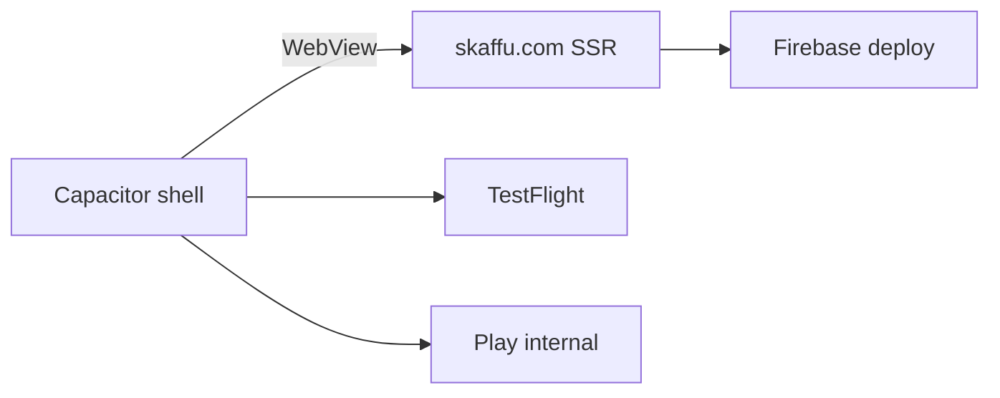

# App Store & Google Play — Capacitor

*Skaffu distribution via native shell (WebView → `https://skaffu.com`). Primary deploy stays Firebase App Hosting — no static export.*

**Status:** Capacitor spike landed (`capacitor.config.ts`, `ios/`, `android/`). TestFlight + Play **internal testing** first; public listing gated per [DAY_90_DECISION.md](./DAY_90_DECISION.md).

---

## Architecture

| Layer | What |
|-------|------|
| **Web app** | SvelteKit SSR (`adapter-node`) on Firebase App Hosting |
| **Native shell** | Capacitor iOS/Android — loads prod via `server.url` |
| **PWA** | Parallel channel — home screen install, web push ([PWA.md](./PWA.md)) |



Config: [`capacitor.config.ts`](../capacitor.config.ts) — `appId: com.skaffu.app`, `appName: Skaffu`, `server.url: https://skaffu.com`.

Client helper for telemetry: `src/lib/utils/capacitor.ts` (`capacitor_ios` / `capacitor_android`).

---

## npm scripts

| Script | Purpose |
|--------|---------|
| `npm run cap:sync` | Copy web assets + sync native projects |
| `npm run cap:ios` | Open Xcode (`ios/App`) |
| `npm run cap:android` | Open Android Studio (`android/`) |
| `npm run generate:store-icons` | 1024 App Store icon + Android adaptive base from `static/pwa/icon.svg` |

Typical flow after config/plugin changes:

```bash
npm run cap:sync
npm run cap:ios    # or cap:android — requires Mac for iOS
```

---

## Local dev (optional)

Production WebView uses `https://skaffu.com`. To point at local adapter-node:

1. Temporarily set `server.url` in `capacitor.config.ts` (e.g. `http://YOUR_LAN_IP:5173` or `https://localhost:5173` with `dev:https`).
2. Add origin to `kit.csrf.trustedOrigins` in [`svelte.config.js`](../svelte.config.js) — `capacitor://localhost` is already listed.
3. Revert before store builds.

---

## USER_LOCAL checklist (owner)

These steps require physical accounts, devices, and consoles — not Cursor.

### Accounts

| Platform | Requirement |
|----------|-------------|
| **Apple** | Apple Developer Program (~99 USD/yr), App Store Connect access |
| **Google** | Play Console (~25 USD one-time) |

### Devices & tooling

| Task | Notes |
|------|-------|
| **iOS build** | Mac + Xcode (latest stable) |
| **Android build** | Android Studio + JDK; physical device or emulator |
| **Signing — iOS** | Distribution certificate + provisioning profile for `com.skaffu.app` |
| **Signing — Android** | Upload keystore (store securely; never commit) |

### Store metadata (both platforms)

- Privacy policy: [https://skaffu.com/privacy](https://skaffu.com/privacy)
- Support: support email / URL on marketing site
- **Account deletion** in-app — store blocker until shipped (see privacy text)
- Age rating / content rating (IARC on Play)
- Data safety form (Play) — align with [`privacy-content.ts`](../src/lib/marketing/privacy-content.ts)

### Assets

```bash
npm run generate:store-icons
```

| Asset | Path / spec |
|-------|-------------|
| App Store icon | `static/store/icon-1024.png` — 1024×1024 PNG, no alpha |
| Android adaptive | `static/store/adaptive-foreground-432.png` — import in Android Studio |
| Screenshots | SV-first; 6.7" + 6.5" iPhone, Android phone — see [BRAND_REFRESH_BRIEF.md](./BRAND_REFRESH_BRIEF.md) |

---

## TestFlight (Apple)

1. App Store Connect → **Apps** → **+** → iOS → bundle ID `com.skaffu.app`
2. Xcode: select **Any iOS Device** → **Product → Archive** → **Distribute App** → App Store Connect
3. **Internal testing** — up to 100 team Apple IDs, no review
4. **External TestFlight** — beta review (lighter than full App Store)
5. Smoke on device: login, session cookies, `/scan`, camera permission

### Version bump (iOS)

- `MARKETING_VERSION` / `CURRENT_PROJECT_VERSION` in Xcode target **App**
- Keep in sync with [`package.json`](../package.json) semver for traceability

---

## Google Play internal testing

1. Play Console → **Create app** → package `com.skaffu.app`
2. **Release → Testing → Internal testing** → upload **AAB**
3. Add testers (email list or Google Group) — no public review for internal track
4. **Data safety** + **Content rating** questionnaires before wider tracks
5. Smoke: login, `/scan`, share intent to `/scan/share` (Android)

Build AAB from Android Studio: **Build → Generate Signed Bundle / APK**.

---

## Native push (scaffold — post-beta)

**Not implemented in spike.** Plan after TestFlight feedback.

### iOS (APNs)

1. Apple Developer → **Keys** → APNs key (.p8)
2. Enable **Push Notifications** capability in Xcode target
3. `@capacitor/push-notifications` — request permission, register, send token to backend
4. Server: store device tokens; send via APNs HTTP/2 (or Firebase Admin bridging APNs)

### Android (FCM)

1. Firebase project → add Android app `com.skaffu.app` → `google-services.json` in `android/app/`
2. FCM server key / service account for backend
3. Same Capacitor plugin — token registration endpoint on Skaffu API

Web push (VAPID) remains for PWA; native tokens are separate. See [PWA.md](./PWA.md) limitations table.

Env / server bridge: document in [VAPID_SETUP.md](./VAPID_SETUP.md) appendix when implemented.

---

## iOS Share Extension (V2)

Kivra → Skaffu receipt share **does not work in PWA on iOS**. Requires native **Share Extension** target in Xcode (separate from Capacitor WebView).

- **V1 (beta):** WebView + manual PDF upload in app
- **V2:** Share Extension → hand off to `https://skaffu.com/scan/share` or native upload API

See [RECEIPT_IMPORT_AUTOMATION_SPIKE.md](./RECEIPT_IMPORT_AUTOMATION_SPIKE.md) appendix.

Android: intent filter on main activity + existing `/scan/share` route (lighter than iOS extension).

---

## Public release gates

**Do not submit public App Store / Play listing until all gates pass.** TestFlight and Play internal are allowed earlier.

Derived from [DAY_90_DECISION.md](./DAY_90_DECISION.md):

### PMF (primary)

| Gate | Threshold |
|------|-----------|
| **D30 retention** | ≥ **15 %** (early) or ≥ **25 %** (mature), with `d30EligibleUsers ≥ 30` |
| **Qualitative** | Interviews / feedback support native need (“want real app / push / expiry notification”) — not only “didn’t understand value” |

### Product blockers

| Gate | Status |
|------|--------|
| **Self-service account deletion** | Required — UI + API + email confirmation |
| **Receipt PDF quality** | Test pack ≥ 15/20 real PDFs acceptable |
| **Login + scan + session** | Verified on physical iOS + Android (Capacitor spike) |

### Commercial / policy

| Gate | Notes |
|------|-------|
| **Stripe / Pro in app** | If selling in app → Apple IAP / Play billing rules ([PRICING.md](./PRICING.md)) |
| **Native push OR clear UX** | If push still web-only at public launch, messaging must say so |

### Decision matrix (summary)

- **D30 < 15 %** → no public store; focus web + PMF (Path A)
- **D30 ≥ 15 % + qualitative native demand** → Capacitor beta → then public (Path B)
- **Hybrid:** TestFlight/Play internal while improving scan/receipt (Path A + B prep)

Formal owner checklist: [DAY_90_DECISION.md §7](./DAY_90_DECISION.md#7-checklista-för-ägare--fyll-i-vid-dag-90).

---

## Repo layout

```
capacitor.config.ts
www/index.html          # placeholder for cap sync (WebView loads server.url)
ios/                    # Xcode project — committed
android/                # Gradle project — committed
static/store/           # generated store icons (gitignore optional — regenerate via script)
```

Build artifacts (`DerivedData`, `android/app/build/`, etc.) are in [`.gitignore`](../.gitignore).

---

## References

- [PWA.md](./PWA.md) — store app vs PWA
- [DAY_90_DECISION.md](./DAY_90_DECISION.md) — PMF gates
- [ROADMAP.md](./ROADMAP.md) — Capacitor timeline
- [RECEIPT_IMPORT_AUTOMATION_SPIKE.md](./RECEIPT_IMPORT_AUTOMATION_SPIKE.md) — Share Extension
- [CURSOR_COORDINATOR.md](./CURSOR_COORDINATOR.md) — USER_LOCAL vs Cursor work
