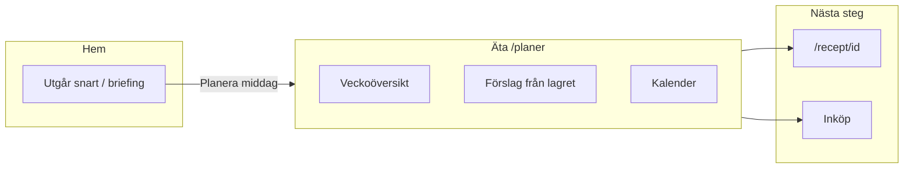

# Äta-sidan (`/planer`)

> **Syfte:** Veckovy för att planera middagar utifrån lagret — se vad som är planerat, lägg till från förslag, öppna recept och fyll inköpslistan.

## Namn och routes

| Yta | Route | UI-namn |
|-----|-------|---------|
| Primär flik | `/planer` | **Äta** (nav, sidhuvud, browser title) |
| Veckoförslag (AI) | `/planer/vecka` | **Veckoförslag** — generera och godkänn hela veckan |
| Receptdetalj | `/recept/{id}` | Öppnas från kalender eller idépanel |

Route `/planer` behålls av SEO/skäl — namnet **Äta** är ren UX/copy.

## Flöde

### Hem → Äta

- Home briefing moment `planMeal` → `/planer`
- Context banner länkar tillbaka till utgående varor på Hem (eller skafferi med `?filter=expiring` när Pantry V2 är aktivt)

### Äta → Inköp

- Efter "lägg saknade på lista" (idépanel eller dag-sheet): toast + bannerlänk till `/inkop`

### Äta → Recept

- Måltid med `ideaId`: chip i kalender, **Visa recept** i dag-sheet, **Laga** i idépanel
- Manuell måltid (utan idé): redigera i dag-sheet, ingen trasig receptlänk

## Kalender

- Öppen by default på `/planer`
- Växla **Vecka / Månad** i kalenderhuvudet
- Veckovy: 7 dagar med större måltidschips (desktop) eller vertikal daglista (mobil)
- Veckonavigation: synliga prev/next, svep vänster/höger, `aria-live` veckointervall
- Deep links: `#ata-calendar`, `?week=YYYY-MM-DD` (måndag normaliseras), `?month=YYYY-MM`
- Måltidschips: **Förslag** (idé) vs **Egen** (manuell) — inte bara färg

## Telemetry

| Event | När |
|-------|-----|
| `planer_viewed` | `/planer` mount |
| `ata_recipe_opened` | Recept öppnat från `calendar`, `ideas` eller `day_sheet` |
| `ata_week_view_toggled` | Vecka/månad-växling (`metadata.view`) |

## Relaterat

- Veckoritual success-state behåller **"Veckan fixad"** i [`WeeklyRitualFlow`](../src/lib/components/organisms/WeeklyRitualFlow.svelte) — skiljer sig från sidtiteln **Veckoförslag** på `/planer/vecka`.
