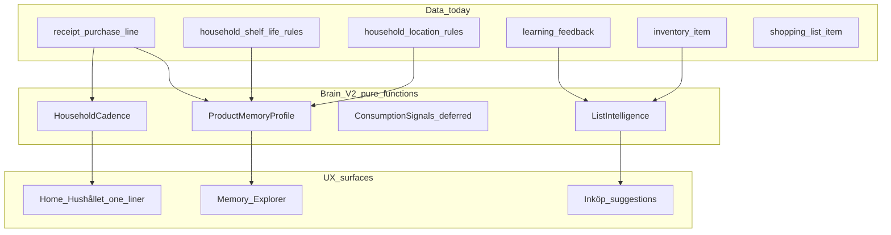
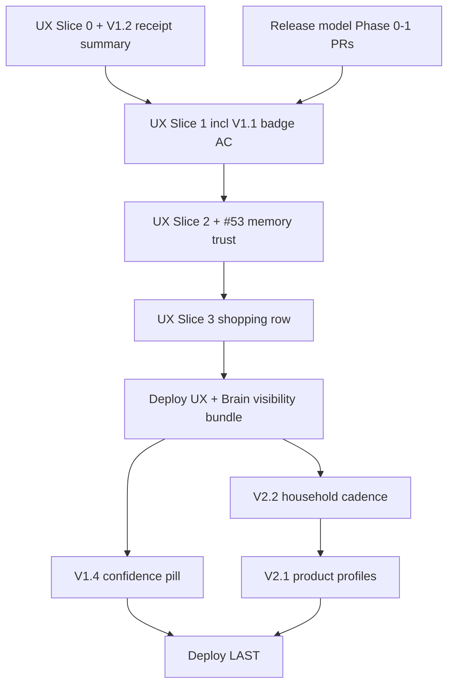

# Brain Roadmap V1.1 → V3

*Coordinator roadmap: inventory visibility, household memory graph, assistant vision — aligned with UX/UI slices and simplified release model.*

**Relaterat:** [BRAIN_V1_PRODUCT_INTEGRATION.md](./BRAIN_V1_PRODUCT_INTEGRATION.md) · [LEARNING_ENGINE.md](./LEARNING_ENGINE.md) · [UX_COORDINATOR_BACKLOG.md](./UX_COORDINATOR_BACKLOG.md)

**Baseline:** Prod `73d3dfd0` ([CURRENT_REALITY.md](./CURRENT_REALITY.md)), Brain V1 live (shelf/location/replenishment learning, Memory Explorer, Uppskattat i kvittoreview + receipt summary #67). **Deploy bundle 2 SHIPPED** (2026-06-14). **Release princip:** merge+deploy = aktiv, ingen flag-flip.

**Hard rules:** Inga nya predictors utan tydlig loop, inga LLM-tier, inga migrations utan explicit V2-gate, deploy sist, max 1 aktiv branch per filfamilj.

---

## Inventory gap (V1.1 decision)

| # | Fråga | Svar |
|---|--------|------|
| 1 | Var finns estimated expiry? | `InventoryItem.expiresOn` + `expiresOnSource` |
| 2 | Source/confidence på item? | `expiresOnSource`: `heuristic`, `household_learned`, `ai_inferred`, user-set, etc. |
| 3 | Var visas `EstimatedBadge` idag? | Desktop table (`InventoryTableRow`); receipt review (`ReceiptBulkAddFlow`) |
| 4 | Mobil compact row? | `InventoryCompactRow` — **ingen** badge; relative days only |
| 5 | UX-konflikt? | **Hög** — UX Slice 1 ändrar samma rad |

**Rekommendation:** Integrera V1.1 i UX Slice 1 (Product Row) — **inte** separat Brain-PR på `InventoryCompactRow`. Fallback: minimal patch om Slice 1 blockeras >1 vecka.

---

## Brain V1.x

| Version | Scope | User value | Primära filer | UX-konflikt | Build | Test | Rollback |
|---------|--------|------------|---------------|-------------|-------|------|----------|
| **V1.1 Visibility** | Uppskattat i inventory (mobil) | Brain synligt i skafferiet | `InventoryCompactRow` | **Slice 1** | **Integrera B** | `inventory-mobile.spec` | revert row |
| **V1.2 Receipt summary** | Efter import: “3 datum uppskattade…” | Stänger activation feedback-loop | `ReceiptBulkAddFlow`, `receipt-import-session.ts` | **Slice 0** | Kombinera med receipt toast PR | receipt e2e | revert |
| **V1.3 Explainability** | Varför/källa på förslag | Trust | `EstimatedBadge`, `PredictionExplainSheet`, `MemoryDetailSheet` | Låg om badge-only | Delvis live; utöka tap→edit | unit + settings e2e | revert |
| **V1.4 Confidence UX** | Hög/uppskattat/låg/granska | Tydlighet utan AI-hype | `EstimatedBadge`, `MemoryConfidenceBadge` | Låg | Efter V1.1 — `feat/brain-v1.4-confidence-pill` | unit | revert |
| **V1.5 Memory feedback** | Acceptera/korrigera/glöm enklare | Learning loop | `/settings/memory`, post-import links | **Slice 2**, #53 | Vänta — fold in #53 + Slice 2 | settings e2e | revert |
| **V1.6 Home timeline** | “Skaffu lärde sig…” på hem | Engagement utan dashboard | `HomeDashboard`, `HomeHouseholdSection` | **Slice 7** | Design only | critical-flows | revert |

**V1.x merge notes:** V1.2 kombineras med Slice 0 (toast + summary). V1.4 parallellt med Slice 3 (olika filer). Inga nya env flags.

---

## Brain V2 — Household Memory Graph

Relationer mellan produkt, plats, köp, konsumtion, lista, kvitto, bäst-före, feedback — **utan ny LLM**, **utan monolit**.

**Princip:** V2 = read models + pure functions över befintliga tabeller; nya tabeller endast om V2.3 consumption kräver event-log.

| Slice | Output | Data | UX | Build |
|-------|--------|------|-----|-------|
| **V2.1 Product profiles** | Per `normalizedKey`: location, shelf-life, cadence, confidence | `receipt_purchase_line`, rules | Memory Explorer enrichment | Efter deploy — `feat/brain-v2.1-product-profile-read` |
| **V2.2 Household cadence** | “Ni brukar handla på söndag”, store hint | `receipt_purchase_line` | En rad Home Hushållet | Efter UX deploy — `feat/receipt-household-memory` |
| **V2.3 Consumption signals** | Snabbt slut vs ofta kvar | **Saknas** — migration | Eat-first footnote | **Do Not Build Yet** |
| **V2.4 List intelligence** | “Lägg till yoghurt”, “köp inte pasta” | Replenishment + profiles | Inköp suggestions | Efter UX Slice 3 |

---

## Brain V3 — Household Assistant

**Inte** autonom AI. Transparent, korrigerbar, household-scoped, bekräftelse först.

| Capability | Kräver V2 | Creepy guard |
|------------|-----------|--------------|
| Veckolista-förslag | V2.1 + V2.2 | Visa som “förslag” + edit lista |
| Waste-aware shopping | V2.3 + eat-first | Data-driven, inte prediktion |
| Autopilot med confirm | Replenishment + patterns | Befintlig `ReceiptAutopilotSection` pattern |
| Household briefing | Home V3 §1–3 | Max 3 bullets, inga nya widgets |

| Slice | UX surface | Metric |
|-------|------------|--------|
| **V3.1 Weekly list assistant** | Inköp topp — “Förslag till veckan” (ej auto-add) | Lista från förslag, checkoff rate |
| **V3.2 Waste-aware shopping** | Inköp banner + shopping row hint | Färre finish-suggestions |
| **V3.3 Autopilot with confirmation** | Utöka receipt pattern accept till veckolista | — |
| **V3.4 Household briefing** | Kort veckobrief på Home | D7 retention, PMF |

**V3 = design + små slices efter V2.2 + UX wave deploy.**

---

## Build buckets

Scoring: User Value × Strategic Alignment × Learning Potential ÷ Conflict Risk.

| Rank | Item | Bucket |
|------|------|--------|
| 1 | V1.1 via UX Slice 1 Product Row (B) | **Build After UX Slice 1 starts** (requirement, not separate PR) |
| 2 | V1.2 receipt memory summary + Slice 0 toast | **Build Today** |
| 3 | V2.2 household cadence one-liner | **Build This Afternoon** (post-UX deploy) |
| 4 | V1.4 confidence pill on EstimatedBadge | **Build After Next Deploy** |
| 5 | V1.5 / #53 memory trust | **Build After Next Deploy** (Slice 2) |
| 6 | V2.1 product profile read model | **Build After Next Deploy** |
| 7 | V2.4 list hints copy | **Build After UX Slice 3** |
| 8 | V1.6 home timeline | **Design Only For Now** |
| 9 | V2.3 consumption signals | **Do Not Build Yet** |
| 10 | V3.x assistant | **Do Not Build Yet** |
| 11 | LLM tiers | **Do Not Build Yet** |

**Deploy bundle 1:** UX Slice 0 (+ V1.2), release Phase 0–1 → activation + receipt feedback. **Ej** inventory badge (väntar Slice 1).

**Deploy bundle 2 — SHIPPED @ `73d3dfd0`:** #67 receipt summary, #70 onboarding receipt wiring, #63 EstimatedBadge (desktop fallback), #59 home tone, #65 receipt location badge. **Mobil inventory badge + Product Row unify** väntar UX Slice 1 (`feat/ux-inventory-list-v1`, PLANNED). Slice 2–3 + optional V1.4 → next wave.

---

## Conflict matrix (UX/UI)

| UX work | Files | Brain tasks |
|---------|-------|-------------|
| Slice 0 P0 | `InventoryList`, `ReceiptBulkAddFlow`, `ShoppingListPanel` | V1.2 **integrate** |
| Slice 1 inventory | `InventoryCompactRow`, `InventoryList`, toolbar | V1.1 **integrate (B)**; V1.4 efter |
| Slice 2 settings/memory | settings, `MemoryExplorerPage`, #53 | V1.5 **integrate** |
| Slice 3 shopping | `ShoppingListPanel`, `ShoppingListRow` | V2.4 **after** |
| Slice 7 home | `HomeDashboard` | V1.6, V2.2, V3.4 **design first** |
| Slice 4 toast | `client-toast`, TOAST.md | V1.2 toast path **align** |
| Release model Phase 2 | un-flag brain | Brain code assumes always-on — **merge before** heavy Brain UX |

**Regel:** Samma fil → integration requirements eller sequential merge, aldrig parallella PRs.

---

## Merge order

**Max 1 open PR** på `InventoryCompactRow` / `ShoppingListPanel` / `HomeDashboard`.
