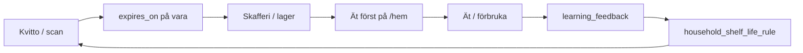

# Brain V1 — Product integration

*How shelf-life learning connects to the weekly household loop — wired on `master`, flags off until deploy.*

**Relaterat:** [LEARNING_ENGINE.md](./LEARNING_ENGINE.md) · [CURRENT_REALITY.md](./CURRENT_REALITY.md)

---

## Household loop impact

| Loop step | Brain V1 contribution |
|-----------|------------------------|
| **Kvitto → skafferi** | `ShelfLifePredictor` at import; household rules replace heuristics after 2+ samples |
| **Skafferi → ät först** | `findExpiringBefore` ranks by `expires_on` ASC — all sources |
| **Korrigering** | Expiry edit in lager/kvitto → `learning_feedback` → rule update |
| **Nästa vecka** | Better expiry → sharper eat-first chips |

---

## Feature flags

| Flag | Receipt parse UI | Scan bulk save | Kivra import | Inventory badge | Settings Förslag |
|------|------------------|----------------|--------------|-----------------|------------------|
| `SHELF_LIFE_LEARNING_ENABLED` | — | Server infer + feedback | Yes | Yes (saved source) | Yes |
| `PUBLIC_SHELF_LIFE_ESTIMATES_IN_RECEIPT` | Review UX + parse predictions | Hidden prediction fields | — | Unchanged | — |
| `LOCATION_LEARNING_ENABLED` | Location predictions in parse | Feedback on bulk save | Kivra import | — | Location rules panel |
| `REPLENISHMENT_LEARNING_ENABLED` | — | — | — | — | Accept/dismiss → `learning_feedback` |

### Rollback

Flags `false` → heuristik-only / no receipt estimate UI; `household_*_rule` and `learning_feedback` data remain.

---

## Gating consistency (implemented)

| Step | Gate | Entry |
|------|------|-------|
| Parse API predictions | `isShelfLifeEstimatesInReceiptEnabled()` | `api/receipt/parse/+server.ts` |
| Scan page prop | same | `scan/+page.server.ts` `load` → `ReceiptBulkAddFlow` |
| Bulk create infer | `inferLineShelfLife` + `isShelfLifeLearningEnabled()` | `scan/+page.server.ts` `bulkCreate` |
| Bulk create location feedback | `recordLineLocationFeedback` + `isLocationLearningEnabled()` | `scan/+page.server.ts` `bulkCreate`, `ReceiptBulkAddFlow` |
| Email/Kivra import | `isShelfLifeLearningEnabled()` | `receipt-import.ts` |
| Kivra/receipt location feedback | `recordLineLocationFeedback` + `isLocationLearningEnabled()` | `receipt-import.ts` |
| Replenishment accept/dismiss | `recordPredictorFeedback` (gated in service) | `api/replenishment/accept`, `api/replenishment/dismiss` |
| Inventory display | `isEstimatedExpirySource()` | `InventoryTableRow.svelte`, `EatFirstSection.svelte` |
| Expiry correction | `isShelfLifeLearningEnabled()` | `item/[id]/edit/+page.server.ts` |
| Settings → Förslag | `shouldShowSuggestionsSection()` | `settings/+page.server.ts` |

Predictor chain: **household_rule** (LEARNING on + `sample_count >= 2`) → **heuristic** → **LLM stub** (null).

---

## Smoke checklist (post flag enable)

1. Scan receipt → **Uppskattat** on line → save → lager badge
2. Edit expiry → toast *Tack — Skaffu justerar nästa gång* → re-import → household rule
3. `/hem` Eat First chips include item; estimated badge when source ≠ `user_set`
4. Settings → **Skaffu lär sig** → rule + **Återställ**

---

## Deferred (not V1)

- `HOUSEHOLD_FAVORITES_ENABLED` / migration `0049` — separate track
- `InkopDuoActionBar` — wedge UI, not shelf-life loop
- LLM tier, consumption-velocity sort, global learning
