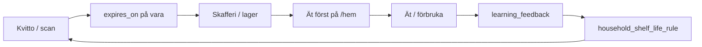

# Brain V1 — Product integration (Eat First + flags)

*How shelf-life learning connects to the weekly household loop, waste prevention, and Eat First — without new predictors or dashboards.*

**Relaterat:** [LEARNING_ENGINE.md](./LEARNING_ENGINE.md) · [TRUST_LAYER.md](./TRUST_LAYER.md) · [SKAFFU_BRAIN_MEMORY.md](./SKAFFU_BRAIN_MEMORY.md) · [CURRENT_REALITY.md](./CURRENT_REALITY.md) · `.cursor/rules/skaffu-core-loop.mdc`

---

## Household loop impact

Brain V1 closes a gap in the **60-day core loop**:

| Loop step | Brain V1 contribution |
|-----------|------------------------|
| **Kvitto → skafferi** | `ShelfLifePredictor` föreslår bäst-före vid import; hushållsregler (`sample_count >= 2`) ersätter generiska heuristiker |
| **Skafferi → ät först** | `findExpiringBefore` rankar alla aktiva rader med `expires_on` inom `EXPIRING_SOON_DAYS` — inkl. `household_learned` och `heuristic` |
| **Korrigering** | Användaren ändrar datum i lager eller kvittogranskning → `learning_feedback` → regel uppdateras |
| **Nästa vecka** | Bättre expiry → färre falska larm, fler träffsäkra eat-first-chips → mindre svinn |

Brain V1 **förstärker** Tier A (eat-first, replenishment, onboarding→inkop). Det ersätter inte inköpslistan eller checkoff.

---

## Eat First

### Ranking (shipped)

Eat First på `/hem` och veckoritualen får `summary.expiringSoon` från `InventoryService.getDashboard()` → `findExpiringBefore()`:

- Filter: aktiv rad, `expires_on` not null, idag ≤ datum ≤ idag + `EXPIRING_SOON_DAYS` (7)
- Sort: **`expires_on` ASC** (närmast utgång först)
- **Ingen särbehandling av `expiresOnSource`** — korrekt, eftersom källan beskriver *hur* datumet sattes, inte prioritet. Ett `household_learned`-datum som är tidigare rankas högre eftersom datumet är tidigare.

Chips visar dagar kvar + **Uppskattat**-badge när källan är `heuristic`, `household_learned` eller legacy `ai_inferred` ([`EstimatedBadge`](../src/lib/components/molecules/EstimatedBadge.svelte)).

### Recipe suggestions (unchanged)

`POST /api/eat-first` använder samma `filterItemsExpiringWithinDays()` — AI-recept baseras på varunamn + expiry, inte på predictor-tier.

### What Eat First does **not** do (V1)

- Ingen separat “confidence sort” (household vs heuristic)
- Ingen consumption-velocity-driven reorder (design i [SKAFFU_BRAIN_MEMORY.md](./SKAFFU_BRAIN_MEMORY.md), ej materialiserad)
- Ingen LLM meal planning tier

---

## Waste prevention

| Surface | Mechanism | Brain V1 link |
|---------|-----------|---------------|
| **Eat First chips** | Items inom 7 dagar, sorterade | Bättre `expires_on` → fler relevanta chips |
| **`detectWasteAlert()`** | Briefing / `#eat-first` CTA | Räknar expiring + “slow movers” (`lastConfirmedAt` ≥ 14d) — använder samma `expires_on` |
| **Expiry reminders** | E-post / push digest | `filterItemsExpiringWithinDays` i `ExpiryReminderService` |
| **Auto-expired** | Past `expires_on` + grace | Uppskattade datum kan auto-expire som manuella — användaren kan korrigera → feedback |

**Outcome hypothesis (seed cohort):** fler varor med hushållsanpassat datum → högre precision i eat-first → färre “missade” varor och färre falska alarm.

---

## Feature flags — what each controls

| Flag | Reader | Receipt parse UI | Scan bulk save | Email/Kivra import | Inventory list badge | Eat-first rank |
|------|--------|------------------|----------------|---------------------|----------------------|----------------|
| `SHELF_LIFE_LEARNING_ENABLED` | `isShelfLifeLearningEnabled()` | — (server) | Server infer när inget datum i formulär | Ja — `receipt-import.ts` | Ja — badge på uppskattat | Ja — sparade datum |
| `PUBLIC_SHELF_LIFE_ESTIMATES_IN_RECEIPT` | `isShelfLifeEstimatesInReceiptEnabled()` | Visa dolda fält + “Uppskattat” i granskning | — (fallback till LEARNING-flag) | — | **Oförändrad** (badge kvar) | Oförändrad |
| `LOCATION_LEARNING_ENABLED` | `isLocationLearningEnabled()` | Platsförslag i kvitto | Platsfeedback | — | — | — |
| `REPLENISHMENT_LEARNING_ENABLED` | `isReplenishmentLearningEnabled()` | — | — | — | Lista accept/dismiss → feedback | — |
| `SHELF_LIFE_LLM_ENABLED` | `isShelfLifeLlmEnabled()` | — | — | — | — | — |

### Fallback rule

`PUBLIC_SHELF_LIFE_ESTIMATES_IN_RECEIPT` unset → faller tillbaka till `SHELF_LIFE_LEARNING_ENABLED` ([`shelf-life-learning-flag.ts`](../src/lib/server/shelf-life-learning-flag.ts)).

### Intentional split

- **PUBLIC_*** = synlighet i kvittogranskning (parse API + `ReceiptBulkAddFlow`)
- **SHELF_LIFE_LEARNING_ENABLED** = server-side predictor + regelmaterialisering + tyst infer vid save när UI döljer fält
- **Inventory badge** följer sparad `expiresOnSource`, inte PUBLIC-flaggan ([TRUST_LAYER.md](./TRUST_LAYER.md))

### Rollback

Flags `false` → heuristik-only / inga kvittoförslag; `household_shelf_life_rule` och `learning_feedback` kvar. Re-enable återupptar lärande.

**Seed cohort:** alla fyra Brain-flaggor `true` i `apphosting.yaml` — se [FOUNDER_SEED_PLAYBOOK.md](./FOUNDER_SEED_PLAYBOOK.md).

---

## Gating consistency (receipt → inventory)

| Step | Gate | Entry |
|------|------|-------|
| Parse API predictions | `isShelfLifeEstimatesInReceiptEnabled()` | [`api/receipt/parse/+server.ts`](../src/routes/api/receipt/parse/+server.ts) |
| Scan page prop | same | [`scan/+page.server.ts`](../src/routes/scan/+page.server.ts) `load` |
| Bulk create infer (no form date) | `isShelfLifeLearningEnabled()` | `scan/+page.server.ts` `bulkCreate` |
| Email/Kivra import | `isShelfLifeLearningEnabled()` | [`receipt-import.ts`](../src/lib/server/receipt-import.ts) |
| Inventory display | `isEstimatedExpirySource(expiresOnSource)` | [`InventoryTableRow.svelte`](../src/lib/components/molecules/InventoryTableRow.svelte) |
| Settings → Förslag | `isShelfLifeLearningEnabled()` | [`settings/+page.server.ts`](../src/routes/settings/+page.server.ts) |

Predictor chain: **household_rule** (kräver LEARNING on + `sample_count >= 2`) → **heuristic** → **LLM stub** (null).

---

## Not launched (explicit out of scope V1)

| Item | Status |
|------|--------|
| **LLM shelf-life tier** | Stub behind `SHELF_LIFE_LLM_ENABLED`; always off |
| **Global / cross-household learning** | Design-only; allt scoped `household_id` |
| **PMF / Brain dashboards** | Tier C — no user-facing analytics for rules |
| **Consumption-velocity predictor** | Domain sketch; ej wired to eat-first sort |
| **Unified trust API** | Design in TRUST_LAYER; settings panel is V1 surface |
| **Meal-AI as Brain hero** | Eat-first recipes unchanged; not a learning surface |

---

## Smoke checklist (post flag enable)

1. Scan receipt → “Uppskattat” on line → save → item in lager with badge
2. Edit expiry → toast “tack” → re-import same product → date reflects rule
3. `/hem` Eat First chips include item, earliest date first; estimated badge when source ≠ `user_set`
4. Settings → Förslag → shelf-life rule visible with sample count + Återställ
