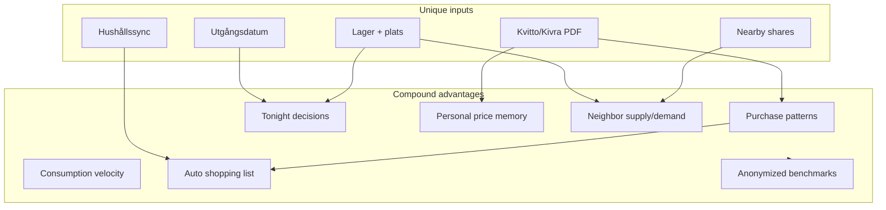

# Breakthrough Growth Opportunities — Skaffu

*Version: juni 2026. Kritisk strategidokument som svarar på breakthrough-frågan: vad får en främling att installera utan social proof?*

**Relaterade dokument:** [`GROWTH_STRATEGY.md`](./GROWTH_STRATEGY.md) · [`PRODUCT_LED_GROWTH_ANALYSIS.md`](./PRODUCT_LED_GROWTH_ANALYSIS.md) · [`ACQUISITION_WEDGES.md`](./ACQUISITION_WEDGES.md) · [`JUNE_ENGINEERING_REPORT.md`](./JUNE_ENGINEERING_REPORT.md) · [`COMPETITIVE_ANALYSIS.md`](./COMPETITIVE_ANALYSIS.md) · [`GRANNSKAFFERIET_V0.md`](./GRANNSKAFFERIET_V0.md) · [`ROADMAP.md`](./ROADMAP.md) · [`PMF_METRICS_LOG.md`](./PMF_METRICS_LOG.md) · [`RECEIPT_AUTOPILOT_NO_KIVRA_PLAN.md`](./RECEIPT_AUTOPILOT_NO_KIVRA_PLAN.md) · [`KIVRA_PARTNERSHIP_TRACK.md`](./KIVRA_PARTNERSHIP_TRACK.md) · [`FOOD_ECOSYSTEM_EXPLORATION.md`](./FOOD_ECOSYSTEM_EXPLORATION.md) (C1–C7 kategori-horisont om B1–B12 compound lyckas)

**Avgränsning:** Denna rapport upprepar inte distribution-kanaler (LinkedIn, Facebook-grupper, SEO, referrals, `/dela`, household invites, Wrapped-dela, community outreach, hero A/B, UTM) — de täcks i [`GROWTH_STRATEGY.md`](./GROWTH_STRATEGY.md) och [`PRODUCT_LED_GROWTH_ANALYSIS.md`](./PRODUCT_LED_GROWTH_ANALYSIS.md). Briefen antar att kanaler finns; fokus är *vad i produkten* skapar pull.

**Datagap (ärligt):** [`PMF_METRICS_LOG.md`](./PMF_METRICS_LOG.md) är i stort sett tom. All rankning bygger på produktlogik, shipped kod och konkurrentanalys — inte påhittade konverteringssiffror.

---

## 1. Executive summary

- **Breakthrough-bottleneck idag är growth, inte engineering.** Juni 2026 levererade 435 commits, Grannskafferiet v1–v2, admin analytics och Kivra-forward MVP — men ingen bevisad funnel för kall trafik ([`JUNE_ENGINEERING_REPORT.md`](./JUNE_ENGINEERING_REPORT.md) §9–10). [`PRODUCT_LED_GROWTH_ANALYSIS.md`](./PRODUCT_LED_GROWTH_ANALYSIS.md) identifierar rätt *nästa steg* (Inköp-invite, publik inköpslista) men de förstärker befintliga loopar som kräver att någon redan använder Skaffu. Breakthrough-frågan kvarstår: **vad får en främling att registrera sig utan nätverk?**

- **Top 1–2 breakthrough bets (inte bevisat):** (1) **B1+B2 kombinerat** — Kivra-forward som primär onboarding → lager fylls automatiskt → personligt prisminne från egna kvitton. Differentierar mot Matpriskollen (butiksjämförelse, inte din historik) och Matdags (native distribution, inte PDF-pipeline). (2) **B3 publik city-feed** — read-only lista av aktiva delningar per stad utan login — *om* supply seedas manuellt; annars tom-feed-risk.

- **Overbuilt vs under-explored (juni-engineering):** Overbuilt: Grannskafferiet v2-karta, admin analytics/decisions, LinkedIn OAuth queue, SEO guides pipeline. Under-explored: Kivra-forward som *hero story* (shipped men gömd i Inställningar), receipt pattern engine som acquisition-hook (`purchase-pattern.ts` live men ingen stranger-facing demo), Skaffurapport som demand creation (gate ≥50 hushåll).

- **Explicit inte breakthrough nu:** Grannskafferiet-karta (login + opt-in + density), generisk meal-plan AI (ChatGPT-substitut), publik pantry-kalkylator (B10 kill), BRF-onboarding (B12 kill), fler admin-dashboards.

- **Kärntes:** Kvitto-pipeline är **moat**, inte automatiskt **wow för främlingar**. Wow kräver att mottagaren *ser* värdet innan konto — antingen via publik utility (B3) eller via sökintent-hook (“Kivra → skafferi”, B1).

---

## 2. De fem breakthrough-frågorna — direkta svar

### 2.1 Vad får en främling att installera utan nätverk?

**Kort svar:** Endast features med *standalone utility* — något användbart utan att en vän redan delat en länk. Idag finns nästan inget: `/grannskafferiet` kräver login, `/dela/[token]` kräver befintlig användare, app-kärnan är bakom konto-vägg.

**Kandidater med stranger-pull:**

| Hypotes | Stranger-pull | Katalog |
|---------|---------------|---------|
| Kivra-forward autopilot | Medel–hög i SV-nisch — sökintent “Kivra kvitto”, “ICA PDF skafferi” | **B1** |
| Personligt prisminne | Medel — budgetmedvetna hushåll söker “vad betalade jag för X?” | **B2** |
| Publik city-feed | Hög *om* icke-tom; död *om* tom | **B3** |
| Recall/allergy alert | Medel–hög via fear/intent | **B7** |

**Svaga för stranger:** Grannskafferiet-karta (tre barriärer), Tonight engine (B5), consumption velocity (B9), household coordination (B11 = PLG O1-territorium).

**Slutsats:** Breakthrough kräver antingen **publik read-only yta** (B3) eller **tydlig sökintent-hook** kopplad till unik data (B1+B2). Distribution utan produkt-pull fortsätter konvertera dåligt — se [`GROWTH_STRATEGY.md`](./GROWTH_STRATEGY.md) §1.

### 2.2 Skapar vi demand eller bara distribution?

**Demand creation** = folk *söker aktivt* efter lösningen och hittar Skaffu. **Distribution** = vi pushar budskap till folk som inte letade.

| Typ | Exempel | Verdict |
|-----|---------|---------|
| Demand | “Forwarda Kivra-kvitto → skafferi uppdateras”; “mat som finns nära dig [stad]”; “återkallelse på varor jag köpt” | B1, B3, B7 |
| Distribution only | Karta-polish, Wrapped, admin LinkedIn queue, fler dashboards | Retention/ops |
| Hybrid (svag demand) | “Minska matsvinn” — bred intent, låg differentiering | Generisk AI, B10 |

Features som bara funkar *efter* registrering och aktivering (B5 Tonight, B9 velocity, B6 pre-shopping gate) skapar **habit**, inte **demand**. De är värdefulla som compound efter activation — inte som breakthrough-ingång.

**Peaking:** B1 och B3 är de enda med tydlig *intent-match* utan social graph. B2 kräver kvittohistorik men kan marknadsföras som intent (“ditt eget prisarkiv”) om B1 sänker aktiveringsbarriären.

### 2.3 Vad skapar daglig vana?

Daglig vana kräver **timely decision** eller **pre-shopping ritual** — inte veckovis planering.

| Mekanism | Habit-styrka | Stranger? | Katalog |
|----------|--------------|-----------|---------|
| Push/e-post “äta idag” från faktisk utgång | Hög för aktiverade | Låg | **B5** |
| Pre-shopping gate före butik | Medel–hög | Medel (PWA install) | **B6** |
| Kivra autopilot completion | Medel — “kvitto kom → lager fixat” | Medel | **B1** |
| Nearby push vid delning | Medel | Låg (kräver opt-in) | PLG O9 |

ROADMAP P3-A (“Ät det först” veckovy) driver **veckovana**, inte daglig — retention-first, inte stranger-install ([`ROADMAP.md`](./ROADMAP.md) P3). B5 är adjacent men ska rankas som **compound efter activation**, inte breakthrough.

**Rekommenderad sekvens:** Breakthrough (B1/B3) → activation → habit compound (B5, B6, B9).

### 2.4 Vad är svårt för ChatGPT alone?

ChatGPT kan generera inköpslistor, recept och generiska pantry-tips — men kan inte:

- Parsa ICA/Kivra-PDF med per-rad plats och bygga persistent lager
- Veta vad *ditt* hushåll har, utgår när, eller vad partnern just la till
- Köra Kivra-forward till hushållsspecifik token (`/api/inbound/kivra`)
- Matcha neighbor supply mot demand med geo + privacy
- Beräkna personligt prisminne från *dina* kvitton över tid

Se §8 för full matris. Generisk meal-plan AI och publik pantry-kalkylator (B10) är **ChatGPT-substitut** — kill.

### 2.5 Vad stärks av inventory / receipts / expiry / household / local?

Unika inputs compound till fördelar som blir svårare att kopiera över tid:

**Shipped kod:**

| Compound output | Kod / route |
|-----------------|-------------|
| Purchase patterns | `src/lib/domain/purchase-pattern.ts` — `detectReceiptPatternSuggestions`, heuristik 90 dagar, min 2 imports |
| Finish suggestions | `detectReceiptFinishSuggestions` — “köpt igen medan gammal finns kvar” |
| Skaffurapport benchmarks | `skaffurapport.service.ts`, k-anonymitet ≥10, beta-kohort ≥50 (`SKAFFURAPPORT_K_ANONYMITY_MIN`) |
| Kivra forward | `kivra-forward.ts`, `POST /api/inbound/kivra`, adress i Inställningar |
| Nearby supply | `expiring_share_link` + geo stack — kräver density |

**Breakthrough-insikt:** Compound moat (B2, B8, B9) bygger *efter* activation. Breakthrough (B1, B3) måste antingen exponera compound tidigt eller skapa publik utility utan konto.

---

## 3. Antaganden vi demolishar

### “Killer feature = Ät det först veckovy” (ROADMAP P3-A)

P3-A kopplar utgående varor → måltidsförslag → plan → lista. Stark **retention** och tydlig demo för *aktiverade* användare. Men en främling som googlar “skafferi-app” får ingen utility från veckovy utan att först bygga lager.

**Verdict:** Behåll som retention-spår (ROADMAP rekommenderar A). **Inte** breakthrough för cold acquisition. Rankas under B1, B2, B3.

### “Grannskafferiet = growth”

[`GRANNSKAFFERIET_V0.md`](./GRANNSKAFFERIET_V0.md) och [`GROWTH_STRATEGY.md`](./GROWTH_STRATEGY.md) säger hybrid: Dela som bild + länk först, karta efter density. Kod bekräftar: `/grannskafferiet` redirectar till login, density-gate ≥5–10 delningar/500 m.

**Verdict:** Retention och nätverk för opt-in-användare. Acquisition endast *efter* manuell supply-seed. Att bygga mer karta-polish pre-PMF var juni:s största misstag ([`JUNE_ENGINEERING_REPORT.md`](./JUNE_ENGINEERING_REPORT.md) §10).

### “Mer AI = growth”

Photo AI zone detection, recept-schema, generiska måltidsförslag — personligt värde inuti appen, noll extern exponering. ChatGPT gör 80 % av “recept från det jag har hemma” utan persistent state.

**Verdict:** AI som *guardrail* på befintlig data (utgång → 3 måltider) = compound. AI som *huvudstory* = substitut. Se B5 vs B10.

### “Mer dashboards/admin = growth”

Juni levererade behavior schema, nightly rollup, admin decisions, cohort CSV, LinkedIn OAuth queue — **0 slutanvändar-PLG** ([`PRODUCT_LED_GROWTH_ANALYSIS.md`](./PRODUCT_LED_GROWTH_ANALYSIS.md) §7).

**Verdict:** Ägarverktyg. Noll stranger-pull.

### “Engineering capacity är bottleneck”

435 commits på 11 dagar, 37 mergade PRs, Kivra MVP shipped — kapacitet finns. [`PMF_METRICS_LOG.md`](./PMF_METRICS_LOG.md) tom, kall konvertering dålig, Grannskafferiet utan density.

**Verdict:** **Growth är bottleneck** — rätt produkt-yta, rätt message, rätt experiment — inte fler features. WIP=1 tills PMF baseline fylld ([`JUNE_ENGINEERING_REPORT.md`](./JUNE_ENGINEERING_REPORT.md) §9).

---

## 4. Opportunity catalog (B1–B12)

Obligatoriska fält per idé. ID används i rankning (§5). **O1–O15** i [`PRODUCT_LED_GROWTH_ANALYSIS.md`](./PRODUCT_LED_GROWTH_ANALYSIS.md) refereras som compound där relevant — inte som nya breakthrough-idéer.

---

### B1 — Kivra-forward autopilot (primär onboarding)

| Fält | Värde |
|------|-------|
| **User story** | Som ny användare vill jag forwarda mitt ICA-kvitto från Kivra till en personlig adress och se skafferiet fyllas utan scan — som primär onboarding, inte gömd inställning. |
| **Why users care** | Svenska hushåll får redan PDF-kvitton i Kivra; manuell scan är tröttsamt. “Skicka vidare → klart” matchar befintlig vana. |
| **Why hard to copy** | Kräver nordisk PDF-parsing, per-rad plats-gissning, hushållsspecifik forward-token (`buildKivraForwardAddress`), inbound-pipeline (`POST /api/inbound/kivra`). Matdags har kvitto men inte samma forward-MVP; Matpriskollen har inget lager. |
| **Why growth** | Sökintent “Kivra skafferi”, “ICA kvitto app” — demand creation utan social graph. Sänker aktiveringsbarriär → fler når compound (B2, B9). |
| **Complexity** | M — MVP shipped jun 2026; gap = hero-positionering + parsing-kvalitet (P2 fixtures) |
| **Confidence** | M — teknik live; conversion obevisad |
| **Biggest risk** | Parsing missar rader → trust-break första kvittot; Kivra-forward okänd som kategori |

**Verdict:** **Breakthrough** (med parsing-risk). Primär bet-kandidat.

---

### B2 — Personligt prisminne

| Fält | Värde |
|------|-------|
| **User story** | Som budgetmedveten användare vill jag fråga “vad betalade jag senast för Arla mjölk på ICA?” och få svar från mina egna kvitton — inte butiksjämförelse. |
| **Why users care** | Matpriskollen visar *butiks*priser idag; ingen app visar *din* historik kopplad till lager. Relevant vid inflation och budgetplanering. |
| **Why hard to copy** | Kräver ackumulerad receipt history per hushåll, normalisering (`normalizeReceiptProductName`), tidslinje över butiker. ChatGPT har inte dina kvitton. |
| **Why growth** | Differentierad intent (“mitt prisarkiv”); compound med B1 — varje forwardat kvitto förstärker minnet. |
| **Complexity** | M — köphistorik i `receipt_purchase_line` (namn, nyckel, frekvens); **pris/butik saknas**; parse + persist + UI väntar. Se [`PRICE_MEMORY_STRATEGY.md`](./PRICE_MEMORY_STRATEGY.md). |
| **Confidence** | M — moat tydlig; stranger-pull medel (kräver förklaring) |
| **Biggest risk** | Smalt use case; Matpriskollen kan lägga “historik” med lägre friktion |

**Verdict:** **Breakthrough / compound moat**. Bäst kombinerat med B1.

---

### B3 — Publik city-feed (read-only, ingen login)

| Fält | Värde |
|------|-------|
| **User story** | Som nyfiken granne vill jag se vilken mat som delas i Malmö just nu — utan konto — som en flip av OLIO:s manuella listings. |
| **Why users care** | OLIO kräver app + foto; Skaffu-listan kommer från riktiga skafferier automatiskt. Publik browse sänker barriär vs login-gated `/grannskafferiet`. |
| **Why hard to copy** | Kräver lager → utgång → snapshot-pipeline (`expiring_share_link`) redan shipped; OLIO har inte pantry-sanningskälla. |
| **Why growth** | Hög stranger-pull *om* feed inte är tom. Demand creation: “gratis mat Malmö” utan social proof. |
| **Complexity** | M — aggregera aktiva snapshots per stad; privacy (ingen PII redan i snapshot) |
| **Confidence** | M — tom-feed dödar produkten |
| **Biggest risk** | **Tom-feed** utan manuell seed; negativ social proof värre än ingen sida |

**Verdict:** **Breakthrough** (villkorat av supply-seed). Alternativ primär bet om ägare willing to seed.

---

### B4 — Demand board (saknar X → neighbor match)

| Fält | Värde |
|------|-------|
| **User story** | Som användare som saknar tahini vill jag posta behov och matchas mot grannars opt-in inventory — inte bara utgående-listor. |
| **Why users care** | Utökar Grannskafferiet från “jag har för mycket” till “jag behöver” — dubbelriktad nätverkseffekt. |
| **Why hard to copy** | Kräver geo, opt-in, inventory-synlighet med privacy-design, density. |
| **Why growth** | Medel stranger-pull; högre retention/network. |
| **Complexity** | L–XL — ny datamodell + trust |
| **Confidence** | L — density saknas |
| **Biggest risk** | Privacy backlash; tom demand-sida utan supply |

**Verdict:** **Compound moat** (post-density). Inte breakthrough nu.

---

### B5 — Tonight engine (daglig beslutspush)

| Fält | Värde |
|------|-------|
| **User story** | Varje kväll vill jag få en push: “Ät laxen idag — den går ut imorgon” med ett konkret förslag från mitt faktiska lager. |
| **Why users care** | Minskar beslutsångest och matsvinn; tydligare än veckoplan. |
| **Why hard to copy** | Kräver expiry + inventory + push; ChatGPT vet inte dina datum. |
| **Why growth** | Hög habit; **låg stranger** — kräver aktiverat lager. |
| **Complexity** | M — data finns; P3-A adjacent |
| **Confidence** | H för retention; L för acquisition |
| **Biggest risk** | Notis-trötthet; fel förslag → avregistrering |

**Verdict:** **Retention-only / compound**. Sekundär bet efter activation.

---

### B6 — Pre-shopping gate

| Fält | Värde |
|------|-------|
| **User story** | Innan jag går till ICA vill jag öppna Skaffu och se live inköpslista med “du har redan hemma” — så jag inte köper dubbelt. |
| **Why users care** | Butik-vana: telefonen upp vid hyllan. Bring har lista men inte lager-sanningskälla. |
| **Why hard to copy** | Kräver synkat lager + lista + hushåll; realtids “already in pantry”. |
| **Why growth** | Medel stranger (PWA install-moment); stark habit för aktiverade. |
| **Complexity** | S–M — mycket finns; UX-positionering saknas |
| **Confidence** | M |
| **Biggest risk** | Data inaktuell → användare slutar lita |

**Verdict:** **Compound moat**. Inte breakthrough; förstärker PLG O2 (publik lista) för hushåll.

---

### B7 — Recall / allergy alert kopplad till köpta varor

| Fält | Värde |
|------|-------|
| **User story** | När Livsmedelsverket återkallar en produkt vill jag få alert om jag köpt den — baserat på kvittohistorik. |
| **Why users care** | Fear/intent; konkret nytta beyond matsvinn. |
| **Why hard to copy** | Kräver receipt matching + recall data feed + persistent inventory. |
| **Why growth** | Medel–hög stranger om marknadsförd som safety; PR-potential. |
| **Complexity** | L — data sourcing, liability, false positives |
| **Confidence** | L — juridik och datakvalitet |
| **Biggest risk** | Missad match eller fel alert → liability; data-licens |

**Verdict:** **Breakthrough potential** (villkorat). Spännande men hög risk — parkera till post-B1.

---

### B8 — Anonymized waste benchmark

| Fält | Värde |
|------|-------|
| **User story** | Jag vill veta om mitt hushåll slösar mer än liknande i Malmö — anonymiserat. |
| **Why users care** | Social jämförelse motiverar beteendeändring; Skaffurapport visar aggregerad data men inte personlig benchmark. |
| **Why hard to copy** | Kräver kohort med k-anonymitet (`SKAFFURAPPORT_K_ANONYMITY_MIN = 10`); fler hushåll = bättre benchmarks. |
| **Why growth** | Medel — PR via Skaffurapport; svag cold pull. |
| **Complexity** | M — evolution av `skaffurapport.service.ts` |
| **Confidence** | M — gate ≥50 hushåll blockerar |
| **Biggest risk** | Kohort för liten; benchmark känns meningslös |

**Verdict:** **Compound moat**. Inte breakthrough före kritisk massa.

---

### B9 — Consumption velocity autopilot

| Fält | Värde |
|------|-------|
| **User story** | Skaffu ska säga “mjölk slut om ~2 dagar” och lägga till på inköpslista automatiskt — från köpmönster. |
| **Why users care** | Mindre manuellt tänk; lista fylls själv. |
| **Why hard to copy** | `purchase-pattern.ts` live med heuristik; kräver receipt history. |
| **Why growth** | Låg stranger; hög retention för power users. |
| **Complexity** | S–M — delvis live på `/hem` + `/inkop` |
| **Confidence** | H för moat; L för acquisition |
| **Biggest risk** | Fel velocity → felaktiga listor |

**Verdict:** **Retention-only / compound**. Stödjer B1-moat, inte breakthrough.

---

### B10 — Public “pantry calculator” (estimator utan konto)

| Fält | Värde |
|------|-------|
| **User story** | Som besökare vill jag uppskatta matsvinn i kronor utan konto. |
| **Why users care** | Kuriosa — inte daglig utility. |
| **Why hard to copy** | **Lätt** — ChatGPT + generiska formler. |
| **Why growth** | Låg; ingen persistent state; ingen moat. |
| **Complexity** | S |
| **Confidence** | H att det **inte** håller |
| **Biggest risk** | Attraherar fel audience; noll konvertering till lager |

**Verdict:** **KILL.** ChatGPT-substitut utan data-moat. Bygg inte.

---

### B11 — Household coordination layer

| Fält | Värde |
|------|-------|
| **User story** | “Vem handlar / vad saknas” — multiplayer inköp. |
| **Why users care** | Familjer delar inköp idag via Bring/WhatsApp. |
| **Why hard to copy** | Hushållssync shipped; roller owner/editor/viewer. |
| **Why growth** | Låg stranger — kräver invite (PLG **O1**, **O2**, **O5**). |
| **Complexity** | S–M för UX-förstärkning |
| **Confidence** | H — redan analyserat i PLG-doc |
| **Biggest risk** | Duplicerar PLG-arbete utan ny breakthrough-vinkel |

**Verdict:** **Compound** (via PLG O1–O5). **Inte ny breakthrough-idé** — kör PLG Tier A först.

---

### B12 — BRF / hyresvärd pantry onboarding

| Fält | Värde |
|------|-------|
| **User story** | BRF köper Skaffu till alla lägenheter som matsvinn-initiativ. |
| **Why users care** | Bra för samhälle; inte individens sökintent. |
| **Why hard to copy** | Säljcykel, inte produkt-moat. |
| **Why growth** | Distribution-heavy; kräver B2B-sälj före PMF ([`ROADMAP.md`](./ROADMAP.md) P4-F). |
| **Complexity** | XL (sälj) + L (multi-tenant) |
| **Confidence** | L |
| **Biggest risk** | Ingen PMF → churn hela BRF; distraherar från B2C breakthrough |

**Verdict:** **KILL** (för nu). Appendix only; revisit efter P3 exit-gate.

---

## 5. Rankad breakthrough-lista

Poäng 1–5 per dimension. **Breakthrough potential** = stranger install + demand creation (vägt dubbelt). Sorterat på breakthrough potential, inte implementation ease.

| Rank | ID | Möjlighet | Stranger | Demand | Habit | Moat | Validate | **BP** | Verdict |
|------|-----|-----------|----------|--------|-------|------|----------|--------|---------|
| 1 | **B1** | Kivra-forward autopilot | 4 | 5 | 3 | 5 | 4 | **4,6** | Breakthrough |
| 2 | **B3** | Publik city-feed | 5 | 4 | 2 | 3 | 3 | **4,2** | Breakthrough* |
| 3 | **B2** | Personligt prisminne | 3 | 4 | 2 | 5 | 4 | **3,8** | Breakthrough |
| 4 | **B7** | Recall/allergy alert | 4 | 4 | 2 | 4 | 2 | **3,6** | Potential |
| 5 | **B6** | Pre-shopping gate | 3 | 2 | 4 | 4 | 4 | **3,2** | Compound |
| 6 | **B8** | Waste benchmark | 2 | 3 | 2 | 4 | 3 | **2,8** | Compound |
| 7 | **B4** | Demand board | 2 | 2 | 3 | 4 | 2 | **2,6** | Compound |
| 8 | **B5** | Tonight engine | 1 | 1 | 5 | 4 | 4 | **2,6** | Retention |
| 9 | **B9** | Velocity autopilot | 1 | 1 | 4 | 4 | 5 | **2,4** | Retention |
| 10 | **B11** | Household coordination | 1 | 1 | 3 | 3 | 5 | **2,0** | PLG compound |
| — | **O8** | Grannskafferiet karta | 1 | 1 | 3 | 2 | 2 | **1,6** | Retention |
| — | **O12** | Generisk AI meal-plan | 2 | 2 | 2 | 1 | 3 | **1,8** | Substitut |
| — | **B10** | Pantry calculator | 2 | 1 | 1 | 1 | 5 | **1,6** | **KILL** |
| — | **B12** | BRF onboarding | 1 | 2 | 1 | 1 | 1 | **1,4** | **KILL** |

\* B3 förutsätter manuell supply-seed; utan seed faller BP till ~2,0.

**Explicit motivering — top 3 ovan Grannskafferiet (O8) och generisk AI (O12):**

1. **B1** skapar demand via Kivra-intent utan login-barriär på *story-nivå*; moat från PDF-pipeline som varken OLIO, Matpriskollen eller ChatGPT replikerar.
2. **B3** är enda idén med *publik* utility utan konto — O8 kräver login + opt-in + density.
3. **B2** differentierar mot Matpriskollen (§4.8) — de jämför butiker, inte din historik; kräver B1 för dataackumulation.

Grannskafferiet-karta rankas **#10** (via O8); generisk AI meal-plan under B5 och under top 3.

---

## 6. Network effects & moats

### Stärks med fler användare (cross-household)

| Idé | Nätverkseffekt | Krav |
|-----|----------------|------|
| B3 city-feed | Mer supply → mer värde för browse | Seed + stad |
| B4 demand board | Match quality | Density + opt-in |
| B8 benchmark | Finare kohortjämförelse | ≥50 hushåll |
| O8 karta | Nearby discovery | Login + opt-in + density |

### Solo-hushåll moats (växer utan nätverk)

| Idé | Moat-mekanism |
|-----|---------------|
| B1 Kivra pipeline | Receipt corpus per hushåll |
| B2 prisminne | Ackumulerad prishistorik |
| B9 velocity | `purchase-pattern.ts` heuristik |
| B6 pre-shopping | Lager + lista synk |

### Trust / opt-in-gräns

Cross-household värde (B3, B4, O8) kräver **explicit opt-in** för plats och delning. Solo-moats (B1, B2) kräver bara **hushållsregistrering + kvitto**. Strategi: bygg solo-moat först (B1+B2), öppna cross-household när density finns (B3 seed → O8).

---

## 7. ChatGPT-resistansmatris

| Idé | ChatGPT 80 % utan Skaffu? | Varför Skaffu vinner |
|-----|---------------------------|----------------------|
| B1 Kivra autopilot | **Nej** | PDF-parse, per-rad plats, forward-token, persistent lager |
| B2 Prisminne | **Nej** | Kräver *dina* kvitton över tid |
| B3 City-feed | **Delvis** | Lista kan beskrivas; live supply + snapshot kräver backend |
| B4 Demand board | **Nej** | Geo + inventory + opt-in |
| B5 Tonight | **Delvis** | Generiska middagsförslag ja; *dina* utgångsdatum nej |
| B6 Pre-shopping | **Nej** | Live lager ∩ lista |
| B7 Recall alert | **Nej** | Match köpt ↔ recall |
| B8 Benchmark | **Nej** | K-anonym kohortdata |
| B9 Velocity | **Nej** | Historisk köpfrekvens per hushåll |
| B10 Calculator | **Ja** | Generiska uppskattningar — **kill** |
| B11 Household | **Delvis** | Lista ja; sync + roller nej |
| O12 Generisk AI plan | **Ja** | Recept/listor utan state — substitut |
| O8 Grannskafferiet | **Nej** | Geo + snapshots; men svag stranger |

**Positionering mot konkurrenter** ([`COMPETITIVE_ANALYSIS.md`](./COMPETITIVE_ANALYSIS.md)):

- **Matpriskollen (§4.8):** Streckkod → butikspris. Skaffu B2 = *din* historik + lager. Kompletterar, inte samma jobb.
- **OLIO (§3G):** Manuell listing + foto. Skaffu B3 = auto från pantry; listan finns redan.
- **Matdags (§4.1):** Native + kvitto. Skaffu B1 = Kivra-forward + butiksneutral + web/PWA.

---

## 8. Rekommenderad breakthrough-bet (ärlig)

### Primär bet: B1 + B2 (“Kivra → lager → prisminne”)

**Argument:**

1. **Demand creation** — svensk sökintent kring Kivra/ICA-PDF; hero kan testas utan ny backend (MVP shipped).
2. **Moat** — varje kvitto förstärker pattern engine (`purchase-pattern.ts`) och framtida B2/B8/B9; ChatGPT kan inte replikera.
3. **Lägre risk än B3** — ingen tom-feed; värdet är *personligt* från första kvittot.
4. **Engineering** — inte bottleneck; gap är *positionering* (landning, onboarding-copy) + parsing-kvalitet (P2), inte ny geo-stack.

**Inte bevisat:** Vi har `receipt_parsed` som aktiveringsevent, inte stranger conversion. Mät registrering utan invite-referrer efter hero-shift.

### Sekundär bet (parallell om supply finns): B3 publik city-feed

Kör endast med **manuellt seedad supply** i en pilotstad (samma density-regel som E3 i [`GROWTH_STRATEGY.md`](./GROWTH_STRATEGY.md)). Utan ≥5 aktiva delningar/vecka — **bygg inte publik feed**.

### Tertiär (post-activation): B5 + B6 habit compound

Tonight push och pre-shopping gate efter PMF-aktivering. Stödjer ROADMAP P3-A men som *retention*, inte breakthrough.

### Explicit inte nu

- Mer Grannskafferiet-karta-polish (O8)
- Admin analytics utbyggnad (O13)
- Generisk meal-plan AI (O12)
- B10 pantry calculator (**kill**)
- B12 BRF (**kill**)
- B7 recall — spännande men liability; efter B1 stabil

---

## 9. Validering utan ny feature-spam

2–4 veckors signal-experiment per top bet. **Ingen** ny marketing-taktik — produkt/copy-mätning via befintlig instrumentering.

### Experiment 1: B1 hero-shift (vecka 1–2)

| Fält | Värde |
|------|-------|
| **Hypotes** | “Forwarda Kivra → skafferi fylls” ökar registrering utan invite-referrer vs nuvarande hybrid-hero |
| **Implementation** | Landningssida variant (copy only) + onboarding steg 1 visar Kivra-adress tidigare; ej ny backend |
| **Metrics** | `landing_view` → `register_click` → `signup_complete` (UTM `breakthrough=kivra`); andel `receipt_parsed` inom 24 h; andel signup **utan** `invite` referrer |
| **Success** | ≥20 % uplift register_click vs baseline; ≥30 % av nya registreringar parser kvitto inom 24 h |
| **Stop** | <10 aktiveringar på 4 veckor → problem är audience, inte mer kvitto-kod |

### Experiment 2: B2 smoke (vecka 2–3)

| Fält | Värde |
|------|-------|
| **Hypotes** | Användare med ≥2 kvitton frågar om prisminne om ytan finns |
| **Implementation** | Minimal sökfält på `/hem`: “vad betalade jag för …?” mot receipt lines |
| **Metrics** | `price_memory_query` (ny); click-through på resultat |
| **Success** | ≥15 % av kvitto-aktiverade hushåll testar inom 7 dagar |

### Experiment 3: B3 seed feed (vecka 2–4, villkorat)

| Fält | Värde |
|------|-------|
| **Hypotes** | Publik `/stad/[slug]` med read-only aktiva delningar driver registrering utan social graph |
| **Implementation** | Aggregera `expiring_share_link` per stad; manuellt seed 5–10 hushåll i pilotstad |
| **Metrics** | `public_city_feed_viewed`; view → `signup_complete` utan referrer |
| **Success** | View→signup ≥5 %; minst 3 registreringar utan invite på 4 veckor |
| **Stop** | Tom feed efter seed → avbryt B3; återgå B1 |

### Datakällor

| Källa | Användning |
|-------|------------|
| `/admin` PMF | `activationRate`, `inviteRate`, event counts |
| `POST /api/product-events` | Befintliga + minimala nya (ovan) |
| [`PMF_METRICS_LOG.md`](./PMF_METRICS_LOG.md) | Fyll baseline **före** experiment |

**PLG Tier A** ([`PRODUCT_LED_GROWTH_ANALYSIS.md`](./PRODUCT_LED_GROWTH_ANALYSIS.md) §8) körs parallellt — O1/O2 förstärker compound, inte breakthrough, men ökar hushålls-expansion efter activation.

---

## 10. Appendix

### A. Routes & services (breakthrough-relevanta)

| Route / service | Auth | Breakthrough-roll |
|-----------------|------|-------------------|
| `POST /api/inbound/kivra` | Webhook | B1 — autopilot ingestion |
| `/settings` (Kivra-adress) | Ja | B1 — idag gömd; ska upp i onboarding |
| `src/lib/domain/purchase-pattern.ts` | — | B9, compound efter B1 |
| `skaffurapport.service.ts` | — | B8 — aggregerad benchmark |
| `/rapport/[month]` | Delvis publik | PR; gate ≥50 hushåll |
| `/dela/[token]` | Nej | Supply för B3; redan PLG — referens only |
| `/grannskafferiet` | Ja | O8 — retention, inte breakthrough |

### B. Relaterade dokument

| Dokument | Roll |
|----------|------|
| [`GROWTH_STRATEGY.md`](./GROWTH_STRATEGY.md) | Distribution, E1–E6, do-not-build |
| [`PRODUCT_LED_GROWTH_ANALYSIS.md`](./PRODUCT_LED_GROWTH_ANALYSIS.md) | PLG O1–O15, Tier A experiment |
| [`GRANNSKAFFERIET_V0.md`](./GRANNSKAFFERIET_V0.md) | Hybrid launch, density-gate |
| [`ROADMAP.md`](./ROADMAP.md) | P3-A Ät det först, P4 Kivra stretch |
| [`COMPETITIVE_ANALYSIS.md`](./COMPETITIVE_ANALYSIS.md) | OLIO §3G, Matpriskollen §4.8 |
| [`JUNE_ENGINEERING_REPORT.md`](./JUNE_ENGINEERING_REPORT.md) | Overbuilt analysis §9 |
| [`PMF_METRICS_LOG.md`](./PMF_METRICS_LOG.md) | Datagap — fyll före beslut |
| [`PRICE_MEMORY_STRATEGY.md`](./PRICE_MEMORY_STRATEGY.md) | B2 prisminne — datagap, V1–V3, implementationsuppgifter |
| [`FOOD_ECOSYSTEM_EXPLORATION.md`](./FOOD_ECOSYSTEM_EXPLORATION.md) | Post-PMF kategori-karta — C1–C7, fyra ekosystem, H1–H3 |

### C. Datagap att fylla

| Metric | Varför |
|--------|--------|
| Registrering utan invite-referrer | Breakthrough vs PLG |
| `receipt_parsed` inom 24 h per kohort | B1 activation |
| `expiring_share_created` per stad | B3/O8 density |
| D7/D30 per acquisition-källa | Separera breakthrough från warm |

---

*Dokument genererat 2026-06-11. Revidera efter första 4-veckors B1/B3-experiment och PMF baseline.*
