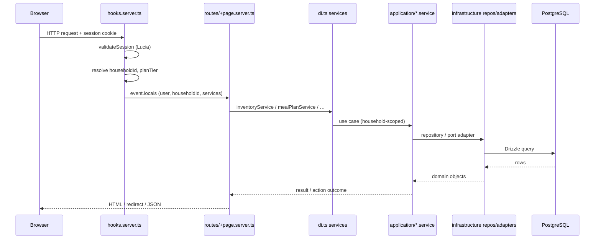
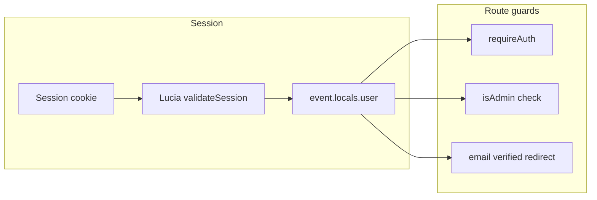
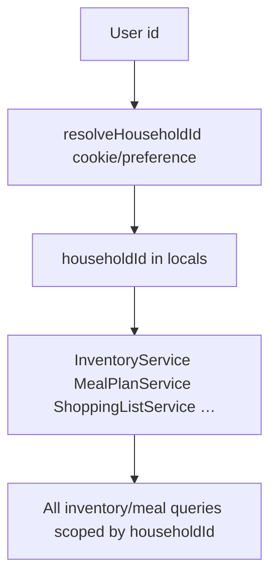
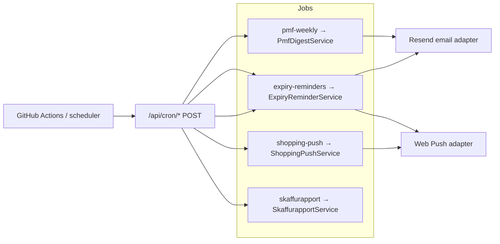

# Skaffu — case study

*Portfolio artifact för Head of Development och senior fullstack. Live produkt: [skaffu.com](https://skaffu.com). Intern repo: `home-pantry`.*

---

## 1. Problem & målgrupp

**Problem:** Svenska hushåll handlar ofta utan en delad bild av vad som faktiskt finns i kyl, frys och skafferi. Det leder till dubbelköp, utgången mat och onödigt matsvinn — särskilt när flera personer handlar i olika butiker (ICA, Willys, Coop, Lidl).

**Målgrupp (ICP):** Par och familjer 28–45 i Sverige som handlar butiksneutralt, vill minska svinn och behöver hushållssync utan att låsa sig till en kedjas app. Sekundärt: roommates och waste-conscious hushåll som provat Bring! men saknar lager som sanningskälla.

**Produktlöfte:** *Skanna först. Håll koll på skafferiet. Handla smart.* — streckkod, kvitto (bild/PDF) och foto → lager per plats → utgång → smart inköpslista och veckoplan.

---

## 2. Beslut

| Beslut | Val | Varför |
|--------|-----|--------|
| **Webb/PWA före native** | SvelteKit + PWA på Firebase App Hosting | Snabb iteration, en kodbas, installbanner och web push räcker till PMF bevisas. Capacitor/App Store **medvetet väntar** tills D30-retention och kvalitativ efterfrågan motiverar det ([`DAY_90_DECISION.md`](./DAY_90_DECISION.md)). |
| **PMF före monetisering** | Stripe Checkout och Pro-enforcement **ej startat** | Gates i [`ROADMAP.md`](./ROADMAP.md) och [`PRICING.md`](./PRICING.md): D30 ≥15 %, rate limits klara, köpvillkor — innan betalning. Freemium-gränser och waitlist finns; intäkt kommer efter bevisad retention. |
| **Growth wave efter Fas 0** | Launch playbook + Wrapped/Skaffurapport i copy | Fas 0 (instrumentering, kvitto, plan→lista, deploy-gates) klar jun 2026. Fas 1 = retention, community-launch och PMF-mätning — inte fler Must-features i isolation ([`LAUNCH_PLAYBOOK.md`](./LAUNCH_PLAYBOOK.md)). |
| **Butiksneutral wedge** | Ingen ICA/Coop-låsning | Differentiering mot listappar och retailer-appar; lager + plan + lista i ett flöde ([`COMPETITIVE_ANALYSIS.md`](./COMPETITIVE_ANALYSIS.md)). |
| **Solo-leverans med agent-disciplin** | Cursor coordinator, WIP 3, spawn-proposal | Skala leverans utan team — enterprise-liknande gates (CI, security, E2E) utan overhead ([`CURSOR_COORDINATOR.md`](./CURSOR_COORDINATOR.md)). |

**Talking point:** *"Jag prioriterade PMF före monetisering och native — feature-bredd imponerar mindre än mätetal och en live demo."*

---

## 3. Arkitektur

Medveten **hexagonal / layered** struktur under `src/lib/`:

```
domain/          → affärsregler, rena typer (ingen I/O)
application/     → use cases (*.service.ts), ports/
infrastructure/  → Drizzle-repos, adapters (email, push, rate limit, …)
server/          → composition root (di.ts), guards, session
routes/          → SvelteKit UI + API; tunna, delegerar till services
```

**Varför:** Application-lagret ska inte importera `$lib/server` direkt. Ports (`application/ports/`) + adapters (`infrastructure/adapters/`) eliminerar läckage; `di.ts` är composition root där repos och adapters kopplas ([`CODE_QUALITY_AUDIT.md`](./CODE_QUALITY_AUDIT.md)).

**Ports (exempel):** `EmailPort`, `PushPort`, `RateLimitPort`, `StripePort`, `ShelfLifeInferencePort`, `AppOriginPort` — se `src/lib/application/ports/`.

### Request flow (typisk app-request)



### Auth (Lucia)



- **Lucia** + Drizzle session store; OAuth och lösenordsåterställning via `AuthService`, `OAuthService`, `PasswordResetService`.
- **API guards** (`api-guards.ts`): verifierad e-post, rate limits, IDOR-skydd — integrationstester för OAuth, reset och household-IDOR.

### Household-scoping



Varje inloggad request får `event.locals.householdId` i `hooks.server.ts`. Services tar `householdId` som parameter — ingen global pantry-state. Medlemskap och roller via `HouseholdService` / `DrizzleHouseholdRepository`.

### Cron-jobb (server-side, Bearer-auth)



| Endpoint | Syfte |
|----------|--------|
| `/api/cron/pmf-weekly` | Veckosammanfattning till ägare (PMF-dashboard-påminnelse) |
| `/api/cron/expiry-reminders` | E-post + web push för utgående varor |
| `/api/cron/shopping-push` | "Handla idag"-push från inköpslista |
| `/api/cron/skaffurapport` | Månatlig offentlig rapport när tröskel uppfylls |

Composition root: [`src/lib/server/di.ts`](../src/lib/server/di.ts) — ~40 services wired från repos och adapters.

---

## 4. AI & kostnad

Skaffu använder OpenAI för kvittoparsning, foto-etikett, receptförslag, smart fill och veckoplan — med **hårda guardrails** för solo-ekonomi.

| Mekanism | Implementation |
|----------|----------------|
| **Per-kind rate limits** | `AiRateLimitService` — dagliga/ månatliga tak per `AiUsageKind` och plan (`getAiLimit` i `domain/plan.ts`) |
| **Scope** | Hushåll om `householdId` finns, annars per användare (`resolveAiUsageScope`) |
| **Freemium** | `PlanLimitsService` + banners; Pro unlimited för vissa kinds (hypotes 39 kr/mån — ej live checkout) |
| **Admin** | `/admin` AI-användning via `AiUsageAdminService` |
| **E2E vs prod** | CI/deploy: `E2E_MOCK_AI=true` stubbar kvittoparse och smart fill — **ingen OpenAI-nyckel i G2**. Prod: Firebase secret `OPENAI_API_KEY`, hela kedjan live |

**Ärlighet:** Prod-AI har varit en känd risk (502 på recept/vecka om nyckel saknas); CI grön med mock imponerar inte i demo — prod-fix och tydliga användarfel är W0-blocker ([`RECEIPT_TEST_PACK.md`](./RECEIPT_TEST_PACK.md), deploy-workflow).

---

## 5. Kvalitet & leverans

### Testing diamond

Inte klassisk pyramid — **integration primärt**, E2E sparsamt men djupt ([`TEST_STRATEGY.md`](./TEST_STRATEGY.md)):

| Lager | Omfattning | Gate |
|-------|------------|------|
| Unit | ~620 tester — domän, parsing, validering | G0/G1 |
| Integration | ~72 tester — actions, repos, auth, IDOR | G1 |
| E2E | ~20–23 kritiska resor — login, scan, kvitto, inköp, plan | **G2 — blockerar deploy** |

### Deploy pipeline

```
G0 (lokalt) → G1 quality → G2 E2E (E2E_MOCK_AI) → G3 Deploy to production → agent PROD_SMOKE
```

- Merge till `master` kör CI; prod via manuell **Deploy to production** ([`CI_CD.md`](./CI_CD.md), [`PROD_SMOKE.md`](./PROD_SMOKE.md)).
- Security-agent och npm audit i CI; ingen "deployed"-claim utan grön deploy + post-deploy smoke (agent-owned).

### Mobile & accessibility

- **WCAG 2.2 AA** mål — axe i `e2e/accessibility.spec.ts` (desktop) och `e2e/mobile-visual.spec.ts` (390×844 iPhone gate) ([`ACCESSIBILITY.md`](./ACCESSIBILITY.md)).
- PWA: manifest, installbanner, `/install-app`; web push för utgång (native push väntar Capacitor).

### Kodkvalitet (snapshot)

- Hexagonal ports/adapters, `di.ts` composition root — **8/10** enligt [`CODE_QUALITY_AUDIT.md`](./CODE_QUALITY_AUDIT.md).
- Säkerhetsaudit genomförd; IDOR-, OAuth- och reset-integrationstester.

---

## 6. Resultat

**Status jun 2026:** Early-stage produkt — **PMF ej bevisad** enligt [`ROADMAP.md`](./ROADMAP.md) och [`COMPETITIVE_ANALYSIS.md`](./COMPETITIVE_ANALYSIS.md). Fas 0 levererad; Fas 1 (retention + launch) pågår.

| Metric | Mål (indikativt) | Status |
|--------|------------------|--------|
| Aktivering (24 h) | >40 % | *Fyll från `/admin`* |
| Tid till första scan | <3 min median | *Fyll från `/admin`* |
| Veckoscan-rate | >30 % | *Fyll från `/admin`* |
| **D30-retention** | >15 % tidigt | **Primär gate — ej bevisad** |
| Hushåll 2+ aktiva | >50 % | *Fyll från `/admin`* |
| Smart fill / vecka | >20 % | *Fyll från `/admin`* |

**Shipped som bevis på execution (inte PMF):**

- Live prod [skaffu.com](https://skaffu.com) — marknad + app i en deploy
- Kvitto PDF/bild med per-rad plats; plan → inköpslista ett klick
- Wrapped (`/statistik/wrapped`) + Skaffurapport + Grannskafferiet (dela utgående)
- PMF-instrumentering: `/admin`, `product_event`, veckovis ägar-e-postcron
- ~690 automatiserade tester + deploy E2E-gate

**Lärdomar (ärliga):**

1. Feature-bredd närmar Matdags på flera axlar, men **retention och distribution** (App Store, native push) är fortfarande huvudgapet.
2. **Lager som sanningskälla** differentierar mot Bring/ICA — om användaren når aktivering.
3. Solo + AI-agenter fungerar för leveransdisciplin, men metrics och intervjuer kräver fortfarande ägare-tid — instrumenteringen ersätter inte syntes.

*Uppdatera denna sektion efter 4 veckors PMF-rutin ([`PMF_WEEKLY.md`](./PMF_WEEKLY.md)) med riktiga siffror från `/admin`.*

---

## 7. Nästa

- **Launch våg 1** enligt [`LAUNCH_PLAYBOOK.md`](./LAUNCH_PLAYBOOK.md) — en primär community + Wrapped i copy; mät aktivering 24h och D7.
- **Fyll metrics i case study v2** efter veckovis `/admin`-granskning — ärliga små tal slår tomma claims.
- **P3-kandidat "Ät det först"** om P2 exit + retention-signal — utgångsstyrd veckoplan kopplad till befintlig plan→lista ([`ROADMAP.md`](./ROADMAP.md) P3).

---

## Relaterad dokumentation

| Doc | Innehåll |
|-----|----------|
| [`ROADMAP.md`](./ROADMAP.md) | Faser, PMF-gates, medvetet väntande Stripe/Capacitor |
| [`COMPETITIVE_ANALYSIS.md`](./COMPETITIVE_ANALYSIS.md) | Marknad, ICP, mätetal |
| [`CODE_QUALITY_AUDIT.md`](./CODE_QUALITY_AUDIT.md) | Arkitektur, tester, CI |
| [`CURSOR_COORDINATOR.md`](./CURSOR_COORDINATOR.md) | Agent/leveransmodell |
| [`DEMO_SCRIPT.md`](./DEMO_SCRIPT.md) | 3-min live demo (seed/fixtures) |

*Senast uppdaterad: jun 2026 — portfolio Spår A1, A3, A4.*
