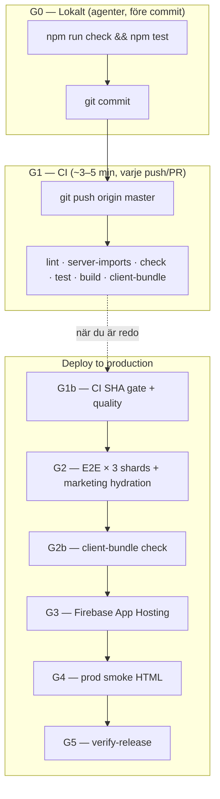

# CI/CD — trunk-baserad pipeline (home-pantry)

**Merge till `master` = snabb CI (~3–5 min).** Produktion deployas **manuellt** via Actions → **Deploy to production**. Se [DEPLOY.md](./DEPLOY.md).

**Relaterat:** [FIREBASE_DEPLOY.md](./FIREBASE_DEPLOY.md) · [DEPLOY.md](./DEPLOY.md)

---

## Översikt



| Gate | När | Vad | Måltid | Blockerar |
|------|-----|-----|--------|-----------|
| **G0** | Före commit (agenter) | `npm run check && npm test` + husky `lint-staged` | ~1–2 min | Lokalt |
| **G1** | Push/PR till `master` | Reusable `quality`: lint, `check:server-imports`, check, test, integration, build, `check:client-bundle`, audit | ~3–5 min | Deploy (via SHA-gate) |
| **G1b** | Deploy `quality` | Kräver grön CI `quality` på **samma SHA** + samma steg som G1 | ~3–5 min | G2 |
| **G2** | Deploy (alltid), PR, nattligt | Playwright E2E (PGlite), **3 shards**; marketing `pageerror`-check på `/` och guide-slug | ~3–8 min | G3 |
| **G2b** | I G1/G1b efter build | `scripts/check-client-bundle.mjs` — fångar `process.cwd`, `node:fs` i klient | ~2 s | Deploy |
| **G3** | Deploy | `firebase deploy --only apphosting:home-pantry` | ~5–20 min | Produktion |
| **G4** | Efter G3 | `scripts/smoke-prod-urls.sh` — HTTP 200 + ingen `Internal Error`/500 i HTML; valfri 2× med 30 s paus | ~1 min | Release (workflow röd) |
| **G5** | Deploy (sista jobbet) | `verify-release` — fail om E2E/deploy/smoke skippades eller misslyckades | ~5 s | Agent får inte säga "deployed" |

**Efter merge:** ~3–5 min till grön CI. Deploy när du vill — typiskt ~15–25 min för full deploy-kedja.

**Ingen prod-release utan grön Deploy-workflow inkl. `verify-release`.** Merge till `master` deployar inte automatiskt (utom guide-only push — se nedan).

### Deploy SLO och definition of done (prod)

| Mått | Mål / sanning |
|------|----------------|
| **När säga "prod är uppdaterad"** | Endast när [**Deploy to production**](https://github.com/arpi09/grocery-manager/actions/workflows/deploy.yml) är **grön** på rätt SHA **och** jobbet **`verify release completed`** är `success` — **inte** när bara CI eller E2E-workflow är grön |
| **Obligatoriska jobb** | `quality` → `e2e (1/3)` + `(2/3)` + `(3/3)` → `deploy` → `post-deploy smoke` → `verify release completed` (alla `success`; E2E skip endast explicit hotfix) |
| **Typisk tid (full deploy)** | `quality` ~3–5 min · E2E ×3 ~3–8 min · Firebase ~5–20 min · smoke ~1 min · verify ~5 s → **~12–25 min** totalt |
| **Workflow drift** | Alla quality-vägar via [`reusable-quality.yml`](../.github/workflows/reusable-quality.yml) (CI, E2E, deploy) |
| **False-green deploy** | 0 — `verify-release` failar om e2e/deploy/smoke skippades eller misslyckades |

### Incident 2026-06-07 (lärdomar)

| Gap | Konsekvens | Åtgärd i repo |
|-----|------------|---------------|
| CI körde inte E2E | `process is not defined` i klient nådde prod | Marketing E2E `pageerror`-check; client-bundle guard |
| Deploy utan E2E tilläts | Firebase deploy utan Playwright | `verify-release` på `workflow_dispatch` **och** guide-only `push` |
| Workflow **success** när bara `quality` kördes | Agent trodde prod var uppdaterad | `verify-release` failar om e2e/deploy/smoke inte `success` |
| Post-deploy smoke = curl HTTP 200 | SSR 200 + JS-krasch passerade | Smoke läser HTML-body; dubbelkoll med paus |
| Ingen guard mot server-kod i client bundle | Guides-regression | `check:client-bundle` + `check:server-imports` |
| Playwright plockade vitest under `e2e/helpers/` | Hotfix deploy blockerades | `testMatch: **/*.spec.ts` + `tests/unit/receipt-fixtures.test.ts` |

### Nattlig E2E + Cursor Automation

| Steg | Tid (UTC) | Vad |
|------|-----------|-----|
| **GitHub E2E** | 03:00 | Schedule i [`e2e.yml`](../.github/workflows/e2e.yml) kör Playwright mot `master`-tip. Ingen deploy. |
| **Valfri notis** | Efter körning | Vid röd nattlig/manuell E2E: samma webhook/Telegram-secrets som deploy (`DEPLOY_NOTIFY_*`) om konfigurerade. |
| **Cursor Automation** | 04:00 | Schemalagd agent (se [DEPLOY.md](./DEPLOY.md)) läser senaste E2E på `master` via `gh`. |

**Cursor-agenten vid röd E2E:** minimal fix, push `master`, ev. lokal `test:e2e`. **Aldrig** `deploy.yml` eller Firebase.

**Cursor-agenten vid grön E2E:** rapportera OK — ingen push, ingen deploy.

Regel för coordinator: [`.cursor/rules/nightly-e2e-guard.mdc`](../.cursor/rules/nightly-e2e-guard.mdc).

---

## Agentens happy path

När uppgiften är klar:

1. **G0 lokalt:** `npm run check && npm test` (plus `npm run test:e2e` om auth/UI rörts).
2. **Commit + push/merge till `master`.**
3. **Vänta på grön CI** (~3–5 min) — inte full E2E/deploy.
4. **Deploy (människa eller coordinator):** Actions → **Deploy to production** → Run workflow. Coordinator kan `gh workflow run deploy.yml` eller be användaren trigga.
5. **Efter grön deploy:** coordinator kör [PROD_SMOKE.md](./PROD_SMOKE.md) — inte användaren.

---

## Workflows (GitHub Actions)

| Fil | Namn (UI) | Trigger |
|-----|-----------|---------|
| [`.github/workflows/reusable-quality.yml`](../.github/workflows/reusable-quality.yml) | *(reusable)* | `workflow_call` från CI, E2E och deploy |
| [`.github/workflows/ci.yml`](../.github/workflows/ci.yml) | **CI** | `push` / `pull_request` → `master`/`main` |
| [`.github/workflows/e2e.yml`](../.github/workflows/e2e.yml) | **E2E** | PR → `master`/`main`; `workflow_dispatch`; schedule 03:00 UTC |
| [`.github/workflows/deploy.yml`](../.github/workflows/deploy.yml) | **Deploy to production** | `workflow_dispatch`; `push` → `master` när **endast** `content/guides/**` ändrats |

Deploy-kedja: `gate` → `quality` (reusable + **CI SHA-gate**) → `e2e` (matrix 3 shards) → `deploy` → **`post-deploy smoke`** → **`verify-release`**. Varje shard laddar ner samma `sveltekit-build`-artifact från `quality`. Smoke curl:ar `/`, `/login`, `/guider` och failar på fel HTTP **eller** fel HTML (`Internal Error`, SvelteKit 500).

### Deploy gates (obligatoriska)

| Gate | Var | Blockerar prod? | Varför |
|------|-----|-----------------|--------|
| **G1 quality** | `ci.yml`, `e2e.yml` + `deploy.yml` via reusable | Ja (deploy kräver grön CI på samma SHA) | En sanning för lint/test/build — inget drift |
| **G1b CI SHA** | `reusable-quality.yml` när `verify_ci_sha: true` | Ja | Sparar tid; stoppar deploy av commit som inte passerat CI |
| **G2 E2E** | `deploy.yml` job `e2e` (3 shards) | Ja — **alltid** vid normal deploy | SSR + marketing hydration (`pageerror`) |
| **G2b client bundle** | Efter build i reusable | Ja | `process.cwd` / `node:fs` i klient |
| **G3 Firebase** | `deploy.yml` job `deploy` | Ja (utan `FIREBASE_TOKEN`: skip → `verify-release` röd) | Faktisk App Hosting-deploy |
| **G4 prod smoke** | `deploy.yml` job `post-deploy smoke` | Ja | HTML-body, inte bara HTTP 200 |
| **G5 verify-release** | Sista jobbet i `deploy.yml` | Ja | Workflow **röd** om e2e/deploy/smoke skippades |

**E2E hoppas aldrig över** utom explicit hotfix: `skip_e2e=true` **och** `hotfix_confirm=hotfix`. Deploy till prod utan grön E2E **och** grön smoke **och** grön `verify-release` räknas som misslyckad release.

**Skript:**

| Skript | Roll |
|--------|------|
| [`scripts/smoke-prod-urls.sh`](../scripts/smoke-prod-urls.sh) | G4 — prod URL + HTML (lokal: `BASE_URL=https://skaffu.com bash scripts/smoke-prod-urls.sh`) |
| [`scripts/check-client-bundle.mjs`](../scripts/check-client-bundle.mjs) | G2b — efter `npm run build` |
| [`scripts/check-server-imports.mjs`](../scripts/check-server-imports.mjs) | G1 — förbjud `.server` i `.svelte`, `node:fs` utanför server paths |

**Concurrency:**
- **CI / E2E:** ny körning avbryter pågående på samma ref (`cancel-in-progress: true`).
- **Deploy:** `deploy-production` — avbryter inte pågående deploy.

**Node:** 20 (`.nvmrc`, `package.json` `engines`).

### Nödläge (hotfix)

Actions → **Deploy to production** → Run workflow → *Skip E2E* = `true` **och** *hotfix_confirm* = `hotfix`. Annars körs E2E som vanligt. Dokumentera varför i chat/commit. **Prod smoke körs fortfarande** efter Firebase — rollback om smoke failar.

---

## Ägare — GitHub och Firebase (kan inte kodas i repot)

Dessa inställningar stoppar upprepning av incidenten. **Checklista för repo-ägare:**

| Åtgärd | Var | Varför |
|--------|-----|--------|
| **Branch protection** på `master` | GitHub → Settings → Branches | Kräv status check **`quality / quality`** (CI workflow via reusable-quality) före merge |
| **Stäng av Firebase Console auto-deploy** | Firebase → App Hosting → GitHub | En deploy-källa: Actions only |
| **`FIREBASE_TOKEN` + `PRODUCTION_URL`** | GitHub Secrets/Variables | Deploy och smoke måste fungera |
| **Required reviewers** (valfritt) | Branch protection | Mänskligt deploy-beslut för stora releases |

Agentregel: [`.cursor/rules/deploy-safety.mdc`](../.cursor/rules/deploy-safety.mdc).

## Branch protection (valfritt)

| Inställning | Rekommendation solo | Varför |
|-------------|---------------------|--------|
| Require PR | Valfritt | Trunk-flöde fungerar med direkt push |
| Require status check `quality / quality` (CI workflow) | **Rekommenderat** | Blockerar merge/deploy på trasig lint/test/build; krävs för G1b SHA-gate |
| Require status check `e2e` | Valfritt | Långsammare — deploy-workflow kör E2E ändå |
| Require status check deploy `post-deploy smoke` | Ej möjligt solo | Smoke körs bara i deploy-workflow efter Firebase |
| Do not allow bypassing | Av för solo | Du behöver kunna pusha direkt |

---

## Secrets och Firebase

| Plats | Namn | Syfte |
|-------|------|--------|
| GitHub Actions | `FIREBASE_TOKEN` | `firebase login:ci` — deploy från Actions |
| GitHub Actions (secret) | `CRON_SECRET` | Bearer för schemalagda cron (`/api/cron/expiry-reminders`, `pmf-weekly`, `shopping-push`, `skaffurapport`, …) — måste matcha Firebase |
| GitHub Actions (variable) | `PRODUCTION_URL` | Prod-appens bas-URL (samma som `PUBLIC_ORIGIN`, utan `/` på slutet). **`https://skaffu.com`** — se [`SKAFFU_DOMAIN_MIGRATION.md`](./SKAFFU_DOMAIN_MIGRATION.md). |
| GitHub Actions (valfritt) | `DEPLOY_NOTIFY_WEBHOOK_URL` | Push-notis efter lyckad deploy — ntfy, Discord, Slack m.m. (se [Mobilnotis vid deploy](#mobilnotis-vid-deploy)) |
| GitHub Actions (valfritt) | `DEPLOY_TELEGRAM_BOT_TOKEN` + `DEPLOY_TELEGRAM_CHAT_ID` | Telegram-push efter lyckad deploy (alternativ till webhook) |
| Firebase Secret Manager | `DATABASE_URL`, `ADMIN_PASSWORD`, `OPENAI_API_KEY`, `CRON_SECRET`, … | Runtime i App Hosting |

Utan `FIREBASE_TOKEN` körs quality + E2E vid deploy ändå; deploy-jobbet **skippar** med tydlig loggrad.

**Firebase Console → App Hosting → GitHub auto-deploy:** stäng av om du använder Actions — undvik **dubbel deploy**. En källa: **Actions → Deploy to production**.

### CRON_SECRET — ägare (manuellt)

Cron-jobb körs från **GitHub Actions** mot prod (`POST /api/cron/*`). Appen validerar `Authorization: Bearer <CRON_SECRET>` i `src/lib/server/cron-auth.ts` (inte i `hooks.server.ts`). **Samma sträng** måste finnas i GitHub (avsändare) och Firebase App Hosting (mottagare).

| Status (repo) | Detalj |
|---------------|--------|
| Kod | Fyra workflows: `expiry-reminders-cron.yml` (mån 07:00 UTC), `pmf-weekly-cron.yml` (mån 08:00), `shopping-push-cron.yml` (dagligen 06:00), `skaffurapport-cron.yml` (1:a i månaden 06:00). Endpoints: `/api/cron/expiry-reminders`, `pmf-weekly`, `shopping-push`, `skaffurapport` (+ valfritt `reset-demo` utan egen workflow). |
| `.env.example` | `CRON_SECRET=` med kommentar om Bearer och scheman. |
| `apphosting.yaml` | `CRON_SECRET` mappad från Secret Manager (kräver redeploy efter att secret skapats). |

**Du gör (engångs):**

1. **Generera** stark hemlighet (rotera inte utan avsikt): t.ex. `openssl rand -hex 32`.
2. **Firebase** (projekt `home-pantry-4bee5`, backend `home-pantry`):
   ```bash
   npx firebase apphosting:secrets:set CRON_SECRET --project home-pantry-4bee5
   npx firebase apphosting:secrets:grantaccess CRON_SECRET --backend home-pantry --project home-pantry-4bee5
   ```
   Deploya om så runtime får värdet (Actions → **Deploy to production**).
3. **GitHub** → *Settings* → *Secrets and variables* → *Actions*:
   - **Secret** `CRON_SECRET` — exakt samma sträng som i Firebase.
   - **Variable** `PRODUCTION_URL` — redan satt till `https://skaffu.com` om du följt domän-migreringen.
4. **Verifiera:** Actions → t.ex. **Expiry reminders cron** → *Run workflow*. Förväntat: HTTP 200, JSON `{ "ok": true, ... }`. Om GitHub saknar secret failar workflow direkt med `CRON_SECRET is not set`. Om Firebase saknar/värdet skiljer sig: HTTP **401** `Unauthorized`.

**Lokalt:** sätt `CRON_SECRET` i `.env` om du vill testa cron-rutter manuellt med `curl -H "Authorization: Bearer …"`.

---

## Mobilnotis vid deploy

Du kan få notis på mobilen när **deploy-jobbet lyckas** (efter Firebase deploy, inte bara när CI är klart).

### Alternativ utan kod (rekommenderas att prova först)

| Metod | Fördelar | Nackdelar |
|-------|----------|-----------|
| **[GitHub Mobile](https://github.com/mobile)** (iOS/Android) | Ingen konfiguration i repot | Notiser för *hela* workflow-körningen |
| **GitHub e-post** | Zero setup | Samma som ovan |
| **GitHub → Watch → Custom → Actions** | Finare filter i appen | Fortfarande workflow-nivå |

**GitHub Mobile — snabbstart:**

1. Installera appen och logga in.
2. Gå till repot **home-pantry** → **Watch** → **Custom**.
3. Kryssa i **Actions**.
4. Aktivera push-notiser för GitHub i telefonens systeminställningar.

Du får notis när **Deploy to production** är klar (grön eller röd).

### Push-notis bara vid lyckad deploy (rekommenderat)

Workflow-steg **Notify deploy success** i [`deploy.yml`](../.github/workflows/deploy.yml) körs **endast** när Firebase-deploy faktiskt lyckades (`FIREBASE_TOKEN` satt och deploy OK). Ingen secret = steget hoppar tyst över.

#### A) ntfy.sh (enklast för mobil-push)

Gratis app ([ntfy](https://ntfy.sh/app)) med riktiga push-notiser. Ett enda GitHub-secret.

1. Välj ett unikt topic-namn (t.ex. `skaffu-deploy-dittnamn`).
2. Installera **ntfy** på mobilen och **Subscribe** till samma topic.
3. GitHub → **Settings → Secrets and variables → Actions → New repository secret**
   - Namn: `DEPLOY_NOTIFY_WEBHOOK_URL`
   - Värde: `https://ntfy.sh/skaffu-deploy-dittnamn`
4. Nästa lyckade deploy → push-notis: *"Skaffu deploy lyckades"* med commit och Actions-länk.

#### B) Telegram

1. Skapa bot via [@BotFather](https://t.me/BotFather) → spara **bot token**.
2. Skicka ett meddelande till boten; hämta **chat id** (t.ex. via `https://api.telegram.org/bot<TOKEN>/getUpdates`).
3. Lägg till GitHub-secrets:
   - `DEPLOY_TELEGRAM_BOT_TOKEN`
   - `DEPLOY_TELEGRAM_CHAT_ID`

#### C) Discord eller Slack

1. Skapa en **Incoming Webhook** i kanalen du vill ha notiser i.
2. Sätt `DEPLOY_NOTIFY_WEBHOOK_URL` till webhook-URL:en (Discord `discord.com/api/webhooks/…`, Slack `hooks.slack.com/…`).

Workflowen känner igen ntfy, Discord och Slack automatiskt. Andra URL:er får generisk JSON (`text`, `url`, `commit`).

**Obs:** Notis-steget använder `continue-on-error: true` — en trasig webhook ska inte markera deploy som misslyckad.

---

## Lokala kommandon (samma som CI)

```bash
npm ci
npm run lint                  # G1
npm run check:server-imports  # G1
npm run check                 # G0 + G1
npm test                      # G0 + G1
USE_PGLITE=true npm run test:integration
npm run build
npm run check:client-bundle   # G2b

# G2 (innan deploy om auth/UI rörts)
USE_PGLITE=true npm run test:e2e

# G3 (lokalt om FIREBASE_TOKEN saknas i Actions)
npm run deploy:firebase

# G4 (efter deploy)
BASE_URL=https://skaffu.com bash scripts/smoke-prod-urls.sh
```

**G0:** husky pre-commit kör `lint-staged` vid commit. Agenter kör dessutom `npm run check && npm test` före commit.

---

## Framtida förbättringar

| Idé | Status |
|-----|--------|
| Path filters (skippa E2E på ren dokumentation) | **Implementerat** i [`e2e.yml`](../.github/workflows/e2e.yml) (`dorny/paths-filter@v4`) |
| Delade npm-cache artifacts mellan jobb | Ej implementerat |
| Preview deploy per commit | Ej implementerat |
| Post-deploy prod-smoke (curl) | **Implementerat** — `deploy.yml` job `post-deploy smoke` + [`scripts/smoke-prod-urls.sh`](../scripts/smoke-prod-urls.sh); coordinator kör utökad checklista i [`PROD_SMOKE.md`](./PROD_SMOKE.md) |

---

## Filer

| Fil | Roll |
|-----|------|
| `.github/workflows/reusable-quality.yml` | Delad G1 — lint, guards, test, build, artifact |
| `.github/workflows/ci.yml` | G1 — snabb CI vid push/PR |
| `.github/workflows/e2e.yml` | G2 — E2E på PR, manuellt, nattligt |
| `.github/workflows/deploy.yml` | G1b → G2 → G3 → G4 → G5 — prod-deploy |
| `scripts/check-client-bundle.mjs` | G2b — klientbundle efter build |
| `scripts/check-server-imports.mjs` | G1 — statisk server-import guard |
| `.cursor/rules/deploy-safety.mdc` | Agent — aldrig falskt "deployed" |
| `.github/workflows/expiry-reminders-cron.yml` | Veckovis utgångspåminnelse i prod (måndag 07:00 UTC) |
| `.github/workflows/pmf-weekly-cron.yml` | Veckovis PMF-digest till ägare (måndag 08:00 UTC) |
| `.github/workflows/shopping-push-cron.yml` | Daglig handla-idag-push (06:00 UTC) |
| `.github/workflows/skaffurapport-cron.yml` | Månatlig Skaffurapport-aggregering (1:a 06:00 UTC) |
| `.husky/pre-commit` | lint-staged (G0) |
| `apphosting.yaml` | Firebase build/run |
| `docs/DEPLOY.md` | Så deployar du (svenska) |
| `docs/FIREBASE_DEPLOY.md` | Infra, secrets, första deploy |
