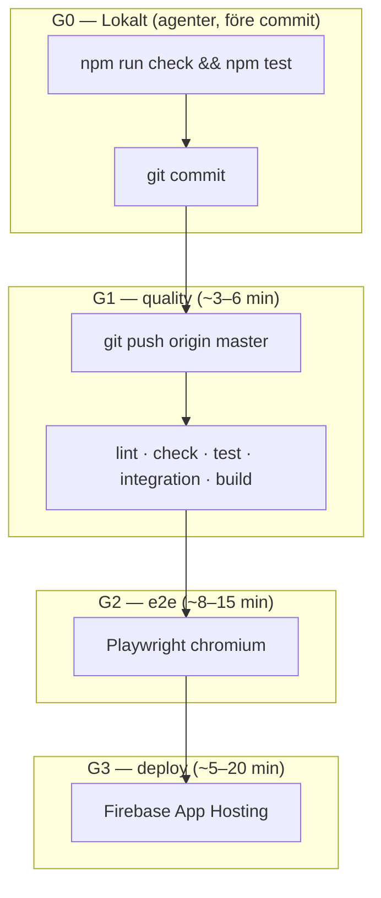

# CI/CD — trunk-baserad pipeline (home-pantry)

**Ingen PR krävs.** Agenter och du pushar direkt till `master`. GitHub Actions kör kvalitet → E2E → deploy automatiskt.

**Relaterat:** [FIREBASE_DEPLOY.md](./FIREBASE_DEPLOY.md)

---

## Översikt



| Gate | När | Vad | Måltid | Blockerar |
|------|-----|-----|--------|-----------|
| **G0** | Före commit (agenter) | `npm run check && npm test` + husky `lint-staged` | ~1–2 min | Lokalt |
| **G1** | Push till `master` | `lint`, `check`, `test`, `test:integration` (PGlite), `build` | ~3–6 min | G2 |
| **G2** | Efter G1 | Playwright E2E (5 spec-filer, PGlite) | ~8–15 min | G3 |
| **G3** | Efter G2 | `npm run deploy:firebase` | ~5–20 min | Produktion |

**Total tid (typiskt):** ~15–25 min från push till live — inget manuellt steg.

---

## Agentens happy path

När uppgiften är klar eller användaren säger *commit push deploy*:

1. **G0 lokalt:** `npm run check && npm test` (plus `npm run test:e2e` om auth/UI rörts).
2. **Commit + push:** `git commit` → `git push origin master`.
3. **Vänta inte manuellt** — Actions kör automatiskt. Agent kan rapportera Actions-länk eller deploy-URL när klar.
4. **Användaren gör inget** (förutsatt `FIREBASE_TOKEN` finns).

**Öppna aldrig PR** om inte användaren uttryckligen ber om det.

---

## Workflow (GitHub Actions)

| Fil | Namn (UI) | Trigger |
|-----|-----------|---------|
| [`.github/workflows/release.yml`](../.github/workflows/release.yml) | **Release** | `push` → `master`/`main`; `workflow_dispatch` (nödläge) |
| [`.github/workflows/expiry-reminders-cron.yml`](../.github/workflows/expiry-reminders-cron.yml) | **Expiry reminders cron** | `schedule` måndag 07:00 UTC; `workflow_dispatch` |

Jobbkedja: `quality` → `e2e` → `deploy` (`needs:` — inga `workflow_run`-länkar).

**Concurrency:** ny push till `master` avbryter pågående körning (`cancel-in-progress`).

**Node:** 20 (`.nvmrc`, `package.json` `engines`).

### Nödläge

Actions → **Release** → Run workflow → kryssa i *Skip E2E* endast vid akut deploy. Dokumentera i chat/commit-meddelande.

---

## Branch protection (valfritt)

För solo trunk-flöde: **ingen** "Require pull request before merging".

| Inställning | Rekommendation solo | Varför |
|-------------|---------------------|--------|
| Require PR | **Av** | Agenter pushar direkt till `master` |
| Require status check `quality` | Valfritt | Blockerar röd push automatiskt — ingen människa |
| Require status check `e2e` | Valfritt | Samma, men långsammare feedback vid direkt push |
| Do not allow bypassing | Av för solo | Du behöver kunna pusha direkt |

Om du aktiverar status checks på `master` körs de automatiskt vid push — fortfarande **ingen PR**.

---

## Secrets och Firebase

| Plats | Namn | Syfte |
|-------|------|--------|
| GitHub Actions | `FIREBASE_TOKEN` | `firebase login:ci` — deploy från Actions |
| GitHub Actions (secret) | `CRON_SECRET` | Bearer för veckocron `POST /api/cron/expiry-reminders` — måste matcha Firebase |
| GitHub Actions (variable) | `PRODUCTION_URL` | Prod-appens bas-URL (samma som `PUBLIC_ORIGIN`, utan `/` på slutet) |
| Firebase Secret Manager | `DATABASE_URL`, `ADMIN_PASSWORD`, `OPENAI_API_KEY`, `CRON_SECRET`, … | Runtime i App Hosting |

Utan `FIREBASE_TOKEN` körs G1+G2 ändå; G3 **skippar** med tydlig loggrad.

**Firebase Console → App Hosting → GitHub auto-deploy:** stäng av om du använder Actions-kedjan — undvik **dubbel deploy**. En källa: **Actions vid push till `master`**.

---

## Lokala kommandon (samma som CI)

```bash
npm ci
npm run lint          # G1
npm run check         # G0 + G1
npm test              # G0 + G1
USE_PGLITE=true npm run test:integration
npm run build

# G2 (innan push om auth/UI rörts)
USE_PGLITE=true npm run test:e2e

# G3 (lokalt om FIREBASE_TOKEN saknas i Actions)
npm run deploy:firebase
```

**G0:** husky pre-commit kör `lint-staged` vid commit. Agenter kör dessutom `npm run check && npm test` före commit.

---

## Framtida förbättringar

| Idé | Status |
|-----|--------|
| Path filters (skippa E2E på ren dokumentation) | Ej implementerat |
| Delade npm-cache artifacts mellan jobb | Ej implementerat |
| Preview deploy per commit | Ej implementerat |

---

## Filer

| Fil | Roll |
|-----|------|
| `.github/workflows/release.yml` | G1 → G2 → G3 |
| `.github/workflows/expiry-reminders-cron.yml` | Veckovis utgångspåminnelse i prod (oberoende av release) |
| `.husky/pre-commit` | lint-staged (G0) |
| `apphosting.yaml` | Firebase build/run |
| `docs/FIREBASE_DEPLOY.md` | Infra, secrets, första deploy |
