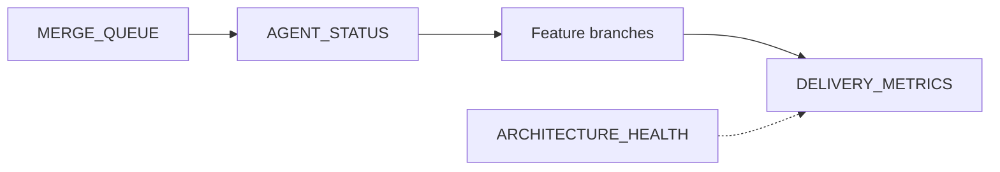

# Delivery metrics and coordination docs

How [DELIVERY_METRICS.md](../DELIVERY_METRICS.md) fits the coordinator stack.

## Documents

| File | Role | On `master`? |
|------|------|--------------|
| [AGENT_STATUS.md](../AGENT_STATUS.md) | Live board: active branches, env, merge notes | Yes |
| `MERGE_QUEUE.md` | Ordered merge intent, conflict risk, pause rules | **No** — on `chore/coordinator-v2` until merged |
| [DELIVERY_METRICS.md](../DELIVERY_METRICS.md) | Historical flow: time through stages, reworks, test honesty | This PR |
| `docs/ARCHITECTURE_HEALTH.md` | Periodic architecture audit | **Pending** |
| [COMPLEXITY_REPORT.md](../COMPLEXITY_REPORT.md) | Structural hotspots, merge friction | This program |

## How they work together

- **MERGE_QUEUE** answers *what should merge next and why* (risk, infra blockers).
- **AGENT_STATUS** answers *what is active right now* (branches, base SHA, env).
- **DELIVERY_METRICS** answers *how long did flow take and where did we stall* — updated **after** integration, not instead of the live boards.
- **ARCHITECTURE_HEALTH** (when added) supplies structural findings; the coordinator may reference them in weekly summary bottlenecks, not as a substitute for per-feature rows.

## Coordinator workflow

1. Plan / reorder → update `MERGE_QUEUE` (when on repo).
2. During work → update `AGENT_STATUS`.
3. After merge or explicit park → row in `DELIVERY_METRICS.md`.
4. Checkpoint → weekly summary in `DELIVERY_METRICS.md`.

Rule: [.cursor/rules/delivery-metrics.mdc](../.cursor/rules/delivery-metrics.mdc).