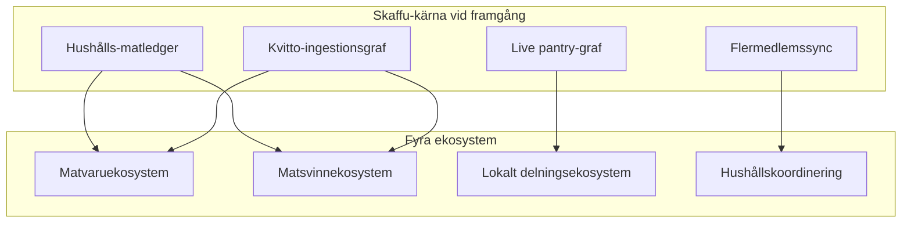
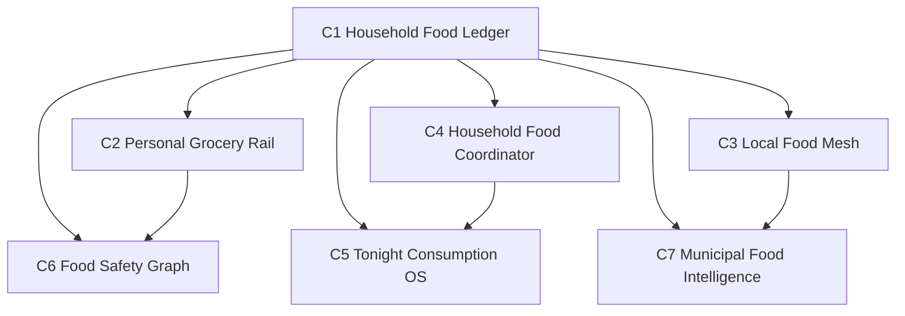
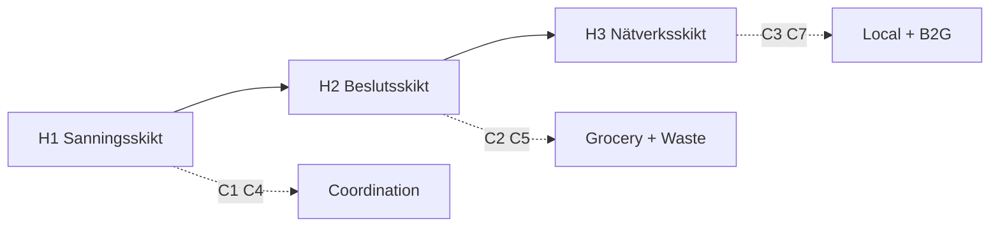
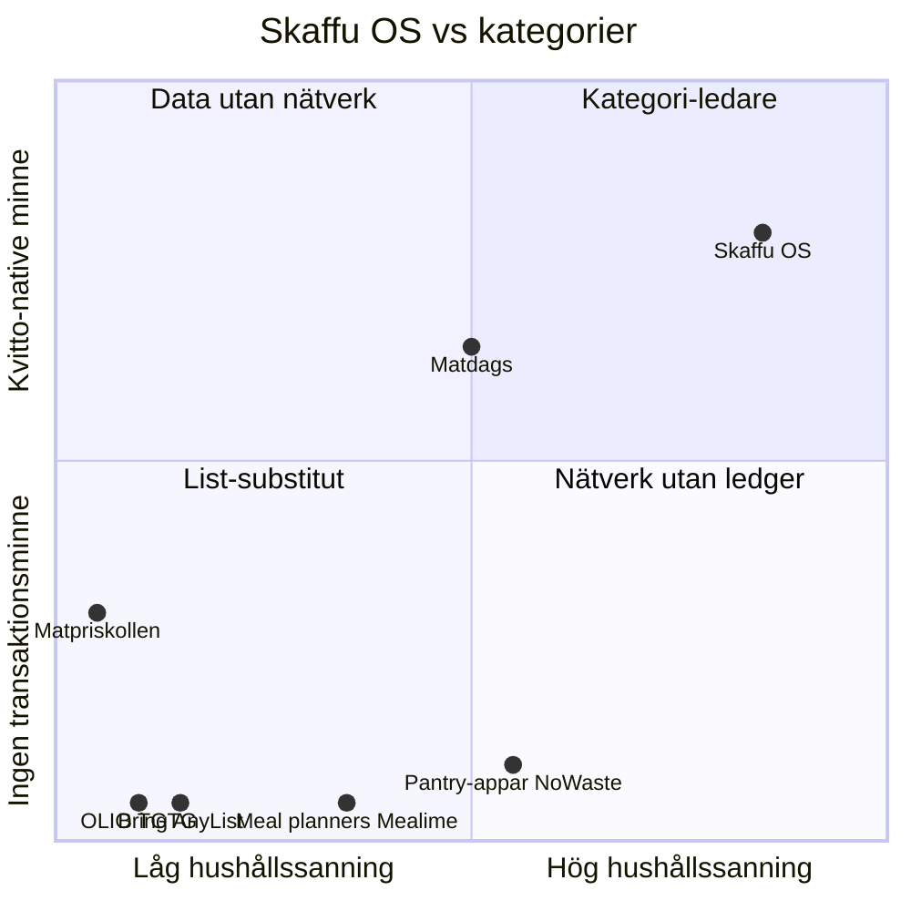

# Food Ecosystem Exploration — Skaffu som OS för hushållsmat

*Version: juni 2026. Horisont- och kategoridokument — inte en roadmap eller implementation-plan.*

**Relaterade dokument (läs där, duplicera inte här):**

| Dokument | Vad det täcker |
|----------|----------------|
| [`GROWTH_STRATEGY.md`](./GROWTH_STRATEGY.md) | Acquisition > activation > retention, do-not-build |
| [`NEXT_STAGE_STRATEGY.md`](./NEXT_STAGE_STRATEGY.md) | PMF-risker, 10x-gafflar, beslut efter W1–W4 |
| [`BREAKTHROUGH_GROWTH_OPPORTUNITIES.md`](./BREAKTHROUGH_GROWTH_OPPORTUNITIES.md) | B1–B12, stranger-pull, compound moat |
| [`HOUSEHOLD_GROWTH.md`](./HOUSEHOLD_GROWTH.md) | Hushållsexpansion, invite-friktion, V1–V3 |
| [`PRICE_MEMORY_STRATEGY.md`](./PRICE_MEMORY_STRATEGY.md) | B2 prisminne — schema-gap, V1–V3 |
| [`ROADMAP.md`](./ROADMAP.md) | P3–P4 stretch, idé-kill-lista |
| [`GRANNSKAFFERIET_V0.md`](./GRANNSKAFFERIET_V0.md) | Dela-länk, density-gate, evolution |
| [`KIVRA_PARTNERSHIP_TRACK.md`](./KIVRA_PARTNERSHIP_TRACK.md) | Partnerskapsspår, API-gate |
| [`COMPETITIVE_ANALYSIS.md`](./COMPETITIVE_ANALYSIS.md) | PMF-status, funktionsmatris §4C, OLIO §3G |
| [`PMF_METRICS_LOG.md`](./PMF_METRICS_LOG.md) | Veckovis baseline — **tom idag** |

**Datagap (ärligt):** [`PMF_METRICS_LOG.md`](./PMF_METRICS_LOG.md) är i stort sett tom. Detta dokument antar att Skaffu *lyckas* — PMF-gates i `src/lib/domain/pmf.ts` är met eller trendar positivt, W1–W4 har positiva verdicts, och hushållsgraf + kvittohistorik + valfri lokal densitet finns i skala. Utan den basen är allt nedan **produktlogik**, inte empiriska slutsatser.

**Avgränsning:** Inga implementation-uppgifter, inga nya acquisition-wedges (W1–W4 freeze per [`NEXT_STAGE_STRATEGY.md`](./NEXT_STAGE_STRATEGY.md)), ingen duplicering av hushålls- eller prisminnes-implementationsdetalj. Endast strategiska bets, preconditions och “validate before build”-grindar.

---

## 1. Executive summary

### Operating assumption — “Skaffu lyckas”

**Skaffu lyckas** betyder i detta dokument:

- PMF-gates i `pmf.ts` är uppfyllda eller tydligt trendar (`activationRate ≥ 40 %`, `d30RetentionEarly ≥ 15 %`, `multiMemberHouseholdRate` mot 50 %, `receiptRate ≥ 25 %`).
- W1–W4 verdicts är tillräckligt positiva att **hushållsgraf + kvittohistorik + valfri lokal densitet** existerar i skala.
- Skaffu är inte “en pantry-app med features” utan **koordinationslagret** där hushållets mat-tillstånd lever.

### OS-definition (en mening)

> **En enda hushålls-scopad sanninggraf** — vad du köpte, var det bor, när det går ut, vem som konsumerar det, vad du fortfarande behöver, vad du kan dela lokalt — som **orkestrerar beslut** över inköp, matlagning, svinn och grannutbyte.

Pantry, recept och listor är **UI-skalet**. OS-kärnan är **ledger + graph + household + valfritt lokalt mesh**.

### Kärnslutsats

Om Skaffu lyckas kan sju kategoribets (C1–C7) var och en definiera en egen produktkategori — men endast om **H1 sanningsskiktet** är pålitligt innan H2-beslut och H3-nätverk byggs. För tidigt nätverk = OLIO-fällan.

---

## 2. OS-kärna — vad Skaffu redan är

Explorationen grundas i **shippade eller planerade primitiver**, inte fantasy:

| Tillgång | Kod / dokumentankare | OS-roll |
|----------|---------------------|---------|
| Lager + utgång + plats | Kärnapp | Fysiskt tillstånd |
| Kvittorader + import-batch | `receipt_purchase_line`, B1 | Transaktionshistorik (prisutvidgning i [`PRICE_MEMORY_STRATEGY.md`](./PRICE_MEMORY_STRATEGY.md)) |
| Plan → lista | [`ROADMAP.md`](./ROADMAP.md) | Intent → execution-brygga |
| Hushållsroller + invites | [`HOUSEHOLD_GROWTH.md`](./HOUSEHOLD_GROWTH.md) | Flermedlemsbehörigheter |
| Utgående dela + geo nearby | Grannskafferiet v0–v2 | Lokalt överskottsignal |
| Köpmönster / smart fill | `purchase-pattern.ts`, B9 | Prediktivt lager |
| PMF / Skaffurapport | admin, B8 | Aggregerad intelligens |

**Explicit:** Pantry + recept + listor är gränssnittet användaren ser. Plattformen är **ledger + graph + household + valfritt lokalt mesh**.

---

## 3. Fyra ekosystem — djupdykningar

### 3.1 Matvaruekosystem (Grocery)

**Spelare idag:** ICA/Coop-appar, Bring, Matpriskollen, Matdags (native + kvitto), Mathem, rabattappar, bank-cashback.

**Användarjobb:** billigast korg, snabbast tur, komma ihåg vad som ska köpas, undvika dubbelköp, rutt över butiker.

**Skaffu-wedge:** Inte “ännu en lista” — **lista grundad i lager + köphistorik**. Pre-shopping gate (B6), personligt prisminne (B2), kvitto-autopilot (B1), mönsterbaserad påfyllning (B9). Se [`PRICE_MEMORY_STRATEGY.md`](./PRICE_MEMORY_STRATEGY.md) för B2-datagap — prisfält saknas i DB idag.

**Skaffu ska inte bli:** Full matvarumarknadsplats, dark store eller affiliate-prisskrapare utan PMF ([`ROADMAP.md`](./ROADMAP.md) skippar affiliate).

**Kategori-möjlighet — Personal Grocery Rail:** System som outputar “din korg denna vecka” från ledger + mönster, sedan valfritt routar till butik/kanal. Skiljer sig från Matpriskollen (anonym jämförelse) genom att den känner **din** kadens, dubbletter och lagerluckor.

---

### 3.2 Matsvinnekosystem (Food waste)

**Spelare idag:** OLIO, Too Good To Go, kommunala “minska matsvinn”-kampanjer, NoWaste, kompostappar, handlarnas hållbarhets-PR.

**Användarjobb:** känna mindre skuld, spara pengar, leva upp till hushållsnormer, synlighet i community.

**Skaffu-wedge:** Svinn som **mätbar utfall av ledger-drift** (köpt → inte konsumerat → utgått/delat) — inte moralisk messaging ensam. “Ät det först” (ROADMAP P3-A), Tonight engine (B5), auto-expired-flik, Wrapped.

**Skaffu ska inte bli:** Generiskt hållbarhetsinnehåll eller OLIO-klon utan lager-native supply.

**Kategori-möjlighet — Household Waste Intelligence:** Per-hushålls svinnpoäng + handlingsbar veckoplan kopplad till verklig utgång; B2G-export via Skaffurapport (B8).

---

### 3.3 Lokalt delningsekosystem (Local sharing)

**Spelare idag:** OLIO, Facebook-grupper, BRF-gemensamma kylskåp, matbanker, hyperlokala WhatsApp-grupper.

**Användarjobb:** bli av med överskott snabbt, hitta gratis mat i närheten, bygga grannförtroende, slippa slänga.

**Skaffu-wedge:** **Lager-native supply** — överskott detekteras från utgång/lager, inte manuell listing ([`GRANNSKAFFERIET_V0.md`](./GRANNSKAFFERIET_V0.md)). Evolutionsväg: `/dela` → nearby opt-in → city feed (B3) → demand board (B4).

**Skaffu ska inte bli:** Generiska annonser eller dating-stil grannsocialt nätverk.

**Kategori-möjlighet — Local Food Mesh:** Likviditetsnätverk där supply är **verifierat lageröverskott** och demand kan vara **hushållsbehovssignaler** (B4), med density-gated discovery. Position vs OLIO: “från det du redan trackar” vs “lägg upp en annons”.

---

### 3.4 Hushållskoordinering (Household coordination)

**Spelare idag:** Bring/AnyList/OurGroceries, delade kalendrar, Splitwise (budget), meal kits, muntlig koordinering.

**Användarjobb:** vem handlar, vem lagar, delad budget, tonåringar/handlers med begränsade rättigheter, async list-sync.

**Skaffu-wedge:** Flermedlemshushåll + live lista + roller — utvidgat i [`HOUSEHOLD_GROWTH.md`](./HOUSEHOLD_GROWTH.md) och W5 delegated shopping.

**Skaffu ska inte bli:** Full familj-OS (kalender, sysslor, ekonomi) — scope creep dödar fokus.

**Kategori-möjlighet — Household Food Coordinator:** Behörigheter, närvaro, delegerad shopping, budgetkrokar från kvitto-ledger — **mat-specifik** koordinations-OS, inte generisk hushållsapp.

---

## 4. Kategori-definierande möjligheter (C1–C7)

Rankade bets som *var och en* kan definiera en kategori om Skaffu lyckas. Fält: produktnamn, kategoripåstående, varför kategori-definierande, kärnberoende, främling vs hushållsvärde, moat, precondition, risk.

| # | Produkt / kategori | Ekosystem | Kärnberoende |
|---|-------------------|-----------|--------------|
| **C1** | Household Food Ledger | Alla | B1+B2+B9 compound |
| **C2** | Personal Grocery Rail | Grocery | B6, B2, valfritt Kivra |
| **C3** | Local Food Mesh | Local | B3+B4 vid densitet |
| **C4** | Household Food Coordinator | Coordination | W5, [`HOUSEHOLD_GROWTH.md`](./HOUSEHOLD_GROWTH.md) V3 |
| **C5** | Tonight / Consumption OS | Waste + coordination | B5, B6 |
| **C6** | Food Safety Graph | Grocery + waste | B7 |
| **C7** | Municipal Food Intelligence (B2G) | Waste + local | B8 |

### C1 — Household Food Ledger

**Kategoripåstående:** Det enda hushålls-scopade in/ut-grafen för mat — köp → lagring → konsumtion → svinn/delning.

**Varför kategori-definierande:** Allt annat (C2–C7) är applikationer ovanpå samma sanning. Utan ledger finns ingen compound moat.

**Främling vs hushåll:** Primärt hushållsvärde; främlingar matas in via rails (Kivra, lista, city feed) som skriver till ledger.

**Moat:** Månader av hushållsspecifik data — inte kopierbar av listappar.

**Precondition:** `receiptRate ≥ 25 %`, pantry-ifyllnad stabil, B1 autopilot trusted.

**Risk:** Kvitto-trust-break ([`RECEIPT_TEST_PACK.md`](./RECEIPT_TEST_PACK.md) tunn korpus) förstör hela grafen.

---

### C2 — Personal Grocery Rail

**Kategoripåstående:** “Din korg denna vecka” — inte anonym prisjämförelse utan personlig inköpsintelligens.

**Varför kategori-definierande:** Kombinerar ledger, mönster och butiksneutralitet på ett sätt varken Matpriskollen eller ICA-appen gör.

**Främling vs hushåll:** Medel stranger-pull via sökintent (“vad betalade jag för X?”); full rail kräver historik.

**Moat:** Kadens + dubblettdetektion + lagerluckor per hushåll.

**Precondition:** C1 stabil; B2 prisminne V1 shipped; B6 pre-shopping gate vid skala; valfritt Kivra som default ingestion ([`KIVRA_PARTNERSHIP_TRACK.md`](./KIVRA_PARTNERSHIP_TRACK.md)).

**Risk:** Bygga rail utan prisfält i DB ([`PRICE_MEMORY_STRATEGY.md`](./PRICE_MEMORY_STRATEGY.md)) = tom produkt.

---

### C3 — Local Food Mesh

**Kategoripåstående:** Lokalt matnätverk där supply är verifierat lageröverskott — inte manuella annonser.

**Varför kategori-definierande:** OLIO äger “free food map” men med listing-friction; Skaffu äger “overflow från det du redan trackar”.

**Främling vs hushåll:** Hög stranger-pull via B3 city feed *om* supply seedad; annars negativ social proof.

**Moat:** Inventory-native supply + density i pilotstäder.

**Precondition:** W2/W3 positiva; density-gate ≥5–10/500 m ([`GRANNSKAFFERIET_V0.md`](./GRANNSKAFFERIET_V0.md)); B4 demand board endast post-density.

**Risk:** Tom feed värre än ingen sida — OLIO-fällan.

---

### C4 — Household Food Coordinator

**Kategoripåstående:** Mat-specifik flermedlems-OS — roller, delegerad shopping, budget från kvitton.

**Varför kategori-definierande:** Bring/AnyList synkar listor men äger inte lager, utgång eller kvitto-ledger.

**Främling vs hushåll:** Nästan uteslutande hushåll; W1/W4 bryggor kan ge registrering men inte full koordinator utan andra medlem.

**Moat:** `multiMemberHouseholdRate` + roller + live lista + pantry-sync.

**Precondition:** W1+W4 scale; `multiMemberHouseholdRate` trendar mot 50 %; W5 delegated shopping; post-invite activation per [`HOUSEHOLD_GROWTH.md`](./HOUSEHOLD_GROWTH.md) V3.

**Risk:** Falsk expansion — invite skapad men ingen aktiv andra medlem.

---

### C5 — Tonight / Consumption OS

**Kategoripåstående:** Dagligt beslutslager — “vad ska vi äta ikväll?” — som gör ledger värd att underhålla dagligen.

**Varför kategori-definierande:** Mealime och ChatGPT är substitut utan koppling till verkligt lager och utgång.

**Främling vs hushåll:** Svag stranger-pull; stark retention/habit för aktiverad kohort.

**Moat:** Utgångsordning + köphistorik + hushållspreferenser i samma graf.

**Precondition:** Ifyllt lager; B5 Tonight engine; B6 store moment; `eat_first_week_viewed` trendar.

**Risk:** Generisk meal-plan AI utan ledger-koppling — se kill list.

---

### C6 — Food Safety Graph

**Kategoripåstående:** Nationell recall/allergi-layer på köpta SKU:er — “du köpte denna produkt, den återkallas”.

**Varför kategori-definierande:** Hög trust, PR-potential, inget listapp-alternativ med kvitto-native SKU-graf.

**Främling vs hushåll:** Medel–hög stranger-pull via fear/intent (B7); full värde kräver köphistorik.

**Moat:** Receipt-native SKU-länk + hushållsnotifiering.

**Precondition:** C1 med tillförlitlig produktnyckel; Livsmedelsverket/recall-data-partnerskap; juridisk review.

**Risk:** Hög liability; fel alert = trust-break värre än ingen alert.

---

### C7 — Municipal Food Intelligence (B2G)

**Kategoripåstående:** Anonymiserad hushållsdata i skala för kommuner och handlare — inte consumer acquisition.

**Varför kategori-definierande:** Skaffurapport (B8) som stadsbenchmark; dataprodukt separat från app-PMF.

**Främling vs hushåll:** Ingen stranger-pull; PR/demand creation när kohort ≥50 hushåll.

**Moat:** Aggregerad svinn- och köpdata som kommuner inte samlar själva.

**Precondition:** B8 gate; k-anonymitet; tillräcklig kohort från wedge-framgång.

**Risk:** Meningslös benchmark med n<50; GDPR/k-anonymitet-fel.

---

### Stretch / plattform (lägre rank)

| Bet | Beskrivning | Villkor |
|-----|-------------|---------|
| **Embedded Pantry OS** | White-label ledger för BRF, meal kits, kedjor (ROADMAP P4-F) | Post-PMF; B12 killed för onboarding |
| **Kivra Food Hub** | Distributionsmonopol om API-gate öppnas | C2+C1 som default-lager för SV-hushåll |
| **Open household food API** | Skaffu som truth source för Bring-liknande verktyg (ROADMAP P4-E) | C1 stabil + partneravtal |

---

## 5. Produktkonstellation

C1 är fundament. C2, C4, C5 konsumerar ledger direkt. C3 och C7 kräver densitet och kohort. C6 är tvärgående trust-lager.

---

## 6. Horisonter H1–H3 — hur OS:et emergear

Tre narrativa horisonter — **inte** implementation-faser:

| Horisont | Narrativ | Dominerande ekosystem |
|----------|----------|----------------------|
| **H1 — Sanningsskikt** | Ledger + hushållssync + kvitto-autopilot betrodd | Coordination + grocery prep |
| **H2 — Beslutsskikt** | Tonight, svinnintelligens, personal grocery rail | Grocery + waste |
| **H3 — Nätverksskikt** | Lokalt mesh + B2G-intelligens vid densitet | Local + waste |

Koppling till [`NEXT_STAGE_STRATEGY.md`](./NEXT_STAGE_STRATEGY.md) §6: 10x kräver **två kopplade mekanismer** — t.ex. hushållsgraf (W1/W4) *plus* kvitto-compound (B1+B2). En wedge ensam ger incremental tillväxt, inte kategori-skapande.

**H1 utan H2:** Data utan daglig ritual → churn trots bra activation.

**H3 före H1–H2:** Nätverk utan supply/trust → OLIO-fällan med tom feed.

---

## 7. Konkurrenskategori-karta

Positionering på tre axlar (syntes från [`COMPETITIVE_ANALYSIS.md`](./COMPETITIVE_ANALYSIS.md) §4C — full matris där):

- **Household truth depth** (none → full ledger)
- **Local network** (none → mesh)
- **Transaction memory** (none → receipt-native)

| Aktör | Truth depth | Local network | Transaction memory | Kommentar |
|-------|-------------|---------------|-------------------|-----------|
| **Skaffu OS (mål)** | Full ledger | Mesh vid H3 | Receipt-native | Unik kombination om H1 levererar |
| **Bring / AnyList** | Lista only | Ingen | Ingen | Vana att slå för W1 |
| **Pantry-appar / NoWaste** | Lager, svag kvitto | Ingen | Manuell | Ingen hushållsgraf |
| **Meal planners** | Recept/plan | Ingen | Ingen | ChatGPT-substitut för C5 |
| **OLIO / TGTG** | Ingen | Hög (listing) | Ingen | Supply-friction vs C3 |
| **Matdags** | Medel (native kvitto) | Ingen | Hög (egen pipeline) | Distribution-moat, inte lager-moat |
| **Matpriskollen** | Ingen | Ingen | Anonym pris | C2 differentierar via *din* historik |

---

## 8. Hur blir Skaffu OS för hushållsmat?

Fyra principer — svar på den centrala frågan:

### 1. Äg ledger

Inköp och pantry-tillstånd i **en** hushållsgraf. Inte en feature — plattformen. Alla C2–C7 läser/skriver samma graf (C1).

### 2. Orkestrera ögonblick

Handla, laga ikväll, dela överskott, koordinera medlemmar — varje moment läser och skriver samma graf. UI-skalet (pantry, lista, plan) är ingångar till samma OS.

### 3. Compound över tid

Moat är månader av hushållsspecifik data. Främlingar matas in via rails (Kivra, publik lista, city feed) som **matar ledger**, inte parallella silos.

### 4. Nätverk är valfritt men exponentiellt

Lokalt mesh (C3) och B2G (C7) endast efter H1–H2. För tidigt nätverk = listing-app utan inventory-native supply.

---

## 9. Kill list — inte vår kategori

Alignerad med befintlig strategi ([`GROWTH_STRATEGY.md`](./GROWTH_STRATEGY.md), [`BREAKTHROUGH_GROWTH_OPPORTUNITIES.md`](./BREAKTHROUGH_GROWTH_OPPORTUNITIES.md), [`ROADMAP.md`](./ROADMAP.md)):

| Idé | Varför inte kategori-definierande |
|-----|-----------------------------------|
| Generisk meal-plan AI | ChatGPT-substitut utan ledger (C5 kräver lager-koppling) |
| Publik pantry-kalkylator (B10) | Ingen compound moat; kill i breakthrough |
| Restaurangaggregator (ROADMAP idé I) | Utanför hushålls-OS |
| IBS separat app (ROADMAP idé J) | Scope creep; inte mat-OS |
| Kart-polish utan densitet | Acquisition-fälla; negativ social proof |
| Full matvarumarknadsplats / dark store | Kapitalintensivt; affiliate skip |
| BRF-onboarding (B12) | Kill pre-PMF; Embedded Pantry OS post-PMF only |
| Generisk familj-OS (kalender, sysslor) | C4 mat-specifik — inte allt-i-ett |
| OLIO-klon utan lager-native supply | Listing-friction utan wedge |
| Affiliate-prisskrapare | ROADMAP skip; Matpriskollen-territorium |

---

## 10. Valideringsgrindar (research, inte build)

För varje C1–C7: vad som måste valideras **innan** produktlinje behandlas som beslutad. Inga engineering-uppgifter.

### C1 — Household Food Ledger

| Typ | Signal / tröskel |
|-----|------------------|
| Intervju | “Appen borde veta vad vi brukar ha hemma” / “kvittot ska fylla lagret automatiskt” |
| Metric | `receiptRate ≥ 25 %`; `receipt_autopilot_accepted` korrelerar med D7 |
| Metric | `shopping_checkoff_to_pantry` ökar vecka-för-vecka |
| Gate | ≥15/20 riktiga PDF godkända i [`RECEIPT_TEST_PACK.md`](./RECEIPT_TEST_PACK.md) |
| Gate | B2 schema-gap stängt per [`PRICE_MEMORY_STRATEGY.md`](./PRICE_MEMORY_STRATEGY.md) V1 |

### C2 — Personal Grocery Rail

| Typ | Signal / tröskel |
|-----|------------------|
| Intervju | “Vill att appen vet vad vi brukar köpa” / “vad betalade jag senast för X?” |
| Metric | `smartFillWeeklyRate ≥ 20 %`; pre-shopping gate engagement (B6) |
| Metric | B2 “senast betalt” används återkommande (efter V1) |
| Partnership | Kivra-forward MVP validerad; partnerskapsspår aktivt ([`KIVRA_PARTNERSHIP_TRACK.md`](./KIVRA_PARTNERSHIP_TRACK.md)) |
| Gate | C1 trusted; parsing-trust-break rate <5 % |

### C3 — Local Food Mesh

| Typ | Signal / tröskel |
|-----|------------------|
| Intervju | “Grannar ja, men inte OLIO” / “listan finns redan — vill bara dela” |
| Metric | W2: ≥3 signup/vecka per seedad stad; W3: `expiring_share_viewed` → CTA → registrering |
| Metric | `expiring_share_created` per stad; density-gate uppfylld i pilot |
| Gate | Supply seedad manuellt innan B3 city feed; kill om tom feed |
| Gate | B4 demand board **inte** före density |

### C4 — Household Food Coordinator

| Typ | Signal / tröskel |
|-----|------------------|
| Intervju | “Vi koordinerar lista i Bring men inte lager” / “vem handlar denna vecka?” |
| Metric | `multiMemberHouseholdRate` trendar mot 50 %; `inviteRate ≥ 30 %` |
| Metric | W1 view→signup >5 % **och** andra medlem aktiv inom 7 dagar |
| Metric | W4 dismiss-rate <80 % |
| Gate | Viewer/editor-inkonsistens löst per [`HOUSEHOLD_GROWTH.md`](./HOUSEHOLD_GROWTH.md) V1 |

### C5 — Tonight / Consumption OS

| Typ | Signal / tröskel |
|-----|------------------|
| Intervju | “Vet aldrig vad vi ska laga” / “glömmer det som går ut” |
| Metric | `eat_first_week_viewed` veckovis; `d7Retention ≥ 20 %` i kohort med ifyllt lager |
| Metric | Tonight/B5 engagement utan extern meal-plan-substitut |
| Gate | Lagerdjup median ≥5 varor i aktiverad kohort |
| Gate | C1 utgångsdata tillförlitlig |

### C6 — Food Safety Graph

| Typ | Signal / tröskel |
|-----|------------------|
| Intervju | “Skulle vilja veta om återkallad produkt” / allergi-intent |
| Metric | B7 alert open-rate; D7-korrelation för recall-kohort |
| Partnership | Livsmedelsverket eller motsvarande recall-feed |
| Legal | Liability review; false-positive-protokoll |
| Gate | SKU/produktnyckel-koppling till `receipt_purchase_line` tillförlitlig |

### C7 — Municipal Food Intelligence (B2G)

| Typ | Signal / tröskel |
|-----|------------------|
| Intervju | Kommun/hållbarhetskoordinator: “behöver hushållsdata, inte enkät” |
| Metric | Skaffurapport kohort ≥50 hushåll; B8 gate passerad |
| Metric | PR/demand från `/rapport/*` utan betald acquisition |
| Legal | k-anonymitet-review; GDPR DPIA för aggregerad export |
| Gate | C1+C5 svinnmätning stabil; inga individidentifierbara fält |

---

## 11. Relaterade dokument

| Dokument | Roll i denna exploration |
|----------|-------------------------|
| [`GROWTH_STRATEGY.md`](./GROWTH_STRATEGY.md) | Nuvarande funnel; do-not-build |
| [`NEXT_STAGE_STRATEGY.md`](./NEXT_STAGE_STRATEGY.md) | 10x-gafflar; W1–W4 freeze |
| [`BREAKTHROUGH_GROWTH_OPPORTUNITIES.md`](./BREAKTHROUGH_GROWTH_OPPORTUNITIES.md) | B1–B12 katalog; stranger-pull |
| [`HOUSEHOLD_GROWTH.md`](./HOUSEHOLD_GROWTH.md) | C4 detalj — referera, duplicera inte |
| [`PRICE_MEMORY_STRATEGY.md`](./PRICE_MEMORY_STRATEGY.md) | C2 datagap — referera, duplicera inte |
| [`ACQUISITION_WEDGES.md`](./ACQUISITION_WEDGES.md) | W1–W4 verdicts som H1-input |
| [`PMF_METRICS_LOG.md`](./PMF_METRICS_LOG.md) | Fyll före tolkning |

---

*Dokument skapat 2026-06-11. Revidera när PMF baseline finns och W1–W4 verdicts landat — då kan H1–H3-narrativet kalibreras mot data.*
