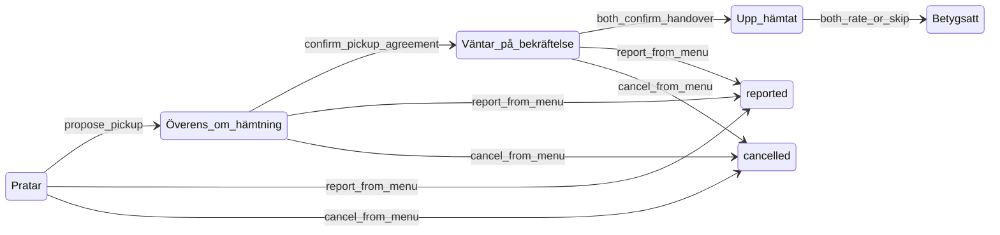

# Grannskafferiet Market v0.3 — Trust & transaktionsflöde

Market v0.3 builds on v0.2 with an intuitive trust flow (Vinted-inspired): lifecycle stepper in chat, meaningful reporting via overflow menu, and blind mutual ratings with profile reviews. Access model is unchanged — admin lab + demo seed + `market_live_enabled` off until v0.4.

## What's new in v0.3

| Area | v0.3 capability |
|------|-----------------|
| **Lifecycle** | `lifecycle_status` on threads: chatting → pickup_agreed → awaiting_handover → completed |
| **Stepper** | `MarketChatStepper` — Pratar → Överens → Upp hämtat → Betyg |
| **Handover UX** | "Upp hämtat" replaces "Utbyte klart"; dual confirmation with per-party checkmarks |
| **Rating v2** | Bottom sheet: stars + optional comment (120 chars) + "Stämde varorna?" |
| **Blind rating** | Counterpart rating revealed only after you rate (`revealed_at`) |
| **Profile reviews** | `MarketReviewList` — latest 3 ratings on market profile |
| **Report UX** | ⋮ overflow menu → modal with reason + optional block checkbox |
| **Cancel** | "Avbryt förfrågan" closes thread as `cancelled` (no rating prompt) |
| **Demo seed v3** | 4 listings + 4 threads (Anna, Erik, Lisa, Sara) |
| **Migration** | `0068_market_v03_trust.sql` |

## Trust flow diagram

### Step mapping

| Step | `lifecycle_status` | User sees |
|------|-------------------|-----------|
| 1 Pratar | `chatting` | Messages; CTA "Föreslå hämtning" |
| 2 Överens | `pickup_agreed` | Pickup agreed; stepper at step 2 |
| 3 Upp hämtat | `awaiting_handover` → `completed` | "Bekräfta att varorna bytt ägare"; dual ✓ |
| 4 Betyg | `completed` (exchange done) | Rating sheet when exchange ready |
| Terminal | `cancelled` / `reported` | Thread locked; no rating prompt |

Domain helpers: `src/lib/domain/market-lifecycle.ts` — transitions, step index, blind-rating visibility, report reason defaults.

## Report UX

Reporting moved from a visible header button to the **⋮ overflow menu** (`MarketChatOverflowMenu`).

| Menu item | API | Effect |
|-----------|-----|--------|
| Rapportera | `POST /api/market/chat/[threadId]/report` | Opens `MarketReportModal`; thread → `reported` |
| Blockera person | `POST /api/market/chat/[threadId]/block` | Adds to nearby block list |
| Avbryt förfrågan | `POST /api/market/chat/[threadId]/cancel` | Thread → `cancelled` |

### Report reasons

| Reason key | Label (SV) | Default block checkbox |
|------------|------------|------------------------|
| `inappropriate` | Olämpligt | on |
| `no_show` | Kom inte | off |
| `misleading` | Fel/skämt annons | off |
| `unsafe` | Känner mig otrygg | on |
| `other` | Annat | off |

Modal copy explains that reports are reviewed; serious cases block contact. On submit: admin panel entry, thread locked, **no rating prompt**.

Admin dismiss: `POST /api/admin/market/dismiss-chat-report` — reason shown in `AdminGrannskafferietReportsPanel` via `marketChatReportReasonLabel`.

## Rating UX

Triggered when exchange is complete (`isExchangeReadyForRating()` from `market-exchange.ts`) and thread is not terminal.

**`MarketRatingSheet`** (bottom sheet):

- 1–5 stars (large touch targets)
- Optional comment (max 120 chars) — shown on profile via `MarketReviewList`
- Optional "Stämde varorna?" — `items_as_described`: `yes` | `partial` | `no`
- **Blind:** counterpart rating visible only after you submit (`isCounterpartRatingVisible`)
- "Hoppa över" — no rating; 24h push reminder still applies (v0.2 cron)

API: `POST /api/market/chat/[threadId]/rate` — body includes `stars`, optional `comment`, optional `itemsAsDescribed`.

Profile: `GET /api/market/profile` + `MarketReviewList` on profile/market panels.

## Demo seed v3

Enabled by default; disable with `MARKET_DEMO_SEED_ENABLED=false`.

**Service:** `MarketDemoService` (`src/lib/application/market-demo.service.ts`)

**Flow (`POST /api/admin/market/seed-demo`):**

1. Clears prior demo rows (prefix cleanup)
2. Enables nearby sharing for admin; uses admin coords or Stockholm fallback
3. Seeds **4 listings** (`demo_market` source)
4. Seeds **4 chat threads** (admin as seeker):

| Thread | Sharer | `lifecycle_status` | Purpose |
|--------|--------|-------------------|---------|
| 1 | Anna | `pickup_agreed` | Stepper + pickup agreed state |
| 2 | Erik | `completed` | Rating sheet (no ratings yet) |
| 3 | Lisa | `completed` + both ratings | Profile reviews + blind reveal done |
| 4 | Sara | `reported` (`unsafe`) | Admin report panel + dismiss |

**Stable IDs:**

| Prefix | Entity |
|--------|--------|
| `market-demo-user-*` | Demo sharer users (1–4) |
| `market-demo-hh-*` | Demo households |
| `market-demo-share-*` | Expiring share links |
| `market-demo-thread-*` | Chat threads |

**Clear** (`POST /api/admin/market/clear-demo`): threads → shares → households → users.

## Admin test checklist

### Setup

- [ ] Confirm `MARKET_V01_DISABLED` is **not** set
- [ ] Confirm `market_live_enabled` is **false** (admin lab only)
- [ ] Migrations `0065`–`0068` applied (via deploy or local DB)

### Seed & feed

- [ ] Admin → Grannskafferiet → **Skapa marknadsdemodata**
- [ ] `/grannskafferiet/marknad` shows 4 demo listings near admin coords
- [ ] Demo source label visible on feed items

### Thread walkthrough

| Thread | Test |
|--------|------|
| **Anna** | Stepper at "Överens"; propose/confirm pickup flows work |
| **Erik** | Stepper at "Betyg"; rating sheet opens; blind until you rate |
| **Lisa** | Both ratings + comments on profile; `MarketReviewList` shows reviews |
| **Sara** | Thread locked; report visible in admin panel with reason `unsafe` |

### Overflow menu

- [ ] ⋮ menu on active thread: Report / Block / Cancel
- [ ] Report modal: all 5 reasons; block checkbox defaults for unsafe/inappropriate
- [ ] Cancel on test thread → `cancelled`, no rating prompt

### Handover

- [ ] "Upp hämtat" copy (not "Utbyte klart")
- [ ] Dual confirmation UI (you ✓ / counterpart waiting)
- [ ] Both confirm → `completed` → rating sheet

### Cleanup

- [ ] Dismiss Sara's report in admin panel
- [ ] **Rensa marknadsdemodata** — all 4 threads/listings gone
- [ ] Metrics show demo vs real split during seed

## Access model (unchanged from v0.2)

| Layer | Default | Effect |
|-------|---------|--------|
| `MARKET_V01_DISABLED` env | off | 404 everywhere |
| `market_live_enabled` | **false** | Users blocked; admins test |
| Nearby opt-in | per user | Required for users when live on |

Density-gate, route merge, and public city feed → **v0.4**.

## Key files

| Concern | Path |
|---------|------|
| Lifecycle | `src/lib/domain/market-lifecycle.ts` |
| Exchange | `src/lib/domain/market-exchange.ts` |
| Chat service | `src/lib/application/market-chat.service.ts` |
| Demo | `src/lib/domain/market-demo.ts`, `src/lib/application/market-demo.service.ts` |
| Stepper | `src/lib/components/molecules/MarketChatStepper.svelte` |
| Overflow / report | `MarketChatOverflowMenu.svelte`, `MarketReportModal.svelte` |
| Rating | `MarketRatingSheet.svelte`, `MarketReviewList.svelte` |
| Chat page | `src/routes/grannskafferiet/marknad/chatt/[threadId]/+page.svelte` |
| Admin | `AdminGrannskafferietReportsPanel.svelte` |
| Schema | `src/lib/infrastructure/db/schema.ts` |

## Migrations (order)

1. `0065_market_live.sql` — `market_live_enabled`
2. `0066_market_chat_report.sql` — report table
3. `0067_market_v02_exchange.sql` — exchange status, push, read receipts
4. `0068_market_v03_trust.sql` — lifecycle, rating comment/items/revealed, report reason backfill
