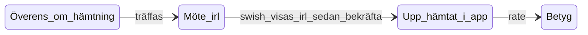

# Grannskafferiet Market v0.4 — Prissatta varor (betalning vid mötet)

Market v0.4 adds priced listings (quantity left + auto-price from % of receipt price). **Payment happens offline at pickup** — the buyer shows a Swish confirmation on their phone; the app does not handle money. Builds on v0.3 lifecycle unchanged.

## What's new in v0.4

| Area | v0.4 capability |
|------|-----------------|
| **Pricing snapshot** | `portionPercent`, `referencePriceSek`, `askingPriceSek`, `pricingMode` frozen on share at publish |
| **Listing settings** | `PATCH /api/market/listing-settings` — default price %, Swish number on `user` |
| **Discovery badges** | "Gratis" / "35 kr" + quantity on feed (Agent B) |
| **Pickup payment card** | `MarketPickupPaymentCard` in chat when `pickup_agreed` or `awaiting_handover` |
| **Swish help** | Masked copyable number + optional `swish://` deep link (buyer only) |
| **Demo seed v4** | Anna 25 kr / 75%, Erik gratis, Lisa 15 kr / 50% + Swish at pickup_agreed |
| **Migration** | `0069_market_v04_pricing.sql` |

## Payment-at-pickup flow



When `lifecycle_status` is `pickup_agreed` or `awaiting_handover`, and the listing has a non-free total price, both parties see **`MarketPickupPaymentCard`** below the stepper:

- **Att betala:** ca XX kr (sum of priced snapshot items)
- **Tips:** buyer Swishes and shows confirmation; seller checks before "Upp hämtat"
- **Swish number** (seller's `market_swish_number`) — masked `070-*** **67`, copy full number
- **Öppna Swish** (seeker only) — prefilled amount + message via `buildSwishPaymentUrl()`
- **Disclaimer:** Skaffu does not handle payments

**Not in v0.4:** `payment_status`, "Jag har betalat" / "Betalning mottagen" buttons.

Free listings (`pricingMode=free`) behave like v0.3 — no payment card.

## Swish number visibility

| Surface | Swish shown? |
|---------|--------------|
| Public listing / feed | No |
| Chat before pickup agreed | No |
| Chat at pickup_agreed+ | Yes (masked) |
| Settings (`MarketListingSettingsPanel`) | Seller edits own number |

API: `GET/PATCH /api/market/listing-settings` — validates Swedish mobile via `normalizeSwedishMobileNumber()`.

## Chat integration

| Layer | Change |
|-------|--------|
| `MarketChatService.getThreadDetail()` | Returns `paymentContext` when lifecycle + priced listing |
| `GET /api/market/chat/[threadId]` | Includes `paymentContext` for poll refresh |
| `+page.server.ts` | Passes `paymentContext` to chat page |
| `+page.svelte` | Renders card after `MarketChatStepper`; updates on poll |

`paymentContext` shape:

```ts
{
  askingPriceSek: number;
  items: ExpiringShareItemSnapshot[];
  sharerSwishNumber: string | null;
  isSeeker: boolean;
  sharerFirstName: string;
}
```

## Domain helpers

`src/lib/domain/market-pricing.ts`:

- `shouldShowPickupPaymentCard(status)`
- `hasPaidListingItems(items)` / `sumListingAskingPriceSek(items)`
- `maskSwedishMobileNumber()` / `formatSwedishMobileForDisplay()`
- `buildSwishPaymentUrl({ swishNumber, amountSek, message })`

## Demo seed v4

| Listing | Price | Portion | Thread | Purpose |
|---------|-------|---------|--------|---------|
| Anna | 25 kr | 75% | `pickup_agreed` | Price badge + payment card |
| Erik | Gratis | 100% | `completed` | Back-compat (no card) |
| Lisa | 15 kr | 50% | `pickup_agreed` | Swish number + deep link |
| Sara | — | — | `reported` | Unchanged (admin reports) |

Lisa demo user has `market_swish_number = 0701234567`.

## Analytics

| Event | When |
|-------|------|
| `market_listing_priced` | Priced listing published (backend, Agent A) |
| `market_swish_link_opened` | Buyer taps "Öppna Swish" (client → `/api/product-events`) |

## Admin test checklist

1. Seed demo → open **Anna** or **Lisa** thread at "Överens"
2. Confirm payment card shows price + meetup tip
3. **Lisa:** masked Swish, copy works, "Öppna Swish" on mobile
4. **Erik** completed thread — no payment card
5. Confirm pickup → card stays through handover step
6. Complete handover → card hidden (thread moves to rating)

## Key files

| Concern | Path |
|---------|------|
| Pricing domain | `src/lib/domain/market-pricing.ts` |
| Payment card | `src/lib/components/molecules/MarketPickupPaymentCard.svelte` |
| Chat service | `src/lib/application/market-chat.service.ts` |
| Chat page | `src/routes/grannskafferiet/marknad/chatt/[threadId]/+page.svelte` |
| Listing settings UI | `src/lib/components/organisms/MarketListingSettingsPanel.svelte` |
| Demo | `src/lib/domain/market-demo.ts` |
| Listing settings API | `src/routes/api/market/listing-settings/+server.ts` |

## v0.5+ (follow-ups)

- **Mobile shell (shipped v0.5)** — tabs, inbox, profile → [`GRANNSKAFFERIET_MARKET_V05_SHELL.md`](GRANNSKAFFERIET_MARKET_V05_SHELL.md)
- **In-app escrow (design v0.6)** — optional Stripe Connect before pickup → [`GRANNSKAFFERIET_MARKET_V06_ESCROW.md`](GRANNSKAFFERIET_MARKET_V06_ESCROW.md) and [`PRICING.md`](PRICING.md)

## Migrations (order)

1. `0068_market_v03_trust.sql` — lifecycle, ratings
2. `0069_market_v04_pricing.sql` — `market_swish_number`, `market_default_price_percent`
