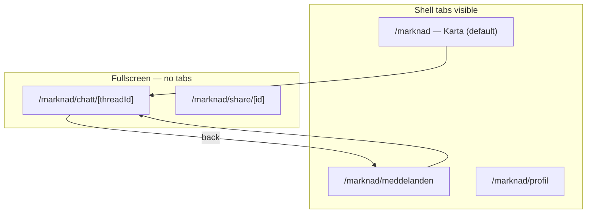

# Grannskafferiet Market v0.5 — Mobile shell (tabs, inbox, map, chat UX)

Market v0.5 wraps the v0.4 priced-listing experience in a **dedicated mobile shell**: three tabs (Karta, Meddelanden, Profil), a unified inbox, and full-screen chat that returns to the inbox. Builds on [v0.4 priced listings](./GRANNSKAFFERIET_MARKET_V04.md). Payment stays **offline at pickup** (Swish); in-app escrow is deferred to [v0.6 design](./GRANNSKAFFERIET_MARKET_V06_ESCROW.md).

## What's new in v0.5

| Area | v0.5 capability |
|------|-----------------|
| **Tab shell** | `MarketShellLayout` — Karta (default), Meddelanden, Profil |
| **Routes** | `/grannskafferiet/marknad` (map), `/meddelanden`, `/profil` |
| **Fullscreen routes** | Chat (`/chatt/[threadId]`) and listing detail (`/share/[id]`) hide tabs |
| **Inbox** | `MarketInboxList` — active/closed segments, pull-to-refresh, 5 s poll |
| **Unread badge** | Dot on Meddelanden tab + nav; polled via `GET /api/market/chats` |
| **Chat back UX** | Header back → `/meddelanden`; no shell tabs in thread view |
| **Profile tab** | Market name, auto-listing, Swish/listing settings, push panel |
| **Map UX** | List/map toggle; chat shortcut on pins with unread/active state |
| **Desktop** | Sticky top tabs inside bordered shell; mobile fixed bottom tabs |

## Shell routing

Domain helpers in `src/lib/domain/market-shell.ts`:

- `MARKET_SHELL_MESSAGES_PATH`, `MARKET_SHELL_PROFILE_PATH`
- `resolveMarketShellTab(pathname)` → `'map' | 'messages' | 'profile'`
- `isMarketShellFullscreenRoute(pathname)` — chat + share detail
- `isMarketShellRoute(pathname)` — any shell tab route

## Tab bar

| Tab | Path | `data-testid` | Content |
|-----|------|---------------|---------|
| Karta | `/grannskafferiet/marknad` | `market-shell-tab-map` | Nearby map + list (`NearbySharesMap`) |
| Meddelanden | `…/meddelanden` | `market-shell-tab-messages` | Inbox (`market-inbox`) |
| Profil | `…/profil` | `market-shell-tab-profile` | Settings panels (`market-profile-page`) |

Shell root: `data-testid="market-shell"`. Layout: `src/routes/grannskafferiet/marknad/+layout.svelte` wraps tab routes in `AppLayout` + `MarketShellLayout`; fullscreen routes render children only.

**Unread polling:** layout polls `/api/market/chats` every 5 s when nearby opt-in is on; syncs `setMarketUnreadCount()` for main nav badge.

## Inbox (Meddelanden)

`MarketInboxList` (`data-testid="market-inbox"`):

| Feature | Behaviour |
|---------|-----------|
| Segments | Active / closed (`market-inbox-segment-active`, `market-inbox-segment-closed`) |
| Thread row | Counterpart avatar, listing preview + price badge, last message, relative time |
| Empty states | Copy per segment when no threads |
| Refresh | Pull-to-refresh on touch; 5 s background poll |
| Opt-in gate | Empty + CTA when nearby sharing off |

Domain: `src/lib/domain/market-inbox.ts` — `filterInboxThreadsBySegment`, `formatMarketInboxRelativeTime`, `isActiveInboxThread`.

API: `GET /api/market/chats` — threads + `unreadCount` (unchanged from v0.3).

## Map tab (default)

Landing route stays `/grannskafferiet/marknad` (`data-testid="market-v01-page"` on map view).

- **List / map toggle** — `marketV05.mapShowList` / `mapShowMap`
- **Pin actions** — open listing; chat button when thread exists (`mapOpenChatBtn`)
- **Unread on pin** — visual indicator when thread has unread messages
- **Empty discovery** — hint to enable auto-listing on Profil tab

## Profil tab

`/grannskafferiet/marknad/profil` (`data-testid="market-profile-page"`):

- `MarketProfilePanel` — display name, avatar
- `MarketListingSettingsPanel` — default price %, Swish number (v0.4)
- `MarketAutoListingPanel` — auto nearby listing toggle
- `MarketChatPushPanel` — chat push opt-in

Requires nearby opt-in; otherwise shows settings link (same as v0.1).

## Chat UX (fullscreen)

Chat threads **do not** show shell tabs — full viewport for messages + stepper.

| Element | Behaviour |
|---------|-----------|
| Back | `← Tillbaka till meddelanden` → `/marknad/meddelanden` |
| Header | Counterpart name, compact stepper, overflow menu |
| Listing pin | `MarketChatListingCard` — link to share detail |
| Lifecycle | v0.3 stepper + v0.4 `MarketPickupPaymentCard` when priced + pickup agreed |
| Closed thread | Secondary CTA back to inbox |

`data-testid="market-chat-thread"`. Main nav hidden on fullscreen market routes via `isMarketShellFullscreenRoute` in `MainNavMobile`.

## Navigation integration

- **More menu** — `nav-market-v01` link to `/grannskafferiet/marknad` (admin lab; unchanged access model)
- **Unread in main nav** — `market-unread.svelte.ts` store fed by layout poll
- **Bottom nav suppression** — mobile bottom nav hidden on market fullscreen routes

## i18n keys

Namespace `marketV05` in `en.json` / `sv.json`: tab labels, inbox copy, profile title, back-to-inbox, map toggle strings.

## Key files

| Piece | Path |
|-------|------|
| Shell domain | `src/lib/domain/market-shell.ts` |
| Inbox domain | `src/lib/domain/market-inbox.ts` |
| Shell layout | `src/lib/components/templates/MarketShellLayout.svelte` |
| Route layout | `src/routes/grannskafferiet/marknad/+layout.svelte` |
| Inbox page | `src/routes/grannskafferiet/marknad/meddelanden/+page.svelte` |
| Profile page | `src/routes/grannskafferiet/marknad/profil/+page.svelte` |
| Inbox UI | `src/lib/components/organisms/MarketInboxList.svelte` |
| Chat page | `src/routes/grannskafferiet/marknad/chatt/[threadId]/+page.svelte` |
| Unread store | `src/lib/stores/market-unread.svelte.ts` |
| Nav config | `src/lib/navigation/nav-config.ts` |

## Access model (unchanged)

Same as v0.1–v0.4: admin lab + optional `market_live_enabled`; nearby opt-in required for inbox/map data. Demo seed via admin panel → `/api/admin/market/seed-demo`.

## Related documents

| Doc | Relation |
|-----|----------|
| [GRANNSKAFFERIET_MARKET_V04.md](./GRANNSKAFFERIET_MARKET_V04.md) | Priced listings + Swish at pickup |
| [GRANNSKAFFERIET_MARKET_V03.md](./GRANNSKAFFERIET_MARKET_V03.md) | Lifecycle, ratings, reports |
| [GRANNSKAFFERIET_MARKET_V06_ESCROW.md](./GRANNSKAFFERIET_MARKET_V06_ESCROW.md) | Optional Stripe Connect escrow (future) |
| [PRICING.md §9](./PRICING.md#9-grannskafferiet--köparskydd-utkast-v06) | Buyer protection fee draft (escrow) |

---

*Shipped jun 2026 — mobile shell only; no payment or escrow changes.*
