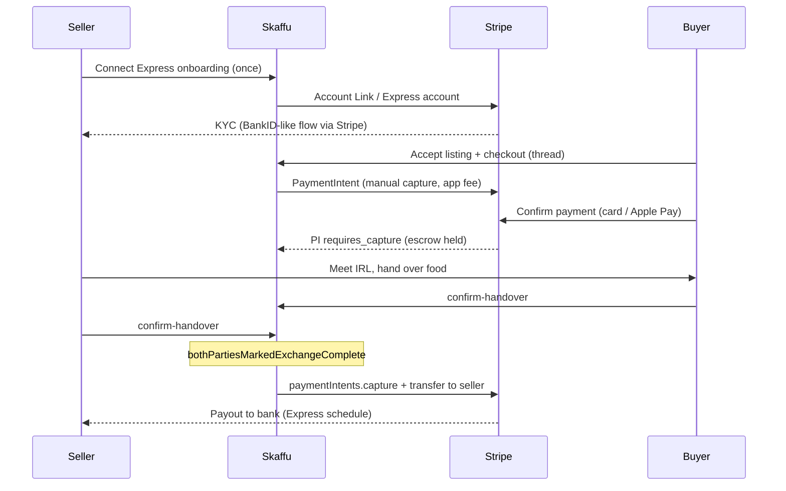

# Grannskafferiet Market v0.6 — Stripe Connect escrow (design)

*Status: **design only** — no implementation. Builds on [v0.3 handover](./GRANNSKAFFERIET_MARKET_V03.md), [v0.4 priced listings](./GRANNSKAFFERIET_MARKET_V04.md), and [v0.5 mobile shell](./GRANNSKAFFERIET_MARKET_V05_SHELL.md).*

Market v0.4 keeps payment **offline** (Swish/kontant vid mötet). v0.6 is an **optional** upgrade: buyer pays in-app before pickup; funds are held in escrow and released when both parties confirm handover — the same trigger v0.3 already uses for "Upp hämtat".

---

## 1. Decision: v0.4 offline vs v0.6 escrow

| Criterion | Stay on v0.4 (offline) | Build v0.6 (escrow) |
|-----------|------------------------|---------------------|
| **User expectation** | OLIO / lokala grupper — gratis P2P, Swish at the door | Vinted-like — pay first, buyer protection |
| **No-show risk** | Social trust + ratings; no financial commitment | Reserved funds reduce flaking |
| **Compliance** | Skaffu is contact broker only; no PSD2 payment institution | Stripe Connect handles KYC/payouts; platform is marketplace facilitator |
| **Engineering** | Pricing UX + Swish helper only | Connect onboarding, checkout, webhooks, dispute ops |
| **Fees** | None for Skaffu | Buyer protection fee (see [PRICING.md §9](./PRICING.md#9-grannskafferiet--köparskydd-utkast-v06)) |
| **Food context** | Matches "meet anyway" for perishables | Better when price > ~50 kr or repeat sellers |

**Recommendation:** v0.4 and v0.5 shell are shipped. Start v0.6 only when product signals justify it — e.g. repeated "buyer didn't pay" / "seller no-show" reports, or explicit user demand for in-app payment before meetup.

**Coexistence:** `pricingMode=free` and v0.4 offline flow remain default. Escrow is opt-in per listing (`paymentMode: 'offline' | 'escrow'`) and only when seller has a Connect account in good standing.

---

## 2. What exists today (reuse)

### 2.1 Handover release trigger (v0.3)

Escrow release must hook the **same domain condition** as rating eligibility:

```43:45:src/lib/domain/market-exchange.ts
export function bothPartiesMarkedExchangeComplete(thread: MarketExchangeThreadFields): boolean {
	return thread.seekerCompletedAt != null && thread.sharerCompletedAt != null;
}
```

Application flow (`MarketChatService.confirmHandover`):

1. Participant calls `POST /api/market/chat/[threadId]/confirm-handover`.
2. Sets `seekerCompletedAt` or `sharerCompletedAt`.
3. When **both** are set → `lifecycleStatus: 'completed'`, `exchangeStatus: 'completed'`, `closedAt` set.

v0.6 adds a **side effect** at step 3: capture PaymentIntent + transfer to seller (if thread has escrow).

Lifecycle alignment:

| Step | `lifecycle_status` | Escrow state |
|------|-------------------|--------------|
| Chat / agree pickup | `chatting` → `pickup_agreed` | No charge yet (or PI created but not confirmed — see §4) |
| Awaiting handover | `awaiting_handover` | Funds **authorized** or **captured to platform hold** |
| Both confirm "Upp hämtat" | `completed` | **Capture** (if manual) + **transfer** to seller Connect account |
| Report / cancel (terminal) | `reported` / `cancelled` | **Cancel** or **refund** PI; block release |

Domain duplicate: `handoverCompletesExchange()` in `market-lifecycle.ts` mirrors `bothPartiesMarkedExchangeComplete()` — escrow service should call one helper only (prefer `bothPartiesMarkedExchangeComplete` on full thread row).

### 2.2 Stripe today (Pro subscription only)

[`src/lib/server/stripe.ts`](../../src/lib/server/stripe.ts) exposes:

- Secret key, webhook secret, monthly/yearly **Price IDs**
- `createStripeClient()` — API version `2026-05-27.dahlia`
- `isStripeConfigured()` — Pro checkout gates

**Not present:** Connect account creation, PaymentIntents for marketplace, separate Connect webhook handling, or seller onboarding.

Existing Pro stack (reference pattern):

| Piece | Path / table |
|-------|----------------|
| Checkout | `POST /api/stripe/checkout` |
| Portal | `POST /api/stripe/portal` |
| Webhook | `POST /api/stripe/webhook` → updates `household.plan_tier` |
| Billing columns | `household.stripe_customer_id`, `stripe_subscription_id`, … |

v0.6 extends the same Stripe platform account with **Connect** capabilities; Pro billing stays on household subscription — **separate** from marketplace payouts.

Operational guide for Pro test mode: [STRIPE.md](./STRIPE.md).

---

## 3. Architecture overview



**Principle:** Skaffu does **not** operate an internal wallet (no Vinted Pay / EMI license). Stripe holds funds; Express accounts receive payouts per Stripe's schedule after capture.

---

## 4. Stripe Connect — Express accounts (sellers)

### 4.1 Account type

| Choice | Rationale |
|--------|-----------|
| **Express** | Stripe-hosted onboarding + dashboard; lowest ops for P2P food marketplace |
| Custom | Rejected — too much compliance UI for v0.6 |
| Standard | Rejected — sellers manage full Stripe dashboard; poor UX for casual sharers |

### 4.2 Seller onboarding flow

1. Sharer enables "Ta betalt i appen" in market profile (gated: admin lab → live).
2. `POST /api/market/connect/onboard` → create Express `account` (`type: 'express'`, `country: 'SE'`, `capabilities: { card_payments: { requested: true }, transfers: { requested: true } }`).
3. Store `user.stripe_connect_account_id` (new column, design).
4. Return Account Link URL → redirect to Stripe onboarding.
5. Webhook `account.updated` → sync `charges_enabled`, `payouts_enabled`, `details_submitted` to `user.market_connect_status`.

**Gating paid escrow listings:**

- `charges_enabled && payouts_enabled && details_submitted` before `paymentMode: 'escrow'` on listing.
- Otherwise fall back to v0.4 offline or block publish with CTA "Slutför utbetalningsuppgifter".

### 4.3 KYC / compliance

- **Identity & bank:** Stripe Express onboarding (SE); platform does not store bank details.
- **Seller type:** `business_type: 'individual'` for private sharers; revisit if commercial sellers appear.
- **Platform role:** Marketplace facilitator — terms must state Skaffu is not seller of food; private P2P transaction.
- **PSD2:** No own payment institution; Stripe is licensed acquirer.
- **Food / hygiene:** Product copy unchanged from v0.4 FAQ — inform, don't certify.

---

## 5. Escrow mechanics — PaymentIntent manual capture

### 5.1 Recommended model

**PaymentIntent with `capture_method: 'manual'`** on the platform account, with Connect transfer on capture:

```ts
// Illustrative — not implemented
await stripe.paymentIntents.create({
  amount: totalMinor,           // öre
  currency: 'sek',
  customer: buyerStripeCustomerId,
  capture_method: 'manual',
  application_fee_amount: buyerProtectionFeeMinor,
  transfer_data: {
    destination: sellerConnectAccountId
  },
  metadata: {
    market_thread_id: threadId,
    expiring_share_id: shareId,
    skaffu_escrow: 'v1'
  }
});
```

| Phase | PI status | Meaning |
|-------|-----------|---------|
| Buyer confirms checkout | `requires_capture` | Funds authorized; not paid out to seller |
| Both confirm handover | `succeeded` (after capture) | Seller portion transferred per Connect rules |
| Cancel / report before capture | `canceled` | Authorization released |
| Refund after capture | Refund API | Platform + seller shares per Stripe Connect refund rules |

**Alternative considered:** Separate charges and transfers (charge platform, transfer after handover). Manual capture + `transfer_data` is simpler and matches "hold until handover" mentally.

### 5.2 When to create the PaymentIntent

| Option | Pros | Cons |
|--------|------|------|
| **At pickup_agreed** | Pay before meet; reduces no-show | Buyer pays before seeing item |
| **At thread start (seeker commits)** | Strong commitment early | Refunds if deal falls through |
| **Recommended: at pickup_agreed** | Aligns with v0.3 "Överens om hämtning" | Requires clear cancel/refund policy |

Checkout UI: seeker sees frozen `askingPriceSek` from listing snapshot + buyer protection fee line item → Stripe Payment Element.

### 5.3 Amounts

From v0.4 listing snapshot (design):

- `askingPriceSek` → PI `amount` base (seller receivable before platform fee)
- `buyerProtectionFeeSek` → included in buyer total; recorded as `application_fee_amount`
- Buyer pays: `askingPriceSek + buyerProtectionFeeSek` (see [PRICING.md §9](./PRICING.md#9-grannskafferiet--köparskydd-utkast-v06))

All amounts stored in **öre** in DB; display SEK in UI.

---

## 6. Release trigger — mapping to handover

### 6.1 Integration point

Extend `MarketChatService.confirmHandover` **after** successful `markExchangeComplete` when `bothPartiesMarkedExchangeComplete(updated)`:

```
if (thread.paymentMode === 'escrow' && bothPartiesMarkedExchangeComplete(updated)) {
  await marketEscrowService.releaseEscrow({ threadId, idempotencyKey });
}
```

`MarketEscrowService.releaseEscrow`:

1. Load `market_payment` row by `thread_id`.
2. Assert PI status `requires_capture`.
3. `stripe.paymentIntents.capture(piId)`.
4. Update `market_payment.status = 'released'`, `released_at`.
5. On Stripe error: log, set `status = 'release_failed'`, alert ops — **do not** roll back handover timestamps (handover is source of truth for UX; ops retries capture).

**Idempotency:** Use Stripe idempotency key `release-{threadId}`; DB unique constraint on `thread_id` for payment row.

### 6.2 Partial handover (one party confirmed)

No funds movement. UI unchanged from v0.3 — wait for counterpart.

### 6.3 Auto-release timeout (optional v0.6.1)

Vinted auto-releases after 48h. For local pickup, **defer** auto-release until we have data. If added:

- Cron: if `awaiting_handover` + seeker confirmed + 48h → auto-set sharer confirm OR auto-capture with dispute window.
- Product risk for food (disputes "item spoiled") — prefer manual dual confirm for v0.6.0.

---

## 7. Webhooks

### 7.1 Endpoint strategy

| Option | Recommendation |
|--------|----------------|
| Single `/api/stripe/webhook` | Extend existing handler with event type routing |
| Separate `/api/stripe/connect-webhook` | Use if Connect dashboard requires different URL — otherwise one endpoint |

Verify signature with existing `getStripeWebhookSecret()`; add `STRIPE_CONNECT_WEBHOOK_SECRET` only if Stripe mandates separate signing secret for Connect events (often same endpoint).

### 7.2 Events to handle

| Event | Action |
|-------|--------|
| `payment_intent.succeeded` | If already captured at checkout (shouldn't happen in manual mode) — reconcile. After capture: mark `released`. |
| `payment_intent.amount_capturable_updated` | PI authorized — set `market_payment.status = 'held'`. |
| `payment_intent.payment_failed` | Checkout failed — notify seeker; thread stays unpaid. |
| `payment_intent.canceled` | Sync cancel from Stripe dashboard or our cancel flow. |
| `charge.dispute.created` | Set `market_payment.status = 'disputed'`; freeze ops review; link to admin panel. |
| `charge.refunded` | Sync refund state. |
| `account.updated` | Refresh seller Connect capabilities on user row. |
| `transfer.created` / `payout.paid` | Analytics / seller "payment on the way" (optional UX). |

**Ordering:** Webhooks may arrive after API response. DB status is authoritative; webhook reconciles.

### 7.3 Idempotency & replay

Store `stripe_event_id` processed (table or column) to ignore duplicates — same pattern as Pro subscription webhook handler.

---

## 8. Cancel, report, dispute, refund

### 8.1 Thread cancel (`cancelled`)

| Escrow state | Action |
|--------------|--------|
| No PI / checkout incomplete | No-op |
| PI `requires_capture` | `paymentIntents.cancel` — buyer authorization released |
| PI already captured (shouldn't happen if release tied to handover) | Refund per policy |

Who can cancel: same as v0.3 — either party via overflow menu before `completed`.

### 8.2 Thread report (`reported`)

1. Lock thread (existing v0.3 behavior).
2. If PI `requires_capture` → **do not capture**; leave authorized or cancel after admin review window.
3. If PI captured (edge: release succeeded before report) → open refund/dispute path; flag admin.

Report reasons map to escrow policy:

| Reason | Default escrow action |
|--------|----------------------|
| `no_show` | Cancel PI / full refund to buyer |
| `misleading` | Admin review → full or partial refund |
| `unsafe` | Cancel + block; refund buyer |
| `inappropriate` / `other` | Admin review |

Integrate with `AdminGrannskafferietReportsPanel` — show payment state + Stripe Dashboard link.

### 8.3 Stripe disputes (chargeback)

After capture, buyer may dispute via bank. Stripe Connect routes dispute to platform/seller per account configuration. Platform:

- Respond via Stripe Dashboard with handover timestamps (`seekerCompletedAt`, `sharerCompletedAt`) + chat metadata.
- No custom dispute API in v0.6.0 — ops playbook only.

### 8.4 Refund matrix

| Scenario | Buyer | Seller |
|----------|-------|--------|
| Cancel before pickup_agreed | N/A (no PI) | — |
| Cancel after PI, before handover | Full refund / auth release | Nothing paid |
| Report upheld before capture | Auth canceled | — |
| Both confirmed handover | No automatic refund | Payout proceeds |
| Post-handover quality issue | Not in v0.6 — ratings + admin manual refund | — |

---

## 9. Data model (design sketch)

New tables/columns — **migration TBD**:

### `user`

| Column | Type | Notes |
|--------|------|-------|
| `stripe_connect_account_id` | text nullable | `acct_…` |
| `market_connect_status` | enum | `none` / `onboarding` / `active` / `restricted` |

### `market_chat_thread`

| Column | Type | Notes |
|--------|------|-------|
| `payment_mode` | enum | `offline` (default) / `escrow` |
| `payment_status` | enum nullable | `pending` / `held` / `released` / `canceled` / `refunded` / `disputed` |

v0.4 intentionally has **no** payment state — only add when v0.6 ships.

### `market_payment` (new)

| Column | Type | Notes |
|--------|------|-------|
| `id` | uuid | PK |
| `thread_id` | uuid | FK unique |
| `stripe_payment_intent_id` | text | |
| `amount_minor` | int | Total charged to buyer |
| `seller_amount_minor` | int | After fees |
| `buyer_protection_fee_minor` | int | |
| `currency` | text | `sek` |
| `status` | enum | Mirrors §5.1 / §7.2 |
| `held_at` | timestamptz | |
| `released_at` | timestamptz | |
| `canceled_at` | timestamptz | |

Listing snapshot still holds `askingPriceSek` (v0.4) — immutable price at publish.

---

## 10. API surface (design)

| Method | Path | Purpose |
|--------|------|---------|
| POST | `/api/market/connect/onboard` | Start Express onboarding |
| GET | `/api/market/connect/status` | Seller capabilities for UI |
| POST | `/api/market/chat/[threadId]/checkout` | Create + confirm PI (seeker) |
| POST | `/api/market/chat/[threadId]/cancel-payment` | Internal/admin or tied to cancel flow |

Existing handover route unchanged: `POST …/confirm-handover` triggers release.

**Feature flags:** `market_escrow_enabled` app setting (default false); requires `market_live_enabled` + Stripe Connect activated in Dashboard.

---

## 11. UI deltas (design)

| Surface | Change |
|---------|--------|
| Listing publish | Toggle "Betala i appen" if Connect active |
| Listing card | Badge "Köparskydd" for escrow listings |
| Chat (pickup_agreed+) | Replace Swish card with "Betala nu" OR show "Betalning reserverad" |
| Handover step | Same "Upp hämtat" — add copy: "Pengar betalas ut till säljaren när ni båda bekräftat" |
| Profile (Profil tab) | Connect onboarding status + Express dashboard link |
| Settings / FAQ | Escrow terms, fee disclosure, dispute contact |

Copy when escrow off: keep v0.4 *"Skaffu hanterar inte betalningar…"* verbatim.

---

## 12. Implementation phases (when approved)

| Phase | Scope |
|-------|-------|
| **6a** | Connect Express onboarding + account webhooks + profile UI |
| **6b** | Checkout PI + `market_payment` + held state |
| **6c** | Release on `bothPartiesMarkedExchangeComplete` + capture webhook reconcile |
| **6d** | Cancel/report/refund integration + admin payment column |
| **6e** | Beta under admin lab; metrics: conversion, dispute rate, release latency |

**Do not start** until v0.4 priced listings and v0.5 shell are stable in production.

---

## 13. Testing checklist (future)

- [ ] Seller completes Express onboarding (test mode)
- [ ] Buyer checkout → PI `requires_capture`
- [ ] Single party confirm-handover → no capture
- [ ] Both confirm → capture + transfer; `payment_status = released`
- [ ] Cancel thread before handover → PI canceled
- [ ] Report thread with held PI → no release; admin can cancel PI
- [ ] Webhook replay idempotency
- [ ] `pricingMode=free` + offline unchanged (regression)
- [ ] Pro subscription billing unaffected

---

## 14. Related documents

| Doc | Relation |
|-----|----------|
| [GRANNSKAFFERIET_MARKET_V03.md](./GRANNSKAFFERIET_MARKET_V03.md) | Handover + report + rating |
| [GRANNSKAFFERIET_MARKET_V05_SHELL.md](./GRANNSKAFFERIET_MARKET_V05_SHELL.md) | Mobile shell (Profil tab for Connect UI) |
| [PRICING.md §9](./PRICING.md#9-grannskafferiet--köparskydd-utkast-v06) | Buyer protection fee draft |
| [STRIPE.md](./STRIPE.md) | Pro subscription setup (existing) |
| `src/lib/server/stripe.ts` | Client factory to extend |
| `src/lib/domain/market-exchange.ts` | Release trigger domain rule |

---

*Design draft — jun 2026. No code, migrations, or env vars until product explicitly prioritizes v0.6.*
