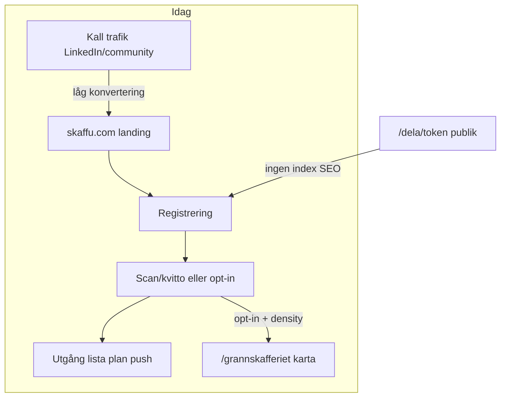

# Growth-strategi — Skaffu

*Version: juni 2026. Operativ strategi för acquisition, activation och retention — inte en feature-roadmap.*

**Relaterade dokument (läs där, duplicera inte här):**

| Dokument | Vad det täcker |
|----------|----------------|
| [`LAUNCH_PLAYBOOK.md`](./LAUNCH_PLAYBOOK.md) | Community-launch, UTM, postmallar, PMF-mått |
| [`GRANNSKAFFERIET_V0.md`](./GRANNSKAFFERIET_V0.md) | Dela-länk, hybrid launch, density-gate |
| [`COMPETITIVE_ANALYSIS.md`](./COMPETITIVE_ANALYSIS.md) §3G | OLIO vs TGTG vs Skaffu — geo/grann-delning |
| [`PRICING.md`](./PRICING.md) | Freemium, Pro-radie, betalvägg senare |
| [`LINKEDIN_LAUNCH.md`](./LINKEDIN_LAUNCH.md) | Ärlig beta-copy, kall trafik |
| [`PRODUCT_LED_GROWTH_ANALYSIS.md`](./PRODUCT_LED_GROWTH_ANALYSIS.md) | PLG-inventering, rankad opportunity-katalog, valideringsplan |
| [`BREAKTHROUGH_GROWTH_OPPORTUNITIES.md`](./BREAKTHROUGH_GROWTH_OPPORTUNITIES.md) | Breakthrough-frågan, stranger-pull, B1–B12-katalog, data compound-moat |
| [`ACQUISITION_WEDGES.md`](./ACQUISITION_WEDGES.md) | Rankade acquisition-wedges W1–W10, capability scorecard, $0-ad mekanik, build-prioritet efter activation |
| [`NEXT_STAGE_STRATEGY.md`](./NEXT_STAGE_STRATEGY.md) | PMF-risker, retention, moat, 10x-gafflar, CTO-granskning, beslutskalender efter W1–W4 |
| [`PRICE_MEMORY_STRATEGY.md`](./PRICE_MEMORY_STRATEGY.md) | Price memory — compound/retention, V1–V3, schema-gap (inga priser i DB idag) |
| [`HOUSEHOLD_GROWTH.md`](./HOUSEHOLD_GROWTH.md) | Hushållsexpansion solo→flermedlem, W1/W4-bryggor, friktion, V1–V3, naturlig invite |
| [`FOOD_ECOSYSTEM_EXPLORATION.md`](./FOOD_ECOSYSTEM_EXPLORATION.md) | Horisont/kategori — fyra mat-ekosystem, C1–C7 bets, H1–H3 om Skaffu lyckas |

---

## 1. Executive summary

### Diagnos (ärlig)

**Primärt problem: acquisition.** Få personer hittar Skaffu. Pantry-kategorin har låg organisk sökintent i Sverige. Kall trafik från LinkedIn och community konverterar dåligt till registrering — se varningarna i [`LINKEDIN_LAUNCH.md`](./LINKEDIN_LAUNCH.md). Det är inte ett “produkt saknas features”-problem; det är ett “rätt personer med rätt budskap i rätt kanal”-problem.

**Sekundärt problem: activation.** De som landar på skaffu.com möter en konto-vägg innan nästan allt värde (lager, utgång, karta, push) blir tillgängligt. Aktivering kräver arbete: skanna streckkoder, ladda upp kvitto, eller opta in till nätverksfunktioner. Onboarding-flödet är i stort sett shipped ([`90_DAY_ROADMAP.md`](./90_DAY_ROADMAP.md) punkt 2) — det är inte huvudblockern.

**Local Food Map (`/grannskafferiet`) är idag retention och nätverk, inte acquisition.** Kartan kräver inloggning, opt-in med plats under Inställningar, och en density-gate (≥5–10 aktiva delningar i ett område) innan den ger meningsfullt värde. Publika dela-länkar (`/dela/[token]`) är `noindex` — ingen SEO-discovery. Att marknadsföra kartan före supply skadar mer än det hjälper.

**Retention:** Instrumentering finns (PMF-dashboard på `/admin`, onboarding-events, push). PMF är **inte bevisad** ([`COMPETITIVE_ANALYSIS.md`](./COMPETITIVE_ANALYSIS.md) §1). Retention-optimering utan acquisition-funnel är prematur. Prioritet: få in rätt användare och se om de stannar — inte bygga fler retention-features.

### Vad Skaffu kan bli vs vad det är idag

| Idag | Möjligt (under villkor) |
|------|-------------------------|
| Nischprodukt för hushåll som aktivt bygger digitalt lager | Hybrid “lager → dela lokalt” för matsvinn-community |
| Grannskafferiet som retention för aktiverade användare | Karta som acquisition-kanal **efter** density i en pilotstad |
| Låg kall-konvertering | Varm trafik via dela-bild, DM, och befintliga användares Wrapped |

### Do not build (denna strategifas, 4–6 veckor)

- **Karta-polish** — discovery för befintliga, inte acquisition-fix
- **Nya pantry-features** — lager-kärnan räcker för PMF-test
- **Pro-gates och betalvägg** — freemium-hypotes väntar på PMF ([`PRICING.md`](./PRICING.md))
- **Admin-polish** — läs data, bygg inte dashboards
- **SEO på karta** — före density i Stockholm, Malmö eller Göteborg

**Undantag (redan pågående, minimal scope):** W4 toggle-fix och Mer-meny — discovery UX för **befintliga** användare, inte magisk acquisition.

### Funnel idag



---

## 2. Svar på de åtta analysfrågorna

### 1. Vad är den starkaste acquisition storyn?

**Hybrid-vinkel (rekommenderad):** *“Sluta köpa dubbelt — se vad som går ut och dela lokalt utan foto-jobb.”*

Kedjan är: **lager → utgång → dela-länk eller bild**. Det differentierar mot OLIO (manuell listing med foto) och mot ICA-appen (butikslojalitet). Se [`COMPETITIVE_ANALYSIS.md`](./COMPETITIVE_ANALYSIS.md) §3G.

**Inte** “bästa matkartan i Sverige” före density. OLIO äger “free food map”-positionen idag; tom Skaffu-karta förstärker den narrativet.

**Pantry-alone (sekundär):** Butiksneutralt hushållsskafferi + Kivra/kvitto-PDF. Nisch med lägre volym men högre intent för SEO-guider ([`guides.ts`](../src/lib/marketing/guides.ts)). Bra som landnings- och SEO-spår, inte som enda kanal.

*EN one-liner:* “Pantry-first, share-second — not a map-first pitch.”

### 2. Vad kan en besökare göra utan konto?

| Yta | Utan konto | Acquisition-värde |
|-----|------------|-------------------|
| `/` och marketing-sidor | Läsa, jämföra, CTA till register | Begränsat — kräver övertygande hero |
| `/dela/[token]` | Se utgående lista (48 h), registrerings-CTA med UTM | **Högst** — men `noindex`, ingen organisk discovery |
| Guider (`/guider/*`) | Läsa SEO-innehåll | Långsiktig, låg volym |
| `/rapport/*` | Läsa anonymiserad månadsdata (gated vid låg kohort) | PR-spår, inte daglig acquisition |
| `/grannskafferiet` | **Kräver login** | Noll acquisition idag |

**Experiment (senare, inte nu):** Read-only publik karta-teaser utan konto — endast om density finns i pilotområde. Bygg-first är fel ordning.

### 3. Hur berättar en nöjd användare för en vän?

**Primärt:** Dela **bild + länk** i matsvinn-Facebook-grupp eller grannchat — mallar i [`GRANNSKAFFERIET_V0.md`](./GRANNSKAFFERIET_V0.md). Listan finns redan; mottagaren ser konkret värde utan att förstå hela appen.

**Sekundärt:** Wrapped eller veckostatistik om de redan använder appen ([`WRAPPED.md`](./WRAPPED.md)).

**Inte:** “Ladda ner Skaffu för kartan.” Det kräver density, opt-in och aktivt nätverk — tre barriärer för mottagaren.

### 4. One-liner (SV)

**Primär (hybrid):**

> *Skaffu visar vad som går ut i skafferiet — och låter dig dela det med grannar utan att lista mat från noll.*

**Alternativ pantry-only (SEO/bred målgrupp):**

> *Butiksneutralt skafferi för hela hushållet — skanna, kvitto, utgång, gemensam lista.*

Landning A/B: variant A = “koll på skafferiet”, variant B = “butiksneutralt hushåll” ([`landing-variants.ts`](../src/lib/marketing/landing-variants.ts)). För bred SV-familj-acquisition rekommenderas **variant B** som test i experiment E2.

### 5. Vilka är de största adoptionsbarriärerna?

| Barriär | Effekt | Mitigation (experiment, inte feature) |
|---------|--------|--------------------------------------|
| Konto-vägg före värde | Hög bounce från kall trafik | Varm trafik via `/dela`; tydlig “5 scan eller 1 kvitto” i poster |
| Vana att bygga digitalt lager | “Ännu en app att underhålla” | Kvitto-wow eller 5 streckkoder som minimum viable activation |
| OLIO mental model | “Finns det mat gratis i närheten?” | Budskap: listan finns redan i *ditt* skafferi |
| Webb/PWA (ingen App Store) | Misstro eller “glömmer öppna” | `/install-app`-tip i första kommentar ([`LAUNCH_PLAYBOOK.md`](./LAUNCH_PLAYBOOK.md)) |
| Tomt nätverk i förort | Grannskafferiet känns meningslöst | Density-seed i **en** stad; marknadsför inte karta nationellt |
| Privacy kring plats | Opt-in känns läskigt | Dela-länk/bild kräver ingen plats; karta endast efter trust |

### 6. Retention vs acquisition — vad driver vad?

| Acquisition (få in nya) | Retention (hålla kvar) |
|-------------------------|------------------------|
| Landing + hero A/B ([`landing-variants.ts`](../src/lib/marketing/landing-variants.ts)) | Lager, scan, kvitto |
| SEO guider ([`guides.ts`](../src/lib/marketing/guides.ts)) | Utgång, Ät det först, push |
| Publik `/dela/[token]` + UTM | Inköpslista, plan, hushåll |
| Community-poster (hybrid bild+länk) | Wrapped, statistik, streak |
| LinkedIn (ärlig beta) | Grannskafferiet karta (opt-in) |
| — | Nearby push, Pro radie (senare) |

**Slutsats:** Acquisition och retention delar *innehåll* (utgång, delning) men olika *ingångar*. Investera acquisition-tid i distribution och copy — inte i retention-features före PMF-signal.

### 7. Vad ska vi sluta bygga nu?

Tills minst två acquisition-experiment (E1–E2) har 4 veckors data:

- Karta-polish, nya kartlager, publik karta utan strategi
- Nya pantry-features utöver stabilitet
- Pro-gates, Stripe, betalvägg-UI
- Admin-dashboard-utbyggnad
- “Viral loops” i produkten utan manuell distribution först

**Undantag:** W4 toggle-fix + Mer-meny — hjälper befintliga hitta Grannskafferiet; räknas som discovery, inte growth-hack.

### 8. Vilka experiment ska köras före mer funktionalitet?

Se avsnitt 7 (E1–E6). Tidsram: **4–6 veckor**. Geo-fokus: **Stockholm, Malmö, Göteborg som tre separata density-zoner** — inte en nationell “Sverige-karta”. Välj **en** pilotstad för E3 första cykeln.

---

## 3. Acquisition-analys

### Kanaler och realistisk konvertering

| Kanal | Styrka | Svaghet | Prioritet |
|-------|--------|---------|-----------|
| Matsvinn FB-grupper | Hög intent, hybrid bild+länk funkar | “Ännu en app”; regler | **E1 — primär** |
| Varm DM (vänner, föräldrar) | Hög aktivering | Låg volym | **E5** |
| SEO guider | Långsiktig, gratis | Låg volym månader 1–3 | Bakgrund |
| LinkedIn kall | Byggare-story, trust | Dålig registrering | **E6** — resultat, inte “ny app” |
| `/dela/[token]` | Konkret värde | Ingen SEO; kräver befintlig användare | Supply-driven |
| Grannskafferiet-karta | — | Login + opt-in + density | **E4 endast efter E3** |

### Primärt acquisition-problem (sammanfattning)

Skaffu har **distribution- och message-problem**, inte product-gap. Kategori “pantry app” är okänd för de flesta svenska hushåll. Kall pitch “skafferi-app” konverterar sämre än konkret matsvinn-exempel (“här är vad som går ut hemma hos oss denna vecka”).

Operativt playbook för community finns i [`LAUNCH_PLAYBOOK.md`](./LAUNCH_PLAYBOOK.md) — denna strategi säger **vilken vinkel** som ska testas först (hybrid, inte karta).

---

## 4. Activation-analys

### Definitioner (från [`LAUNCH_PLAYBOOK.md`](./LAUNCH_PLAYBOOK.md))

**PMF-aktivering:** ≥10 varor **eller** 1 kvitto inom 24 h efter registrering.

**Grannskafferiet-aktivering:**

| Event | Betydelse |
|-------|-----------|
| `expiring_share_created` | Användaren delade utgående lista |
| `expiring_share_viewed` | Någon öppnade publik `/dela/[token]` |

### Activation-tratt

1. **Landning → registrering:** Mät med UTM + hero-variant (`?hero=a|b`).
2. **Registrering → PMF-aktivering:** Mål >40 % ([`LAUNCH_PLAYBOOK.md`](./LAUNCH_PLAYBOOK.md)); läs `/admin` varje måndag.
3. **Aktivering → delning:** Andel som skapar `expiring_share_created` inom 7 dagar — indikator på hybrid-story traction.

### Var activation faller idag

- **Kall trafik** registrerar sig men skannar inte — message/audience mismatch, inte onboarding-bugg.
- **Karta-sökare** (om de hittar appen) möter login + tom karta → avhopp före lager-aktivering.
- **Kvitto-vägen** har högst “wow” men kräver PDF-vana; community-copy ska nämna båda vägarna.

---

## 5. Retention-analys

### Metrics (läs `/admin`)

| Metric | Indikativt mål | Tolkning |
|--------|----------------|----------|
| D7-retention | >20 % | Tidig signal — community-kohort vs övriga |
| D30-retention | >15 % | PMF-indikator, inte bevis |
| Veckoscan-rate | >30 % WAU | Engagement i kärnloopen |
| Sean Ellis | >40 % “Mycket besviken” | Kräver intervjuer ([`COMPETITIVE_ANALYSIS.md`](./COMPETITIVE_ANALYSIS.md) §13) |

### Varför retention-optimering är prematur

Instrumentering finns, men kohorten är för liten och för “kall” för att dra slutsatser om push-timing, streak-design eller Pro-radie. **Retention följer acquisition:** om fel användare kommer in (nyfikna utan matsvinn-vana) blir D7 låg oavsett push.

**Undantag:** Behåll befintliga retention-loopar (utgång, push, Wrapped) — bygg inte nya.

---

## 6. Kan Local Food Map bli en acquisition-kanal?

**Ja — men bara under tydliga villkor.** Idag är kartan **retention/nätverk** för redan aktiverade användare.

### Villkor (alla måste uppfyllas)

1. **Supply:** ≥5–10 **aktiva** delningar (`expiring_share_link` ej utgångna) inom **ett pilotområde** — 500 m radie i **en** av: Stockholm, Malmö, Göteborg. Tre städer = **tre separata density-zoner**, inte en sammanslagen nationell karta.
2. **Distribution:** Community-poster med **Dela som bild + länk** skapar supply; karta marknadsförs som **demand**-ingång först när supply finns ([`GRANNSKAFFERIET_V0.md`](./GRANNSKAFFERIET_V0.md) hybrid-strategi).
3. **Discovery:** Mer-meny + community-copy med stadnamn; **inte** SEO på `/grannskafferiet` före density.
4. **Valfritt senare (experiment):** Read-only publik teaser-karta utan konto — endast efter E3 success i pilotstad.

### Varför inte idag

| Krav idag | Effekt på acquisition |
|-----------|----------------------|
| `/grannskafferiet` kräver login | Ingen “browse utan konto” |
| Opt-in + plats i Inställningar | Dubbel bar innan karta ger värde |
| Density-gate ≥5–10 delningar | Tom karta skadar marknadsföring |
| `/dela/[token]` är `noindex` | Ingen SEO-discovery av delningar |

### Konkurrentposition

OLIO vinner “free food map” med native app, push och social proof. Skaffu vinner **“listan finns redan i skafferiet”** — 10 sekunder från utgång till delning, inte foto + beskrivning från noll. Det är acquisition-vinkel **efter** lokal density, inte före. Detaljer: [`COMPETITIVE_ANALYSIS.md`](./COMPETITIVE_ANALYSIS.md) §3G.

---

## 7. Viral och distribution

### Hybrid launch (fasad tillväxt)

Nätverksprodukter dör på tom karta. Strategin från [`GRANNSKAFFERIET_V0.md`](./GRANNSKAFFERIET_V0.md):

| Fas | Kanal | Acquisition-roll |
|-----|-------|------------------|
| v0 länk + Dela som bild | FB, WhatsApp, grannchat | **Primär** — kräver ingen density |
| v1 lista nära | Opt-in feed, 500 m | Retention när 2+ hushåll |
| v1.2 karta | `/grannskafferiet` | Acquisition **efter** density-gate |

### UTM-konvention

Följ [`LAUNCH_PLAYBOOK.md`](./LAUNCH_PLAYBOOK.md): `utm_source`, `utm_medium=community`, `utm_campaign`, `utm_content`. Grannskafferiet-specifik: `utm_content=grannskafferiet`. UTM sparas vid registrering i `signup_utm_*` — läs i `/admin`.

### Geo: tre zoner, en pilot i taget

| Stad | Community-våg | Mät separat |
|------|---------------|-------------|
| Stockholm | Egna FB-grupper, stad i copy | `expiring_share_*` + registreringar med UTM |
| Malmö | Separat våg, inte dela supply med Sthlm | Samma metrics |
| Göteborg | Separat våg | Samma metrics |

**Regel:** Marknadsför aldrig “Sverige-wide karta”. Säg alltid “X delningar inom 500 m i [stad]”.

---

## 8. Högsta ROI-experiment (4–6 veckor)

Ingen ny feature-kod som default. Prioriterad lista:

| # | Experiment | Hypotes | Success metric | Geo |
|---|------------|---------|----------------|-----|
| **E1** | 3 community-poster (matsvinn FB) med **Dela som bild** + UTM | Supply skapas utan karta-marknadsföring | `expiring_share_created` ≥ N (sätt N=5 första cykeln), `expiring_share_viewed` ≥ 2× created | SV-grupper; tagga stad i copy |
| **E2** | Landing hero A/B (`?hero=a\|b`) | Rätt one-liner ökar registrering | Registrering / unik session från landing; jämför A vs B över 2 veckor | All |
| **E3** | **Density seed** — be 5–10 beta-hushåll i **en** stad aktivera nearby + dela samma vecka | Karta blir användbar lokalt | ≥5 aktiva shares inom 500 m i pilotstad | **Välj en:** Stockholm **eller** Malmö **eller** Göteborg |
| **E4** | Efter E3: post “finns delningar i [stad]” med länk till `/grannskafferiet` | Karta driver registrering när supply finns | `nearby_map_opened`, registrering med `utm_content=grannskafferiet` | Pilotstad |
| **E5** | 5 personliga DM (föräldrar/vänner) med `/dela` demo | Warm traffic aktiverar | Aktivering inom 24 h ≥3 av 5 | Lokal |
| **E6** | LinkedIn **resultat-post** (Wrapped eller skafferidata) — inte “ny app” | Delning från användare > kall app-pitch | Delningar + kommentarer; sekundärt registrering | All |

### Körordning

```
Vecka 1–2: E1 + E2 + E5 (parallellt)
Vecka 2–3: E3 (efter att E1 visat minst 1 delning)
Vecka 4:   E4 (endast om E3 nått density-gate)
Vecka 3–6: E6 (när du har ett konkret resultat att visa)
```

### Stop rules

| Signal | Tolkning | Åtgärd |
|--------|----------|--------|
| E1+E2 ger **<10 aktiveringar** på 4 veckor | Message/audience-problem, inte karta | Byt vinkel (pantry-only vs hybrid); byt grupp; **inte** nya map-features |
| E3 når inte 5 shares | Otillräcklig supply eller fel stad | Byt pilotstad eller fördubbla DM/warm outreach |
| E4 körs före E3 | Tom karta-marknadsföring | **Stopp** — återgå till E1 bild+länk |
| D7 <10 % för community-kohort | Fel målgrupp eller activation-friktion | Intervjuer ([`USER_INTERVIEWS.md`](./USER_INTERVIEWS.md)); justera copy |

---

## 9. Rekommenderad messaging

### Landing (primär vinkel: pantry + matsvinn, inte karta)

- **H1:** Kör A/B-test; för bred SV-familj testa **variant B** (“butiksneutralt skafferi för hela hushållet”) i E2.
- **Hero secondary:** Utgång + “dela lokalt” som **bullet**, inte huvudrubrik.
- **CTA:** “Skapa konto gratis” + under text “5 streckkoder eller 1 kvitto — under 5 min”.
- Detaljer: [`MARKETING_SITE.md`](./MARKETING_SITE.md).

### LinkedIn (kall trafik)

- Ärlig beta, **ett konkret resultat** (“3 varor som gick ut denna vecka”), CTA feedback.
- Mallar: [`LINKEDIN_LAUNCH.md`](./LINKEDIN_LAUNCH.md).
- **Undvik:** “Karta för gratis mat i närheten” före density.
- **E6-vinkel:** Resultat/Wrap, inte “jag lanserade en app”.

### Community (matsvinn)

- Mall A/B från [`GRANNSKAFFERIET_V0.md`](./GRANNSKAFFERIET_V0.md): **Dela som bild** i flödet, UTM-länk i kommentar.
- Nämn pilotstad om du kör density: “Vi i [Södermalm / Möllevången / Hisingen]…”
- Kombinera med [`LAUNCH_PLAYBOOK.md`](./LAUNCH_PLAYBOOK.md) Mall A för första intro-post.

### Grannskafferiet (efter density-gate)

> “X delningar inom 500 m i [stad] — från riktiga skafferier, inte butiker. Listan är redan klar; inget foto-jobb.”

Länk: `https://skaffu.com/grannskafferiet?utm_source=facebook&utm_medium=community&utm_campaign=[stad]_density&utm_content=grannskafferiet`

---

## 10. Antaganden ifrågasatta

| Antagande | Verdict | Konsekvens |
|-----------|---------|------------|
| “Kartan attraherar nya användare” | **Falskt** utan supply och distribution | Karta = retention tills E3 lyckas |
| “Pantry-app växer organiskt” | **Svagt** | Kräver SEO, community, referrals — aktivt arbete |
| “Mer features → growth” | **Falskt** pre-PMF | [`COMPETITIVE_ANALYSIS.md`](./COMPETITIVE_ANALYSIS.md): gap är distribution, inte feature-lista |
| “OLIO är målet” | **Delvis** | Skaffu säljer **lager→delning**, inte chat-native P2P |
| “LinkedIn driver registrering” | **Svagt** | Bra för trust och nätverk; dålig kall-konvertering |
| “Nationell karta skapar FOMO” | **Falskt** | Tom nationell karta = negativ social proof |
| “Pro / betalvägg ökar seriösitet” | **Obevisat** | [`PRICING.md`](./PRICING.md) väntar på PMF |

---

## 11. Kod kopplad till strategi (minimal)

| Pågående | Roll i strategi |
|----------|-----------------|
| W4 toggle-fix | Grannskafferiet synlighet i UI |
| Mer-meny | Discovery för **befintliga** användare |

**Inga nya map-features** i denna strategifas. `/dela/[token]` UTM-CTA och `noindex` är redan shipped ([`GRANNSKAFFERIET_V0.md`](./GRANNSKAFFERIET_V0.md)).

---

## 12. Vad du gör som ägare (ej agent)

Dessa steg kräver personlig närvaro i community och beslut på känsla + data:

1. **Välj en pilotstad** för E3 första 4 veckor: Stockholm, Malmö eller Göteborg (inte alla tre samtidigt).
2. **Kör community-poster personligt** — E1-mallar; agent kan förbereda copy, inte posta i dina grupper.
3. **Läs `/admin` PMF veckovis** (måndag) — besluta på data, inte feature-ideas.
4. **Fyll launch-logg** i [`LAUNCH_PLAYBOOK.md`](./LAUNCH_PLAYBOOK.md) efter varje våg.
5. **E5: 5 DM** till vänner/föräldrar med konkret `/dela`-exempel.
6. **Dokumentera stop rule** om <10 aktiveringar efter 4 veckor — skriv vad som ändrades i message/audience.

---

## 13. Beslutsträd (snabbreferens)

```
Har vi <10 aktiveringar på 4 veckor (E1+E2)?
  └─ Ja → Byt message/audience. INTE fler features.
  └─ Nej → Har pilotstad ≥5 aktiva shares (E3)?
        └─ Ja → Kör E4 karta-post i den staden.
        └─ Nej → Fortsätt E1 supply; överväg annan pilotstad.
```

---

*Strategi fastställd juni 2026. Revidera efter första 4-veckors experimentcykel med data från `/admin`.*
