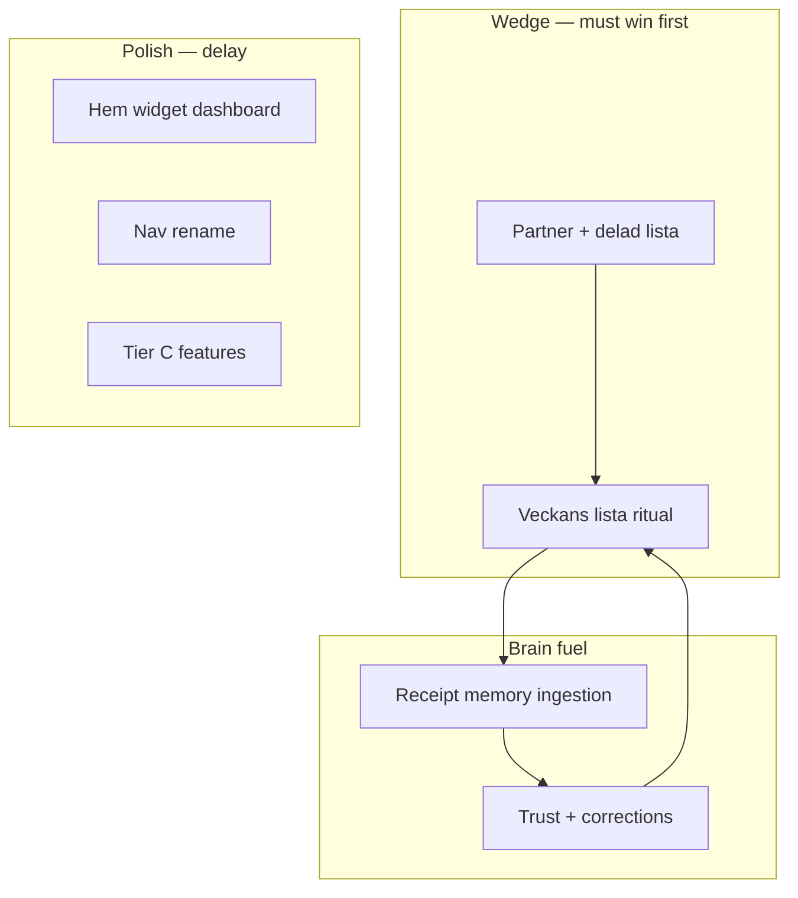
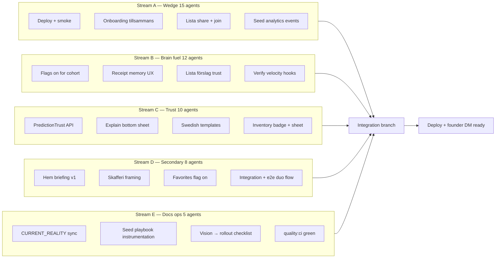

# Highest Leverage Product Ranking

**Lens:** 60-day wedge from [skaffu-core-loop.mdc](../.cursor/rules/skaffu-core-loop.mdc) and [FOUNDER_SEED_PLAYBOOK.md](./FOUNDER_SEED_PLAYBOOK.md) — *10 hushåll × 2 medlemmar × 1 gemensam handling/vecka på delad inköpslista.*

**Scoring (qualitative):** Each factor H / M / L. Combined rank = product of leverage tiers, not arithmetic.

**Reality gap:** Prod still [/hem + share off](./CURRENT_REALITY.md); master has inkop-first + share on but undeployed. Brain code ships with **all learning flags off**. Landing already reframed ([SKAFFU_2026_VISION.md](./SKAFFU_2026_VISION.md) aligned).

---

## Highest Leverage Change Right Now

**Ship the duo weekly loop end-to-end in production** — not a single UI widget.

Concrete bundle (one product motion):

1. **Deploy master** (`inkop-first`, [PUBLIC_SHOPPING_LIST_SHARE_ENABLED](../src/lib/server/shopping-list-share-flag.ts) on) so prod matches landing promise and [APP_HOME_PATH](../src/lib/navigation/app-home.ts).
2. **Onboarding beat 1 = Tillsammans** — partner invite or lista-länk before “empty list” feels normal ([OnboardingGuide.svelte](../src/lib/components/organisms/OnboardingGuide.svelte), [InkopHouseholdInviteBanner](../src/lib/components/organisms/InkopHouseholdInviteBanner.svelte), [PostOnboardingSharePrompt](../src/lib/components/organisms/PostOnboardingSharePrompt.svelte)).
3. **Lista as operating surface** — dela länk, partner presence, who checked what on [ShoppingListPanel](../src/lib/components/organisms/ShoppingListPanel.svelte); `/lista/[token]` → household join CTA.

**Why this wins the formula:**

| Factor | Score | Reason |
|--------|-------|--------|
| User Value | **H** | Solves “handla ihop” — the job partners actually hire a list for |
| Strategic Alignment | **H** | Directly tests the only hypothesis that matters for seed-10 |
| Learning Potential | **M** | Duo generates shared checkoffs, replenishment cadence, receipt evidence — Brain’s best signals come *after* the loop starts |

Everything else (Brain, trust UI, hem briefing) **amplifies** a loop that does not yet run in prod. Without duo+lista, Brain learns solo pantry habits — wrong category story.

---

## Top 10 Changes

Ranked by leverage (User Value × Strategic Alignment × Learning Potential). Implementation effort ignored.

| Rank | Change | UV | SA | LP | Why |
|------|--------|----|----|-----|-----|
| **1** | **Duo loop: share + invite + lista presence (prod)** | H | H | M | Founder seed definition: 3 list items + share *or* partner ([FOUNDER_SEED_PLAYBOOK](./FOUNDER_SEED_PLAYBOOK.md)) |
| **2** | **Onboarding → Tillsammans + veckans lista (not scan-first)** | H | H | M | Routes cold users into wedge; cold-start Brain copy (“vi föreslår när vi sett mönster”) |
| **3** | **Receipt review as memory ingestion + post-import lista** | H | H | **H** | Highest-quality evidence; [inkop?from=receipt](../src/routes/inkop/+page.svelte) session already exists — reframe + enable estimates |
| **4** | **Lista “Skaffu föreslår” with evidence explanations** | H | H | H | [ReplenishmentSection](../src/lib/components/organisms/ReplenishmentSection.svelte) + `reasonCode` → *Från dina kvitton*; accept/dismiss → `learning_feedback` |
| **5** | **Turn on Brain flags for seed cohort** | M | H | **H** | `SHELF_LIFE_LEARNING_ENABLED`, `PUBLIC_SHELF_LIFE_ESTIMATES_IN_RECEIPT`, `LOCATION_LEARNING_ENABLED`, `REPLENISHMENT_LEARNING_ENABLED` — otherwise shipped code is theater |
| **6** | **Trust explain sheet on receipt + inventory** | M | H | **H** | [TRUST_LAYER.md](./TRUST_LAYER.md) gap: badge-only → primary+facts; corrections drive rules |
| **7** | **Estimated expiry as eat-first input** | H | M | H | Connects Brain to waste outcome; inventory + hem eat-first ranked by rules/velocity |
| **8** | **Landing → register → inkop continuity** | M | H | L | Largely done; incremental lift is monitoring 5-second test |
| **9** | **Hem as weekly briefing (not widget dashboard)** | M | M | M | [HomeDashboard](../src/lib/components/organisms/HomeDashboard.svelte) → veckans fokus + ät-först; secondary tab, not wedge |
| **10** | **Inventory as “skafferi speglar” + stale nudge** | M | M | M | Mirror framing + checkoff-bridge education; velocity hooks already in codebase |

**Honorable mentions (below top 10):**

- Settings Förslag + per-rule reset (trust governance) — M/M/M — needed for Brain trust, not wedge unlock
- Server-sync favorites ([0049](../drizzle/0049_household_favorite_product.sql)) — M/M/L — speeds add, weak learning
- Nav rename Lista/Skafferi/Lägg till — L/M/L — polish
- `PredictionTrust` API envelope — M/H/H — enabler for #6, not user-visible alone

---

## What We Should Build Today

**One shippable slice:** **“Veckans lista tillsammans”** — the minimum complete duo activation path.

| Include today | Outcome |
|---------------|---------|
| Prod deploy of inkop-first + share flag | Landing promise = app reality |
| Onboarding step 1: invite partner / dela länk / “handlar själv” | Activation metric shifts to shared action |
| Inkop: invite banner + share prompt + member count surfaced | Visible duo affordance |
| `/lista/[token]` join-household CTA | Guest → member → shared Brain scope |
| Product event: `partner_joined` / `list_link_shared` / `shared_checkoff` | Measure wedge, not vanity signups |
| Post-deploy smoke per [PROD_SMOKE.md](./PROD_SMOKE.md) | G0 gate |

**Do not bundle today:** hem refactor, explain sheet, full `PredictionTrust` API, nav renames, new predictors — they dilute the single measurable outcome: *did a second person touch the same lista this week?*

**Success by end of day:** A founder can DM the playbook link; two people complete one shared shopping session on prod without explaining the product.

---

## What We Should Delay Despite Being Easy

Easy ≠ leverage. Delay these even if “almost free”:

| Delay | Why easy | Why low leverage now |
|-------|----------|----------------------|
| **Hem dashboard widgets** (savings, engagement, duplicates hero) | Components exist | Tier C noise; hem is not home in 2026 vision |
| **Nav label rename** (Lägg till, Skafferi) | i18n only | No behavior change; no wedge signal |
| **Statistik / Wrapped teasers** | Routes exist | Tier C frozen |
| **LLM shelf-life tier** | Stub in chain | Wrong trust story; heuristic+household sufficient for seed |
| **Bulk “glöm alla för mjölk” reset** | Settings extension | Zero users with rules until cohort runs |
| **`learning_feedback` history UI** | Read-only list | Power-user; audit already in DB |
| **Kivra forward onboarding** | Flag-gated | No Kivra users in seed-10 |
| **Grannskafferiet / city feed** | Flag off | Tier C; wrong category |
| **Pro / Stripe / AI marketing bullets** | Copy only | Checkout disabled; distracts Brain narrative |
| **Starter pack pantry dump** | [StarterPackFlow](../src/lib/components/organisms/StarterPackFlow.svelte) | Pantry-first anti-pattern vs lista wedge |
| **Catalog / product DB predictor** | New adapter | Cold-start handled by heuristics + receipt |
| **Price memory UI polish** | [PriceMemoryService](../src/lib/application/price-memory.service.ts) | Economic data anxiety; weak loop tie |
| **Meal plan / planer nav promotion** | Route exists | Tier C meal-AI hero |
| **i18n copy nit** (`sourceHousehold` string alignment) | One key | Invisible without explain sheet |
| **Mjölk encoding in integration test** | Test fix | Engineering hygiene, not user value |

**Rule:** If it does not increase *shared lista actions per household per week* or *receipt lines accepted with correction feedback* in the seed cohort — delay it.

---

## If We Had 50 Agents For One Day

Parallel workstreams with **one integration owner** merging to `master` and one deploy-verify run at end.

| Agents | Mission |
|--------|---------|
| **15 — Wedge** | Full duo path: deploy, onboarding rewrite, share/join, invite banners, lista presence, guest CTA, founder events, PROD_SMOKE |
| **12 — Brain fuel** | Enable flags in apphosting + cohort doc; receipt reframe copy; enable estimates in receipt; replenishment `PredictionTrust` chips; post-receipt lista session polish; consumption velocity smoke |
| **10 — Trust** | `PredictionTrust` on parse API + receipt rows; explain sheet component; Swedish `templateId` i18n; inventory row sheet; correction routing audit |
| **8 — Secondary surfaces** | Hem briefing top 3 blocks only; inventory “speglar verkligheten” empty state; favorites sync flag on; duo e2e test; fix integration test encoding |
| **5 — Ops** | `CURRENT_REALITY` refresh; seed playbook metrics; rollout doc; CI; no Tier C scope creep |

**End-of-day definition of done:** 10 founder DMs sent; prod shows inkop-first + share; at least 3 households with 2 members and a shared lista event in analytics; Brain flags on for those households; one receipt import → lista suggestion path demonstrable in demo.
