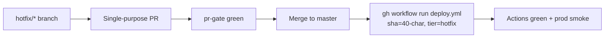

# Hotfix fast path — Skaffu

*Why hotfixes took 2+ hours on 2026-06-17, and how to ship the next one in ~30 minutes.*

**Relaterat:** [RELEASE_MODEL.md](./RELEASE_MODEL.md) · [DEPLOY.md](./DEPLOY.md) · [PROD_SMOKE.md](./PROD_SMOKE.md)

---

## What went wrong (2026-06-17)

| Factor | Impact |
|--------|--------|
| **Parallel agent work** | Multiple agents crashed or retried unrelated feature branches; context lost, duplicate PRs. |
| **Bundled unrelated work** | Hotfix (#105 mobile nav) shipped together with brain feedback, receipt import, price memory, home redesign — not an isolated diff. |
| **Deploy not triggered immediately** | Merge to `master` does not auto-deploy (only guide-only pushes do). Someone had to manually run `deploy.yml`. |
| **Short SHA deploy input** | Workflow rejected or mis-resolved abbreviated SHAs; wasted a cycle. |
| **Migration merge complexity** | Comment-only migration `0050_brain_feedback_v1.sql` contained `;` inside a SQL comment; PGlite splitter executed the tail as SQL → E2E webServer timeout. |
| **Retry-all pattern** | Agents re-ran full feature batches instead of one fix → merge → deploy loop. |

**Net:** ~2+ hours from "fix mobile nav" to verified prod, mostly coordination and pipeline friction — not the size of the code change.

---

## Recommended process (human + coordinator)



1. **Branch:** `hotfix/<short-description>` — one bug, one PR. No feature bundling.
2. **Scope:** Tier A paths only; skip Tier C and drive-by refactors.
3. **Local:** `npm run quick:dev` before push.
4. **Merge:** When `pr-gate / pr-gate` is green on the PR.
5. **Deploy immediately:** Copy full 40-char merge SHA from GitHub (not `git rev-parse --short`).

```bash
SHA=$(git fetch origin master && git rev-parse origin/master)
gh workflow run deploy.yml --ref master \
  -f sha="$SHA" \
  -f deploy_tier=hotfix \
  -f hotfix_reason="mobile nav hidden on desktop"
```

6. **Verify:** Watch the Deploy workflow to `verify release completed` = success. Coordinator runs [PROD_SMOKE.md](./PROD_SMOKE.md) — hard refresh prod (`Ctrl+Shift+R`).

**Target wall clock:** merge → prod smoke in **~25–40 min** (hotfix tier = critical E2E + deploy + smoke).

---

## Checklist (copy for incidents)

- [ ] Hotfix PR is **single-purpose** (no bundled features)
- [ ] `pr-gate / pr-gate` green on PR SHA
- [ ] Merged to `master`; note **full 40-char merge SHA**
- [ ] `gh workflow run deploy.yml` with `-f sha=<40-char>` and `-f deploy_tier=hotfix`
- [ ] Deploy run: gate → E2E critical → deploy → verify release → **all success**
- [ ] Prod smoke: `/`, `/inkop`, guide page — no 500 / `Internal Error`
- [ ] Update [CURRENT_REALITY.md](./CURRENT_REALITY.md) prod SHA

---

## Optional automation (backlog)

| Idea | Benefit |
|------|---------|
| **Post-merge deploy on `hotfix/*` label** | Removes "forgot to trigger deploy" step |
| **`hotfix/*` branch → `deploy_tier=hotfix` default** | Fast tier without manual input |
| **Cross-link in RELEASE_MODEL.md** | Single place for tier semantics + this runbook |
| **Migration lint:** no `;` in comment-only `.sql` files | Prevents PGlite split failures (see `init.ts` `split(';')`) |

---

## What agents / AI must NOT do during hotfix

- **Do not** spawn parallel feature builds (price memory, home redesign, onboarding) on the same timeline.
- **Do not** "retry all work" or reopen closed PR batches — fix forward on one branch.
- **Do not** bundle migrations + UI redesign + new APIs in the hotfix PR.
- **Do not** use short SHAs for `deploy.yml` inputs.
- **Do not** claim "deployed" until Deploy workflow + prod smoke are green ([delivery-done rule](../.cursor/rules/delivery-done.mdc)).
- **Do not** ask the user to restart dev server or manually verify prod.

---

## Release model cross-reference

Normal releases use `deploy_tier=auto` or `full`. Hotfixes use **`hotfix`** tier (critical E2E, not zero E2E). See [RELEASE_MODEL.md](./RELEASE_MODEL.md) § Deploy tiers.

For non-urgent bugfixes on low-risk paths, `deploy_tier=fast` is acceptable after merge — still requires immediate manual `gh workflow run` with full SHA.
