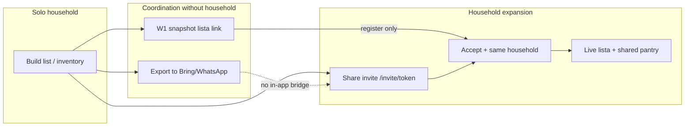

# Hushållsexpansion — strategi och implementationsplan

*Version: juni 2026. Strategisk analys av hur solo-användare blir flermedlems-hushåll — dokument först, V1-kod i separata tasks.*

**Relaterade dokument:** [`GROWTH_STRATEGY.md`](./GROWTH_STRATEGY.md) · [`ACQUISITION_WEDGES.md`](./ACQUISITION_WEDGES.md) (W1, W4, W5) · [`PRODUCT_LED_GROWTH_ANALYSIS.md`](./PRODUCT_LED_GROWTH_ANALYSIS.md) (O1, O2, O4, W5) · [`NEXT_STAGE_STRATEGY.md`](./NEXT_STAGE_STRATEGY.md) · [`BREAKTHROUGH_GROWTH_OPPORTUNITIES.md`](./BREAKTHROUGH_GROWTH_OPPORTUNITIES.md) · [`PMF_METRICS_LOG.md`](./PMF_METRICS_LOG.md)

**Avgränsning:** Detta initiativ fokuserar på **intra-hushållsexpansion** (solo → partner/familj i samma hushåll). Uteslutet: nya acquisition-wedges utöver W1/W4-bryggor (W2 city feed, `/dela` stranger-loop), prisminne/kvitto-compound, produktionsdeploy eller flag-enablement (se beslutskalender i [`NEXT_STAGE_STRATEGY.md`](./NEXT_STAGE_STRATEGY.md)).

**Datagap (ärligt):** [`PMF_METRICS_LOG.md`](./PMF_METRICS_LOG.md) är i stort sett tom. `inviteRate` och `multiMemberHouseholdRate` har mål i kod men ingen bevisad baseline. **Invite skapad ≠ aktiv andra medlem** — mät båda separat.

---

## 1. Executive summary

### Diagnos

Hushållssync är en av de starkaste retention-looparna när den fungerar ([`NEXT_STAGE_STRATEGY.md`](./NEXT_STAGE_STRATEGY.md) §3, loop 4). Idag sker invite nästan uteslutande via Inställningar (`/settings#household`) eller via en global modal som triggas av **lagerdjup** (≥5 varor) eller **tid sedan registrering** (≥3 dagar) — inte av handelskoordinering.

Samtidigt löser användare listkoordinering **utan** hushåll: export till Bring/WhatsApp (`shopping_list_export`), W1 snapshot-länk (`/lista/[token]`), eller externa listappar. Dessa vägar skapar värde för mottagaren men bryggar sällan till gemensamt hushåll i Skaffu.

W4 (kontextuell invite från `/inkop`) och W1 (publik lista-länk) är shipped bakom feature flags. Kvarvarande inkonsistenser: W1 snapshot vs live sync; lista-CTA registrerar ny solo snarare än hushållsjoin (§2). Share-invite skapar **editor** ([`share-invite/+server.ts`](../src/routes/api/household/share-invite/+server.ts) rad 22).

### North-star metrics

| Mått | Kodmål (`src/lib/domain/pmf.ts`) | Varför det spelar roll |
|------|----------------------------------|------------------------|
| `multiMemberHouseholdRate` | ≥ 50 % | Andel aktiva hushåll med ≥2 medlemmar — retention och nätverkseffekt |
| `inviteRate` | ≥ 30 % | Andel nya hushåll med ≥2 medlemmar inom fönster — expansion i signup-kohort |
| `household_invite_created` (per `context`) | Baseline per kanal | Jämför Inställningar vs inkop vs lista vs export_prompt |
| W4 dismiss-rate | < 80 % | Kill-kriterium i [`ACQUISITION_WEDGES.md`](./ACQUISITION_WEDGES.md) |
| W1 view → signup | > 5 % | Acquisition; falsk expansion om ingen andra medlem aktiveras |

### Strategisk slutsats

Hushåll ska kännas som **naturlig fortsättning på att dela listan** — inte som separat admin-uppgift. V1 fokuserar på små, högsäkerhetsfixar som stänger friktion mellan W1, W4, export och roller. V2/V3 fördjupar ägarskap och delegated shopping (W5).

---

## 2. Nuvarande flöden

### Invite-vägar (shipped)

| Väg | Ingång | Mekanism | Roll-default | Kod / route |
|-----|--------|----------|--------------|-------------|
| Inställningar `#household` | Djup i Inställningar | E-postinvite + share-link-formulär | Användaren väljer editor/viewer | [`HouseholdSettingsPanel.svelte`](../src/lib/components/organisms/HouseholdSettingsPanel.svelte), [`household.actions.ts`](../src/routes/settings/household.actions.ts) |
| Global modal | `/hem`, `/inkop`, inventory, `/planer` | Modal → deep link till Inställningar | N/A (navigation) | [`HouseholdInvitePrompt.svelte`](../src/lib/components/organisms/HouseholdInvitePrompt.svelte), [`household-invite-prompt.ts`](../src/lib/utils/household-invite-prompt.ts) — gated: solo + (peak inventory ≥5 **eller** days since signup ≥3) |
| W4 Inköp-banner | `/inkop` | `POST /api/household/share-invite` + `navigator.share` | **editor** (hårdkodad) | [`InkopHouseholdInviteBanner.svelte`](../src/lib/components/organisms/InkopHouseholdInviteBanner.svelte), [`share-invite/+server.ts`](../src/routes/api/household/share-invite/+server.ts) |
| Accept | `/invite/[token]` | Login om behövs → accept | Från invite | Share invites: `SHARE_INVITE_EMAIL = '*'` i [`household.ts`](../src/lib/domain/household.ts) |

**Kvarvarande inkonsistens:** W1 `/lista/[token]` är read-only snapshot; copy som antyder live sync gäller W4/editor-invite, inte publik lista.

### Flag-status (jun 2026)

| Mekanism | Flag / gate | Prod-status |
|----------|-------------|-------------|
| W1 publik lista | `PUBLIC_SHOPPING_LIST_SHARE_ENABLED` ([`shopping-list-share-flag.ts`](../src/lib/server/shopping-list-share-flag.ts)) | Av tills deliberate enable |
| W4 inköpsbanner | `shouldShowInkopHouseholdInvitePrompt` i [`household-invite-prompt.ts`](../src/lib/utils/household-invite-prompt.ts) | Shipped; mätning via `household_invite_prompt_*` |

---

## 3. Shopping / pantry / partner / familj

### Shoppinglista

| Yta | Beteende | Expansion-implication |
|-----|----------|----------------------|
| In-app `/inkop` | Live delad state för medlemmar med edit-rätt | Kärnvärde vid ≥2 editor/owner |
| Export (clipboard/text) | `shopping_list_export` + `recordShoppingListExport()` | Partner ser Bring/WhatsApp — **ingen** in-app household-brygga |
| W1 `/lista/[token]` | Snapshot med expiry; visar `snapshotAt` | Stranger/partner ser lista men **inte** live sync; CTA → `buildAcquisitionRegisterUrl('shopping_share')` i [`lista/[token]/+page.svelte`](../src/routes/lista/[token]/+page.svelte) — registrering som **ny solo**, inte “gå med i hushåll” |

### Pantry-samarbete

- Roller: owner / editor / viewer — inventory edit vs consume i [`household.ts`](../src/lib/domain/household.ts): `canEditInventory` (owner+editor), `canConsumeInventory` (alla).
- `/dela/[token]` (utgående inventory-snapshot): grann/nachbar-loop — acquisition wedge W3, **inte** hushållsexpansion. Separat loop; referera [`GRANNSKAFFERIET_V0.md`](./GRANNSKAFFERIET_V0.md).
- Multi-household switcher finns; solo default vid signup.

### Partner vs familj

Copy blandar “partner”, “familj”, “sambo” ([`householdInvite`](../src/lib/i18n/locales/sv.json), onboarding `shareBody` pekar fortfarande Inställningar). Inga differentierade flöden eller roller per hushållstyp.

Måltidsplan har `householdSizeLabel` på `/planer` men **ingen** invite-hook vid plan→lista-konvertering (O4-gap i [`PRODUCT_LED_GROWTH_ANALYSIS.md`](./PRODUCT_LED_GROWTH_ANALYSIS.md)).

---

## 4. Friktionskatalog (rankad efter allvar)

| # | Friktion | Allvar | Evidens |
|---|----------|--------|---------|
| 1 | **Fel ögonblick** — primär invite-UI i Inställningar; global modal kopplad till lagerdjup/tid, inte handelskontext | Hög | [`household-invite-prompt.ts`](../src/lib/utils/household-invite-prompt.ts) `shouldShowHouseholdInvitePrompt` |
| 2 | **Snapshot vs live copy** — W1 read-only medan vissa ytor antyder live sync | Medel | [`lista/[token]/+page.svelte`](../src/routes/lista/[token]/+page.svelte); W4 share-invite editor shipped |
| 3 | **Snapshot vs live** — W1 löser stranger-handoff men konverterar inte till hushåll | Hög | [`lista/[token]/+page.svelte`](../src/routes/lista/[token]/+page.svelte) |
| 4 | **Export utan upgrade-path** — `recordShoppingListExport` finns men **inte** trigger i global prompt (O4) | Medel | `hasShoppingListExported` används i inkop-engagement, ej i `shouldShowHouseholdInvitePrompt` |
| 5 | **Lista-CTA = acquisition, inte join** — publik sida registrerar ny solo | Medel | `buildAcquisitionRegisterUrl('shopping_share')` |
| 6 | **Fel ord** — “Hushåll” / admin vs “dela listan” / “handla ihop” | Medel | Inställningar-framing vs handelskontext |
| 7 | **Accept-friktion** — login-vägg på `/invite/[token]`; ingen household-intent i onboarding | Medel | Invite-accept flow |
| 8 | **Ingen “ni är synkade”-stund** — post-invite activation-nudge saknas | Låg | — |
| 9 | **Flag-gated growth** — W1/W4 av i prod tills enable | Operativ | [`NEXT_STAGE_STRATEGY.md`](./NEXT_STAGE_STRATEGY.md) beslutskalender |

---

## 5. Kontextuella invite-möjligheter (matris)

| Moment | Copy (förslag) | Mekanism | Status |
|--------|----------------|----------|--------|
| Första listdelning (W1) | “Vill du att listan uppdateras live? Bjud in [partner].” | Post-share CTA → `share-invite`, `context=lista` | **V1 build** |
| Inköp med bockade rader (W4) | “Handla ihop? Samma lista, uppdateras när ni handlar.” | Banner → share-invite, `context=inkop`, **editor** | Shipped; roll-fix V1 |
| Export till Bring/WhatsApp | “Slipp klistra in — bjud in partner till Skaffu.” | Global prompt + export trigger, `context=export_prompt` | **V1 build** (O4) |
| Peak inventory / dag 3 | “Dela skafferiet med någon hemma.” | Global modal → Inställningar | Shipped |
| Inställningar `#household` | Full admin (e-post, roller) | Email + share-link | Shipped; `context=settings` saknas i analytics |
| Plan→lista | “Familjen ska se veckans inköp?” | Efter första konvertering | **V2** |
| Post-kvitto autopilot | “Nu syns det för hela hushållet.” | Efter receipt-rader till pantry | **V2** |

---

## 6. Delat ägarskap — möjligheter

| Område | Idag | Möjlighet |
|--------|------|------------|
| Inköpslista | Editor/owner kan ändra och bocka; viewer read-only på praktiken | W5: viewer kan bocka lista **eller** ny `canEditShoppingList`-permission |
| Lager | Editor+ ändrar; viewer konsumerar | Redan tydligt; copy kan förklara skillnad |
| Kvitto/receipt | Per användare import → hushållsscoped pantry | Post-accept “synkat lager”-moment (V2) |
| Plan | Veckoplan intern | Invite efter plan→lista (V2, O4) |
| Wrapped / hem | Solo-fokus | Household-kort med share-CTA för solo ≥2 veckors aktivitet (V2) |

---

## 7. V1 / V2 / V3

### V1 — Koordinering → hushåll ska kännas naturligt (liten scope, hög confidence)

**Tema:** Brygga moment användare redan använder (lista-delning, inköp, export) till **ett tryck household-invite** med **shopping-first copy** och **editor-roll** för shopping-invites.

| Item | Vad |
|------|-----|
| ~~Fixa roll-default~~ (shipped) | `share-invite` API skapar `editor` ([`share-invite/+server.ts`](../src/routes/api/household/share-invite/+server.ts) rad 22) |
| Post-lista-share CTA | Efter lyckad W1-delning i [`ShoppingListPanel.svelte`](../src/lib/components/organisms/ShoppingListPanel.svelte): “Synka live med partner” → samma share-invite-flöde, `context=lista` |
| Export-trigger | Lägg `hasShoppingListExported` i `shouldShowHouseholdInvitePrompt` (O4 delvis) |
| Copy-alignment | Ta bort “realtid” där snapshot/viewer gäller; enhetligt: “samma lista, uppdateras när ni handlar” |
| Analytics | `household_invite_created.metadata.context`: `settings` \| `inkop` \| `lista` \| `export_prompt` |
| Mät | `inviteRate` och `multiMemberHouseholdRate` vs Inställningar-baseline; W4 dismiss-rate |

**Natural-feel-princip V1:** Invite är **fortsättning på att dela listan**, inte separat “hushållsadmin”. Användaren tryckte redan “Dela länk”; nästa rad: “Vill du att listan uppdateras live? Bjud in [partner].”

### V2 — Fördjupa delat ägarskap (medel effort)

| Item | Vad |
|------|-----|
| Onboarding-fork | Tidigt valfritt: “Handlar du med någon?” → uppskjuten invite vid första listanvändning |
| Plan→lista-hook | Efter första plan→shopping-konvertering, kontextuell invite (O4) |
| Invite-landing | `/invite/[token]` + register-URL bär household-intent; post-accept landar på `/inkop` inte `/hem` |
| Lista upgrade-path | Publik lista CTA sekundär: “Gå med i [hushållsnamn]” när token mappar till öppen share-invite (produkt/juridik-review) |
| Wrapped / hem | Household-kort med share-CTA för solo med ≥2 veckors aktivitet |
| Kvitto-autopilot | Post-accept household-prompt när kvittorader flödar till pantry |

### V3 — Hushåll som operativsystem (W5 + presence)

| Item | Vad |
|------|-----|
| Delegated shopping | Viewer kan bocka lista **eller** `canEditShoppingList` — se W5 i [`ACQUISITION_WEDGES.md`](./ACQUISITION_WEDGES.md) |
| Push vid liständring | Notifierar icke-handlande medlem |
| Presence | “X handlar nu” / senaste bockning attribution |
| Familjelägen | Differentierad copy/defaults (tonåring viewer vs partner editor) — endast om data stödjer |

---

## 8. Naturlig hushållsmedlem — designprinciper

**Central fråga:** Hur gör vi att lägga till hushållsmedlem känns naturligt?

### Tre regler

1. **Trigga på koordineringsintent** — lista-delning, export, första bockning, plan→lista — inte navigering till Inställningar.
2. **Språk för uppgiften** — “Dela listan med [partner]” inte “Skapa hushållsmedlem”; hushåll är backend för delad shopping.
3. **Progressiv commitment** — snapshot-länk (W1) → invite-länk (samma share-UX) → accept → live lista; varje steg återanvänder samma mentala modell.

### Anti-mönster

- Admin-framing (“hantera medlemmar”) i handelsögonblick
- “Live”/“realtid” när snapshot eller viewer-roll gäller
- Acquisition-CTA (“skapa konto”) när användaren egentligen vill **gå med** i befintligt hushåll

---

## 9. Mätplan

### Events (shipped)

| Event | Var | Metadata |
|-------|-----|----------|
| `household_invite_prompt_shown` | Global modal, inkop-banner | `context` (inkop när W4) |
| `household_invite_prompt_clicked` | Dito | Dito |
| `household_invite_prompt_dismissed` | Dito | Dito |
| `household_invite_created` | share-invite API, settings actions | `context`: inkop idag; utöka till settings/lista/export_prompt |
| `shopping_list_export` | Export-flöde | — |
| `shopping_list_share_viewed` | W1 publik lista | Wedge KPI |

### PMF-dashboard

Mål definierade i [`pmf.ts`](../src/lib/domain/pmf.ts): `multiMemberHouseholdRate` 0.5, `inviteRate` 0.3. Veckovis loggning i [`PMF_METRICS_LOG.md`](./PMF_METRICS_LOG.md).

### Wedge-beroenden

| Wedge | Household-signal | Tolkning |
|-------|------------------|----------|
| W1 scale | view→signup **och** andra medlem aktiv inom 14d | Annars falsk expansion |
| W4 scale | `inviteRate` delta vs Inställningar-baseline | Kill om dismiss >80 % eller rate oförändrad |
| W4 + V1 | `household_invite_created` per context | Identifiera bästa trigger-moment |

---

## 10. Risker

| Risk | Allvar | Mitigation |
|------|--------|------------|
| Vilseledande “live”-copy | Hög | Copy-pass V1; editor-default för shopping-invites |
| Lista→solo-registrering utan join | Medel | V2 join-CTA; tydlig messaging på `/lista` |
| Viewer permission debt | Medel | V1 editor-fix; V3/W5 delegated shopping |
| Invite skapad, ingen accept | Medel | Mät accept-rate; post-invite nudge (V2) |
| Flag enable utan baseline | Operativ | Fyll [`PMF_METRICS_LOG.md`](./PMF_METRICS_LOG.md) före wedge-verdict |
| Överbygg före W1–W4-data | Strategisk | V1 endast högsäkerhet; V2/V3 efter verdict ([`NEXT_STAGE_STRATEGY.md`](./NEXT_STAGE_STRATEGY.md)) |

---

## 11. Implementation tasks (hög confidence)

Dessa är **inte** blockerade på wedge-verdict; de fixar inkonsistenser och stänger O1/O4-gap:

| Task | Filer | Confidence |
|------|-------|------------|
| ~~Default inkop share-invite roll `editor`~~ (shipped) | [`share-invite/+server.ts`](../src/routes/api/household/share-invite/+server.ts) | — |
| Lägg `shopping_list_export` i global prompt-triggers | [`household-invite-prompt.ts`](../src/lib/utils/household-invite-prompt.ts), tester | H |
| Post-W1-share household CTA + `context=lista` event | [`ShoppingListPanel.svelte`](../src/lib/components/organisms/ShoppingListPanel.svelte), i18n, återanvänd share-invite API | H |
| Copy-pass: inkop-banner + lista + invite align med permissions | `sv.json` / `en.json` | H |
| `household_invite_created` context för settings-väg | [`household.actions.ts`](../src/routes/settings/household.actions.ts) | H |

**Defer V2 / medium confidence** (nämn, inget ticket): lista→join-household CTA, onboarding-fork, viewer shopping permission split.

---

## 12. Relaterade dokument

| Dokument | Koppling |
|----------|----------|
| [`GROWTH_STRATEGY.md`](./GROWTH_STRATEGY.md) | Acquisition > activation; hushåll i retention-kolumn |
| [`ACQUISITION_WEDGES.md`](./ACQUISITION_WEDGES.md) | W1 lista, W4 inkop-invite, W5 delegated shopping |
| [`PRODUCT_LED_GROWTH_ANALYSIS.md`](./PRODUCT_LED_GROWTH_ANALYSIS.md) | O1 kontextuell invite, O2 publik lista, O4 utökade triggers |
| [`NEXT_STAGE_STRATEGY.md`](./NEXT_STAGE_STRATEGY.md) | Hushållsgraf 10x, W4 verdict, beslutskalender |
| [`BREAKTHROUGH_GROWTH_OPPORTUNITIES.md`](./BREAKTHROUGH_GROWTH_OPPORTUNITIES.md) | Compound moat efter activation |
| [`GRANNSKAFFERIET_V0.md`](./GRANNSKAFFERIET_V0.md) | `/dela` — separat stranger-loop |
| [`PMF_METRICS_LOG.md`](./PMF_METRICS_LOG.md) | Veckobaseline för invite/multi-member |

---

*Genererat 2026-06-11. Revidera efter W1–W4 verdict och ifylld PMF-baseline vecka 4.*
