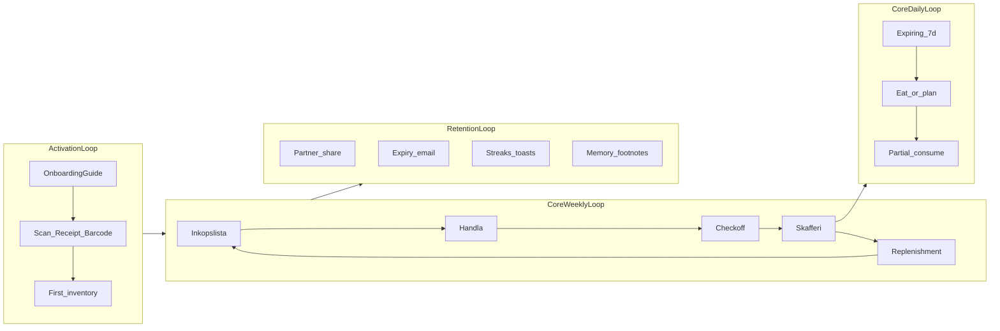

# Household Loop Audit — Skaffu

**Prod-baseline:** `73d3dfd0` — deploy bundle 2 brain visibility live ([CURRENT_REALITY.md](./CURRENT_REALITY.md)). **Master ahead:** UX Slice 1 (`feat/ux-inventory-list-v1`, PLANNED).

**Hypotes i kod:** [skaffu-core-loop.mdc](../.cursor/rules/skaffu-core-loop.mdc) — 2 medlemmar × **1 gemensam handling/vecka** på delad lista.

---

## Vad Skaffu faktiskt bygger (en mening)

En **hushållsritual kring veckans inköp**: lista tillsammans → handla → stäng loopen (checkoff → skafferi) → låt systemet föreslå vad som saknas nästa vecka. Brain är **minnet bakom ritualen** (kvitton → cadence → utgångsdatum), inte en separat "AI-app".

Daglig vana är **svagare**: "äta innan det blir dåligt" finns men lever i inventory/planer, inte som en tydlig daglig hook på `/hem`.

---

## Loop-definitioner

| Loop | Definition | Primär yta | Kadens |
|------|------------|------------|--------|
| **Activation Loop** | Första gången lagret har varor + onboarding dismissed | `/hem?welcome=1`, `/scan`, `/inkop` | En gång |
| **Core Weekly Loop** | Delad lista → handla → checkoff → skafferi → förslag | `/inkop` (execution), `/hem` §1–2 (briefing) | ~1×/vecka |
| **Core Daily Loop** | Se vad går ut → äta/planera → logga förbrukning | `/hem` §3, `/inventory`, `/planer` | 2–4×/vecka (intent, ej stark habit idag) |
| **Household Loop** | Två personer samma lista + samma skafferi | `/inkop`, `/lista/[token]`, settings household | Veckovis + sporadisk sync |
| **Retention Loop** | Kom tillbaka utan ny shopping | Eat-first, waste, replenishment, email, gamification | Veckovis + email 7d cap |

---

## Tidslinje: mål, friction, Brain, retention

### Första dagen

| Steg | Användarens mål | Friction | Brain-value | Retention-värde |
|------|-----------------|---------|-------------|-----------------|
| Register + verify | Kom in | Turnstile, email verify (password) | Ingen | Låg — ännu ingen vana |
| OnboardingGuide | Välj sätt att fylla lagret | Fullscreen sheet; skip = ingen activation | Copy lovar "lär oss" (receipt) | Path sparas lokalt |
| **Receipt path** (bäst) | 1 kvitto → lagret | Parse/review steg; Brain UI om flag on | **Hög** — shelf-life, location, replenishment data seed | Instant activation; celebration |
| **Barcode path** | 3 scans | Högre effort än kvitto | Låg per scan | Progress synlig på hem |
| **Photo path** (primär CTA) | 1 foto sparat | **Gap:** `/scan` photo inte räknar activation ([`onboarding.ts`](../src/lib/utils/onboarding.ts) vs [`OnboardingScanModal`](../src/lib/components/organisms/OnboardingScanModal.svelte) unused) | Brain minimal | **Risk:** guide fastnar |
| **Shopping path** | 3 rader på lista | Inköp utan skafferi känns "tomt" | Ingen tills kvitto | Delad lista tidigt |
| Hem tom | Förstå vad appen gör | 3 sektioner tomma; Brain tom | Ingen data än | Scan CTA |

**Dag-1 Brain:** Receipt review = starkast moment; onboarding embedded receipt Brain wiring shipped via #70 (#64 closed superseded). Memory Explorer ej i flödet.

---

### Första veckan

| Steg | Mål | Friction | Brain-value | Retention |
|------|-----|----------|-------------|-----------|
| Veckans lista byggas | Handla tillsammans | Lista på `/inkop`, hem pekar dit | Replenishment tom utan kvittohistorik | Badge count på hem |
| Handla + checkoff | Stäng shopping | Default `ask` på checkoff→pantry ([`shopping-to-pantry.ts`](../src/lib/domain/shopping-to-pantry.ts)) — modal per rad | Location från historik; **ingen expiry** på bridge-create | **Loop-breaker** om modal tröttar |
| Efter kvitto | Förstå vad hände | Summary synlig (#67 live @ `73d3dfd0`) | Summary + memory footnote | "Skaffu gjorde något" |
| Eat-first syns | Undvik waste | Chips → edit, inte consume på hem | Ranking via `expires_on` learning | 7-dagars urgency |
| Post-onboarding modals | Dela lista, feedback | Modal stack (survey, share, hints) | Ingen | Partner = retention multiplier |

**Vecka-1 vana som faktiskt kan sticka:** *"Vi använder inköpslistan när vi handlar."*

---

### Vecka 2–4

| Steg | Mål | Friction | Brain-value | Retention |
|------|-----|----------|-------------|-----------|
| Replenishment på hem | Slipp tänka på återköp | Max 3 rader; tom copy om kall start | **Cadence från kvitton**; chips "var N:e dag" | Veckovis "aha" om träff |
| Andra kvitto | Förbättra minne | Review igen | Rules ≥2 samples → household_learned | Memory Explorer fotnot 30 min |
| Inventory hygiene | Rätt datum/plats | Mobil saknar Uppskattat-badge (#63 = desktop fallback only; Slice 1 PLANNED) | Data finns men **hidden** på mobile | Misstro om datum "fel" |
| Partner invite | Två använder samma loop | Ej på hem (design); inkop banner | Delad replenishment signal | **2× loop frequency** |
| Planer | Veckomeny | Flyttat från hem | Meal AI separat | Veckoplan som adjunct |

**Vecka 2–4 Brain-narrativ:** *"Skaffu vet vad vi brukar köpa och när mat går ut."* — endast om kvitto + expiry syns.

---

### Etablerad användare

| Steg | Mål | Friction | Brain-value | Retention |
|------|-----|----------|-------------|-----------|
| **Core Weekly Loop** (ritual) | En handlingspass/vecka | Execution på `/inkop`, hem = briefing | Replenishment + dedupe + price memory | **Primär retention** |
| **Core Daily Loop** (marginal) | Ät först, sync stale | Consume bara i inventory; hem read-heavy | Eat-first ranking | Email reminder max 1/7d |
| Memory Explorer | Granska/trust | Tier B settings; inte i huvudloop | **Full explainability** | Power users / trust |
| Settings learning | Reset rules | Ingen confidence inline | Transparency | Sällan |
| Statistik/gamification | Streak feel-good | Ej på hem V3 | Ingen | Ljus retention |

**Etablerad vana:** *"Innan vi handlar kollar vi listan / hem; efter handeln checkar vi av."* Brain är **bakgrundsmotor**, inte daglig destination.

---

## Places Where Brain Helps

| Yta | Signal | Varför det hjälper |
|-----|--------|-------------------|
| Receipt review | Shelf-life + location | Sätter `expires_on` utan manuellt jobb — driver eat-first |
| Post-import toast (#67) | Summary counts | "Brain hände" — trust moment |
| Home §2 Replenishment | Cadence, recurring | Veckoloopen: *vad ska vi köpa igen?* |
| Inköp replenishment fold | Samma data | Execution-yta |
| Eat-first / hem §3 | Learned expiry | Waste prevention |
| Memory Explorer | Rules + confidence | Trust + correction |
| Item edit feedback | Learning toast | Closes feedback loop |

## Places Where Brain Distracts (eller missar)

| Yta | Problem |
|-----|---------|
| Hem §2 tom copy | "Lägg in varor först" — Brain lovar men syns inte |
| Memory footnote | 30 min session, collapsed link — lätt att missa |
| Max 3 replenishment | Döljer intelligens |
| Mobil inventory | Uppskattat hidden → user ser "fel datum" utan förklaring |
| Location silent pre-fill (#65 fixar) | Ser som app-bugg, inte hjälp |
| Onboarding photo path | Primär CTA utan Brain eller activation |
| Checkoff→pantry | Brain location men ingen expiry — eat-first gap efter shop |
| Consumption velocity | Backend only — ingen "hur fort äter vi" story |
| Intellectual "hushållsminne" tagline | Marketing utan synlig data första veckorna |

---

## Highest Leverage Retention Improvements (ingen ny modell)

Prioritet = **stärka befintlig vana**, inte fler features.

| # | Improvement | Loop | Typ |
|---|-------------|------|-----|
| 1 | **Fix photo activation** på `/scan` (`recordFirstItemActivation`) — [#69](https://github.com/arpi09/grocery-manager/pull/69) pending | Activation | Wiring bug |
| 2 | ~~**Deploy bundle 2**~~ **DONE @ `73d3dfd0`** (#67, #70, #63, #59, #65) — Brain synlig (mobil badge väntar Slice 1) | Weekly + trust | **Shipped** |
| 3 | **Checkoff→pantry** — nudge till `always` eller smidigare default efter N yes | Weekly loop close | UX/policy |
| 4 | **Hem §1 → `/inkop`** redan primär — säkerställ partner invite på inkop (inte hem) | Household | Redan design — verifiera |
| 5 | **Eat-first → consume** one-tap från hem chip (befintlig `consumeItem`) | Daily loop | UX, ej Brain |
| 6 | **Receipt path som default activation** i copy/CTA (kvitto = 1 step + Brain) | Activation | Copy/order |
| 7 | **USER_LOCAL smoke** på prod — validate weekly narrative | Retention truth | PO |
| 8 | **V2.2 cadence one-liner** på hem §3 (efter deploy) — en rad, ej ny modell | Weekly | Planned |

**Inte nu:** consumption UI, meal AI på hem, nya predictors, Memory Explorer som hero.

---

## Sammanfattning: vilken vana byggs?

| | Vana |
|---|------|
| **Primär** | Gemensam **veckohandling** med delad inköpslista som single source of truth |
| **Sekundär** | **Expiry awareness** (äta/planera innan waste) — inventory-led, inte hem-led |
| **Tertiär** | **Kvitto som minnesförstärkare** — gör Brain och replenishment trovärdigt |
| **Ej byggd än** | Daglig "öppna Skaffu varje morgon" — ingen push/hook på hem för daily |

Brain **accelererar** veckoloopen (cadence, expiry, trust) när kvitto + synlighet finns. Brain **distraherar** när det är dolt (mobil badge), intellektuellt (footnotes), eller lovar utan data (tom replenishment vecka 1).

---

## Relaterade artefakter

- Merge train (shipped): #67 → #70 (supersedes #64) → #63/#59 → #65 → deploy bundle 2 @ `73d3dfd0`
- [BRAIN_ROADMAP.md](./BRAIN_ROADMAP.md) (master) — visibility buckets
- [BRAIN_V1_PRODUCT_INTEGRATION.md](./BRAIN_V1_PRODUCT_INTEGRATION.md) — Brain smoke checklist
- [HOME_V3.md](./HOME_V3.md) — 3 frågor på hem
- [CURRENT_REALITY.md](./CURRENT_REALITY.md) — prod SHA, nav, flags

**Nästa coordinator-beslut:** Prioritera **weekly loop close** (checkoff friction + photo activation #69) och **UX Slice 1** (mobil badge) över daily loop expansion.

---

## USER_LOCAL — weekly loop smoke checklist

**Owner:** `USER_LOCAL` — product owner on physical device (Turnstile, mobilkamera, real receipt). Agents link here; they do not substitute for this pass.

**Status:** Pending — PO gate; agents document only, **do not claim smoke run**. Brain-specific steps: [Brain V1 smoke checklist](./BRAIN_V1_PRODUCT_INTEGRATION.md#smoke-checklist-post-deploy) (required before Phase 2 un-flag).

**Target:** https://skaffu.com @ prod SHA **`73d3dfd0`** — deploy run [27501022135](https://github.com/arpi09/grocery-manager/actions/runs/27501022135) ([CURRENT_REALITY.md](./CURRENT_REALITY.md)).

### Setup

- [ ] Physical phone (not desktop-only) — primary weekly loop is mobile shopping
- [ ] Fresh or test household with at least one prior receipt import (for replenishment signal)
- [ ] Confirm prod SHA in browser devtools / deploy run matches `73d3dfd0` ([27501022135](https://github.com/arpi09/grocery-manager/actions/runs/27501022135))

### Receipt path (activation + Brain seed)

- [ ] Scan real receipt → review step shows shelf-life / location hints where flags allow
- [ ] Save → items land in lager; eat-first dates populated without manual entry
- [ ] `/hem` reflects new inventory (not empty §1–3)

### Checkoff loop (weekly close)

- [ ] Add items to `/inkop` (manual or from list)
- [ ] Check off during/after shop → checkoff→pantry bridge fires (`ask` or `always` per settings)
- [ ] Checked items appear in skafferi with sensible location (no silent wrong defaults)

### Replenishment on hem

- [ ] `/hem` §2 (Skaffu rekommenderar) shows up to 3 cadence-based suggestions after receipt history exists
- [ ] Accept or dismiss a suggestion → item moves to `/inkop` or stays dismissed
- [ ] Empty-state copy is acceptable only on cold start (no receipts yet)

### Eat-first

- [ ] `/hem` §3 (Hushållet) lists items expiring within 7 days, ranked by urgency
- [ ] Chip tap opens item (edit/consume path); estimated badge visible when expiry ≠ user-set
- [ ] After checkoff shop, newly bridged items eventually surface in eat-first when dates apply

### Pass criteria

Weekly narrative holds: *"Lista → handla → checkoff → skafferi → hem visar vad som saknas / går ut."* Note friction points (modal fatigue, hidden Brain on mobile, empty replenishment on cold start) for coordinator backlog.
