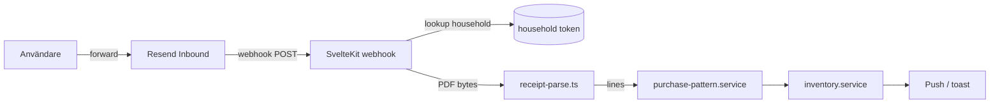

# Kivra forward — teknisk spike

Status: **spike / ej produktion** (jun 2026). Syfte: validera manuell Kivra-forward → kvittoparsning utan full integration.

## Mål

Med samtycke: användaren vidarebefordrar Kivra-kvitto (PDF/e-post) till Skaffu → befintlig kvittomotor fyller lagret utan scan.

## Föreslagen arkitektur

### 1. Inbound e-post (Resend)

| Del | Förslag |
|-----|---------|
| Adress | `kvitto+{householdToken}@inbound.skaffu.com` (plus-alias per hushåll) |
| Leverantör | [Resend Inbound](https://resend.com/docs/dashboard/inbound/introduction) — webhook till `/api/inbound/kivra` |
| Auth | Verifiera Resend webhook-signatur; avvisa okända avsändare |
| Storage | Spara **inte** rå PDF längre än parse + audit behöver (TTL / radera efter lyckad import) |

Unik token per hushåll (hash i DB, som `expiring_share_link`). Inställningar visar forward-adress + kort instruktion.

### 2. Parse-flöde

1. Webhook tar emot `email.received` med bilaga (PDF).
2. Matcha `+`-alias → `householdId`.
3. Anropa befintlig [`receipt-parse.ts`](../src/lib/server/receipt-parse.ts) (samma väg som `/api/receipt/parse`).
4. Kör [`purchase-pattern.service.ts`](../src/lib/application/purchase-pattern.service.ts) / inventory insert (samma som manuell kvittouppladdning).
5. Skicka produkthändelse `receipt_parsed` + ev. push "X varor lades till".

**Kvalitetsgate:** P2 i [`RECEIPT_TEST_PACK.md`](./RECEIPT_TEST_PACK.md) — ≥15 riktiga PDF i CI innan bred launch.

### 3. UX (MVP)

- Inställningar → "Vidarebefordra Kivra-kvitto hit" med kopierbar adress.
- Efter lyckad import: toast *"12 varor lades till automatiskt"*.
- Fel: tydlig fallback ("Kunde inte läsa kvittot — försök ladda upp PDF manuellt").

## Risker

| Risk | Mitigering |
|------|------------|
| **Juridik / samtycke** | Opt-in i inställningar; integritetspolicy om e-postinnehåll; radera bilagor efter parse |
| **Fel hushåll** | Unik token per hushåll; rotera token vid misstanke |
| **Kivra/ICA-format regress** | Utöka [`RECEIPT_TEST_PACK.md`](./RECEIPT_TEST_PACK.md); manuell QA per kedja |
| **Spam / missbruk** | Rate limit per token; allowlist av avsändare (`kivra.se`, `ica.se`, …) i v1 |
| **Oparsebara PDF** | Dead-letter + admin-logg; ingen tyst miss |
| **PII i kvitto** | Parsa bara rader → produktnamn; lagra inte hela e-postbody |

## Nästa steg (ej i denna spike)

1. Resend inbound domän + webhook-endpoint.
2. `household_receipt_forward_token` tabell.
3. UI i inställningar + produkthändelse `kivra_forward_received`.
4. 10 beta-användare enligt PMF-gate i roadmap.

## Relaterat

- [`RECEIPT_TEST_PACK.md`](./RECEIPT_TEST_PACK.md)
- [`ROADMAP.md`](./ROADMAP.md) — P4 Kivra-autopilot
- Befintlig kvittoväg: `/scan/kvitto`, `/api/receipt/parse`
