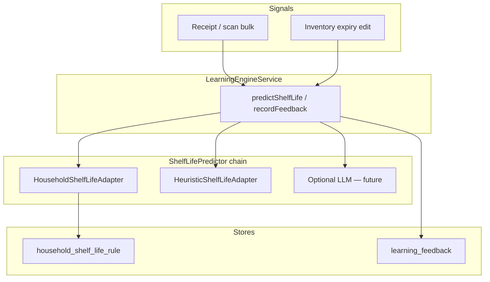

# Learning Engine — Skaffu Brain V1

*Shelf-life prediction at receipt import and inventory. Shipped in codebase (migration `0047_learning_engine_v1.sql`); prod flags default **off** until validated.*

**Relaterat:** [SKAFFU_BRAIN_V1_EXECUTION.md](./SKAFFU_BRAIN_V1_EXECUTION.md) (coordinator execution) · [CURRENT_REALITY.md](./CURRENT_REALITY.md) · [RECEIPT_AUTOPILOT_NO_KIVRA_PLAN.md](./RECEIPT_AUTOPILOT_NO_KIVRA_PLAN.md) · [SKAFFU_BRAIN_MEMORY.md](./SKAFFU_BRAIN_MEMORY.md)

---

## Household memory model

Brain V1 implements a slice of the **household memory model**: evidence tables (`receipt_purchase_line`, etc.) feed predictors that materialize small rule tables (`household_shelf_life_rule`, `household_location_rule`) with an audit trail in `learning_feedback`. For the full catalog (core vs nice-to-have vs dangerous memories, V2 roadmap), see **[SKAFFU_BRAIN_MEMORY.md](./SKAFFU_BRAIN_MEMORY.md)**.

---

## What it does

Skaffu Brain V1 replaces scattered `guessShelfLife` calls with a **modular predictor chain** behind `LearningEngineService`. The first module is **shelf life**:

1. **Household rule** — median `typical_days` per `(normalized_key, location)` when `sample_count >= 2`
2. **Heuristic** — existing keyword table in `src/lib/domain/shelf-life.ts`
3. **Optional LLM** — stub tier behind `SHELF_LIFE_LLM_ENABLED` (not implemented in V1)

Every prediction is **observable and correctable**. User actions (accept, correct, reject) write to `learning_feedback` and update `household_shelf_life_rule`.

**Household-first:** learning is scoped to `household_id` + normalized product key. Global anonymized priors are design-only for a later phase.

---

## Architecture

### Layering

| Layer | Path | Role |
|-------|------|------|
| Domain | `src/lib/domain/learning/` | Pure types, median math, `expiresOn` from purchase date |
| Application | `src/lib/application/learning/`, `predictors/` | `LearningEngineService`, `ShelfLifePredictor`, ports |
| Infrastructure | `repositories/learning-*.ts`, `adapters/*-shelf-life.adapter.ts` | Drizzle persistence, heuristic wrapper |
| Server | `src/lib/server/di.ts`, routes | DI wiring; routes call `event.locals.learningEngineService` only |

### Data model

- **`household_shelf_life_rule`** — materialized median shelf life per household + product key + location
- **`learning_feedback`** — shared feedback log for all predictors (`predictor_id`: `shelf_life`, `location`, `replenishment`)

`expiresOnSource` on inventory items: `heuristic`, `household_learned`, or legacy `ai_inferred` (displayed as **Uppskattat**, not "AI").

---

## Feature flags

| Flag | Scope | Default | Reader |
|------|-------|---------|--------|
| `SHELF_LIFE_LEARNING_ENABLED` | server (RUNTIME) | `false` | `isShelfLifeLearningEnabled()` |
| `PUBLIC_SHELF_LIFE_ESTIMATES_IN_RECEIPT` | client UX (BUILD+RUNTIME) | `false` | `isShelfLifeEstimatesInReceiptEnabled()` |
| `LOCATION_LEARNING_ENABLED` | server (RUNTIME) | `false` | `isLocationLearningEnabled()` |
| `REPLENISHMENT_LEARNING_ENABLED` | server (RUNTIME) | `false` | `isReplenishmentLearningEnabled()` |
| `SHELF_LIFE_LLM_ENABLED` | server (RUNTIME) | `false` | `isShelfLifeLlmEnabled()` |

**Local dev:** uncomment in `.env.example` block. **Prod seed cohort:** all four Brain flags `true` in `apphosting.yaml` (see [FOUNDER_SEED_PLAYBOOK.md](./FOUNDER_SEED_PLAYBOOK.md#seed-cohort-brain-flags)).

`PUBLIC_SHELF_LIFE_ESTIMATES_IN_RECEIPT` controls receipt review expiry UI (`ReceiptBulkAddFlow`, scan load). When unset locally, it falls back to `SHELF_LIFE_LEARNING_ENABLED`.

### Rollback

Flip flags to `false` (or remove env) → predictor chain skips household tier and receipt UX hides estimates. **No data loss:** `household_shelf_life_rule` and `learning_feedback` remain; re-enable flag to resume learning.

### Rollout checklist

1. `.env.example` + `apphosting.yaml` documented (Agent E)
2. Run migration `0047_learning_engine_v1.sql` on target DB
3. Enable Brain flags for seed cohort (`SHELF_LIFE_LEARNING_ENABLED`, `PUBLIC_SHELF_LIFE_ESTIMATES_IN_RECEIPT`, `LOCATION_LEARNING_ENABLED`, `REPLENISHMENT_LEARNING_ENABLED`)
4. Post-deploy smoke: scan receipt → see "Uppskattat" on selected line → save → edit expiry → rule updates on re-import; lista replenishment shows "Från dina kvitton" chip

---

## Integration points

| Flow | Entry | Feedback |
|------|-------|----------|
| Scan bulk | `scan/+page.server.ts` — predictions on load/parse; feedback on `bulkCreate` | `accepted` / `corrected` / `rejected` |
| Email/Kivra import | `receipt-import.ts` — parity when flag on | same |
| Inventory create/infer | `inventory.service.ts` — engine for expiry inference | on `updateItem` when user changes predicted expiry |
| Inventory list | `InventoryTableRow.svelte` — muted "Uppskattat" badge | — |
| Replenishment accept | `/api/replenishment/accept` — add suggestion to shopping list | `accepted` |
| Replenishment dismiss | `/api/replenishment/dismiss` — hide pattern (also `receipt_pattern_dismissal`) | `ignored` |

Routes and UI **never** call `guessShelfLife` or OpenAI directly.

---

## Out of scope (V1)

- LLM adapter implementation
- Global anonymized priors (nightly aggregation job)
- Replenishment rule materialization (feedback audit only in V2)
- Client-side-only learning (server is source of truth for household sync)

---

## Tests

- Unit: `learning-engine.service.test.ts`, `shelf-life-predictor.test.ts`, `shelf-life-learning.test.ts`
- Integration: `learning-engine.integration.test.ts`, `scan-bulk.integration.test.ts`
- Repos: `household-shelf-life-rule.repository.test.ts`, `learning-feedback.repository.test.ts`
