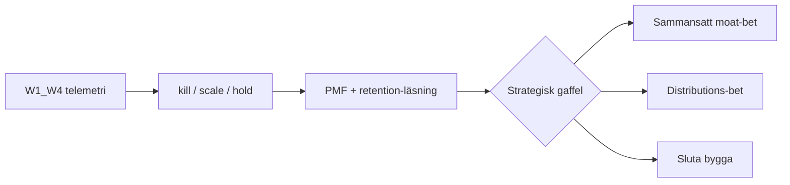
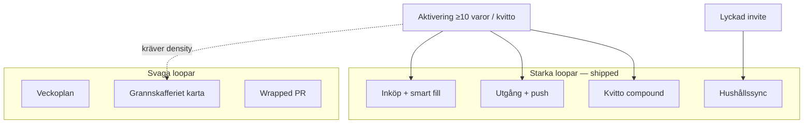

# Nästa fas — strategisk beslutskarta (parallellt med W1–W4)

*Version: juni 2026. Strategisk lins för beslut *efter* att acquisition-wedge-telemetri landar — inte en feature-roadmap eller implementation-plan.*

**Relaterade dokument (läs där, duplicera inte här):**

| Dokument | Vad det täcker |
|----------|----------------|
| [`ACQUISITION_WEDGES.md`](./ACQUISITION_WEDGES.md) | W1–W4 wedges, kill/scale-kriterier, events |
| [`GROWTH_STRATEGY.md`](./GROWTH_STRATEGY.md) | Acquisition > activation > retention, do-not-build |
| [`PRODUCT_LED_GROWTH_ANALYSIS.md`](./PRODUCT_LED_GROWTH_ANALYSIS.md) | PLG-inventering, starka/svaga loopar |
| [`BREAKTHROUGH_GROWTH_OPPORTUNITIES.md`](./BREAKTHROUGH_GROWTH_OPPORTUNITIES.md) | B1–B12, compound moat, stranger-pull |
| [`COMPETITIVE_ANALYSIS.md`](./COMPETITIVE_ANALYSIS.md) | PMF-status, funktionsmatris §4C, OLIO §3G |
| [`PRICING.md`](./PRICING.md) | Freemium-hypotes, Stripe-gates |
| [`DAY_90_DECISION.md`](./DAY_90_DECISION.md) | Webb+SV vs Capacitor-matris |
| [`PMF_METRICS_LOG.md`](./PMF_METRICS_LOG.md) | Veckovis baseline — **tom idag** |
| [`CURSOR_COORDINATOR.md`](./CURSOR_COORDINATOR.md) | Agentstruktur, WIP, spawn-regler |
| [`JUNE_ENGINEERING_REPORT.md`](./JUNE_ENGINEERING_REPORT.md) | Juni-leverans, overbuild-bedömning |
| [`USER_INTERVIEWS.md`](./USER_INTERVIEWS.md) | Churn-kit, syntes (ej ifylld) |
| [`GRANNSKAFFERIET_V0.md`](./GRANNSKAFFERIET_V0.md) | Dela-länk, density-gate |
| [`KIVRA_PARTNERSHIP_TRACK.md`](./KIVRA_PARTNERSHIP_TRACK.md) | Partnerskapsspår, API-gate |
| [`RECEIPT_TEST_PACK.md`](./RECEIPT_TEST_PACK.md) | Kvitto-PDF-korpus, CI-täckning |
| [`RECEIPT_AUTOPILOT_NO_KIVRA_PLAN.md`](./RECEIPT_AUTOPILOT_NO_KIVRA_PLAN.md) | Activation, inte acquisition |
| [`HOUSEHOLD_GROWTH.md`](./HOUSEHOLD_GROWTH.md) | Hushållsexpansion, invite-friktion, V1–V3, naturlig medlem-add |
| [`FOOD_ECOSYSTEM_EXPLORATION.md`](./FOOD_ECOSYSTEM_EXPLORATION.md) | Post-PMF horisont — C1–C7 kategoribets, fyra ekosystem, H1–H3 |

**Datagap (ärligt):** [`PMF_METRICS_LOG.md`](./PMF_METRICS_LOG.md) är i stort sett tom. Alla beslut i detta dokument förutsätter att ägaren fyller baseline *innan* wedge-verdict tolkas. Utan råtal är rankningar produktlogik — inte empiriska slutsatser.

**Avgränsning:** W1–W4 är de **enda** aktiva acquisition-experimenten. Inga nya wedges, inga sprint-uppgifter, inga build-prioriteringar utöver tolkningsgrindar.

---

## 1. Executive framing

### Operating assumption

Engineering-kapacitet är **inte** flaskhalsen. Juni 2026 levererade 435 commits, 37 mergade PRs och en komplett activation-stack på 11 dagar ([`JUNE_ENGINEERING_REPORT.md`](./JUNE_ENGINEERING_REPORT.md)). Flaskhalsen är **inlärningshastighet** och **beslutskvalitet**: få in rätt användare, mäta om de aktiveras, och avgöra om de stannar — innan nästa stora investering.

### Vad som ändras när W1–W4-data landar

Varje wedge har pre-registrerade KPIs och kill-kriterier i [`ACQUISITION_WEDGES.md`](./ACQUISITION_WEDGES.md) §9 och Return block. När 2–4 veckors läsfönster per wedge är klart fattas **kill / scale / hold** per yta:

| Wedge | Primär signal | Tolkning |
|-------|---------------|----------|
| **W1** | `shopping_list_share_viewed` → `signup_complete` | Familj-vana utan geo |
| **W2** | `public_city_feed_viewed` → signup utan referrer | Endast om supply seedad |
| **W3** | `expiring_share_viewed` → CTA → registrering | Varm trafik från `/dela` |
| **W4** | `household_invite_prompt_*` (context=`inkop`) vs `inviteRate` | Kontextuell hushållsexpansion |

Acquisition-framgång utan förbättrad aktivering eller retention **flyttar bara flaskhalsen nedströms** — den löser inte PMF.

### Vad som inte ändras

- **Ingen femte acquisition-wedge** förrän W1–W4 har verdict.
- **Retention/PMF-gates före Stripe** — se [`PRICING.md`](./PRICING.md) §6 och [`DAY_90_DECISION.md`](./DAY_90_DECISION.md).
- **Grannskafferiet-karta som cold acquisition** — fortfarande kill enligt [`GROWTH_STRATEGY.md`](./GROWTH_STRATEGY.md) och [`ACQUISITION_WEDGES.md`](./ACQUISITION_WEDGES.md) §Explicit kill.

---

## 2. PMF-risker (rankade efter allvar)

Syntes från [`COMPETITIVE_ANALYSIS.md`](./COMPETITIVE_ANALYSIS.md) Nuvarande läge, [`GROWTH_STRATEGY.md`](./GROWTH_STRATEGY.md) §1, [`DAY_90_DECISION.md`](./DAY_90_DECISION.md) och `PMF_TARGETS` i `src/lib/domain/pmf.ts`.

### Ovaliderade antaganden

| Antagande | Varför ovaliderat | Failure mode om fel |
|-----------|-------------------|---------------------|
| Pantry-as-truth slår list-only för ICP | Bring/AnyList/ICA är etablerad vana | Acquisition förbättras men D30 platt |
| Svensk kvitto/PDF-parsing tillräckligt pålitlig | CI-korpus tunn — 5 syntetiska PDF:er, 0/20 riktiga i workspace ([`RECEIPT_TEST_PACK.md`](./RECEIPT_TEST_PACK.md)) | Activation wow → churn efter första dåliga kvittot |
| Webb/PWA räcker vs Matdags native | Ingen Capacitor shipped; iOS nearby toggle ej prod jun 11 | Vana förloras till OS-push och App Store |
| Household invite skalar bortom Inställningar | `inviteRate` mål 30 % i kod, baseline tom | W4/W1 lägger till användare men inte flermedlems-rate |
| Grannskafferiet blir nätverk | Login + opt-in + density-gate ≥5–10/500 m ([`GRANNSKAFFERIET_V0.md`](./GRANNSKAFFERIET_V0.md)) | W2 tom-feed skadar förtroende |
| Freemium → Pro utan PMF | Stripe medvetet av — [`PRICING.md`](./PRICING.md) | För tidig betalvägg dödar tillväxt |

### Topp 7 risker (rankade)

| # | Risk | Allvar | Vad som motbevisar efter W1–W4-fönster |
|---|------|--------|----------------------------------------|
| 1 | **PMF ej bevisad — beslut utan data** | Existential | [`PMF_METRICS_LOG.md`](./PMF_METRICS_LOG.md) ifylld; `d30EligibleUsers ≥ 30`; minst 2 metrics på `PMF_TARGETS` |
| 2 | **Acquisition utan activation** | Existential | `activationRate ≥ 40 %` och median TTV ≤ 3 min trots ökad registrering från wedges |
| 3 | **Kvitto-trust-break** | Major | `receipt_parsed` → D7-korrelation positiv; ≥15/20 riktiga PDF godkända i testpack |
| 4 | **Solo-hushåll utan återkommande trigger** | Major | `smartFillWeeklyRate ≥ 20 %` eller `shopping_checkoff_to_pantry` ökar utan invite |
| 5 | **List-substitut vinner** | Major | W1 view→signup >5 %; annars ICP fel eller lista inte differentierande |
| 6 | **Tom city-feed / negativ social proof** | Major | W2: ≥3 signup/vecka per seedad stad eller kill |
| 7 | **Native/PWA-friction** | Moderate | Intervjusyntes + låg PWA-install trots mobiltrafik — se dag-90-matris |

### Retention-risker idag

Ingen daglig ritual för de flesta användare. Måltidsplan (`/planer`) är veckovis — Mealime och ChatGPT är substitut. Kartan är gated. Expiry push hjälper bara **aktiverad** kohort med ifyllt lager. Mål i kod: `d7Retention ≥ 20 %`, `d30RetentionEarly ≥ 15 %` — inga bevisade värden i loggen.

### Activation-risker idag

Konto-vägg före värde ([`GROWTH_STRATEGY.md`](./GROWTH_STRATEGY.md)). `activationRate` mål **40 %**, `medianTimeToFirstScanMinutes` mål **≤3 min** — baseline ej ifylld. Onboarding är shipped; det är inte huvudhypotesen längre.

### Kritisk insikt

> Acquisition-framgång utan activation/retention-förbättring **är inte PMF**. Det är en dyrare funnel till samma churn.

---

## 3. Retention — djupdykning (beteende, inte features)

Analys av **shipped loopar** från [`PRODUCT_LED_GROWTH_ANALYSIS.md`](./PRODUCT_LED_GROWTH_ANALYSIS.md) §2–4 och events i `pmf.ts`. Detta avsnitt beskriver *varför* användare återkommer eller slutar — inte vad som ska byggas.

### Starkaste habit-loopar (rankade)

| Rank | Loop | Mekanism | PMF-mål / event |
|------|------|----------|-----------------|
| 1 | **Pre-shopping / inköp** | Smart fill, list-checkoff, pantry bridge | `smartFillWeeklyRate ≥ 20 %`; `shopping_checkoff_to_pantry` |
| 2 | **Expiry-driven** | Eat-first på `/hem`, web push, e-postdigest | Kräver ifyllt lager; `eat_first_week_viewed` |
| 3 | **Receipt re-import** | Autopilot-förslag på `/inkop` | `receipt_autopilot_accepted`; compound, inte daglig för alla |
| 4 | **Household sync** | Delat lager + lista när ≥2 aktiva | `multiMemberHouseholdRate ≥ 50 %`; `inviteRate ≥ 30 %` |

Loop 1 är den enda som fungerar för **solo-användare utan full lagerdisciplin** — den triggas av handel, inte av daglig app-open. Det förklarar varför retention utan receipt-habit eller partner-sync ofta plattnar.

### Svagaste loopar

| Loop | Varför svag |
|------|-------------|
| `/planer` | Veckovis; Mealime/Matbotten/ChatGPT-substitut utan lager |
| `/grannskafferiet` | Login + opt-in + density; OLIO äger tom-karta-narrativ |
| Wrapped / Skaffurapport | Månads-/stolthetsdelning, inte återkommande utility |
| Admin/insights | Power-user only; noll slutanvändar-PLG |

### Varför användare slutar återkomma (hypoteser)

Kopplat till churn-mekanik och intervjuguide i [`USER_INTERVIEWS.md`](./USER_INTERVIEWS.md) — syntes **ej ifylld** (0/10 intervjuer dokumenterade):

1. **Lager känns inaktuellt** — underhållsbörda utan receipt-habit; varje öppning kräver “städjobb”.
2. **Solo-hushåll** — ingen delad listtryck; invite sker i Inställningar, långt från handelskontext (W4 adresserar detta om det fungerar).
3. **Scan/kvitto-friktion på mobil web** — kamera, PDF-uppladdning, review-steg; Matdags vinner på native-vana.
4. **“Jag använder redan Bring/ICA för lista”** — export går utåt (`shopping_list_export`), partner ser extern app, inte Skaffu.
5. **Ingen push-tillstånd / svag notis-vana på iOS Safari** — expiry-värde når inte användaren i rätt ögonblick.

### Saknad återkommande värde

Det som saknas är en **pålitlig pre-shopping eller daglig trigger** som fungerar för solo-användare utan full lagerdisciplin. Skillnaden mellan *habit compound* (B5/B6 i [`BREAKTHROUGH_GROWTH_OPPORTUNITIES.md`](./BREAKTHROUGH_GROWTH_OPPORTUNITIES.md) — pre-shopping gate, “äta idag”) och *nya features* är viktig: compound förutsätter activation; det är inte acquisition-svar.

---

## 4. Monetiseringsanalys (ingen payments-build)

Ankare: [`PRICING.md`](./PRICING.md) och `src/lib/domain/plan.ts`. Detta avsnitt är **hypotes + beslutsgates** — inte Stripe-arbete.

### Vem betalar realistiskt?

| Segment | Problem de betalar för att lösa |
|---------|--------------------------------|
| Aktiverade flermedlems-hushåll som träffar AI-tak | “Spara mig tid varje vecka” + “sluta cap:a kvitto/scan” |
| Power users med full `/statistik` | Insikter och historik utöver gratis cap |
| Grannskafferiet power users | 2 km radie (soft CTA idag) — **svag** motivator tills nätverk finns |

**Inte betalningsmotiv:** “Betala för att dela mat med grannar.” Nätverksfunktioner är gratis med opt-in per [`PRICING.md`](./PRICING.md) §3.2.

### Första betalda feature (rankad hypotes)

1. **AI + kvitto-PDF-bundle** — tydlig kostnadsalignment (`AI_UNIT_ECONOMICS` i `plan.ts`; 25 PDF/mån free)
2. **Obegränsad smart fill** — differentiator vs Bring
3. **Utökad Grannskafferiet-radie** — svagast; nätverk fortfarande tunt

### Aldrig bakom betalvägg (explicit)

Per [`PRICING.md`](./PRICING.md) §3.1:

- Manuellt lager inom free cap (400 rader)
- Kärn-delad lista för litet hushåll (4 medlemmar free)
- Grundläggande utgångsvy
- Nearby push med opt-in (gratis)
- Publika wedge-sidor och varm-länk-värde före signup (W1, W3)

### Beslutsgate före Stripe

| Gate | Mål | Källa |
|------|-----|-------|
| Sean Ellis “Mycket besviken” | >40 % | [`DAY_90_DECISION.md`](./DAY_90_DECISION.md) |
| D30-retention | ≥15 % tidigt | `PMF_TARGETS.d30RetentionEarly` |
| Kohortstorlek | `d30EligibleUsers ≥ 30` | [`DAY_90_DECISION.md`](./DAY_90_DECISION.md) |
| Pro-waitlist | ≥50 uttryckt vilja | [`PRICING.md`](./PRICING.md) §6 |

**Tolkning:** Om wedges lyckas med registrering men D30 och Sean Ellis förblir under tröskel — **håll Stripe av**. Det bevisar att problemet är retention/activation, inte intäktsmodell.

---

## 5. Konkurrensförsvar och moat

Från [`COMPETITIVE_ANALYSIS.md`](./COMPETITIVE_ANALYSIS.md) §4C och [`BREAKTHROUGH_GROWTH_OPPORTUNITIES.md`](./BREAKTHROUGH_GROWTH_OPPORTUNITIES.md) §2.4–2.5.

| Lager | Kopieras snabbt | Svårt att kopiera |
|-------|-----------------|-------------------|
| UX | List-UI, plankalender, PWA-shell | — |
| Features | Streckkodsscan, grundläggande utgång | Svensk kvitto-PDF + per-rad plats |
| Data | — | `receipt_purchase_line`-historik per hushåll |
| Nätverk | Clipboard-export till Bring | Hushållslager som sanningskälla + invite-graf |
| Lokalt | — | Opt-in geo-delningar i skala *om* density uppstår |

### Datafördelar idag

Hushållsscoped inventory, valfria receipt-rader, expiry-tidsstämplar — **värdefullt endast efter activation**. En främling utan konto har noll compound-data. Det är varför receipt history rankas som moat, inte wedge ([`ACQUISITION_WEDGES.md`](./ACQUISITION_WEDGES.md) §2.1).

### Nätverksfördelar som kan uppstå (villkorat på W1–W4)

| Wedge-signal | Nätverkseffekt |
|--------------|----------------|
| W1 scale | Live lista-länkar tättar hushållsgrafen |
| W4 scale | `inviteRate` och `multiMemberHouseholdRate` ökar — se [`HOUSEHOLD_GROWTH.md`](./HOUSEHOLD_GROWTH.md) för friktionskatalog och V1-bryggor |
| W2 scale | Stad-nivå supply-synlighet — svagt nätverk tills density |

### Moat-tes (om framgång)

> Sammansatt **hushållspantry-minne** (vad ni köpte, var det bor, när det går ut) matat av **nordisk kvitto-ingestion**, med **kors-medlemssync** och valfri **lokal överskotts-synlighet** — inte en lista-app, inte en meal planner, inte OLIO-style manuella listings. Moaten fördjupas med time-on-platform och kvittohistorik; den **finns inte dag 1**.

---

## 6. 10x-möjligheter om W1–W4 lyckas

**Avvisat som 10x:** hero A/B-polish, kart-polish, fler admin-flikar, LinkedIn-kö, generiska AI-insights, recall alerts (liability), demand board pre-density, Capacitor utan D30-gate.

Varje kandidat är en **strategisk gaffel** — inte build-spec.

| # | 10x-mekanism | Precondition (wedge-signal) | Failure mode |
|---|--------------|----------------------------|--------------|
| 1 | **Hushållsgraf-explosion** — varje shopping-share + inkop-invite konverterar listkoordinering till 2-medlems-hushåll i skala | W1 + W4 scale; `multiMemberHouseholdRate` trendar mot 50 % | Registreringar utan andra medlem aktiv — falsk expansion |
| 2 | **City feed → lokal matlikviditet** — manuell seed blir programmatisk density; kategori “lager-driven överskott” vs OLIO | W2: feed views + signup utan referrer i seedad stad | Tom feed → negativ social proof värre än ingen sida |
| 3 | **Receipt pipeline i skala** — B1+B2: personligt prisminne + autopilot som default onboarding | `receiptRate ≥ 25 %`; testpack ≥15/20 godkända | Parsing-trust-break → churn efter wow |
| 4 | **Kivra/partnerkanal** — distribution-multiplikator, inte API-fantasi | Manual receipt MVP validerad; partnerskapsspår ([`KIVRA_PARTNERSHIP_TRACK.md`](./KIVRA_PARTNERSHIP_TRACK.md)) | False marketing; engineering idle på OAuth |
| 5 | **Skaffurapport som demand** — publik anonym data skapar PR-loop när kohort ≥50 | Tillräcklig aktiverad bas från wedge-framgång | Benchmark meningslös med n<50 hushåll |

**Investerarperspektiv:** 10x kräver att minst **två** av ovan kopplas — t.ex. hushållsgraf (W1/W4) *plus* receipt compound (activation). En wedge ensam ger incremental tillväxt, inte kategori-skapande.

---

## 7. CTO-granskning (skeptisk)

Utmanar [`JUNE_ENGINEERING_REPORT.md`](./JUNE_ENGINEERING_REPORT.md) §9–10 och [`PRODUCT_LED_GROWTH_ANALYSIS.md`](./PRODUCT_LED_GROWTH_ANALYSIS.md) §3.

| Fråga | Ärligt svar |
|-------|-------------|
| **Overbuilding?** | Ja: Grannskafferiet v2 map-stack, admin analytics/decisions, SEO guide-pipeline, LinkedIn OAuth — före acquisition-baseline och ifylld PMF-logg |
| **Underinvestering?** | Ja: PMF-logg-disciplin, 10 användarintervjuer, kvitto-PDF-regressionkorpus, wedge-tolkningskadens, prod error-triage |
| **Sluta idag?** | Nya acquisition-ytor utöver W1–W4; kart-polish; dashboard-expansion; debattera B7/B8/B9 tills wedge-verdict |
| **Dubbla ner?** | Wedge-telemetri + attributionsintegritet; kvitto-pålitlighet; onboarding TTV; integrationstester för publika ytor |

### Antaganden som utmanas

| Antagande | Verdict |
|-----------|---------|
| “Mer engineering fixar tillväxt” | **Falskt** — 648 agent-sessioner / 435 commits utan PMF-bevis ([`JUNE_ENGINEERING_REPORT.md`](./JUNE_ENGINEERING_REPORT.md) §9) |
| “Grannskafferiet är storyn” | **Delvis falskt** — `/dela` och lista-delning är storyn; karta är retention post-density |
| “Receipt autopilot är acquisition” | **Falskt** — activation moat; align [`RECEIPT_AUTOPILOT_NO_KIVRA_PLAN.md`](./RECEIPT_AUTOPILOT_NO_KIVRA_PLAN.md) |
| “Vi behöver Capacitor före activation-fix” | **Falskt** — D30 <15 % → väg A per [`DAY_90_DECISION.md`](./DAY_90_DECISION.md) |

**CTO-rekommendation:** Survival mode (WIP=1) tills [`PMF_METRICS_LOG.md`](./PMF_METRICS_LOG.md) vecka 1 baseline finns. Deploy max 1–2 gånger/dag. Feature freeze på geo/map utöver W4 toggle-fix.

---

## 8. Framtida agentstruktur

Baserat på [`CURSOR_COORDINATOR.md`](./CURSOR_COORDINATOR.md) och `.cursor/rules/*`.

### Behåll

| Agent / disciplin | Varför |
|-------------------|--------|
| Coordinator | En leveransägare, merge queue, deploy-beslut |
| dev-runtime | Icke-WIP; `dev:watch` i `home-pantry-dev` |
| security-agent | Deploy-gate före G3 |
| Integration-first | `test:integration` för publika ytor |
| e2e post-freeze | En batch per vecka, inte parallellt med features |

### Förenkla / slå ihop

| Nu | Förslag |
|----|---------|
| complexity-agent + dependency-health-agent | Kvartalsvis kombinerad “health scan” om ingen hotspot |
| Flera governance-spawns | En pre-deploy governance-bundle |

### Pausa / avveckla

| Mönster | Varför |
|---------|--------|
| Parallella explore/shell-bursts under WIP 3 | [`coordinator-v2.mdc`](../.cursor/rules/coordinator-v2.mdc) — ökar fail rate utan snabbare green |
| Proaktiva feature-exploration-agenter under wedge-körning | Distraherar från W1–W4-tolkning |
| Användar-assigned prod smoke som default | Coordinator-owned per [`delivery-done.mdc`](../.cursor/rules/delivery-done.mdc) |

### Skapa senare (efter wedge-data, read-only / låg-kod)

| Roll | Uppgift |
|------|---------|
| **Wedge analyst** | Veckovis: wedge-KPIs från `product_events`, jämför kill-kriterier, utkast till verdict-memo — ingen kod |
| **PMF weekly** | Fyll [`PMF_METRICS_LOG.md`](./PMF_METRICS_LOG.md) från `/admin` export; flagga en metric under mål |
| **Interview synthesizer** | När [`USER_INTERVIEW_TRACKER.md`](./USER_INTERVIEW_TRACKER.md) har nya rader |

**Optimeringsmål:** inlärningshastighet och beslutskvalitet — färre parallella implementation-agenter, mer governance + analyst.

---

## 9. Beslutskalender (inte roadmap)

Tabellen beskriver **vad som ska beslutas**, **när**, med **vilken data** — inte vad som ska byggas.

| Vecka (från wedge-ship) | Beslut | Data som krävs | Alternativ |
|-------------------------|--------|----------------|------------|
| **W+2** | W3 kill/scale/hold | `expiring_share_viewed` → `expiring_share_cta_clicked` → `signup_complete` (UTM `grannskafferiet`); volym ≥20 views/vecka | Scale copy/CTA · Hold volym · Kill om <1 % view→signup |
| **W+2** | W1 tidig signal | `shopping_list_share_created` vs `viewed`; view→signup | Hold om <10 shares · Fortsätt om >3 % conversion |
| **W+4** | W1/W4 verdict | Share-funnel + `inviteRate` delta vs Inställningar-baseline; `household_invite_prompt_*` context=`inkop` | Scale W1+W4 · Kill W1 om inaktuell lista-feedback · Hold W4 om solo-kohort |
| **W+4** | W2 enable/kill | Endast om flag på + ≥5 manuella delningar/vecka i pilotstad; `public_city_feed_*` | Enable scale · Kill tom feed · Skip om ej seedad |
| **W+4** | PMF baseline review | Alla `PMF_TARGETS` vs [`PMF_METRICS_LOG.md`](./PMF_METRICS_LOG.md) vecka 4 | Fortsätt experiment · Pausa ny kod om 0 metrics ifyllda |
| **W+8** | Stripe vs hold | D30, `activationRate`, Sean Ellis, `d30EligibleUsers` | Hold Stripe · Förbered juridik om 2/3 gates gröna |
| **W+8** | Nästa strategisk gaffel | Wedge-verdict + retention-läsning §3 | Compound moat (receipt) · Distribution (Kivra track) · Stop building |
| **W+12** | Capacitor vs web | [`DAY_90_DECISION.md`](./DAY_90_DECISION.md) matris + intervjusyntes | Väg A Webb+SV · Väg B Capacitor · Hybrid |

### Kill-kriterier (sammanfattning från [`ACQUISITION_WEDGES.md`](./ACQUISITION_WEDGES.md))

| Wedge | Kill om |
|-------|---------|
| W1 | View→signup <1 % efter 4 veckor ELLER konsekvent feedback “listan var fel” |
| W2 | Tom feed i seedad stad ELLER <3 organiska signups/vecka |
| W3 | <20 `expiring_share_viewed`/vecka (volym för låg) |
| W4 | `inviteRate` oförändrad vs baseline ELLER prompt dismiss-rate >80 % |

### Referens: PMF_TARGETS (`src/lib/domain/pmf.ts`)

| Metric | Mål |
|--------|-----|
| `activationRate` | 40 % |
| `medianTimeToFirstScanMinutes` | ≤3 min |
| `weeklyScanRate` | 30 % |
| `d7Retention` | 20 % |
| `d30RetentionEarly` | 15 % |
| `multiMemberHouseholdRate` | 50 % |
| `smartFillWeeklyRate` | 20 % |
| `inviteRate` | 30 % |
| `receiptRate` | 25 % |

---

## Sammanfattning för ägare

1. **Kör W1–W4, tolka data, inget nytt wedge.** Beslutskalender §9 är den operativa kompassen.
2. **Fyll PMF-loggen varje måndag** — utan baseline är all strategi teori.
3. **Acquisition ≠ PMF.** Om registreringar ökar men `activationRate` och D30 inte följer med — flaskhalsen är activation/retention, inte distribution.
4. **Moat byggs efter activation** (receipt, hushåll, geo). Breakthrough kräver att främlingar *ser* värde — W1/W2/W3 adresserar det; kvitto och karta ensamt gör det inte.
5. **CTO-linje:** färre agenter, mer mätning och tolkning. Engineering excellence utan funnel-bevis var juni:s största misstag.

---

*Genererat 2026-06-11. Revidera efter W1–W4 verdict och ifylld [`PMF_METRICS_LOG.md`](./PMF_METRICS_LOG.md) vecka 4.*
