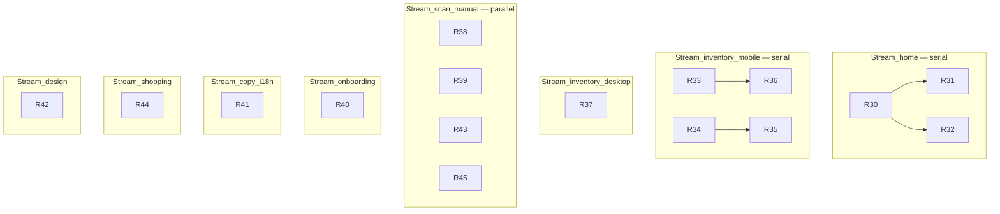

# Premium UX Audit — Skaffu (jun 2026)

> **Canonical premium-feel audit** — mobile-first polish, consistency, Brain V1 visibility. **No Brain V2/V3, new predictors, or feature expansion.** Ready Now slices continue from R29 in [REALITY_AUDIT_2026-06.md](./REALITY_AUDIT_2026-06.md).

**Baseline:** Master workspace code read (2026-06-15) · i18n: [`src/lib/i18n/locales/sv.json`](../src/lib/i18n/locales/sv.json) (no `messages/sv.json` in repo)

**Relaterat:** [CURRENT_REALITY.md](./CURRENT_REALITY.md) · [REALITY_AUDIT_2026-06.md](./REALITY_AUDIT_2026-06.md) · [PRODUCT_AUDIT_2026-06.md](./PRODUCT_AUDIT_2026-06.md) · [BRAND.md](./BRAND.md) · [DESIGN_SYSTEM_V1.md](./DESIGN_SYSTEM_V1.md)

**Princip:** Rank everything **Mobile Impact × User Value × Implementation Speed**. Desktop second. Only Ready Now slices — no roadmap/backlog language.

---

# Critical Mobile Problems

Ranked **Mobile Impact × User Value × Implementation Speed** (max 27). Desktop second.

| Rank | Problem | Evidence | Score |
|------|---------|----------|-------|
| 1 | **ListToolbar `compact` never wired** — mobile still renders 4 expiry chips on row 2 despite `ListToolbar` supporting collapse | `InventoryList.svelte` passes `sortChipLabel` when `isCompact` but **not** `compact={isCompact}` | 27 |
| 2 | **Inventory chrome eats ~50–60% viewport** before first row: `add-goods-block` (photo + barcode + receipt links) sits **above** sticky `LocationTab` + toolbar + section chips | `inventory/[location]/+page.svelte`, `InventoryList.svelte` sticky-band | 24 |
| 3 | **Triple consume affordance** on every mobile row: visible **Slut** button + swipe + overflow | `InventoryCompactRow.svelte` lines 204–224 | 24 |
| 4 | **Uppskattat buried on subline** — expiry badges + estimated badge compete; main line is name·qty only | `InventoryCompactRow.svelte` subline vs main-line | 21 |
| 5 | **Engaged home tagline hidden <560px** — `lista_ready` / `expiry` narrative invisible on phone | `HomeDashboard.svelte` `@media (max-width: 559px) .hero--engaged .tagline { display: none }` | 21 |
| 6 | **Lager behind Mer** — inventory is second-class; stale badge only in More sheet, not bottom tab | `nav-config.ts` — inventory has no `mobileTab` | 18 |
| 7 | **Scan mode tabs (4 peers)** on every sub-mode — horizontal scroll competes with hub clarity | `ScanModeTabs.svelte`, `scan/+page.svelte` | 18 |
| 8 | **Onboarding fullscreen + CelebrationBurst + heavy celebrate illustration** | `OnboardingGuide.svelte` | 15 |
| 9 | **RowOverflowMenu / sheets** can clip under bottom nav (z-index / safe-area) | `InventoryList.svelte` consume modal pattern | 15 |
| 10 | **Mobile sort half-feature** — name↔expiry toggle only, no direction | `toggleMobileSortChip()` in `InventoryList.svelte` | 12 |

---

# Critical UX Problems

| Rank | Problem | Evidence | Score |
|------|---------|----------|-------|
| 1 | **`lista_ready` / `expiry` = tagline only** — no state-specific primary hero; same shopping teaser for all engaged states | `home-state.ts`, `HomeDashboard.svelte` — `tagline` wired, no conditional hero block | 24 |
| 2 | **Four paths to “lägg in vara”** — inventory add block, scan hub, manual `/item/new`, scan tabs | inventory page + `scan-nav.ts` + `AddItemForm` | 21 |
| 3 | **Manual add opens with scan-instead `
`** — barcode/photo tabs before form fields | `AddItemForm.svelte` lines 164–181 | 21 |
| 4 | **Engaged home shows empty section headings** (“Rekommenderar”, “Hushåll”) even when content is empty copy | `HomeDashboard.svelte` — sections always render when `showEngagedSections` | 18 |
| 5 | **Pantry bridge sheet** — i18n loop copy updated but **no loop hint rendered** (orphan `.loop-hint` CSS) | `ShoppingToPantrySheet.svelte` — title/subtitle only | 18 |
| 6 | **No first-checkoff coachmark** for pantry bridge — only repeat nudge at 3× yes | `pantry-bridge-nudge.ts`, `ShoppingListPanel.svelte` | 18 |
| 7 | **Onboarding blocks product** — fullscreen modal on cold paths; `brainLearnLine` vague | `OnboardingGuide.svelte` | 15 |
| 8 | **pathGuide can jump to celebrate** via `syncCelebrateStep` when activation completes mid-flow | `OnboardingGuide.svelte` lines 213–218 | 15 |
| 9 | **Inventory empty CTA = photo scan** (`photoRound.title`) — scanner framing on Tier A surface | `InventoryList.svelte` EmptyState `actionLabel` | 15 |
| 10 | **`inventory.subtitle` still scanner-first** — “Skanna varor när du handlar” | `sv.json` `inventory.subtitle` | 12 |

---

# Critical UI Problems

| Rank | Problem | Evidence | Score |
|------|---------|----------|-------|
| 1 | **Desktop inventory = admin datagrid** — sortable `<table>`, sticky uppercase headers, bordered scroll box | `InventoryDataTable.svelte` | 21 |
| 2 | **Two chip systems in sticky band** — `ListToolbar` filter chips + `section-chip` (auto-expired/finished) | `InventoryList.svelte` | 21 |
| 3 | **Badge pile on rows** — finished / auto-expired / moving-soon / expiry / Uppskattat on subline | `InventoryCompactRow.svelte` | 18 |
| 4 | **Three incompatible product row patterns** — inventory compact (swipe+button), shopping (bordered card), memory (full-width button) | `InventoryCompactRow`, `ShoppingListRow`, `MemoryFacetCard` | 18 |
| 5 | **Design tokens documented, not enforced fleet-wide** — `DESIGN_SYSTEM_V1.md` exists; `EmptyState` uses custom `.action-primary` not `Button` | `EmptyState.svelte`, `DESIGN_SYSTEM_V1.md` | 15 |
| 6 | **Receipt upload heavy** — `DigitalReceiptGuide` + dual `ImageSourcePicker` (camera + file) | `ReceiptBulkAddFlow.svelte` | 15 |
| 7 | **System jargon** — “Slut”, “Utgångna (auto)”, “AI i ett tryck” | `sv.json` `consume.finish`, `inventory.finishedBadge`, `bulkExpiryBanner` | 15 |
| 8 | **Vocabulary split: Uppskattat vs AI-gissning** | `learning.estimatedExpiry` vs `inventory.aiExpiryBadge` in `AddItemForm`, `PhotoRoundFlow`, `ItemRow` | 15 |
| 9 | **Scan tab label drift** — hub “Foto” vs tab `photoRound.title` “Fota in varor” | `ScanModeTabs.svelte` | 12 |
| 10 | **Card padding inconsistent** — `Card.svelte` uses `--space-lg`; compact tiles override locally | `Card.svelte`, `ScanModeHub.svelte` | 9 |

---

# Brain Visibility Problems

*Brain V1 only — no new predictors/engines.*

| Rank | Gap | Severity | Evidence | Score |
|------|-----|----------|----------|-------|
| 1 | **Uppskattat not on name line** — user must scan subline badges | P0 | `InventoryCompactRow.svelte` | 24 |
| 2 | **AI-gissning label** on manual/photo flows breaks “Uppskattat” vocabulary | P1 | `AddItemForm.svelte`, `PhotoRoundFlow.svelte`, `ItemRow.svelte` | 21 |
| 3 | **Cold home hides all Brain** — no estimated/expiry teaching until data exists | P1 | `HomeDashboard.svelte` cold branch | 18 |
| 4 | **Replenishment learning toast exists** but accept path easy to miss among sheet noise | P1 | `sv.json` `learningToastAccept` | 15 |
| 5 | **Receipt toast `rulesImproved`** can overclaim vs visible memory | P1 | `receipt-import-session.ts` | 12 |
| 6 | **Settings vs Memory Explorer** — settings shows sample count; 1-sample uses `building` copy but settings list lacks confidence badge parity | P2 | `SuggestionsSettingsPanel.svelte`, `memory-confidence.ts` | 12 |
| 7 | **Cadence line exists in `HomeHouseholdSection`** but only when server sends `shoppingCadence` — no empty-state teaching | P2 | `HomeHouseholdSection.svelte` | 9 |
| 8 | **Nyheter Brain V1 entry shipped** in `app-news.ts` | ✓ | 4 entries including `brain-v1` | — |
| 9 | **EstimatedBadge interactive + explain wired** on inventory rows when explanation exists | ✓ | `EstimatedBadge.svelte`, `InventoryCompactRow.svelte` | — |
| 10 | **Memory explorer shows 1-sample facets** (`minSamples = 1`) | ✓ | `household-suggestions.service.ts` | — |

---

# Product Row Redesign

**Current state (read from components):**

| Surface | Component | Layout | Actions | Brain |
|---------|-----------|--------|---------|-------|
| Inventory mobile | `InventoryCompactRow` | main-line name·qty; subline badges | Slut btn + swipe + overflow | `EstimatedBadge` on subline |
| Inventory desktop | `InventoryTableRow` in datagrid | name + badge pile; expiry column | overflow only (no visible Slut) | `EstimatedBadge` in expiry col |
| Shopping | `ShoppingListRow` | bordered card, checkbox + line | ghost × remove | none |
| Memory | `MemoryFacetCard` | type badge + title + meta | tap → sheet | confidence badge |

**Premium target (Ready Now slices, no new features):**

- Shared **row rhythm**: 44px min touch, single metadata line, max 2 badges visible
- **Consume**: swipe + overflow only on mobile; desktop overflow only
- **Brain**: `EstimatedBadge` adjacent to product name (main line)
- **Shopping**: flatten to list-row (no per-item card border) to match inventory density
- **Memory**: align padding/typography with inventory compact row

**Slices:** R35, R34, R37, R33, R42

---

# Scan Redesign

**Current IA (prod-relevant paths):**

- `/scan` without `mode` → **hub** (`parseScanMode(null) === 'hub'`) ✓
- Bottom tab → `preferredScanHref()` = `/scan` ✓
- Hub: kvitto-first hero (`ScanModeHub.svelte`) ✓
- Sub-modes: **4 tabs** (receipt, photoRound, barcode, manual) via `ScanModeTabs`
- Inventory page: **photo-primary** add block bypasses hub
- Manual add: collapsed scan tabs inside form

**Premium scan clarity (no new modes):**

1. Inventory add block → single CTA to `scanHubHref` + ghost “Manuellt”
2. Manual add → link “Skanna istället →” to hub (remove `
` tabs)
3. Receipt upload → collapse `DigitalReceiptGuide` by default; one picker row
4. Harmonize photo labels (hub `scan.modes.photo` vs tab `photoRound.title`)

**Slices:** R38, R39, R43, R45

---

# Onboarding Redesign

**Current (`OnboardingGuide.svelte`):**

- 3 beats: welcome (vad) → pathGuide (loop) → celebrate (hur) ✓
- Lista-primary CTA on welcome; pantry paths in `
` ✓
- `CelebrationBurst` on celebrate step; `OnboardingCelebrateIllustration heavy`
- `brainLearnLine` one vague sentence
- Footer: back only on step 1+; path activation via body CTA
- Fullscreen mobile sheet animation

**Premium calm teaching:**

- Remove/reduce `CelebrationBurst`; drop `heavy` celebrate illustration
- Sharpen `brainLearnLine` to loop + Uppskattat vocabulary (i18n only)
- Ensure pathGuide title uses shopping copy when `selectedPath === 'shopping'` (partially done via `pathGuideTitleKey`)

**Slices:** R40, R41 (i18n)

---

# Home Redesign

**Current (`HomeDashboard.svelte` + `home-state.ts`):**

- States: `cold | lista_ready | expiry | steady` derived correctly
- Cold: `EmptyState` lista CTA + scan chips ✓
- Engaged: greeting + **hidden mobile tagline** + generic shopping teaser + secondary `HomeNextAction`
- Sections always shown when engaged (recommends + household) even if empty
- `HomeNextAction` priority: stale → lista → **photo** (photo still default when no list)

**Premium hierarchy:**

- State-specific **primary hero** for `lista_ready` (lista CTA prominent) and `expiry` (eat-first strip)
- Show compact state strip on mobile instead of hiding tagline
- Hide empty `home-v3-section` blocks
- Keep cadence in `HomeHouseholdSection` (already wired when data exists)

**Slices:** R30, R31, R32 — **Merge Dependency: `HomeDashboard.svelte`**

---

# Design System V2

**Source of truth:** `docs/BRAND.md`, `docs/DESIGN_SYSTEM_V1.md`, `src/app.css`

**Healthy:**

- Token set complete (color, space, radius, touch, z-index)
- `Button` variants match brand contract
- `Badge` warning tone uses accent correctly

**Gaps (enforcement pass, not new tokens):**

- `EmptyState` → wrap actions in `Button` for parity
- Inventory/shopping row CSS → use `--space-*` consistently (some hardcoded `0.45rem`, `0.65rem`)
- Chip styles duplicated in `ListToolbar`, `InventoryList` section-chip, `HomeDashboard` empty-chip
- Extract shared `.filter-chip` / `.product-row` utility OR document as molecules (minimal scope: inventory + shopping only)

**Slices:** R42, R37

---

# Micro UX Sweep

| Issue | Location | Slice |
|-------|----------|-------|
| Duplicate nav destinations to add goods | inventory page, scan hub, manual, scan tabs | R38, R39 |
| Modals: onboarding + pantry bridge + consume + post-onboarding stack | `OnboardingGuide`, `ShoppingToPantrySheet`, `InventoryList`, survey prompts | R40 (onboarding calm reduces stack feel) |
| Empty states with scanner CTA on inventory | `InventoryList` EmptyState | R46 |
| `inventory.title` “Ditt skafferi” legacy key (page uses location label) | `sv.json` | R41 |
| Bulk infer banner “AI i ett tryck” | `inventory/[location]/+page.svelte` | R41 |
| Mer sheet 6+ items; eat→`/planer` label drift | `NavMoreSheet`, `nav-config` | awareness only (no slice — IA frozen) |
| Login subtitle lista-first | `sv.json` auth.login | ✓ already updated |
| Grannskafferiet gated | `isPublicCityFeedEnabled()` in `nav-config.ts` | ✓ |

---

# Ready Now

*Continues from R29. All slices are **not implemented** on master per code read. `deploy_tier: fast` unless noted.*

| ID | Branch | Files | Change | Tests | Risk |
|----|--------|-------|--------|-------|------|
| **R30** | `fix/home-state-heroes` | `HomeDashboard.svelte`, `sv.json`, `en.json` | `lista_ready` → dominant lista CTA block; `expiry` → eat-first strip; mobile state chip | home e2e, critical-flows | Med — **Home hot zone** |
| **R31** | `fix/home-hide-empty-sections` | `HomeDashboard.svelte` | Omit `home-v3-section` when recommends/household have no rows | home e2e | Low — **serial after R30** |
| **R32** | `fix/home-mobile-tagline` | `HomeDashboard.svelte` | Show tagline on mobile OR replace with compact state pill | visual / home e2e | Low — **serial after R30** |
| **R33** | `fix/inventory-wire-compact-toolbar` | `InventoryList.svelte` | Pass `compact={isCompact}` to `ListToolbar` | inventory-mobile e2e | **Low — highest ROI** |
| **R34** | `fix/inventory-row-remove-slut` | `InventoryCompactRow.svelte` | Remove visible Slut button; swipe + overflow only | inventory-mobile e2e | Low — **Inventory mobile hot zone** |
| **R35** | `fix/inventory-estimated-mainline` | `InventoryCompactRow.svelte`, `InventoryTableRow.svelte` | Move `EstimatedBadge` to main-line; “Saknar datum” hint when no expiry | unit + inventory-mobile | Low — **serial after R34** |
| **R36** | `fix/inventory-sticky-chips` | `InventoryList.svelte`, `ListToolbar.svelte` | Merge filter+sort+section toggles into one chip row on compact | inventory-mobile e2e | Med — **serial after R33** |
| **R37** | `feat/inventory-desktop-cards` | `InventoryDataTable.svelte`, `InventoryTableRow.svelte` | Replace datagrid with card stack; hide sort headers on mobile breakpoints | inventory e2e desktop | Med |
| **R38** | `fix/inventory-add-hub-link` | `inventory/[location]/+page.svelte`, `sv.json` | Demote add block: hub primary + manual ghost; remove parallel barcode/receipt links | inventory-mobile e2e | Low |
| **R39** | `fix/manual-add-scan-link` | `AddItemForm.svelte`, `item/new/+page.svelte` | Replace `
` scan tabs with link to `scanHubHref` | item/new e2e | Low |
| **R40** | `fix/onboarding-calm` | `OnboardingGuide.svelte`, `CelebrationBurst.svelte` | Reduce burst; remove `heavy` celebrate; shorter animation | onboarding e2e | Low — **Onboarding hot zone** |
| **R41** | `fix/i18n-premium-vocabulary` | `sv.json`, `en.json` | Slut→Klart/Ätit upp; AI-gissning→Uppskattat; bulkExpiry human copy | — | Low — **i18n hot zone** |
| **R42** | `fix/design-system-row-pass` | `EmptyState.svelte`, `ShoppingListRow.svelte`, `InventoryCompactRow.svelte`, `app.css` | Token-aligned spacing; shared chip rhythm | visual | Low |
| **R43** | `fix/receipt-upload-collapse` | `ReceiptBulkAddFlow.svelte` | Collapse `DigitalReceiptGuide` default; single picker emphasis | scan-inventory e2e | Med — **Receipt hot zone** |
| **R44** | `fix/pantry-bridge-first-coach` | `ShoppingToPantrySheet.svelte`, `ShoppingListPanel.svelte`, `sv.json` | Render loop hint; one-shot first-checkoff coachmark (localStorage) | shopping e2e | Low — **Shopping hot zone** |
| **R45** | `fix/scan-tab-label-harmony` | `ScanModeTabs.svelte`, `sv.json` | Align photo tab label with hub | scan smoke | Low |

*i18n files:* [`src/lib/i18n/locales/sv.json`](../src/lib/i18n/locales/sv.json), [`src/lib/i18n/locales/en.json`](../src/lib/i18n/locales/en.json)

---

# Parallel Workstreams

| Stream | Slices | Max parallel |
|--------|--------|--------------|
| Home | R30 → R31, R32 | 1 |
| Inventory mobile | R33 → R36; R34 → R35 | 1 each sub-chain |
| Inventory desktop | R37 | 1 |
| Scan + manual + receipt | R38, R39, R43, R45 | 2 (receipt serial) |
| Onboarding | R40 | 1 |
| i18n | R41 | 1 |
| Shopping | R44 | 1 |
| Design system | R42 | 1 (after row slices) |

---

# Merge Dependencies

| Hot zone | Blocked slices | Rule |
|----------|----------------|------|
| `HomeDashboard.svelte` | R30, R31, R32 | **Max 1 open PR** — merge R30 before R31/R32 |
| `InventoryCompactRow.svelte` | R34, R35 | Serial: R34 then R35 |
| `InventoryList.svelte` | R33, R36 | Serial: R33 then R36 |
| `InventoryDataTable.svelte` / `InventoryTableRow.svelte` | R37 | After R35 if same deploy |
| `AddItemForm.svelte` | R39 | Independent of scan routes |
| `ReceiptBulkAddFlow.svelte` | R43 | Independent |
| `ShoppingListPanel.svelte` / `ShoppingToPantrySheet.svelte` | R44 | Shopping stream only |
| `OnboardingGuide.svelte` | R40 | Independent |
| `src/lib/i18n/locales/sv.json` + `en.json` | R41 | Coordinate with any slice touching same keys — **merge R41 first** in copy bundles |
| `inventory/[location]/+page.svelte` | R38 | Independent |

No dependency between R33/R34 and Home/Onboarding streams.

---

# Agent Assignments

| Agent | Stream | Slices | Branch prefix |
|-------|--------|--------|---------------|
| **home-agent** | Home | R30 → R31 → R32 | `fix/home-*` |
| **inventory-mobile-agent** | Inventory mobile | R33 → R36; R34 → R35 | `fix/inventory-*` |
| **inventory-desktop-agent** | Inventory desktop | R37 | `feat/inventory-desktop-cards` |
| **scan-agent** | Scan/manual/receipt | R38, R39, R43, R45 | `fix/scan-*`, `fix/manual-*`, `fix/receipt-*` |
| **onboarding-agent** | Onboarding | R40 | `fix/onboarding-calm` |
| **copy-agent** | i18n | R41 | `fix/i18n-premium-vocabulary` |
| **shopping-agent** | Shopping | R44 | `fix/pantry-bridge-first-coach` |
| **design-agent** | Design system | R42 | `fix/design-system-row-pass` |

**Frozen (Tier C):** grannskafferiet, Kivra, Stripe/Pro — no slices unless PO explicitly requests.

---

# Recommended Merge Order

1. **R41** i18n vocabulary (unblocks copy consistency)
2. **R33** wire compact toolbar (**quick mobile win**)
3. **R34** remove Slut button
4. **R35** estimated main-line
5. **R39** manual add pure
6. **R38** inventory add → hub
7. **R40** onboarding calm
8. **R30** home state heroes
9. **R31** hide empty sections
10. **R32** mobile tagline
11. **R36** sticky chip consolidation
12. **R44** pantry bridge coach
13. **R43** receipt collapse
14. **R45** scan tab labels
15. **R42** design system row pass
16. **R37** desktop cards

Rebase each on green `pr-gate / pr-gate` master before merge.

---

# Deploy Bundles

| Bundle | Slices | `deploy_tier` | Rationale |
|--------|--------|-----------------|-----------|
| **E1 — Copy + calm** | R41, R40 | `fast` | i18n + onboarding; low conflict |
| **E2 — Mobile inventory** | R33, R34, R35, R36 | `fast` | Highest mobile impact cluster |
| **E3 — Scan clarity** | R38, R39, R43, R45 | `fast` | Parallel scan/manual/receipt |
| **E4 — Home hierarchy** | R30, R31, R32 | `fast` | Serial HomeDashboard |
| **E5 — Loop + desktop** | R44, R37, R42 | `fast` | Shopping + desktop premium + tokens |

**Recommended deploy sequence:** E1 → E2 → E3 → E4 → E5

---

# USER_LOCAL Verification

*PO checklist on physical device @ https://skaffu.com — agents document, do not substitute.*

### Bundle E1 (after deploy)

- [ ] Onboarding: no camera flash / heavy sparkles on celebrate
- [ ] Consume action says **Klart/Ätit upp**, not “Slut”
- [ ] Manual add form shows **Uppskattat**, not “AI-gissning”
- [ ] Bulk expiry banner uses human copy, not “AI i ett tryck”

**Pass:** *Onboarding feels calm; copy sounds like one product, not a scanner + AI demo.*

### Bundle E2 (after deploy)

- [ ] Mobil lager: filter collapsed to **Filter** chip (not 4 chips always visible)
- [ ] First inventory row visible without excessive scroll past add block (if E3 merged, add block also simplified)
- [ ] No visible **Slut** button on rows — swipe and ⋯ work
- [ ] **Uppskattat** on name line; tap opens explain sheet

**Pass:** *Lager feels like a premium list app, not an admin panel.*

### Bundle E3 (after deploy)

- [ ] Inventory add → hub-first (not photo-primary block)
- [ ] `/item/new`: form first; “Skanna istället →” link only
- [ ] Kvitto upload: guide collapsed; one clear picker
- [ ] Scan tabs: consistent photo label

**Pass:** *One mental model for “lägg in varor” — hub, not four competing entry points.*

### Bundle E4 (after deploy)

- [ ] Cold hem: single lista CTA unchanged
- [ ] `lista_ready`: obvious primary lista CTA (not generic teaser only)
- [ ] `expiry`: eat-first visible
- [ ] Mobile shows state message (tagline or chip)
- [ ] Empty recommends/household sections hidden

**Pass:** *Hem tells me what matters this week in one glance.*

### Bundle E5 (after deploy)

- [ ] First checkoff: pantry bridge explains veckoloop
- [ ] Desktop lager: cards not Excel grid
- [ ] Shopping rows and inventory rows feel same family (spacing/typography)

**Pass:** *Skaffu håller vår veckolista och jag ser när den uppskattar datum — inte en skanner-app.*

---

**Audit basis:** Code read on master workspace (`InventoryCompactRow`, `InventoryList`, `ListToolbar`, `HomeDashboard`, `OnboardingGuide`, `AddItemForm`, `ScanModeHub`, `scan/+page`, `ReceiptBulkAddFlow`, `ShoppingListRow`, `ShoppingToPantrySheet`, design atoms, `app.css`, `sv.json`). Cross-checked with `docs/REALITY_AUDIT_2026-06.md`, `docs/PRODUCT_AUDIT_2026-06.md`, `docs/BRAND.md`, `docs/DESIGN_SYSTEM_V1.md`, `private/OWNERSHIP.md`. **No Brain V2/V3 slices proposed.** i18n path: `src/lib/i18n/locales/sv.json` (no `messages/sv.json` in repo).
