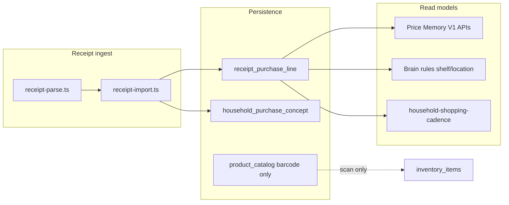

# Price Intelligence Foundation Audit

| Field | Value |
|-------|-------|
| **Audit date** | 2026-06-20 |
| **Master SHA** | `731c833ad1a85d48daebe9f9caf3ae62c6938fee` |
| **Prod SHA** | `ab46f3c49` (per [`CURRENT_REALITY.md`](./CURRENT_REALITY.md); may lag master) |
| **Scope** | Discovery only — static code/schema review. **Out of scope:** price graphs, scraping, Store Reco V2, new architecture, prod SQL sampling, migrations. |
| **Classification** | **Outcome A** — expose + measure existing data; not Outcome B (missing history table). |
| **Sources** | `schema.ts`, migrations `0025`/`0044`/`0051`/`0057`/`0059`, domain services, [`PRICE_MEMORY_STRATEGY.md`](./PRICE_MEMORY_STRATEGY.md), [`RECEIPT_INTELLIGENCE_NEXT_SLICE.md`](./RECEIPT_INTELLIGENCE_NEXT_SLICE.md), [`LEARNING_ENGINE.md`](./LEARNING_ENGINE.md) |

## Audit methodology

Static review of schema, migrations, import pipeline, Price Memory read model, Brain integration points, and strategy docs. No new predictors, migrations, or prod queries in this phase. Cross-checked against shipped migrations and integration tests in `src/lib/application/price-memory.integration.test.ts`.

**Upfront finding:** Skaffu is **not starting from zero**. Per-line prices, stores, and purchase dates are persisted on receipt import and exposed via Price Memory V1 APIs. Remaining gaps are data quality, taxonomy, store normalization, and product surfacing — not a missing `price_history` table.



---

## 1. Product Identity

For each field: **exists? / where / confidence**.

| Field | Verdict | Evidence |
|-------|---------|----------|
| Raw receipt name | **Green** | `receipt_purchase_line.product_name` — set at import via `receiptLineToPurchaseRecord()` in [`receipt-import-purchase.ts`](../src/lib/server/receipt-import-purchase.ts) from `ReceiptLine.name` |
| Normalized product name | **Green** (string key, not canonical product) | `receipt_purchase_line.normalized_key` from [`normalizeReceiptProductName()`](../src/lib/domain/purchase-pattern.ts) — lowercase, strip punctuation, trailing pack sizes (`1L`, `500 g`, etc.) |
| Product family / concept | **Yellow** | `receipt_purchase_line.concept_key` + [`household_purchase_concept`](../src/lib/infrastructure/db/schema.ts) (`household_id`, `concept_key`, `display_name`); defaults to normalized key at import; household-scoped only — no cross-household ontology |
| Brand | **Red** | No DB column on receipt lines. Open Food Facts brand is transient in barcode lookup only; not persisted on receipt path |
| Category | **Red** | No taxonomy table or receipt field; explicitly ignored in [`RECEIPT_INTELLIGENCE_NEXT_SLICE.md`](./RECEIPT_INTELLIGENCE_NEXT_SLICE.md) §Signals We Ignore Today |

### Barcode bridge

| Link | Status | Evidence |
|------|--------|----------|
| `inventory_items.barcode` | **Green** (scan path) | Column added in migration [`0057_product_catalog.sql`](../drizzle/0057_product_catalog.sql) |
| `product_catalog` | **Green** (OFF cache) | `barcode` PK, `name`, `image_url`, `source` — migration `0057` |
| Receipt → barcode | **Red** | `receipt_purchase_line.barcode` column exists (migration `0025`) but PDF parse path rarely populates it; no join to `product_catalog` at import |

### Match provenance

Migration [`0051_price_memory_phase1.sql`](../drizzle/0051_price_memory_phase1.sql) added `match_source` on `receipt_purchase_line`. Values per [`PurchaseLineMatchSource`](../src/lib/domain/purchase-pattern.ts):

| Value | Meaning |
|-------|---------|
| `inventory_item` | Line matched to existing lager post at import |
| `normalized_key` | Default when no inventory match |
| `concept_key` | Explicit household concept grouping |
| `raw` | Unnormalized fallback |

Also persisted: `inventory_item_id`, `import_source` (`receipt_scan` \| `photo_round` \| `kivra_forward` \| `manual` \| `unknown`), `line_index` (unique per `import_batch_id`).

### Example: mjölk identity chain

Receipt text `"Arla Mjölk 1L"` → `product_name` = raw string → `normalized_key` = `arla mjölk` (pack size stripped) → `concept_key` = `arla mjölk` unless user merges concepts later via `household_purchase_concept`.

---

## 2. Price History

**Can we show "Mjölk / ICA / 18.90 / 2026-06-10" today?**

| Question | Answer |
|----------|--------|
| Stored? | **Yes** — `unit_price`, `quantity`, `unit`, `store_label`, `purchased_at`, `currency`, `line_total` on `receipt_purchase_line` (migration [`0044_receipt_price_memory.sql`](../drizzle/0044_receipt_price_memory.sql)) |
| Reconstruct historical prices? | **Yes, per household** — [`price-memory.repository.ts`](../src/lib/infrastructure/repositories/price-memory.repository.ts): `getLastPaidPrice`, `getTimelineByKey`, `getTimelineByConceptKey`, `getSummaryByKey`, `search` |
| Reconstruct historical purchases? | **Yes** — all lines retained (event store, not snapshot); cadence uses `import_batch_id` + dates |
| User-visible today? | **Partial** — [`/settings/price-memory`](../src/routes/settings/price-memory/+page.svelte), item edit [`PurchaseMemoryCard`](../src/routes/item/[id]/edit/+page.svelte), [`PriceMemoryChip`](../src/lib/components/molecules/PriceMemoryChip.svelte) on replenishment — **no dedicated price graph** |
| API | `GET /api/price-memory/last?key=` · `GET /api/price-memory/timeline?key=` · `GET /api/price-memory/summary` · `GET /api/price-memory/search?q=` |

### Query contract

- **Window:** [`PRICE_MEMORY_WINDOW_DAYS`](../src/lib/domain/price-memory.ts) = **365 days**. Older rows remain in DB but are excluded from Price Memory queries (`windowFilter()` in repository).
- **Date fallback:** `COALESCE(purchased_at, created_at)` for ordering and window inclusion.
- **Price filter:** `unit_price IS NOT NULL` required for last-paid and timeline priced entries.

### Integration test behavior (cited)

From [`price-memory.integration.test.ts`](../src/lib/application/price-memory.integration.test.ts):

| Test | Behavior |
|------|----------|
| `returns latest paid price in 12-month window` | Two ICA/Coop lines for `Arla Mjölk 1L` → `getLastPaidPrice` returns `16.50` from Coop (newer `purchasedAt`) |
| `returns null when unit price is missing` | Line with `unitPrice: null` → null last paid |
| `enforces household boundary` | Same `normalizedKey` in another household → null for target household |
| `persists write path metadata` | Import via `insertLines` with `matchSource: 'inventory_item'`, `unitPrice: '18.90'` → persisted on row |
| `ignores duplicate line_index within batch` | Second insert same `(importBatchId, lineIndex)` → single row, first price wins |
| `builds cross-store timeline` | ICA `14.90` + Coop `15.90` → timeline length 2, distinct `storeLabel` values |
| `search does not false-merge` | Search `"mjölk"` returns both `arla mjölk` and oat milk keys separately |

### Data quality risks (yellow/red)

| Risk | Rating | Detail |
|------|--------|--------|
| Nullable `unit_price` | **Yellow** | Lines before migration `0044` or failed parse have no price; [`coerceReceiptPrice()`](../src/lib/server/receipt-parse.ts) allows null |
| 365-day read window | **Yellow** | Policy in domain constant; DB retains full history |
| OCR / name variance | **Yellow** | Normalizer handles case/punctuation; `"mjölk"` vs `"mjolk"` partially handled via Unicode alnum; receipt OCR typos still split keys |
| Batch-level `store_label` | **Yellow** | Free text from [`extractStoreFromReceiptText()`](../src/lib/domain/receipt-store.ts) on receipt header; copied to every line in batch — not validated store entity |
| No `receipt_import` header table | **Yellow** | Planned in [`PRICE_MEMORY_STRATEGY.md`](./PRICE_MEMORY_STRATEGY.md) §2 — never migrated; `import_batch_id` is opaque UUID |

### Parse → persist path

1. [`receipt-parse.ts`](../src/lib/server/receipt-parse.ts) — `RECEIPT_LINES_SCHEMA` includes `unitPrice`, `lineTotal`, `currency`.
2. [`receipt-import.ts`](../src/lib/server/receipt-import.ts) — batch `storeLabel`, `purchasedAt` from caller or [`extractPurchasedAtFromReceiptText()`](../src/lib/domain/receipt-store.ts).
3. [`receipt-import-purchase.ts`](../src/lib/server/receipt-import-purchase.ts) — maps to `RecordReceiptPurchaseLineInput` with `parseOptionalPriceField()`.

---

## 3. Store Intelligence

| Capability | Status | Where |
|------------|--------|-------|
| Store chain | **Yellow** | Free-text `store_label` on every line; regex chains in [`receipt-store.ts`](../src/lib/domain/receipt-store.ts) (ICA, Coop, Willys, Hemköp, Lidl, City Gross); TS enum `STORE_CHAIN_IDS` in [`store-recommendation.ts`](../src/lib/domain/store-recommendation.ts) — **not in DB** |
| Individual store | **Red** | No store ID, address, or geo |
| Purchase frequency per store | **Red** (global) / **Yellow** (partial) | [`deriveHouseholdShoppingCadence()`](../src/lib/domain/household-shopping-cadence.ts) — mode store on dominant shopping weekday only; `retailerCount` in Price Memory summary |
| Household preferred stores | **Yellow** | `detectPreferredStore` specified in [`RECEIPT_INTELLIGENCE_NEXT_SLICE.md`](./RECEIPT_INTELLIGENCE_NEXT_SLICE.md) Slice 2 — **not implemented** |
| Receipt batch metadata | **Yellow** | `import_batch_id` groups trips; no `receipt_import` header table |

### Migration cross-check: `0059_store_recommendation_telemetry.sql`

Adds `product_event` types for Store Recommendation V0 (`store_recommendation_opened`, `store_preference_selected`, `store_chain_selected`, etc.). **Telemetry only** — no receipt-derived store preferences. Flag `STORE_RECOMMENDATION_V0_ENABLED` is **off** in prod per [`CURRENT_REALITY.md`](./CURRENT_REALITY.md); UI removed per [`ACQUISITION_LOOPS_V1.md`](./ACQUISITION_LOOPS_V1.md) — V2 store comparison blocked until price engine exists.

---

## 4. Brain Usage

What Brain **actually consumes** vs audit-only context on receipt lines.

| Feature | Reads from receipts | Uses price/store in rules? |
|---------|---------------------|---------------------------|
| Replenishment suggestions | `normalized_key`, cadence dates (`purchasedAt ?? createdAt`), location, qty | **No** |
| Buy-again / autopilot patterns | Same + `detectReceiptPatternSuggestions` 90-day window | **No** |
| Finish suggestions | Same pipeline | **No** |
| Shelf-life learning | Purchase→expiry days → `household_shelf_life_rule` | **No** — `storeLabel`/`unitPrice` in `learning_feedback.context_json` audit only ([`predictor-types.ts`](../src/lib/domain/learning/predictor-types.ts)) |
| Location learning | `household_location_rule` | **No** |
| Shopping cadence UI | `store_label`, `import_batch_id`, dates via `deriveHouseholdShoppingCadence` | Display only |
| Consumption velocity | Code in [`consumption-velocity.ts`](../src/lib/domain/learning/consumption-velocity.ts) | **Not wired** to prod consume events |
| Store Recommendation V0 | **Nothing from receipts** | Telemetry + localStorage survey only |

Per [`LEARNING_ENGINE.md`](./LEARNING_ENGINE.md): Brain V1 is household rule + heuristic shelf-life/location — no LLM tier, no price-aware predictors. Per [`RECEIPT_INTELLIGENCE_NEXT_SLICE.md`](./RECEIPT_INTELLIGENCE_NEXT_SLICE.md): category habits, cross-store "cheapest here", and consumption velocity are explicitly deferred.

**Intentional today:** Brain ignores price/store in prediction rules — document to avoid duplicate "learning" work on price signals.

---

## 5. Data Quality Traffic Lights

| Dimension | Rating | Rationale |
|-----------|--------|-----------|
| Product normalization | **Yellow** | Robust string normalizer; no brand/category/family ontology; barcode not on receipt path |
| Price history | **Yellow** | Schema + APIs shipped (`0044`, Price Memory V1); capture rate unknown; 365d query window; nullable legacy rows |
| Store history | **Yellow** | Chain label only via header heuristic; no entity graph; partial cadence |
| Category history | **Red** | Not modeled |
| Household shopping habits | **Yellow** | Cadence + replenishment + buy-again work; preferred store + cross-store comparison missing |

### Optional prod DQ sampling (document only)

Template for future approved prod read — **not executed in this audit**:

```sql
-- Sample: price capture rate (last 90 days)
SELECT
  COUNT(*) FILTER (WHERE unit_price IS NOT NULL)::float / NULLIF(COUNT(*), 0) AS pct_with_price,
  COUNT(*) FILTER (WHERE store_label IS NOT NULL AND trim(store_label) <> '')::float / NULLIF(COUNT(*), 0) AS pct_with_store,
  MIN(COALESCE(purchased_at, created_at)) AS oldest,
  MAX(COALESCE(purchased_at, created_at)) AS newest
FROM receipt_purchase_line
WHERE created_at >= now() - interval '90 days';
```

---

## 6. Gap Analysis

| # | Gap | Current state | Desired state | Migration complexity | Risk |
|---|-----|---------------|---------------|---------------------|------|
| 1 | No product taxonomy | String keys only | Brand/category for insights | **L** — new tables + parse | False grouping if rushed |
| 2 | No store entity | Free-text `store_label` | Normalized chain + optional store ID | **M** — lookup table or enum in DB | False precision on comparison UI |
| 3 | Price capture rate unknown | No import telemetry | `receipt_price_captured` on import complete | **S** — event only | Low — scoped in [`FEATURE_ADOPTION_INITIATIVE.md`](./FEATURE_ADOPTION_INITIATIVE.md) §12 |
| 4 | 365-day read window | Domain constant | Longer trends policy | **S** — constant/query change only | UX false precision if shown without DQ |
| 5 | Store Reco V0 disconnected | Survey + localStorage | Receipt-derived preferences | **S–M** — pure fn first | Low if read-only aggregate |
| 6 | Brain ignores price/store | By design | N/A for Phase 1 | **None** | Duplicate work if re-built in Brain |
| 7 | Exposure gap | Data in settings/item edit/chip | Discoverable post-import | **S** — UI links/toast | Low |

### Strategy doc alignment

| Doc | Shipped vs planned |
|-----|-------------------|
| [`PRICE_MEMORY_STRATEGY.md`](./PRICE_MEMORY_STRATEGY.md) | §Executive finding describes **pre-0044** state; footer notes **V1 persistence shipped**. Still planned: `receipt_import` header table, capture telemetry, V2 trend UI |
| [`RECEIPT_INTELLIGENCE_NEXT_SLICE.md`](./RECEIPT_INTELLIGENCE_NEXT_SLICE.md) | Slice 1 (`purchasedAt` in patterns) **merged**; Slice 2 (`detectPreferredStore`) **not built**; category/cross-store explicitly ignored |
| [`LEARNING_ENGINE.md`](./LEARNING_ENGINE.md) | Shelf-life/location/replenishment learning **on** in prod flags; price/store in feedback context **audit only** |

### Migration timeline (receipt + price foundation)

| Migration | Purpose |
|-----------|---------|
| [`0025_receipt_purchase_pattern.sql`](../drizzle/0025_receipt_purchase_pattern.sql) | Base `receipt_purchase_line` + `receipt_pattern_dismissal`; no price columns |
| [`0044_receipt_price_memory.sql`](../drizzle/0044_receipt_price_memory.sql) | `unit_price`, `currency`, `line_total`, `store_label`, `purchased_at` + index on `(household_id, normalized_key, purchased_at)` |
| [`0051_price_memory_phase1.sql`](../drizzle/0051_price_memory_phase1.sql) | `inventory_item_id`, `concept_key`, `match_source`, `import_source`, `line_index`; `household_purchase_concept`; batch line uniqueness |
| [`0057_product_catalog.sql`](../drizzle/0057_product_catalog.sql) | OFF cache + `inventory_items.barcode` — scan path only |
| [`0059_store_recommendation_telemetry.sql`](../drizzle/0059_store_recommendation_telemetry.sql) | Store Reco V0 event types — no receipt schema change |

---

## 7. Future Capability Readiness

| Future capability | Ready with existing data? | Missing ~10% |
|-------------------|---------------------------|--------------|
| Price history (household) | **Mostly yes** | Capture DQ measurement, longer window policy, better surfacing |
| Store comparison | **No** (false precision risk) | Store normalization, multi-store price DQ, chain IDs in DB |
| Shopping insights | **Partial** | Cadence + replenishment yes; category/store prefs weak |
| Savings estimates | **No** | Need baseline price + cross-store or reference prices; only household last-paid exists today |

---

## 8. Phase 1 Proposal (Outcome A)

Primary path: **expose + measure** — no new `price_history` table. Three isolated options.

**Ship status (2026-06-20):**

| Option | Status |
|--------|--------|
| **Option 1** — `receipt_price_captured` telemetry | **Shipped** — `importReceiptLines` + scan bulk import |
| **Option 2** — preferred store signal | **Already partial** — `deriveHouseholdShoppingCadence` + Home Hushållet weekday/store line (no new module) |
| **Option 3** — Price Memory discovery | **Shipped** — chip tooltip/aria, replenishment link, post-import prices hint |

### Option 1 — Measure price capture (S, low risk)

Add `receipt_price_captured` telemetry on import complete with `linesWithPrice`, `totalLines` — already scoped in [`FEATURE_ADOPTION_INITIATIVE.md`](./FEATURE_ADOPTION_INITIATIVE.md) §12. Answers yellow→green boundary for price history DQ **without schema change**.

### Option 2 — Connect existing store signal (S, low risk)

Implement `detectPreferredStore()` pure function + Home Hushållet one-liner — specified as Slice 2 in [`RECEIPT_INTELLIGENCE_NEXT_SLICE.md`](./RECEIPT_INTELLIGENCE_NEXT_SLICE.md). **No migration**; reads `store_label` on existing `receipt_purchase_line` rows grouped by `import_batch_id`.

### Option 3 — Expose existing timeline (S, low risk)

Improve discovery of Price Memory timeline — e.g. tooltip on `PriceMemoryChip` linking to item edit `PurchaseMemoryCard`, or post-import toast after first priced receipt. **No new read model**; uses existing `GET /api/price-memory/timeline`.

### Explicitly not Phase 1

- New `price_history` table
- Scraping or external price APIs
- Price graphs / trend dashboards
- Store comparison UI
- Store Reco V2
- Category taxonomy migration

---

## 9. Related Docs

| Document | Relevance |
|----------|-----------|
| [`PRICE_MEMORY_STRATEGY.md`](./PRICE_MEMORY_STRATEGY.md) | V1/V2/V3 roadmap; note executive section is pre-ship snapshot — persistence now live |
| [`RECEIPT_INTELLIGENCE_NEXT_SLICE.md`](./RECEIPT_INTELLIGENCE_NEXT_SLICE.md) | Signal map, ignored signals, Slice 2 preferred store |
| [`LEARNING_ENGINE.md`](./LEARNING_ENGINE.md) | Brain scope — no price predictors |
| [`ACQUISITION_LOOPS_V1.md`](./ACQUISITION_LOOPS_V1.md) | Store share V2 blocked on price engine |
| [`FEATURE_ADOPTION_INITIATIVE.md`](./FEATURE_ADOPTION_INITIATIVE.md) | `receipt_price_captured` telemetry spec |
| [`CURRENT_REALITY.md`](./CURRENT_REALITY.md) | Prod flags: `PRICE_MEMORY_V1_ENABLED` on; `STORE_RECOMMENDATION_V0_ENABLED` off |

---

## Summary verdict

Skaffu already stores per-line prices, store labels, and purchase dates on receipt import (migrations `0044` + `0051`) and serves them through Price Memory V1. The foundation supports household-level "Mjölk / ICA / 18.90 / 2026-06-10" queries today. Gaps are **measurement** (capture rate), **normalization** (store entity, taxonomy), **policy** (365-day window), and **discovery** (buried UI) — not missing infrastructure. Recommended next step: Phase 1 Option 1 (telemetry) plus one exposure or store-signal option after PO approval.
