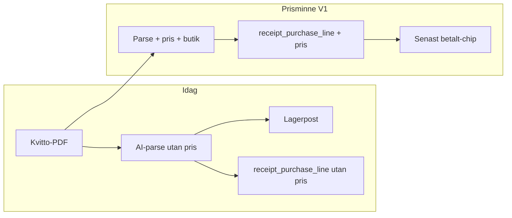
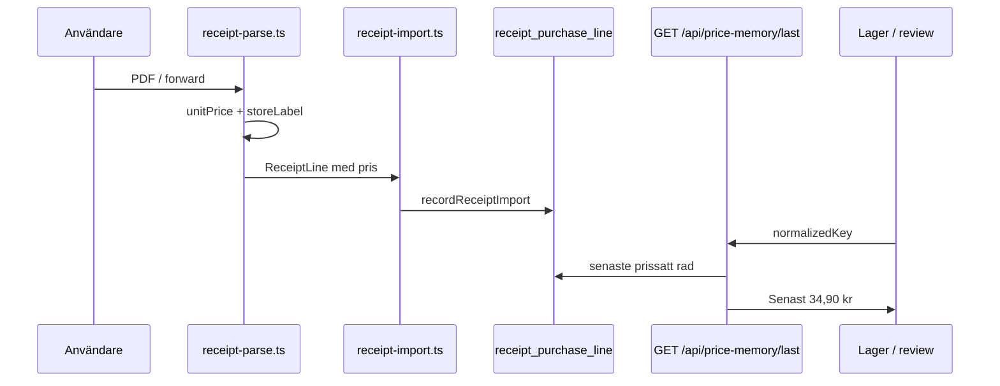

# Prisminne — strategi och V1-plan

*Version: juni 2026. Strategisk analys och implementationsplan för personligt prisminne (breakthrough B2) — dokument först, kod i separat build.*

**Relaterade dokument:** [`BREAKTHROUGH_GROWTH_OPPORTUNITIES.md`](./BREAKTHROUGH_GROWTH_OPPORTUNITIES.md) (B2) · [`RECEIPT_AUTOPILOT_NO_KIVRA_PLAN.md`](./RECEIPT_AUTOPILOT_NO_KIVRA_PLAN.md) · [`RECEIPT_TEST_PACK.md`](./RECEIPT_TEST_PACK.md) · [`PRICING.md`](./PRICING.md) · [`NEXT_STAGE_STRATEGY.md`](./NEXT_STAGE_STRATEGY.md) · [`GROWTH_STRATEGY.md`](./GROWTH_STRATEGY.md) · [`ACQUISITION_WEDGES.md`](./ACQUISITION_WEDGES.md) · Smart Replenishment V1 (`/inkop` — kvittobaserade köp-igen-förslag till inköpslistan, ingen AI)

---

## Executive finding — korrektion av tidigare antagande

[`BREAKTHROUGH_GROWTH_OPPORTUNITIES.md`](./BREAKTHROUGH_GROWTH_OPPORTUNITIES.md) B2 antyder att grunddata för prisminne redan finns i `receipt_purchase_line`. **Det stämmer bara delvis.** Tabellen lagrar köphistorik per produktnyckel — namn, normaliserad nyckel, valfri streckkod, mängd, enhet, lagringsplats och import-batch — men **inga prisfält och ingen butiksidentitet**.

Schema i `src/lib/infrastructure/db/schema.ts`:

```503:520:src/lib/infrastructure/db/schema.ts
export const receiptPurchaseLineTable = pgTable(
	'receipt_purchase_line',
	{
		id: text('id').primaryKey(),
		householdId: text('household_id')
			.notNull()
			.references(() => householdTable.id, { onDelete: 'cascade' }),
		userId: text('user_id')
			.notNull()
			.references(() => userTable.id, { onDelete: 'cascade' }),
		importBatchId: text('import_batch_id').notNull(),
		productName: text('product_name').notNull(),
		normalizedKey: text('normalized_key').notNull(),
		barcode: text('barcode'),
		location: text('location', { enum: ['fridge', 'freezer', 'cupboard'] }).notNull(),
		quantity: numeric('quantity', { precision: 10, scale: 2 }),
		unit: text('unit'),
		createdAt: timestamp('created_at', { withTimezone: true, mode: 'date' }).notNull().defaultNow()
	},
```

Parsningspipelinen extraherar heller inte pris idag. `RECEIPT_LINES_SCHEMA` i `src/lib/server/receipt-parse.ts` tillåter endast `name`, `quantity`, `unit` och `location`. Systemprompten instruerar uttryckligen att hoppa över butiksinfo, och `preprocessReceiptText` tar bort totalsummor, moms och betalrader — men **radpriser fångas aldrig och sparas aldrig**:

```15:35:src/lib/server/receipt-parse.ts
export const RECEIPT_LINES_SCHEMA = {
	type: 'object',
	properties: {
		lines: {
			type: 'array',
			items: {
				type: 'object',
				properties: {
					name: { type: 'string' },
					quantity: { type: 'string' },
					unit: { type: 'string' },
					location: { type: 'string', enum: ['fridge', 'freezer', 'cupboard'] }
				},
				required: ['name', 'quantity', 'unit', 'location'],
				additionalProperties: false
			}
		}
	},
	required: ['lines'],
	additionalProperties: false
} as const;
```

Domänmodellen `ReceiptLine` i `src/lib/domain/receipt-line.ts` speglar samma begränsning: inga prisfält. [`RECEIPT_AUTOPILOT_NO_KIVRA_PLAN.md`](./RECEIPT_AUTOPILOT_NO_KIVRA_PLAN.md) listar B2 som **ej byggt** med motiveringen att `receipt_purchase_line` saknar pris.

| Finns idag | Saknas idag |
|------------|-------------|
| `receipt_purchase_line`: `productName`, `normalizedKey`, `barcode`, `quantity`, `unit`, `location`, `importBatchId`, `createdAt` | **Enhetspris, radtotal, valuta** |
| `normalizeReceiptProductName` + 90-dagars mönsterdetektion | **Butikskedja / butiksnamn** |
| `importBatchId` grupperar rader per import | **Receipt-nivå-tabell** (batch-id är opaque UUID utan metadata) |
| Kvitto-PDF-pipeline + per-rad plats (AI/heuristik) | **Kvitto-datum** (`createdAt` = importtid) |
| Receipt autopilot / `/inkop`-förslag | Pris i `ReceiptLine` eller `RECEIPT_LINES_SCHEMA` |
| Lager + inköpslista som intilliggande kontext | Jämförelse över butiker (inga multi-store-priser per produkt) |

**Strategisk slutsats:** gapet är persistens och parse-schema, inte en ny produktkategori. Confidence för V1-datadelen är hög; parsing-noggrannhet är medium och kräver utökning av [`RECEIPT_TEST_PACK.md`](./RECEIPT_TEST_PACK.md).



---

## 1. Svar på sex analysfrågor

### 1.1 Vilken data finns redan?

Skaffu har en fungerande kvittokedja som ger **köpfrekvens och produktmatchning**, inte priser.

**Köphistorik och mönster.** Varje lyckad import skriver rader till `receipt_purchase_line` via `scan/+page.server.ts` och `receipt-import.ts` (manuell PDF samt valfri Kivra-forward). `detectReceiptPatternSuggestions` i `src/lib/domain/purchase-pattern.ts` analyserar 90 dagars historik och returnerar `importCount`, `lineCount` och `lastPurchasedAt` per `normalizedKey` — grunden för receipt autopilot på `/inkop` (`ReceiptAutopilotSection.svelte`).

**Normalisering.** `normalizeReceiptProductName` slår ihop variantnamn (“Arla Mellanmjölk 1,5%”) till en nyckel som kan matchas över flera importer. Det är samma mekanism som behövs för prisminne.

**Batch-gruppering.** `importBatchId` (opaque UUID per import) grupperar rader från samma kvitto, men det finns ingen `receipt_import`-entitet med metadata på batch-nivå.

**Per-rad kontext.** AI/heuristik sätter `location` (fridge/freezer/cupboard). Valfri `barcode` finns i schemat men är ofta null från PDF-text.

**Transient råtext.** PDF-text finns tillfälligt under parse; den lagras inte permanent — relevant om man senare vill re-parsa historiska kvitton för pris (V2+).

**Intilliggande produktytor.** Lager (`inventory_item`) och inköpslista ger kontext (“du har 2 kvar i kylen”) som konkurrenter som Matpriskollen saknar.

**Receipt autopilot (B9 compound).** `ReceiptAutopilotSection.svelte` på `/inkop` föreslår återköp baserat på frekvens — samma `normalizedKey`-pipeline som prisminne kommer återanvända. När pris finns kan autopilot i framtiden kombinera “köper du ofta” med “senast X kr”, men V1 ska inte blanda in det i nudge-copy.

**Events och funnel.** Delvis telemetri finns (`receipt_parsed`, Kivra-forward-events). Prisminne bör senare mäta visningar separat (uppgift 9) utan att bli acquisition-metric.

### 1.2 Vilken data saknas?

| Saknat | Konsekvens |
|--------|------------|
| **Enhetspris / radtotal (SEK)** | Kan inte svara “vad betalade jag?” |
| **Butik / kedja** | Kan inte skilja ICA Maxi Toftanäs från Willys |
| **Kvitto-datum (transaktion)** | `createdAt` = importtid, inte inköpsdatum |
| **Receipt-import metadata-tabell** | Ingen batch-nivå store/date/total |
| **Stabil EAN över textvarianter** | Svårare exakt produktmatch |
| **Enhetsnormaliserat pris (kr/kg, kr/l)** | Orättvis jämförelse vid olika förpackningar (V2) |
| **Konfidens / parse-källa** | Svårt att dölja osäkra rader |

Utan de tre första posterna finns inget meningsfullt prisminne — bara “du köpte den här produkten X gånger”.

**Teknisk skuld att adressera i V1:** `ReceiptPurchaseLineRecord` och `RecordReceiptPurchaseLineInput` i `purchase-pattern.ts` speglar DB utan pris — alla tre lager (parse, domän, repo) måste uppdateras i samma slice så historiska rader inte blir inkonsistenta med nya.

**Re-parsing av historik:** eftersom rå PDF-text inte lagras kan gamla importer inte få pris retroaktivt utan att användaren laddar upp samma kvitto igen. Dokumentera detta i UI-copy (“prisminne gäller kvitton importerade från och med …”) om vi shippar V1 utan backfill.

### 1.3 Vad kan shipas snabbt? (V1-scope)

V1 är en **wedge-stor slice**, inte en ny app-yta:

1. Utöka parse + domän + DB + import-pipeline med pris (och enkel butiksetikett).
2. Exponera **“Senast betalt”** för produkter med minst en prissatt rad inom 12 månader.
3. Visa subtilt på lagerdetalj eller kvitto-review — **inte** ett pris-dashboard.

Ingen acquisition-copy; kör parallellt med W1–W4 enligt [`GROWTH_STRATEGY.md`](./GROWTH_STRATEGY.md). Ship V1 **efter** nuvarande wedge-commit så fokus inte splittras.

**Vad V1 uttryckligen inte är:** en prissida, en “inflation dashboard”, en Matpriskollen-integration, eller en ny onboarding-hero. Det är ett **context chip** som svarar en fråga i befintliga flöden — samma filosofi som receipt autopilot (compound på `/inkop`, inte landningssida).

**Leveransordning inom V1:** migration → parse → import → service/API → UI. UI ska vara sista steget så vi kan validera dataintegritet med integrationstester före användare ser siffror.

### 1.4 Omedelbart användarvärde

- **“Har det här blivit dyrare?”** i ögonblicket användaren granskar kvitto eller bläddrar i skafferiet.
- Förstärker **kvittovana**: fler importer → tätare minne → mer värde (compound-spår i [`NEXT_STAGE_STRATEGY.md`](./NEXT_STAGE_STRATEGY.md)).
- Differentierar mot Bring/list-appar (ingen prishistorik) och Matpriskollen (anonym butiksfeed idag, inte *dina* betalda priser kopplade till lager).

Matpriskollen äger *marknadspriser* (3 000+ butiker enligt [`COMPETITIVE_ANALYSIS.md`](./COMPETITIVE_ANALYSIS.md) §4.8). Skaffus kil är **hushållets egna betalda priser** från nordiska PDF/Kivra-kvitton — värdefullt först efter receipt-activation (B1 → B2).

**Ögonblick av värde:**

1. **Kvitto-review** — direkt efter parse, innan bulk create: “Senast betalade du 29,90 kr för liknande mjölk (feb).”
2. **Lagerbrowse** — vid utgående eller veckohandling: snabb sanity check utan att öppna gamla PDF:er.
3. **Receipt re-import** — compound-spår i [`NEXT_STAGE_STRATEGY.md`](./NEXT_STAGE_STRATEGY.md): varje nytt kvitto kan bekräfta eller utmana förväntat pris.

Värdet är **emotionellt och budgetärt**, inte analytiskt i V1. Användaren behöver inte grafer — bara ett pålitligt “senast”.

### 1.5 Svårt för konkurrenter att kopiera

- **Hushållsspecifik tidslinje** byggd på ackumulerade kvitton + `normalizeReceiptProductName`.
- **Koppling till skafferi** — “senast 34,90 kr, du har 2 kvar” — ChatGPT och prisjämförelseappar har varken kvitton eller lager.
- **Compound med Kivra-forward** (`0031_household_receipt_forward_token`) — varje forwardat kvitto fyller minnet utan manuell scan.
- Kräver nordisk PDF-parsing och svensk kvittotext (komma-decimaler, kr/st, multi-buy-rader).

**Moat vs Matpriskollen “historik”-risk (B2):** om Matpriskollen lägger sparade sökningar eller listor med lägre friktion, vinner de på *marknads* jämförelse. Skaffu försvarar sig genom **kvitto-ground truth + lager** — data användaren redan betalat för att samla via B1-autopilot, inte data de manuellt söker upp.

**Moat vs Matdags / list-appar:** de saknar receipt-rad-historik kopplad till `inventory_item`. Bring m.fl. optimerar lista, inte “vad betalade jag senast för den här EAN:en på mitt kvitto”.

### 1.6 Mer värdefullt över tid

- Fler kvitton → tätare historik → trender, enkel upp/ner mot förra köpet (V2).
- Fler butiker i historiken → jämförelse *från användarens egna kvitton*, inte scrapad marknadsdata (V3).
- Fler hushållsmedlemmar → delat prisminne.
- Koppling till inköpslista: “senast X kr, Y staplar trendar uppåt”.

Prisminne är **inte en acquisition wedge** ([`ACQUISITION_WEDGES.md`](./ACQUISITION_WEDGES.md) §2.1) — det är activation/retention compound efter B1.

**Tidslinje för compound:**

| Fas | Data | Användarupplevelse |
|-----|------|-------------------|
| 0–5 kvitton | Gles pris per produkt | Chip visas sällan; gate-copy uppmuntrar fler importer |
| 5–20 kvitton | Flera tidpunkter per staple | “Senast betalt” blir meningsfullt för mjölk, bröd, kaffe |
| 20+ kvitton | Multi-butik, säsongsvariation | V2-trend och V3-butiksjämförelse blir försvarbara |

Ackumulerad `receipt_purchase_line` stärker även B9 autopilot och framtida benchmark (`skaffurapport.service.ts` — aggregerad, inte individuellt prisminne).

---

## 2. V1 / V2 / V3 — design

| Version | Användarfråga | Scope | Komplexitet |
|---------|---------------|-------|-------------|
| **V1** | “Vad betalade jag senast?” | Parse + persist `unitPrice` (SEK), valfri `storeLabel` (heuristik); `getLastPaid(normalizedKey)`; UI-chip på lager + kvitto-review | **M** (~1 wedge-slice) |
| **V2** | “Prishistorik / trend?” | Tidslinje 6–12 mån, enkel upp/ner vs förra köpet; valfri månatlig korg-delta för top N-staplar | **M–L** |
| **V3** | “Butikjämförelse / inflation?” | Samma produkt över butiker *från användarens kvitton*; enkel kategori-index; **ingen** Matpriskollen-API | **L** |

**Explicit borttaget (alla versioner):** enterprise BI, admin-prisdashboards, live marknadspris-scraping, Matpriskollen-klon.

**Pro-gräns (hypotes):** V1 “senast betalt” gratis; V2 trender Pro — i linje med AI + kvitto-bundle i [`PRICING.md`](./PRICING.md) §3. Kvitto-PDF-parse är redan Pro-tung drift; att visa *ett* senaste pris på free tier driver receipt-habit utan att öppna obegränsad AI-analys.

**V2 (efter V1-bevis):** enkel linje eller lista per produkt — “du betalade 32,50 → 34,90 → 36,90 kr senaste tre gångerna”. Ingen avancerad indexering mot KPI eller SCB. Eventuell “top 10 staples upp/ner denna månad” som Pro-insight — fortfarande hushållsdata, inte marknadsdata.

**V3 (moat-förstärkning):** “Du köpte samma pasta hos ICA tre gånger och Willys en gång — här är *dina* medel.” Kräver tillräcklig butikstäthet i historiken; tom state ska vara ärlig (“handla hos fler butiker eller importera fler kvitton”).

### Parsningsstrategi (V1)

- Utöka `RECEIPT_LINES_SCHEMA` med `unitPrice` (number, SEK) och valfri `lineTotal`.
- Uppdatera AI-prompt med svenska kvittoregler (kr/st, komma-decimal, rabatt-rader).
- `extractStoreFromReceiptText()` på första ~500 tecken (ICA, Willys, Coop, Hemköp, Lidl, City Gross).
- Ny `receipt_import`-rad eller tabell keyed by `importBatchId`: `storeLabel`, `purchasedAt`, `source`.
- Regression: utöka [`RECEIPT_TEST_PACK.md`](./RECEIPT_TEST_PACK.md) med förväntade priser per rad (start 3–5 ICA-PDF:er).

**Svenska kvittoregler att kodifiera i prompt:**

- Decimal komma i PDF (`34,90`) → normalisera till punkt i JSON.
- `kr/st`, `kr/kg`, `@` multi-buy (“2 för 50”).
- Rabatt-rader: preferera netto enhetspris efter rabatt om synligt; annars flagga låg konfidens (V2).
- Rad utan tydligt pris: tillåt null `unitPrice` — raden ska fortfarande skapa lager men inte prisminne.

**Butiks-heuristik (V1, enkel):** regex/keyword på header (`ICA`, `Maxi`, `Willys`, `Coop`, `Hemköp`, `Lidl`, `City Gross`). Fallback: null store — chip visar bara pris + datum. Butik på batch-nivå (`receipt_import`) räcker om alla rader delar samma kvitto.

**DB-migration (V1):** nullable `unit_price`, `currency` (default SEK), valfri `store_label` på `receipt_purchase_line`; index `(household_id, normalized_key, created_at)`.

**Query-kontrakt (V1):** `getLastPaidPrice(householdId, normalizedKey)` returnerar senaste rad där `unit_price IS NOT NULL`, inom 12 månader, sorterat på `purchased_at` om tillgängligt annars `created_at`. Returnera null om inga träffar — UI visar inget chip (inte “0 kr”).



---

## 3. Risker och gates

| Risk | Mitigation |
|------|------------|
| Fel parse-pris → trust break | Visa “från kvitto” + datum; användaren kan avfärda; visa inte förrän ≥1 prissatt import |
| Kampanj / multi-buy snedvrider enhetspris | Spara radtotal + quantity; enhetsnormalisering i V2 |
| Låg kvittovolym | Gate UI: “Importera fler kvitton för prisminne” |
| W1–W4-fokus splittras | Ship V1 efter wedge-commit; ingen acquisition-copy |
| Pro-gräns oklar | V1 free; V2 trends enligt [`PRICING.md`](./PRICING.md) |
| Parsing-accuracy | [`RECEIPT_TEST_PACK.md`](./RECEIPT_TEST_PACK.md) med prisförväntningar före prod |

**Success metrics (dokumentera, bygg inte dashboards):**

- Andel `receipt_parsed` med pris-metadata.
- Användare med ≥3 prissatta importer.
- Klick/visning på “senast betalt”.
- Korrelation med `receiptRate` och D30.

**Beslutsgate:** [`NEXT_STAGE_STRATEGY.md`](./NEXT_STAGE_STRATEGY.md) anger B1+B2 under “Receipt pipeline i skala” med `receiptRate ≥ 25 %` och testpack ≥15/20 godkända — parsing-trust-break är explicit risk.

**Operativ gate vs wedges:** [`RECEIPT_AUTOPILOT_NO_KIVRA_PLAN.md`](./RECEIPT_AUTOPILOT_NO_KIVRA_PLAN.md) prioriterar manuell PDF + review som primär fallback. Prisminne ska fungera i **samma review-flöde** (`ReceiptBulkAddFlow.svelte`) — inte kräva Kivra-forward. Forward utan review (auto-import) ökar risk för fel pris; V1 bör initialt persist pris endast när användaren godkänt review, om inte vi explicit accepterar forward-risk i en senare flag.

**Trust UX (V1):**

- Chip-text: “Senast betalt: X kr (från kvitto, {månad år})”.
- Ingen röd/grön “inflation”-färg i V1 — undvik false precision.
- Dismiss per produkt (valfritt V1.1) om fel parse — annars support-burden.

---

## 4. V1-implementationsuppgifter (numrerade)

*Dokumentation endast — implementera i separat build efter bekräftelse. Starta inte V2/V3 i samma slice.*

1. **Migration `0044_receipt_price_memory.sql`** — kolumner på `receipt_purchase_line` (`unit_price`, `currency`, valfri `store_label`); valfri `receipt_import`-tabell länkad via `import_batch_id` (`store_label`, `purchased_at`, `source`).

2. **Domän** — utöka `ReceiptLine` (`src/lib/domain/receipt-line.ts`), `RecordReceiptPurchaseLineInput` och `ReceiptPurchaseLineRecord` (`src/lib/domain/purchase-pattern.ts`) med prisfält.

3. **Parse** — uppdatera `src/lib/server/receipt-parse.ts`: schema, prompt, mappers; enhetstester med fixture-snippets.

4. **Butiks-heuristik** — ny `src/lib/domain/receipt-store.ts` + tester på ICA/Willys-headersträngar.

5. **Import-vägar** — `src/lib/server/receipt-import.ts` och `src/routes/scan/+page.server.ts` skickar pris till `recordReceiptImport`.

6. **Service** — `PriceMemoryService` eller utökning av purchase-pattern: `getLastPaidPrice(householdId, normalizedKey)`, `listPriceHistory` (V2-stub).

7. **API** — `GET /api/price-memory/last?key=` (auth, hushållsscoped).

8. **UI V1** — subtilt chip på `InventoryTableRow.svelte` eller artikel-detalj: t.ex. “Senast: 34,90 kr · ICA · mars 2026”; valfritt på kvitto-review.

9. **Events** — valfritt `price_memory_viewed` för compound-telemetri (`product-events.ts`).

10. **Tester** — integration: insert prissatt rad → query senaste pris; parsing-test på 2 fixture-PDF:er med förväntade priser.

11. **Docs** — korrigera B2-påstående i [`BREAKTHROUGH_GROWTH_OPPORTUNITIES.md`](./BREAKTHROUGH_GROWTH_OPPORTUNITIES.md) om “data finns” utan priskolumn (se executive finding ovan).

---

## 5. Sammanfattning

Prisminne (B2) bygger på samma kvittokedja som receipt autopilot ([`RECEIPT_AUTOPILOT_NO_KIVRA_PLAN.md`](./RECEIPT_AUTOPILOT_NO_KIVRA_PLAN.md)) men kräver ett ärligt datagap: **pris och butik persistas inte idag** — varken i `receipt_purchase_line` eller i `receipt-parse.ts`. V1 är avgränsad, shipbar och compound — “senast betalt” — utan BI-scope creep. V2/V3 följer efter bevisad parsing-kvalitet och receipt-rate.

**Nästa steg (ej denna build):** bekräfta V1-slice → implementera uppgifter 1–10 → utöka [`RECEIPT_TEST_PACK.md`](./RECEIPT_TEST_PACK.md) med prisförväntningar → mät success metrics utan admin-dashboard.

Strategin alignar med compound-spåret i [`NEXT_STAGE_STRATEGY.md`](./NEXT_STAGE_STRATEGY.md) och Pro-hypotesen i [`PRICING.md`](./PRICING.md), parallellt med acquisition-wedges W1–W4. Investerarperspektiv: prisminne förstärker “receipt pipeline i skala” tillsammans med B1 — två compound-spår som kräver activation, inte stranger-install.
