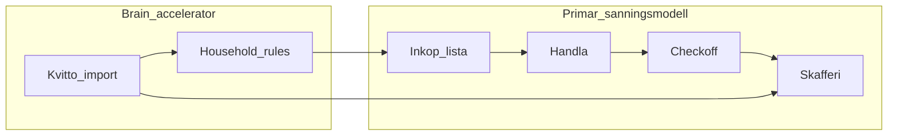
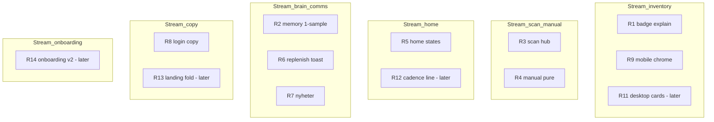

# Fullständig produktaudit — Skaffu (jun 2026)

> **Canonical audit** — single source for critical issues, Ready Now slices, merge/deploy order, and PO verification. Supersedes fragmented plan files in `.cursor/plans/`.

**Baseline:** Prod [`f70c2c9c`](https://github.com/arpi09/grocery-manager/actions/runs/27507835082) · Master `80809b7c` (docs-only ahead at audit time)  
**Princip:** Lita på prod UX, inte gamla planer. Narrativ sprint (S1–S4, #73/#74) förbättrade lista-first men **Brain synlighet, inventory polish, scan IA och onboarding-teaching** är fortfarande flaskhalsar.

**Relaterat:** [CURRENT_REALITY.md](./CURRENT_REALITY.md) · [SKAFFU_2026_VISION.md](./SKAFFU_2026_VISION.md) · [BRAIN_ROADMAP.md](./BRAIN_ROADMAP.md) · [UX_COORDINATOR_BACKLOG.md](./UX_COORDINATOR_BACKLOG.md)

---

## Shopping truth model (A + B hybrid)

**Val:** Primär loop = Inköp → handla → checkoff → skafferi (`shopping-to-pantry`). **Kvitto** är bulk-accelerator efter handel (fyller skafferi + Brain), inte konkurrerande sanningskälla.

Se [SKAFFU_2026_VISION.md](./SKAFFU_2026_VISION.md) för narrativ och copy.

---

## DEL 1 — Critical UX Issues

1. **Onboarding blockerar hem** — ny user ser modal, inte produkt ([`OnboardingGuide.svelte`](../src/lib/components/organisms/OnboardingGuide.svelte))
2. **Onboarding illustrerar pantry/foto**, copy säger lista ([`OnboardingStepIllustration.svelte`](../src/lib/components/organisms/OnboardingStepIllustration.svelte))
3. **Path guide titel** alltid "Lägg in första varor" även shopping-path
4. **"Nästa" på pathGuide** hoppar till celebrate utan activation
5. **Scan: fyra peer modes** — tabs + auto-skip hub ([`scan/+page.svelte`](../src/routes/scan/+page.svelte), [`last-scan-defaults.ts`](../src/lib/utils/last-scan-defaults.ts))
6. **Nav Skanna → receipt direkt**, hub hero aldrig ses
7. **Manual add = scan-first** — barcode/foto tabs i [`AddItemForm.svelte`](../src/lib/components/organisms/AddItemForm.svelte); cancel → photo scan
8. **Hem H1 "Ditt skafferi"** vs lista-first body ([`sv.json`](../src/lib/i18n/locales/sv.json))
9. **Home V4 states** `lista_ready` / `expiry` derived men **ej wired** i UI ([`home-state.ts`](../src/lib/domain/home-state.ts), [`HomeDashboard.svelte`](../src/lib/components/organisms/HomeDashboard.svelte))
10. **Engaged HomeNextAction** foto-default konkurrerar med veckohandel
11. **Cold home** döljer all Brain — ny user ser ingen intelligens
12. **Inventory mobile** ~50–60% viewport chrome före första rad ([`InventoryList.svelte`](../src/lib/components/organisms/InventoryList.svelte))
13. **Lager i Mer** — inventory är second-class på mobil ([`nav-config.ts`](../src/lib/navigation/nav-config.ts))
14. **Pantry bridge copy** "Lägg till i skafferi?" utan loop-förklaring ([`ShoppingToPantrySheet.svelte`](../src/lib/components/molecules/ShoppingToPantrySheet.svelte))
15. **Memory Explorer** länk från settings kan vara tom (1-sample rules) ([`SuggestionsSettingsPanel`](../src/lib/components/organisms/SuggestionsSettingsPanel.svelte) vs [`memory/+page`](../src/routes/settings/memory/+page.svelte))
16. **Replenishment fold** på inkop collapsed när lista har poster
17. **Login subtitle** fortfarande skafferi-app ([`sv.json`](../src/lib/i18n/locales/sv.json) auth.login)
18. **Landing below-fold** pantry/scanner framing ([`content.ts`](../src/lib/marketing/content.ts), [`LANDING_STORY_AUDIT.md`](./LANDING_STORY_AUDIT.md))
19. **pageHints.hem** expiry/kyl framing, inte veckoloop
20. **Grannskafferiet** i Mer nav trots Tier C pause

---

## DEL 2 — Critical UI Issues

1. **Desktop inventory = admin datagrid** — uppercase headers, zebra, sort glyphs ([`InventoryDataTable.svelte`](../src/lib/components/molecules/InventoryDataTable.svelte))
2. **Action column dominerar** — Slut + ⋯ varje rad ([`InventoryTableRow.svelte`](../src/lib/components/molecules/InventoryTableRow.svelte))
3. **Badge pile** under namn — finished/auto-expired/price chips
4. **Mobile Product Row** expiry+badge på subline, inte spec (#74 partial)
5. **Triple consume affordance** — swipe + Slut + overflow ([`InventoryCompactRow.svelte`](../src/lib/components/molecules/InventoryCompactRow.svelte))
6. **ListToolbar** 4 filter chips + sort = 2 rader på 390px ([`ListToolbar.svelte`](../src/lib/components/molecules/ListToolbar.svelte))
7. **Två chip-system** i sticky band (toolbar vs section toggles)
8. **Add block på inventory page** — foto primary + streckkod/kvitto siblings utanför details ([`inventory/[location]/+page.svelte`](../src/routes/inventory/[location]/+page.svelte))
9. **"Med datum" filter** inkluderar uppskattade — ingen "granska uppskattningar"
10. **Mobile sort** halv-feature (namn↔expiry only, ingen riktning)
11. **Notes** desktop only, saknas mobil
12. **Expiry formatting** olika mobil vs desktop
13. **Scan tabs** foto vs "Fota in varor" — två photo-koncept
14. **Receipt upload** heavy — guide + dubbla pickers ([`ReceiptBulkAddFlow.svelte`](../src/lib/components/organisms/ReceiptBulkAddFlow.svelte))
15. **Settings** long-scroll utan progress — 8+ sektioner
16. **Nyheter** en post — timeline ser tom ([`app-news.ts`](../src/lib/data/app-news.ts))
17. **Inkonsekvent spacing/typography** mellan EmptyState, Card, DataGrid, Product Row
18. **"Slut" / "Expired (auto)"** — systemjargong
19. **Bulk infer banner** "AI i ett tryck" — tekniskt
20. **Pro CTA** i varje mobile header — upsell-heavy

---

## DEL 3 — Critical Product Issues

1. **Användaren kan inte beskriva vad Skaffu lär sig** efter 1 vecka utan kvitto
2. **Brain ≠ produktlöfte** i copy men ≠ upplevelse i lager
3. **Lista-first narrative** vs **skafferi chrome** (titles, login, hints)
4. **Activation paths** (foto/kvitto/lista) likvärdiga i kod men olika produktlöfte
5. **USER_LOCAL smoke pending** — prod Brain ej PO-verifierad @ `f70c2c9c`
6. **`PRODUCT_NARRATIVE_AUDIT.md` saknas** — audit fragmenterad i plans/docs (this doc closes the gap)
7. **Doc drift** — UX_COORDINATOR_BACKLOG said Slice 1 PLANNED trots #74 merged (fixed in this PR)
8. **HouseholdBriefing orphaned** — receipt-loop UX ej mountad
9. **Per-user pantry mode** — partners kan ha olika checkoff→pantry utan varning
10. **Acquisition:** delad lista W1 stark; grannskafferiet i nav svag för retention wedge

---

## DEL 4 — Critical Brain Visibility Issues

| Gap | Severity |
|-----|----------|
| Mobile `EstimatedBadge` `interactive={false}` | P0 |
| `PredictionExplainSheet` ej wired från inventory | P0 |
| Replenishment accept/dismiss learning tyst | P0 |
| Location learning ingen lager-surface | P1 |
| Settings 1-sample vs Memory Explorer 2-sample | P0 |
| Receipt toast `rulesImproved` overclaims | P1 |
| Confidence tier `low` + V1.4 pill ej shipped | P2 |
| Cadence one-liner på hem §3 saknas (V2.2) | P1 |
| Nyheter ej kommunicerar Brain V1 / sprint | P1 |
| Cold home döljer replenishment/eat-first | P1 |
| Price memory desktop-only | P2 |
| Three vocabularies: Uppskattat / AI-gissning / Estimated | P1 |

**Halvfärdig = osynlig:** replenishment learning, location på lager, cadence som koncept, memory under 2 samples.

---

## DEL 5 — Critical Mobile Issues

1. Inventory sticky chrome eats list (LocationTab + ListToolbar + filters)
2. Lager bakom Mer — ingen stale badge på Mer-tab
3. Brain explain dead på inventory compact rows
4. Add-goods block ovanför sticky band på first paint
5. RowOverflowMenu kan klippas under bottom nav
6. Touch targets inflate desktop table rows när badge interactive
7. Scan hub sällan nås från bottom Skanna tab
8. Onboarding fullscreen animation heavy (camera flash, sparkles)
9. Home engaged tagline hidden på mobil <560px
10. Inventory ej primary tab — veckoloop execution på Inköp men pantry management gömd

---

## DEL 6 — Critical Navigation Issues

1. Mer sheet = 6+ destinations (Lager, Äta, Statistik, Nyheter, Grannskafferiet, Admin)
2. `nav.eat` → "Äta" men route `/planer` — naming drift
3. Desktop 5 primaries vs mobile 4 — mental model split
4. Settings endast via avatar — ok men Memory Explorer djupt
5. Scan + Lager + Manuellt + Kvitto = fyra vägar till "lägg in vara"
6. No mobile E2E för Lager via Mer sheet

---

## DEL 7 — Critical Activation Issues

1. Onboarding teach activation, inte **veckoritual + Brain**
2. brainLearnLine för vag — ingen loop-story
3. Shopping activation (3 list items) vs foto/kvitto paths olika värde
4. Photo activation fix (#69) shipped men onboarding fortfarande gömmer foto under details
5. Celebrate illustration pantry-framed
6. Post-onboarding modal stack (survey, share, invite) kan konkurrera
7. Register lista-first ✓ men verify-email welcome fortfarande skafferi framing
8. Landing CTA → register → hem welcome — lista story tappas i verify-email

---

## DEL 8 — Ready Now (smallest mergeable slices)

| ID | Branch | Files | Change | Tests | Risk |
|----|--------|-------|--------|-------|------|
| **R1** | `fix/brain-mobile-badge-explain` | `InventoryCompactRow.svelte`, `InventoryTableRow.svelte`, `EstimatedBadge.svelte` | Mobile badge interactive; pass `explanation` when server has it; tap → `PredictionExplainSheet` | inventory-mobile e2e | Low |
| **R2** | `fix/memory-explorer-1-sample` | `memory/+page.server.ts`, `MemoryExplorerPage.svelte`, `SuggestionsSettingsPanel.svelte` | Show "bygger minne (1/2)" för 1-sample rules; align gates | memory unit | Low |
| **R3** | `fix/scan-default-hub` | `scan/+page.svelte`, `last-scan-defaults.ts`, `nav-config.ts` | `/scan` utan mode → hub (inte auto-receipt); bottom tab synlig kvitto-first | scan-inventory e2e | Med |
| **R4** | `fix/manual-add-pure` | `AddItemForm.svelte`, `scan-nav.ts`, `item/new/+page.svelte` | Manual = formulär only; scan tabs i collapsed "Skanna istället"; back → hub | item e2e | Low |
| **R5** | `fix/home-v4-states` | `HomeDashboard.svelte`, `sv.json` | Wire `lista_ready`/`expiry` heroes; `home.title` → veckohandel; HomeNextAction lista-prioritet | home e2e | Med — **1 PR on HomeDashboard** |
| **R6** | `fix/replenishment-learning-toast` | `replenishment/accept`, `dismiss` APIs, toast util | "Skaffu kommer ihåg" / dismiss ack | unit | Low |
| **R7** | `fix/nyheter-brain-v1` | `app-news.ts`, `sv.json`/`en.json` | Entries: Brain V1, narrative sprint, nav V2, inventory Product Row | visual | Low |
| **R8** | `fix/auth-copy-lista` | `sv.json`, `en.json` | Login subtitle/meta lista-first | — | Low |
| **R9** | `fix/inventory-mobile-chrome` | `InventoryList.svelte`, `ListToolbar.svelte` | Collapse filters to chip "Filter"; single-row toolbar; move add block into sticky or hide when scrolling | inventory-mobile e2e | Med |
| **R10** | `fix/pantry-bridge-copy` | `ShoppingToPantrySheet.svelte`, i18n | Explain loop: "Stäng veckan — uppdatera skafferi" | shopping e2e | Low |

### Later slices (same audit, next deploys)

| ID | Branch | Scope |
|----|--------|-------|
| **R11** | `feat/inventory-desktop-cards` | Replace datagrid med card rows, hide actions in overflow, premium density |
| **R12** | `feat/home-cadence-oneliner` | Read-model från `receipt_purchase_line`, hem §3, **ingen ny modell** |
| **R13** | `fix/landing-below-fold` | [`content.ts`](../src/lib/marketing/content.ts) lista+minne |
| **R14** | `feat/onboarding-v2` | 3 beats: vad/loop/hur; lista illustration; remove pathGuide skip; dynamic path art |
| **R15** | `feat/design-system-pass` | Button/Badge/EmptyState audit → [`docs/DESIGN_SYSTEM_V1.md`](./DESIGN_SYSTEM_V1.md) (create) |
| **R16** | `fix/grannskafferiet-nav-gate` | Hide from Mer unless opted in |

---

## DEL 9 — Execution plan

### Parallel workstreams (no file conflicts)

| Stream | PRs | Conflict surface |
|--------|-----|------------------|
| **Inventory** | R1 → R9 → R11 desktop redesign | `InventoryList`, `InventoryCompactRow`, `InventoryDataTable` — **serial within stream** |
| **Scan + manual** | R3, R4 parallel | `scan/*`, `AddItemForm` — parallel OK |
| **Home** | R5 then R12 cadence | `HomeDashboard` only — **max 1 active** |
| **Brain comms** | R2, R6, R7 parallel | settings/memory, API toasts, app-news — parallel OK |
| **Copy** | R8, R10, R13 | i18n, marketing — parallel OK |
| **Onboarding** | R14 | `OnboardingGuide` only — after R5 if celebrate copy references home |

### Merge dependencies (conflict-only)

| Blocker | Blocked |
|---------|---------|
| Any open PR on `HomeDashboard.svelte` | R5, R12 |
| Any open PR on `ShoppingListPanel.svelte` | inkop-only work (none in Ready Now) |
| R9 inventory chrome | R11 desktop (both touch `InventoryList`) |
| R3 scan hub default | E2E that expect receipt-first tab on bare `/scan` — fix in same PR |

No dependency between R1/R2/R6/R7/R8 and narrative streams.

### Recommended merge order

1. **R7** nyheter (docs/comms, zero product conflict)
2. **R8** login copy
3. **R2** memory 1-sample
4. **R6** replenishment toast
5. **R1** mobile badge explain
6. **R4** manual add pure
7. **R3** scan hub default
8. **R10** pantry bridge copy
9. **R5** home V4 states
10. **R9** inventory mobile chrome
11. **R11** desktop inventory cards (if in same deploy batch)
12. **R12** cadence one-liner
13. **R14** onboarding v2
14. **R13** landing
15. **R15** design system doc + token fixes
16. **R16** grannskafferiet nav gate

Rebase each on master before merge; `quality / quality` + e2e green per PR.

### Deploy bundles

**Bundle A (Brain trust + scan clarity)** — merge R7, R8, R2, R6, R1, R4, R3, R10 → single `deploy.yml` on master tip.

**Verifiera före deploy:** `npm run build` lokalt; `apphosting.yaml` **ASCII-only** i comments (mojibake broke deploy @ `f70c2c9c` fix).

**Bundle B (Home + inventory mobile)** — R5, R9, R11 → deploy.

**Bundle C (Onboarding + landing + design system)** — R14, R13, R15, R16 → deploy.

Efter varje bundle: uppdatera [CURRENT_REALITY.md](./CURRENT_REALITY.md) prod SHA + deploy run.

---

## USER_LOCAL verification (PO @ prod efter Bundle A)

Kör på fysisk enhet https://skaffu.com — **agents dokumenterar, inte substituerar.**

### Narrative (post-sprint baseline)

- [ ] Ny registrering: onboarding lista-primary, inte foto-hero
- [ ] Cold hem: en CTA, inte tre tomma sektioner
- [ ] Bottom nav: Hem · Inköp · Skanna · Mer; Lager i Mer
- [ ] Tap Skanna → hub kvitto-first (efter R3)

### Brain visibility (efter Bundle A)

- [ ] Importera kvitto → Uppskattat + explain på review
- [ ] Mobil lager: tap Uppskattat → explain sheet (efter R1)
- [ ] Settings → 1-sample rule visar "bygger minne" (efter R2)
- [ ] Accept replenishment → learning toast (efter R6)
- [ ] Nyheter listar Brain V1 entry (efter R7)

### Weekly loop

- [ ] Skapa lista → handla → checkoff → pantry bridge copy tydlig (efter R10)
- [ ] Replenishment synlig på hem efter data

### Pass criteria

User kan säga: *"Skaffu håller vår veckolista och minns vad vi brukar köpa när jag importerar kvitto"* — inte *"bra skanner"* eller *"oklar app med många lägen"*.

---

## Brand verdict (brutal)

| Dimension | Nu | Mål |
|-----------|-----|-----|
| Logo [`AppLogo.svelte`](../src/lib/components/atoms/AppLogo.svelte) | Varm domestic MVP, inte "intelligent minne" | Evolution OK (shelf emphasis) — inte blocker |
| Typografi/färger | Konsekvent tokens ([`app.css`](../src/app.css), [`BRAND.md`](./BRAND.md)) | Premium calm ✓ |
| Copy tonalitet | Blandat lista/skafferi/AI | En vocabulary pass (R8 + i18n sweep) |
| Inventory desktop | **Internt verktyg** | R11 eller accept "power mode" |
| Inventory mobile | Chrome-heavy, inte premium list | R9 |
| Overall | **Smart under ytan, amatör i daily surfaces** | Brain synlig + inventory polish = premium feel |
