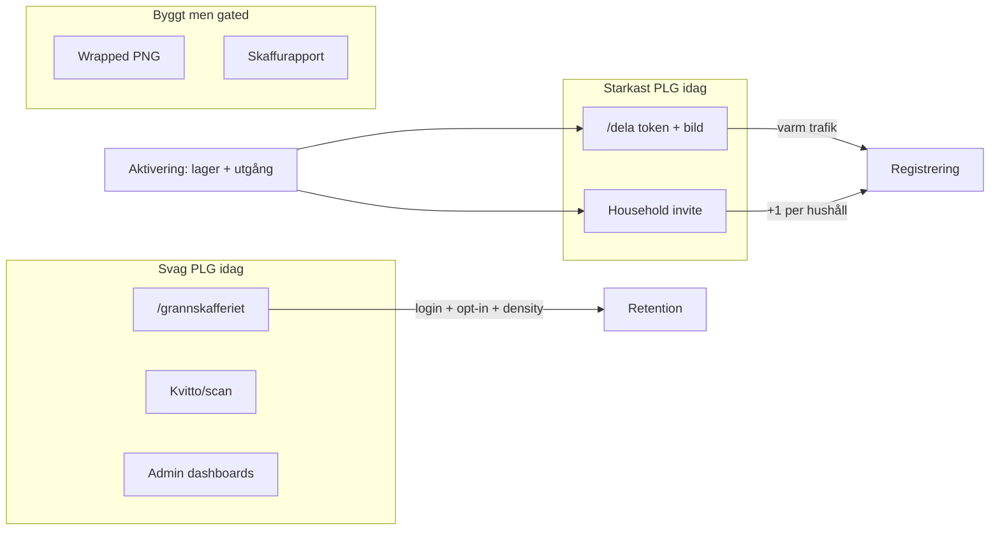

# Product-Led Growth — analys för Skaffu

*Version: juni 2026. Systematisk inventering av shipped PLG-mekaniker, kritisk utvärdering av antaganden, och rankad katalog av konkreta tillväxtmöjligheter.*

**Relaterade dokument:** [`GROWTH_STRATEGY.md`](./GROWTH_STRATEGY.md) · [`BREAKTHROUGH_GROWTH_OPPORTUNITIES.md`](./BREAKTHROUGH_GROWTH_OPPORTUNITIES.md) · [`ACQUISITION_WEDGES.md`](./ACQUISITION_WEDGES.md) · [`GRANNSKAFFERIET_V0.md`](./GRANNSKAFFERIET_V0.md) · [`WRAPPED.md`](./WRAPPED.md) · [`JUNE_ENGINEERING_REPORT.md`](./JUNE_ENGINEERING_REPORT.md) · [`PMF_METRICS_LOG.md`](./PMF_METRICS_LOG.md)

**Datagap (ärligt):** [`PMF_METRICS_LOG.md`](./PMF_METRICS_LOG.md) är i stort sett tom. Denna rapport skiljer *strukturell PLG-fit* (kod + strategi) från *empiriskt bevis* (konverteringsdata). All rankning bygger på produktlogik och shipped infrastruktur — inte påhittade siffror.

---

## 1. Executive summary

- **Starkaste PLG-loop idag:** Hushållssynk via `/invite/[token]` (email + öppen share-link med `SHARE_INVITE_EMAIL = '*'`) och publikt delat innehåll via `/dela/[token]` (utgående lista, 48 h TTL, UTM-registrerings-CTA). Båda looparna ger mottagaren *konkret värde* innan konto krävs — eller tvingar registrering för att delta i samma hushåll.

- **Största miss:** Engineering har investerat tungt i Grannskafferiet v1–v2 (geo, karta, nearby push) och admin-analytics *före* att förstärka de loopar som faktiskt kan bära acquisition: hushållsinvite i rätt kontext (Inköp, export) och publik delning av *aktiv* inköpslista. Kartan kräver login, opt-in, plats och density-gate — tre barriärer som blockerar kall trafik.

- **Rekommenderad PLG-prioritet (4–6 veckor):** (1) kontextuell household-invite från `/inkop`, (2) publik read-only inköpslista-länk (återanvänd `expiring_share_link`-mönster), (3) `/dela`-conversion pass med redirect till egen utgående-lista, (4) utökade invite-triggers vid `shopping_list_export`. *Inte* karta-polish, kvitto-AI eller fler admin-dashboards.

---

## 2. Nuvarande PLG-landskap

Åtta kategorier från briefen — status baserad på shipped kod och docs per 2026-06-11.

| Kategori | Built | Partial | Missing |
|----------|-------|---------|---------|
| **Network effects** | Delat lager och inköpslista inom hushåll; synk via `householdService` | Per-hushåll-silo; inget cross-household värde utan invite | Grann-nätverk tomt utan manuell density-seed |
| **Invitations** | Email-invite + share-link (`createShareInvite`); `navigator.share` i Inställningar; prompt efter ≥5 varor eller 3 dagar (`household-invite-prompt.ts`) | CTA djupt i `/settings#household`; prompt pekar dit, inte direkt share | Kontext vid Inköp; trigger vid export/plan→lista; ingen “partner offline”-signal |
| **Household expansion** | Roller owner/editor/viewer; `inviteRate` i PMF (`pmf.ts`, mål 30 %) | Solo-hushåll dominerar troligen (data saknas) | Automatisk onboarding av partner med förifylld lista |
| **Neighborhood** | Geo opt-in, MapLibre `/grannskafferiet`, nearby feed, push, report/block (jun 10 deploy `c3aadf5f`) | iOS toggle-fix ej prod (W4) | Density ≥5–10 delningar/område; publik browse utan konto |
| **Public utility** | `/dela/[token]` read-only + GDPR-snapshot; SEO-guider; `/rapport/*` (k-anonymitet) | App-kärna bakom login; demo kräver konto | Publik inköpslista; interaktiv demo utan Turnstile |
| **Sharing loops** | Utgående lista + PNG (`EatFirstSection`); UTM på `/dela`; `expiring_share_*` events | `noindex` (medvetet); ingen post-view signup-optimering | Återkommande prenumeration på delad lista; publik inköpslista |
| **Viral loops** | Wrapped share slide (`wrapped_shared`); Skaffurapport (gate ≥50 hushåll) | Kräver aktiverad kohort; pride sharing, inte cold acquisition | Inbyggd “bjud in partner” på Wrapped-kortet |
| **Distribution through usage** | Bring/AnyList clipboard-export från Inköp (`shopping_list_export`) | **Utgående** export — partner får text i urklipp, inte live-länk | Inbound publik inköpslista-länk; delegated shopping-notiser |

---

## 3. Antaganden vi ifrågasätter

### Grannskafferiet (karta) är inte acquisition-svaret — ännu

[`GROWTH_STRATEGY.md`](./GROWTH_STRATEGY.md) och [`GRANNSKAFFERIET_V0.md`](./GRANNSKAFFERIET_V0.md) säger samma sak: hybrid launch = **Dela som bild + länk först**, karta först efter density. Kod bekräftar:

- `/grannskafferiet` redirectar till login om `!user` (`+page.server.ts`).
- `/grannskafferiet/share/[id]` kräver inloggning + hushåll — inte publik preview.
- Density-gate: ≥5–10 aktiva delningar inom 500 m i *en* pilotstad.

**Verdict:** Retention och nätverk för opt-in-användare. Acquisition endast *efter* manuell supply-seed (experiment E3/E4). Att bygga mer karta-polish pre-PMF är distribution utan funnel — se [`JUNE_ENGINEERING_REPORT.md`](./JUNE_ENGINEERING_REPORT.md) §6 (Grannskafferiet v2 rankad “medel-låg ROI” för acquisition).

### Kvitto/PDF-scan är activation wow, inte PLG

Kvitto-autopilot, foto-runda och Kivra-forward (`401b523a`, `0d3cdc33`) minskar friktion för *en* användare att fylla lager. Ingen naturlig extern exponering: mottagaren ser inte kvittot, bara ägaren. Event `receipt_parsed` mäts i PMF som *aktivering*, inte som delningsloop.

**Verdict:** Behåll för TTV och differentiering. Ranka lågt för user growth. Community-copy ska nämna kvitto som *aktiveringsväg*, inte som viral mekanik.

### AI-insights skapar inte delningsloopar

Photo AI zone detection, recept-schema, vision P2 — personligt värde inuti appen. Inga `product-events` kopplade till extern delning. AI ökar retention för power users men genererar inte varm trafik.

**Verdict:** “Mer AI” ≠ growth pre-PMF. [`COMPETITIVE_ANALYSIS.md`](./COMPETITIVE_ANALYSIS.md) (refererad i growth-strategi): gapet är distribution, inte feature-lista.

### “Mer features” driver inte tillväxt

Juni 2026 levererade 435 commits, 37 mergade PRs, hela geo+map-stack — medan `inviteRate`-målet (50 % flermedlems-hushåll) troligen inte nås utan UX-förstärkning av *befintliga* invite-ytor. [`JUNE_ENGINEERING_REPORT.md`](./JUNE_ENGINEERING_REPORT.md) §9: “Bygga Grannskafferiet v1–v2 + admin analytics före acquisition baseline” identifierat som största misstag.

### Mer-meny → Grannskafferiet

Discovery för **befintliga** användare (W4 scope). Noll kall acquisition — de som hittar menyn har redan konto.

---

## 4. Opportunity catalog

Fifteen möjligheter med obligatoriska fält. ID används i rankning och djupdykning.

### O1 — Kontextuell household-invite från Inköp

| Fält | Värde |
|------|-------|
| **User story** | Som solo-användare på `/inkop` vill jag bjuda in partner när jag bockar av varor, så att hen kan handla samma lista. |
| **Why users care** | Familjer delar inköp idag via Bring/AnyList/WhatsApp — Skaffu har listan men ingen in-app “dela med partner”. |
| **Why growth** | +1 registrerad användare per lyckad invite; `inviteRate` i `/admin` PMF. |
| **Complexity** | S (modal/banner + deep link till share-invite) |
| **Confidence** | H — mönster finns (`HouseholdInvitePrompt`, `createShareInvite`) |
| **Expected impact** | H |

### O2 — Publik read-only inköpslista-länk

| Fält | Värde |
|------|-------|
| **User story** | Som handlande partner vill jag öppna en länk och se live inköpslista utan app, som `/dela` för utgående varor. |
| **Why users care** | Matchar befintlig vana (Bring-länk, delad AnyList); lägre friktion än “ladda ner app först”. |
| **Why growth** | Varm trafik → registrering; starkare än karta för familjer utan geo-opt-in. |
| **Complexity** | M — återanvänd `expiring_share_link` + snapshot av `shopping_list` |
| **Confidence** | H — infra finns (`expiring-share.service.ts`, token/TTL/no PII) |
| **Expected impact** | H |

### O3 — `/dela` conversion pass

| Fält | Värde |
|------|-------|
| **User story** | Som mottagare av utgående-lista vill jag enkelt skapa egen lista efter att jag sett värdet. |
| **Why users care** | Publik sida visar redan konkret innehåll; CTA går till generisk landing (`signupUrl` hårdkodad UTM). |
| **Why growth** | `expiring_share_viewed` → `signup_complete` med UTM `grannskafferiet`. |
| **Complexity** | S — bättre copy, redirect till onboarding med “utgående-lista”-intent, ev. PWA-hint |
| **Confidence** | M–H |
| **Expected impact** | M–H |

### O4 — Household invite prompt utökad

| Fält | Värde |
|------|-------|
| **User story** | Som solo-användare vill jag bli påmind att bjuda in partner vid rätt tillfälle — inte bara efter 5 varor. |
| **Why users care** | Timing avgör om invite känns relevant. |
| **Why growth** | Fler triggers → högre `inviteRate`. |
| **Complexity** | S — utöka `shouldShowHouseholdInvitePrompt` |
| **Confidence** | M |
| **Expected impact** | M |

**Triggers att lägga till:** första `shopping_list_export`; plan→lista konvertering; lista ändras utan second member WAU (heuristik).

### O5 — “Handla åt oss” / delegated shopping

| Fält | Värde |
|------|-------|
| **User story** | Som viewer vill jag få push när inköpslistan uppdateras och kunna bocka av utan full editor-rättighet. |
| **Why users care** | Tydlig rollfördelning i hushåll. |
| **Why growth** | Tvingar invite för full loop; viewer → registrering. |
| **Complexity** | M–L |
| **Confidence** | M |
| **Expected impact** | M |

### O6 — Publik interaktiv demo (utan login)

| Fält | Värde |
|------|-------|
| **User story** | Som besökare på skaffu.com vill jag prova read-only demo-hushåll och spara min lista vid registrering. |
| **Why users care** | Minskar konto-vägg före värde ([`GROWTH_STRATEGY.md`](./GROWTH_STRATEGY.md) §2). |
| **Why growth** | Kall trafik → aktivering med snapshot. |
| **Complexity** | M |
| **Confidence** | M |
| **Expected impact** | M |

### O7 — Wrapped timing + partner-CTA

| Fält | Värde |
|------|-------|
| **User story** | Efter första månad med besparingar vill jag dela stolt — och bjuda in partner så ni räknar ihop. |
| **Why users care** | Social proof + hushållsexpansion i samma flow. |
| **Why growth** | `wrapped_shared` + invite; varm virality. |
| **Complexity** | S |
| **Confidence** | M |
| **Expected impact** | M |

### O8 — Grannskafferiet karta (density-gated acquisition)

| Fält | Värde |
|------|-------|
| **User story** | Som grann vill jag se delningar på karta i min stad. |
| **Why users care** | OLIO-liknande discovery — *om* supply finns. |
| **Why growth** | Svag utan density; `nearby_map_opened` → registrering endast post-E3. |
| **Complexity** | L (redan byggt — “cost” = marknadsföring + seed) |
| **Confidence** | M (strategi klar; data saknas) |
| **Expected impact** | L (acquisition), M (retention) |

### O9 — Nearby push som viral kanal

| Fält | Värde |
|------|-------|
| **User story** | Som opt-in-användare får jag push när någon nära delar utgående varor. |
| **Why users care** | Timely discovery. |
| **Why growth** | Endast till *befintliga* app-användare med push+plats — svag acquisition. |
| **Complexity** | M (shipped) |
| **Confidence** | M |
| **Expected impact** | L |

### O10 — Skaffurapport PR-launch

| Fält | Värde |
|------|-------|
| **User story** | Som journalist/läsare vill jag se anonymiserad månadsdata för svenska hushåll. |
| **Why growth** | PR-spår; gate ≥50 hushåll ([`JUNE_ENGINEERING_REPORT.md`](./JUNE_ENGINEERING_REPORT.md)). |
| **Complexity** | M |
| **Confidence** | L (kohort för liten) |
| **Expected impact** | L–M |

### O11 — Kvitto/PDF-scan som growth-lever

| Fält | Värde |
|------|-------|
| **Why growth** | Activation only — ingen extern loop. |
| **Complexity** | L (redan byggt) |
| **Confidence** | H (att det *inte* är PLG) |
| **Expected impact** | L |

### O12 — AI-insights / foto-runda P3

| Fält | Värde |
|------|-------|
| **Why growth** | Personligt värde; noll delning. |
| **Complexity** | L |
| **Confidence** | H |
| **Expected impact** | L |

### O13 — Admin marketing / LinkedIn OAuth

| Fält | Värde |
|------|-------|
| **Why growth** | Ägarverktyg; noll slutanvändar-PLG. |
| **Complexity** | M (shipped `cb02fc1f`) |
| **Confidence** | H |
| **Expected impact** | L |

### O14 — Mer-meny → Grannskafferiet (discovery)

| Fält | Värde |
|------|-------|
| **Why growth** | Befintliga hittar karta; ingen kall trafik. |
| **Complexity** | S (W4) |
| **Confidence** | H |
| **Expected impact** | L |

### O15 — Landing hero A/B (experiment E2)

| Fält | Värde |
|------|-------|
| **User story** | Som besökare ska rätt one-liner öka min vilja att registrera. |
| **Why growth** | `register_click` + `landing_view` med variant; redan instrumenterat. |
| **Complexity** | S (shipped `landing-variants.ts`) |
| **Confidence** | M |
| **Expected impact** | M |

---

## 5. Rankad masterlista

### Poängmodell (1–5 per dimension)

| Dimension | Vikt | 5 = bäst |
|-----------|------|----------|
| Expected user growth | 40 % | Flest nya registreringar / hushållsmedlemmar |
| Ease | 20 % | S=5, M=3, L=1 |
| Confidence | 25 % | H=5, M=3, L=1 |
| Time to validate | 15 % | 2 veckor=5, 4 veckor=3, 8+ veckor=1 |

**Composite** = viktad summa.

### Composite ranking (högst först)

| Rank | ID | Möjlighet | G | E | C | V | **Composite** |
|------|-----|-----------|---|---|---|---|---------------|
| 1 | O1 | Kontextuell invite från Inköp | 5 | 4 | 5 | 5 | **4,80** |
| 2 | O2 | Publik inköpslista-länk | 5 | 3 | 5 | 4 | **4,45** |
| 3 | O3 | `/dela` conversion pass | 4 | 5 | 4 | 5 | **4,35** |
| 4 | O4 | Invite prompt utökad | 4 | 5 | 3 | 5 | **4,10** |
| 5 | O15 | Landing hero A/B | 3 | 5 | 3 | 5 | **3,70** |
| 6 | O7 | Wrapped + partner-CTA | 3 | 5 | 3 | 4 | **3,55** |
| 7 | O6 | Publik interaktiv demo | 4 | 3 | 3 | 3 | **3,40** |
| 8 | O5 | Delegated shopping | 4 | 2 | 3 | 3 | **3,20** |
| 9 | O14 | Mer-meny discovery | 1 | 5 | 4 | 5 | **3,15** |
| 10 | O9 | Nearby push | 2 | 3 | 2 | 3 | **2,35** |
| 11 | O8 | Grannskafferiet karta | 2 | 2 | 3 | 2 | **2,25** |
| 12 | O11 | Kvitto-scan som growth | 1 | 2 | 5 | 3 | **2,25** |
| 13 | O10 | Skaffurapport PR | 2 | 3 | 2 | 2 | **2,20** |
| 14 | O12 | AI-insights | 1 | 2 | 2 | 2 | **1,60** |
| 15 | O13 | Admin marketing | 1 | 3 | 1 | 2 | **1,55** |

*Minst tre möjligheter (O1, O2, O3) rankas klart ovan O8 (Grannskafferiet) och O11 (kvitto).*

### Pure growth ranking (endast growth-poäng)

| Rank | ID | Möjlighet | Growth |
|------|-----|-----------|--------|
| 1 | O1, O2 | Invite från Inköp; publik inköpslista | 5 |
| 3 | O3, O4, O5, O6 | Conversion pass; prompt; delegated; demo | 4 |
| 7 | O7, O15 | Wrapped; landing A/B | 3 |
| 9 | O8, O9, O10 | Karta; push; rapport | 2 |
| 12 | O11–O14 | Kvitto; AI; admin; Mer-meny | 1 |

**Skillnad composite vs pure growth:** O15 (landing A/B) klättrar i composite p.g.a. ease och snabb validering — rätt för experiment E2 parallellt med O1–O3. O8 (karta) faller i båda rankningarna — bekräftar att geo inte är primär acquisition-lever.

---

## 6. Per kategori — djupdykning

### 6.1 Network effects

Skaffus nätverkseffekter är **intra-hushåll**, inte metro-wide. Delat lager och inköpslista blir mer värdefullt per extra medlem (`multiMemberHouseholdRate`, mål 50 %). Grannskafferiet siktar på **inter-hushåll** men kräver kritisk massa som saknas.

**Catalog-koppling:** O1, O2, O5 förstärker intra-hushåll; O8 kräver manuell seed före nätverkseffekt.

### 6.2 Invitations

Shipped: email (`createInvite`), share-link (`createShareInvite`, `SHARE_INVITE_EMAIL`), `navigator.share` i settings, modal efter 5 varor/3 dagar. Gap: invite sker i Inställningar — långt från dagliga loopar.

**Catalog-koppling:** O1 (Inköp), O4 (fler triggers), O7 (Wrapped) adresserar detta direkt.

### 6.3 Household expansion

`/invite/[token]` hanterar share-invites utan email-match (`isShareInviteEmail`). Email-invites kräver match — rätt för säkerhet, men share-link är PLG-vänligare.

**Catalog-koppling:** O1, O4, O5. Mät `inviteRate` veckovis i `/admin`.

### 6.4 Neighborhood

Full stack shipped jun 10: opt-in grov plats (~111 m), jittered coords, 500 m free / 2 km Pro, MapLibre, report/block. Login-gate och density-gate blockerar acquisition.

**Catalog-koppling:** O8 endast efter E3; tills dess O3 (dela-länk) som supply-kanal per [`GRANNSKAFFERIET_V0.md`](./GRANNSKAFFERIET_V0.md) hybrid-tabell.

### 6.5 Public utility

`/dela/[token]` är starkast publik yta: read-only, `noindex`, 48 h, ingen PII. Guider ger SEO men låg volym. `/rapport/*` gated.

**Catalog-koppling:** O2 utökar public utility till inköp; O6 minskar login-barriär för kall trafik; O3 optimerar befintlig `/dela`.

### 6.6 Sharing loops

Utgående: `POST /api/expiring-share` → snapshot → share/PNG. Inköp: endast clipboard till Bring/AnyList (`shopping_list_export`) — ingen inbound länk.

**Catalog-koppling:** O2 är högsta-impact nya loop; O3 förstärker utgående-loop.

### 6.7 Viral loops

Wrapped (`/statistik/wrapped`): 6 slides, PNG 9:16, `wrapped_shared`. Skaffurapport: pride/PR, inte cold. Båda kräver aktiverad kohort.

**Catalog-koppling:** O7 kombinerar virality med household expansion.

### 6.8 Distribution through usage

Export-knappar i `ShoppingListPanel` kopierar till externa appar — användaren *lämnar* Skaffu för att dela. Invers PLG: partner ser Bring-text, inte Skaffu-länk.

**Catalog-koppling:** O2 vänder flödet; event `shopping_list_export` blir trigger för O4.

---

## 7. Overbuilt vs under-levererat

Koppling till [`JUNE_ENGINEERING_REPORT.md`](./JUNE_ENGINEERING_REPORT.md).

### Overbuilt (hög engineering, låg PLG-return idag)

| Område | Bevis | PLG-konsekvens |
|--------|-------|----------------|
| Grannskafferiet v1–v2 | `404f2bba`→`c3aadf5f`, migrationer 0038–0040 | Retention utan supply; acquisition-gate ej passerad |
| Admin analytics/decisions | `2ff968c6`–`c6333cee` | Dashboards utan PMF-baseline i `PMF_METRICS_LOG` |
| LinkedIn OAuth queue | `cb02fc1f` | Ops, inte slutanvändar-loop |
| SEO guides pipeline | `ad63eb83` | Långsam kanal; okänd konvertering |

### Under-levererat (låg engineering, hög PLG-potential)

| Område | Gap | Quick win |
|--------|-----|-----------|
| Household invite UX | Prompt → `/settings#household` | O1: inline från Inköp |
| Inköpslista-delning | Export utåt, ingen publik länk | O2: återanvänd expiring-share |
| `/dela` conversion | Generisk CTA | O3: intent-aware signup |
| Invite triggers | Bara 5 varor / 3 dagar | O4: export + plan triggers |

**Slutsats:** Juni-investeringen lutade åt *mätbar retention/geo* medan *invite och delning av vardagsinnehåll* (lista, utgående) fortfarande är UX-undermonterade — trots att strategin redan pekar på hybrid “lager → dela”.

---

## 8. Valideringsplan

Ingen marketing-taktik här — endast produktmätning via befintlig instrumentering och små UX-experiment.

### Datakällor

| Källa | Användning |
|-------|------------|
| `/admin` PMF | `inviteRate`, `activationRate`, `multiMemberHouseholdRate`, event counts |
| `POST /api/product-events` | Se appendix |
| `GET /api/admin/data?section=export&period=30` | CSV för veckojämförelse |
| [`PMF_METRICS_LOG.md`](./PMF_METRICS_LOG.md) | Manuell veckologg (fyll baseline före experiment) |

### Experiment per Tier A (2–4 veckor)

| Vecka | Experiment | Hypotes | Events / metrics | Success |
|-------|------------|---------|------------------|---------|
| 1–2 | **O1** Inköp-invite banner | Solo på Inköp bjuder in oftare än via Inställningar | Ny event `household_invite_prompt_shown` (context=`inkop`); `inviteRate` delta | Invite från Inköp ≥30 % av nya share-links |
| 1–2 | **O3** `/dela` CTA v2 | Intent-copy ökar registrering | `expiring_share_viewed` → `signup_complete` med UTM | View→signup > baseline (sätt efter vecka 1) |
| 2–3 | **O2** inköpslista-länk MVP | Familjer delar lista oftare än utgående | `shopping_share_created`, `shopping_share_viewed` (nya); jämför med `expiring_share_*` | Created ≥50 % av `shopping_list_export`-volym |
| 2–4 | **O4** export-trigger prompt | Export = intent att dela externt | `shopping_list_export` → prompt show rate; `inviteRate` | Prompt CTR ≥15 % |

### Events att lägga till (minimal)

| Event | När | Metadata |
|-------|-----|----------|
| `household_invite_prompt_shown` | Modal/banner visas | `context`: `inkop` \| `hem` \| `export` |
| `household_invite_prompt_clicked` | CTA klick | `context` |
| `shopping_share_created` | Publik inköpslänk skapas | `itemCount` |
| `shopping_share_viewed` | Publik inköpslänk öppnas | `itemCount` |

Registrera i `PRODUCT_EVENT_TYPES` (`pmf.ts`) och `+server.ts` (public vs auth).

### Stop rules (från growth-strategi, produkt-tolkning)

- **O8 (karta):** Kör inte geo-marknadsföring förrän `expiring_share_created` ≥5 inom 500 m i pilotstad.
- **O2/O1:** Om `inviteRate` flat efter 4 veckor trots UX — problem är audience/message, inte mer geo-kod.
- **Allt:** <10 aktiveringar på 4 veckor → byt copy/kanal, inte fler features.

---

## 9. Appendix

### A. Representativa commits (jun 2026)

| SHA | Feature | PLG-relevans |
|-----|---------|--------------|
| `9265b522` | Grannskafferiet v0, Wrapped, rapport | Dela-länk, viral assets |
| `4d680c2a` | Eat-first share card | PNG + native share |
| `404f2bba`–`c3aadf5f` | Grannskafferiet v1–v2 | Geo/karta (retention) |
| `32e620e1` | Unified nav | Daily surfaces |
| `ba8bce29` | Binary onboarding | Activation |
| `4f8b5621` | GROWTH_STRATEGY.md | Strategisk riktning |

### B. Routes med PLG-betydelse

| Route | Auth | PLG-roll |
|-------|------|----------|
| `/dela/[token]` | Nej | Publik utgående-lista; `expiring_share_viewed` |
| `/invite/[token]` | Delvis | Household expansion; share-invite utan email-gate |
| `/inkop` | Ja | Inköpslista; export utåt; **saknar invite CTA** |
| `/grannskafferiet` | Ja | Karta; retention |
| `/grannskafferiet/share/[id]` | Ja | Nearby preview; ej publik |
| `/statistik/wrapped` | Ja | Viral PNG; `wrapped_shared` |
| `/rapport/*` | Delvis | PR; k-anonymitet |
| `/settings#household` | Ja | Invite creation + share-link |

### C. Product events (growth-relevanta)

**Publika (ingen auth):** `expiring_share_viewed`, `landing_view`, `guide_view`, `register_click`, `public_report_viewed`

**Auth:** `expiring_share_created`, `wrapped_viewed`, `wrapped_shared`, `shopping_list_export`, `nearby_map_opened`, `nearby_share_tapped`, `onboarding_completed`, `signup_complete` (server-side)

**PMF tracked:** `inviteRate` (flermedlems-hushåll), `activationRate`, `wrappedRate`, m.fl. — se `PMF_TARGETS` i `src/lib/domain/pmf.ts`.

### D. Kodreferenser

| Komponent / modul | Fil |
|-------------------|-----|
| Publik dela-sida | `src/routes/dela/[token]/+page.svelte` |
| Invite accept | `src/routes/invite/[token]/+page.svelte` |
| Utgående delning | `src/lib/components/organisms/EatFirstSection.svelte` |
| Invite prompt | `src/lib/components/organisms/HouseholdInvitePrompt.svelte` |
| Prompt logik | `src/lib/utils/household-invite-prompt.ts` |
| Inköp export | `src/lib/components/organisms/ShoppingListPanel.svelte` |
| Share-link invite | `src/routes/settings/household.actions.ts` → `createShareInvite` |
| Product events API | `src/routes/api/product-events/+server.ts` |

---

*Analys genererad 2026-06-11. Revidera efter PMF baseline ifylld och första 4-veckors Tier A-experiment.*
