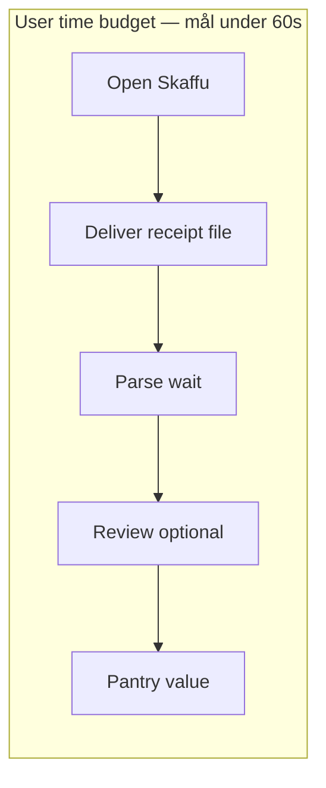

# Receipt Import Automation — Feasibility Spike

*Version: juni 2026. Discovery only — ingen produktkod före PO-granskning.*

**Syfte:** Jämföra sex importkanaler mot Skaffus **60-sekundersmål** (kvitto → pantry-värde) och befintlig parse/review-pipeline. Dokumentet rekommenderar V1/V2-roadmap utan implementation.

**Relaterade dokument:**

- [`RECEIPT_AUTOPILOT_NO_KIVRA_PLAN.md`](./RECEIPT_AUTOPILOT_NO_KIVRA_PLAN.md) — strategi utan Kivra API
- [`KIVRA_FORWARD_SPIKE.md`](./KIVRA_FORWARD_SPIKE.md) — Resend inbound forward (Tier C)
- [`KIVRA_PARTNERSHIP_TRACK.md`](./KIVRA_PARTNERSHIP_TRACK.md) — officiell API-ansökan
- [`RECEIPT_TEST_PACK.md`](./RECEIPT_TEST_PACK.md) — PDF-regression och kvalitetsgate
- [`BREAKTHROUGH_GROWTH_OPPORTUNITIES.md`](./BREAKTHROUGH_GROWTH_OPPORTUNITIES.md) — B1 kvitto-wedge
- [`CURRENT_REALITY.md`](./CURRENT_REALITY.md) — prod-flaggor och nav

---

## 1. Executive summary

Skaffu har en **prod-ready kvittopipeline**: upload → `POST /api/receipt/parse` → review → bulk create till lager. Det som saknas för “receipt autopilot” är inte parse-kvalitet utan **färre steg mellan kvitto i Kivra/ICA och Skaffu**.

**Primär metric:** Tid från att användaren har ett digitalt kvitto (PDF) till **pantry-värde** — varor i lager med plats/utgång — **under 60 sekunder** för en normal första-gångsanvändare.

**Rough timing idag (manuell upload via `/scan?mode=receipt`):**

| Fas | Tid (typiskt) |
|-----|---------------|
| Öppna Skaffu, navigera till scan-hub | 5–15 s |
| Välj fil / kamera | 5–10 s |
| Parse (nätverk + OpenAI + PDF extract) | 15–45 s |
| Review rader + plats + confirm | 20–60 s |
| **Total** | **Ofta >60 s** |

Automation-spike fokuserar på att **minska eller flytta steg**, inte bara optimera backend.

### Rekommendation (post-spike)

| Fas | Rekommendation | Motivering |
|-----|----------------|------------|
| **V1** | One-tap upload + PWA Share Target (Android) | Låg risk, återanvänder 100 % befintlig pipeline; Android share ger störst activation-lift per vecka |
| **V2** | Native iOS Share Extension / Android share intent (Capacitor eller minimal wrapper) | iOS ignorerar PWA `share_target` — native krävs för “dela från Kivra → Skaffu” i ett steg |
| **Advanced** | Gmail/Outlook OAuth mailbox scan | Hög privacy/legal overhead — **inte primär onboarding** |
| **Partner only** | Kivra / retailer officiella API | Hög activation om godkänd, men okänd ledtid — se [`KIVRA_PARTNERSHIP_TRACK.md`](./KIVRA_PARTNERSHIP_TRACK.md) |

**Explicit avvisat som primär mainstream-path:** **E-post-forward** (Resend inbound). Kod finns men `KIVRA_FORWARD_ENABLED` är **off** i prod; UX djupt i Inställningar, kräver forward-adress och auto-import utan review idag = trust-risk. Kan finnas kvar som **Tier C beta** för power users — se [`KIVRA_FORWARD_SPIKE.md`](./KIVRA_FORWARD_SPIKE.md).

---

## 0. Baseline — Skaffu idag

### Nuvarande användarflöde

| Steg | Flow |
|------|------|
| 1 | Öppna `/scan?mode=receipt` (eller onboarding “Ladda upp digitalt kvitto”) |
| 2 | Välj PDF/fil eller kamera |
| 3 | `POST /api/receipt/parse` (OpenAI + PDF extract) via [`ReceiptBulkAddFlow.svelte`](../src/lib/components/organisms/ReceiptBulkAddFlow.svelte) |
| 4 | **Review** rader + plats |
| 5 | Bulk create → lager + purchase lines |

### Befintliga kanaler i kod (ej nya alternativ i denna spike)

| Kanal | Status | Referens |
|-------|--------|----------|
| Manuell upload (PDF/bild) | **Prod-ready** | `/api/receipt/parse`, `ReceiptBulkAddFlow.svelte` |
| HEIC → JPEG normalisering | Shipped | [`receipt-file.ts`](../src/lib/utils/receipt-file.ts) |
| Resend e-post-forward | Kod shipped, **flag off** | `/api/inbound/kivra`, `KIVRA_FORWARD_ENABLED` — [`CURRENT_REALITY.md`](./CURRENT_REALITY.md) |
| Kivra / retailer API | **Ej i kod** | Ansökan väntar — [`KIVRA_PARTNERSHIP_TRACK.md`](./KIVRA_PARTNERSHIP_TRACK.md) |

### PWA-manifest

[`static/manifest.webmanifest`](../static/manifest.webmanifest) har **ingen** `share_target`. Appen är installerbar (icons, `display: standalone`, `start_url: /hem`) men tar inte emot system-delning.

### 60s-blocker idag

1. **Navigation** — scan-hub som mellanstation
2. **Parse-wait** — synkron UX under upload (kan göras async med progress)
3. **Review** — största produkttradeoff; obligatorisk i nuvarande no-Kivra-plan

---

## 2. Sex alternativ — jämförelse

Varje alternativ utvärderas mot samma dimensioner. User steps är SV-exempel riktade mot Kivra/ICA digital PDF.

---

### Option 1 — One-tap upload

**Beskrivning:** CTA på `/hem`, post-shopping eller `/inkop` → direkt file picker (`<input type="file">` eller `showOpenFilePicker` där stöd finns) utan navigera via scan-hub. Parse + review oförändrat.

#### User steps

1. Tryck “Importera kvitto” på hem/inköp
2. Välj PDF från Filer / Google Drive / nedladdningar
3. Vänta på parse (progress)
4. Granska rader + plats
5. Bekräfta → varor i skafferi

#### Plattformsstöd

| Plattform | Stöd | Detalj |
|-----------|------|--------|
| **iOS** | Ja (browser) | Safari file picker; HEIC/PDF via befintlig `receipt-file.ts` |
| **Android** | Ja (browser) | Chrome file picker; PDF från Downloads/Drive |
| **PWA** | Ja | Samma som browser när installerad; ingen share sheet-integration |

#### Privacy risk

**Låg.** Fil skickas till befintlig parse-endpoint; ingen ny tredjepartskälla. Samma retention som manuell upload.

#### Implementation effort

**S — ~1 vecka**

- Routing/CTA på hem eller inköp
- Öppna `ReceiptBulkAddFlow` inline eller modal
- Telemetry: `receipt_uploaded` med `source=one_tap`
- Ingen ny backend

#### Legal / platform risk

**Låg.** Standard fil-upload; inga nya API-villkor.

#### Expected activation impact

**Med** — sänker friktion för användare som redan tänkt “jag ska ladda upp kvittot”, men kräver fortfarande att de **öppnar Skaffu först** och navigerar till filväljare.

#### 60s metric fit

**Maybe (Yellow)** — sparar 5–15 s navigation; parse + review kvar. Kan nå 60 s med få rader och snabb review; ofta över vid 10+ rader.

---

### Option 2 — PWA Share Target

**Beskrivning:** Lägg till `share_target` i `manifest.webmanifest` för `application/pdf`, bilder, `multipart/form-data` → handler route (`/scan` eller `/api/receipt/share-import`) → samma parse-pipeline. Kräver **installerad PWA**.

#### User steps

1. Installera Skaffu (“Lägg till på hemskärmen”) — engångssteg
2. Öppna Kivra / e-post / Filer → Dela → välj Skaffu
3. Skaffu öppnas med fil → parse
4. Granska rader + platt
5. Bekräfta → skafferi

#### Plattformsstöd

| Plattform | Stöd | Detalj |
|-----------|------|--------|
| **iOS** | **Nej** | Safari **ignorerar** `share_target` helt — se [Plattformsfakta](#plattformsfakta-pwa-share-target) |
| **Android** | **Ja (starkt)** | Chrome 76+ Android; PWA måste vara installerad; WebAPK registrerar share target |
| **PWA** | Delvis | Fungerar där Chromium stödjer share target; **inte iOS** |

#### Privacy risk

**Låg.** Samma som manuell upload; ingen mailbox-access.

#### Implementation effort

**M — ~2–3 veckor**

- `share_target` i manifest (absolut URL för `action` rekommenderas på Android)
- POST-handler som tar multipart, validerar session/auth
- Omdirigera till review-state i `ReceiptBulkAddFlow`
- Installations-onboarding (“Dela kvitto hit”)
- Test på Android Chrome + reinstall efter manifest-ändring

#### Legal / platform risk

**Låg.** Web Share Target API är standard PWA-mekanism; inga nya datakällor.

#### Expected activation impact

**Hög (Android)** / **Ingen (iOS utan fallback)** — “Dela från Kivra → Skaffu” i ett steg eliminerar “öppna app först”. Android-andel + PWA-install rate avgör lift.

#### 60s metric fit

**Green–Yellow (Android)** — tar bort steg B (leverera fil) nästan helt. Parse + review kvar. **No på iOS** utan native V2.

---

### Option 3 — Native share extension (iOS) / share intent (Android)

**Beskrivning:** Wrapper-app (Capacitor, TWA + native bridge, eller minimal native shell) med iOS Share Extension / Android `ACTION_SEND` → upload till befintlig `/api/receipt/parse`.

#### User steps

1. Installera Skaffu-app (App Store / Play) — engångssteg
2. Kivra → Dela → Skaffu
3. (Valfritt) Bekräfta i extension eller öppna full app
4. Granska rader
5. Bekräfta → skafferi

#### Plattformsstöd

| Plattform | Stöd | Detalj |
|-----------|------|--------|
| **iOS** | **Ja (endast native)** | Share Extension; enda sättet att finnas i iOS share sheet för kvittofiler |
| **Android** | **Ja** | Share intent; kan komplettera eller ersätta PWA share target |
| **PWA** | **Nej** | Kräver native binary |

#### Privacy risk

**Med** — samma upload, men App Store/Play metadata och ev. analytics i native shell.

#### Implementation effort

**L–XL — 6–12+ veckor**

- iOS Share Extension + App Store review
- Android share intent + Play listing
- Auth/session handoff extension → web eller native WebView
- CI/release pipeline för två plattformar
- Underhåll vid OS-uppdateringar

#### Legal / platform risk

**Med** — App Store review, privacy nutrition labels, ev. krav på account deletion.

#### Expected activation impact

**Hög** om installerad — bästa UX för “dela från Kivra”; låg om användaren inte installerar native app (majoriteten idag = PWA/browser).

#### 60s metric fit

**Green** — minimal friktion vid leverans av fil; parse + review kvar. Bästa vägen till 60s på **iOS**.

---

### Option 4 — Gmail / Outlook OAuth mailbox scanning

**Beskrivning:** OAuth read-only (eller granular) mailbox access → filter kvitto-mail → hämta PDF-bilagor → parse pipeline.

#### User steps

1. Inställningar → “Koppla Gmail/Outlook”
2. OAuth consent (mailbox scope)
3. (Bakgrund) Skaffu skannar nya mail med kvittobilage
4. Notis “Nytt kvitto hittat” → granska
5. Bekräfta → skafferi

#### Plattformsstöd

| Plattform | Stöd | Detalj |
|-----------|------|--------|
| **iOS** | Ja (web) | OAuth i browser; bakgrundsscan server-side |
| **Android** | Ja (web) | Samma |
| **PWA** | Ja | Server-driven; plattformsoberoende |

#### Privacy risk

**Hög** — mailbox-innehåll, token storage, retention policy, GDPR consent, security audit. Google [Restricted Scope](https://developers.google.com/terms/api-services-user-data-policy) / Microsoft Graph policies.

#### Implementation effort

**XL — 8–16+ veckor**

- OAuth flows (Google + Microsoft)
- Token refresh, revocation
- MIME parsing, dedup, rate limits
- Security review + privacy policy update
- **Ej kopplat till befintlig kod** utöver parse

#### Legal / platform risk

**Hög** — API policy compliance, explicit consent, data minimization, ev. app verification (Google).

#### Expected activation impact

**Med** — “magisk” automation för power users; låg trust hos mainstream utan tydlig value prop; OAuth-friction vid onboarding.

#### 60s metric fit

**Yellow (async)** — första kvittot inte under 60s (OAuth + scan latency); **efterföljande** kan vara under 60s om review förenklas. **Inte primär path** per produktstrategi.

---

### Option 5 — Email forwarding (Resend inbound)

**Beskrivning:** Användaren vidarebefordrar Kivra/ICA-mail till `kvitto+{token}@inbound.skaffu.com` → webhook → parse → inventory. **Redan spikead och delvis implementerad.**

#### User steps

1. Inställningar → kopiera forward-adress
2. Konfigurera Kivra/e-post att vidarebefordra (eller manuellt per kvitto)
3. (Bakgrund) Skaffu tar emot mail → parse → **auto-import utan review idag**
4. Toast “X varor lades till”

#### Plattformsstöd

| Plattform | Stöd | Detalj |
|-----------|------|--------|
| **iOS** | Ja (indirekt) | Via mail-app forward |
| **Android** | Ja (indirekt) | Via mail-app forward |
| **PWA** | N/A | Server-side; ingen klientfunktion |

#### Privacy risk

**Med** — e-postinnehåll via Resend; PII i bilagor; kräver TTL/radering — se [`KIVRA_FORWARD_SPIKE.md`](./KIVRA_FORWARD_SPIKE.md).

#### Implementation effort

**S (exists)** — kod shipped; prod kräver DNS, webhook secret, `KIVRA_FORWARD_ENABLED=true` för beta.

#### Legal / platform risk

**Med** — opt-in, integritetspolicy, avsändar-allowlist.

#### Expected activation impact

**Låg–Med** — djupt i Inställningar; kräver forståelse av forward; **inte hero onboarding**. Auto-import utan review = trust-risk vs manuell review-flow.

#### 60s metric fit

**Red (som primär path)** — async; första gången >>60s (setup). Efter setup kan vara “0 user seconds” men **unacceptable som mainstream onboarding** p.g.a. setup-friktion och trust.

**Tier C / beta only** — align med [`RECEIPT_AUTOPILOT_NO_KIVRA_PLAN.md`](./RECEIPT_AUTOPILOT_NO_KIVRA_PLAN.md).

---

### Option 6 — Official Kivra / retailer APIs

**Beskrivning:** OAuth mot Kivra eller ICA/Willys/Coop API → pull kvitto-PDF/metadata → parse (med review).

#### User steps

1. Inställningar → “Koppla Kivra” (efter partnerskap)
2. OAuth / bankID-flöde hos partner
3. (Bakgrund) Nya kvitton synkas
4. Granska import
5. Bekräfta → skafferi

#### Plattformsstöd

| Plattform | Stöd | Detalj |
|-----------|------|--------|
| **iOS** | Ja | Partner OAuth i browser/webview |
| **Android** | Ja | Samma |
| **PWA** | Ja | Server-driven sync |

#### Privacy risk

**Med** — partner-DPA, user consent, data scope begränsat till kvitton.

#### Implementation effort

**XL+ — okänd ledtid**

- Partnerskap + legal (se [`KIVRA_PARTNERSHIP_TRACK.md`](./KIVRA_PARTNERSHIP_TRACK.md) — **Applied, no response**)
- OAuth, webhooks, format-drift per retailer
- **Ingen integration i repo idag**

#### Legal / platform risk

**Med–Hög** — DPA, marketing claims (“koppla Kivra”) förbjudet tills API bekräftat.

#### Expected activation impact

**Hög om godkänd** — lägst friktion long-term; **noll idag** p.g.a. partnership gate.

#### 60s metric fit

**Green (if exists)** — async sync; user time ≈ review only. **Not actionable V1.**

---

## 3. 60-second success model

**Definition:** Klocka startar när användaren **intar att importera kvittot** (har PDF tillgänglig). Stopp när minst en vara finns i lager med plats (pantry-värde).

### Steg-analys

| Steg | Kan minskas? | Bästa kanaler |
|------|--------------|---------------|
| **A — Open Skaffu** | Delvis | Share target / native share startar app åt användaren |
| **B — Deliver file** | **Ja (störst)** | PWA share (Android), native share (iOS+Android), one-tap (minimal) |
| **C — Parse wait** | Flytta utanför “aktiv tid” | Progress UI, async notification; parse 15–45s kvarstår tekniskt |
| **D — Review** | Produktd beslut | Obligatorisk V1 enligt no-Kivra-plan; “quick confirm all” = V1.1 |
| **E — Pantry value** | — | Success metric |

### Review som 60s-blocker

Spike antar **review kvar i V1** (trust + parse-kvalitet enligt [`RECEIPT_TEST_PACK.md`](./RECEIPT_TEST_PACK.md)). Quick confirm / autopilot med undo är **V1.1**, inte V1 scope.

**Realistisk V1 60s-scenario (Android, share target, 5 rader):**

- B: ~3 s (dela → app öppnas)
- C: ~25 s (parse med progress)
- D: ~20 s (snabb review)
- **~48 s** — möjligt men tight

**Realistisk idag (manuell, 15 rader):** ofta **90–120 s**.

---

## 4. Scoring matrix

Traffic-light sammanfattning för PO-beslut.

| Option | 60s fit | Mainstream onboarding | Privacy | Effort | Activation (om adopted) |
|--------|---------|----------------------|---------|--------|-------------------------|
| **1 One-tap upload** | Yellow | **High** | Low | **S** | Med |
| **2 PWA share target** | Green–Yellow (Android) / Red (iOS) | Med–High (Android only) | Low | **M** | High (Android) |
| **3 Native share** | **Green** | **High** | Med | **L–XL** | **High** |
| **4 Mailbox OAuth** | Yellow (async) | Med | **High** | **XL** | Med |
| **5 Email forward** | **Red (primary)** | **Low** | Med | S (exists) | Low–Med |
| **6 Partner API** | Green (if exists) | High | Med | **XL+** | High |

**Legend:** Green = bra fit; Yellow = delvis / plattformsberoende; Red = olämplig som primär path.

---

## 5. Plattformsfakta — PWA Share Target

Kort validering för Option 2 vs Option 3. Källor juni 2026.

### Android (Chrome PWA)

| Faktum | Referens |
|--------|----------|
| Web Share Target API stöds i Chrome for Android (från v76) och desktop Chrome (v89+) | [MDN `share_target`](https://developer.mozilla.org/en-US/docs/Web/Progressive_web_apps/Manifest/Reference/share_target), [Chrome docs](https://developer.chrome.com/docs/capabilities/web-apis/web-share-target) |
| PWA **måste vara installerad** för att synas i system share sheet | [Chrome Web Share Target](https://developer.chrome.com/docs/capabilities/web-apis/web-share-target) |
| PDF/filer kräver `method: POST`, `enctype: multipart/form-data`, `files` i manifest | [Chrome — accepting files](https://developer.chrome.com/docs/capabilities/web-apis/web-share-target) |
| `action` bör vara **absolut URL**; manifest-ändringar kan kräva avinstallera + installera om PWA | [PWA share target on Android (2025)](https://martin.hjartmyr.se/articles/pwa-web-share-target-android/) |
| Samsung Internet 12+ stödjer share target | [Can I use — Share targets](https://caniuse.com/wf-app-share-targets) |

### iOS (Safari PWA)

| Faktum | Referens |
|--------|----------|
| **`share_target` stöds inte** — Safari on iOS ignorerar manifest-medlemmen | [Can I use — Safari on iOS: Not supported](https://caniuse.com/wf-app-share-targets), [firt.dev iOS PWA notes](https://firt.dev/notes/pwa-ios) |
| WebKit position: **neutral** (ej planerad implementation); bug öppen sedan 2019 | [WebKit bug 194593](https://bugs.webkit.org/show_bug.cgi?id=194593), [Web platform features explorer](https://web-platform-dx.github.io/web-features-explorer/features/app-share-targets/) |
| iOS har **Web Share API** (dela *från* webben) men inte Web Share **Target** (ta emot i PWA) | [firt.dev — Web Share vs share_target](https://firt.dev/notes/pwa-ios) |
| **Enda mainstream-lösning på iOS:** native Share Extension (Option 3) | Industry consensus; se t.ex. [SpaceNote research #62](https://github.com/mcbarinov/spacenote/issues/62) |

### Implikation för Skaffu

- **V1 PWA share target:** värde främst **Android Chrome**-användare som installerat PWA
- **iOS:** one-tap upload i V1; planera native share för V2 om activation-data motiverar
- Marketing får **inte** lova “dela till Skaffu från Kivra” utan plattformsdisclaimer (Android + installerad app)

---

## 6. Recommended roadmap (post-PO-review)

*Doc only — implementation efter godkännande.*

### V1 scope

1. **One-tap “Importera kvitto”** på `/hem` och/eller post-shopping på `/inkop` → direkt file picker → [`ReceiptBulkAddFlow.svelte`](../src/lib/components/organisms/ReceiptBulkAddFlow.svelte)
2. **`share_target` i manifest** + POST handler → samma parse/review
3. **Telemetry:** `receipt_uploaded` / `receipt_import_started` med dimension `source`: `one_tap` | `share_target` | `scan_hub` | `onboarding`
4. **Android install nudge** efter första manuella upload (“Dela kvitton direkt från Kivra — lägg till Skaffu på hemskärmen”)

### V1.1 (ej blocker för V1)

- “Quick confirm all” med undo (trust autopilot) — PO-beslut
- Async parse med push när klar

### V2 scope

- Utvärdera **Capacitor** vs minimal native wrapper för iOS Share Extension + Android intent
- Beslutsgate: activation funnel V1 + andel iOS vs Android

### Explicit out of V1

| Out of scope | Varför |
|--------------|--------|
| Mailbox OAuth | XL effort, hög privacy — advanced |
| Email forward som hero | Tier C; unacceptable primary onboarding |
| Kivra/retailer API | Partnership gate — [`KIVRA_PARTNERSHIP_TRACK.md`](./KIVRA_PARTNERSHIP_TRACK.md) |
| Skip review (prod-wide) | Trust + [`RECEIPT_TEST_PACK.md`](./RECEIPT_TEST_PACK.md) kvalitetsgate |

### Success metrics (V1)

| Metric | Mål |
|--------|-----|
| `receipt_import_started` → `receipt_review_completed` | Funnel baseline |
| Median tid start → pantry value | Trend mot <60s (segment: Android share vs one-tap) |
| PWA install rate (Android) | Korrelera med share_target usage |
| Parse failure rate | Oförändrad eller bättre vs scan_hub |

---

## 7. Open questions för PO

1. **Review obligatorisk i V1?** Nuvarande no-Kivra-plan säger ja. Accepterar vi “quick confirm all” med undo i V1.1, eller krävs full rad-for-rad review tills [`RECEIPT_TEST_PACK.md`](./RECEIPT_TEST_PACK.md) P2 (≥15 riktiga PDF) är grön?

2. **iOS-strategi:** Acceptera sämre UX (one-tap only) i V1, eller prioritera native share (V2) tidigare givet SV iOS-andel?

3. **Email forward:** Behåll Tier C med tyst auto-import, lägg till review-kö (align med manuell flow), eller deprecate messaging helt tills partner-API?

4. **PWA install prompt:** Hur aggressiv ska Android “Lägg till på hemskärmen”-nudge vara utan att störa kärnloopen (inköpslista → handling)?

5. **60s metric segmentering:** Ska målet gälla **första kvittot ever** eller **upprepade import** (där review kan bli snabbare)?

6. **Share handler URL:** `/scan?mode=receipt` vs dedikerad `/api/receipt/share-import` — preferens för cache/auth/session?

---

## 8. Appendix — kodreferenser

| Artefakt | Roll |
|----------|------|
| [`ReceiptBulkAddFlow.svelte`](../src/lib/components/organisms/ReceiptBulkAddFlow.svelte) | UI: upload, parse, review, bulk create |
| [`/api/receipt/parse`](../src/routes/api/receipt/parse/) | Parse endpoint |
| [`receipt-file.ts`](../src/lib/utils/receipt-file.ts) | PDF/HEIC validering |
| [`receipt-import.ts`](../src/lib/server/receipt-import.ts) | Bulk create till lager |
| [`/api/inbound/kivra`](../src/routes/api/inbound/kivra/) | Forward webhook (Tier C) |
| [`manifest.webmanifest`](../static/manifest.webmanifest) | PWA — ingen `share_target` idag |
| [`KivraForwardSettingsPanel.svelte`](../src/lib/components/) | Forward UX (flag-gated) |

---

## 9. Decision log

| Datum | Beslut | Ägare |
|-------|--------|-------|
| 2026-06-20 | Spike doc skapad; V1 = one-tap + PWA share (Android); V2 = native share | PO review pending |
| 2026-06-20 | **V1 shipped:** one-tap CTAs (hem/inköp), PWA `share_target` + POST `/scan/share`, telemetry `source`, quick confirm all, Android install nudge. **V2 deferred:** Capacitor iOS Share Extension — se appendix nedan. |

---

## Appendix — V2 native share (ej i V1-release)

Checklist för nästa release (dokumentation only):

- `@capacitor/core` + ios/android projekt
- iOS Share Extension → deep link `skaffu://import-receipt`
- Android `ACTION_SEND` intent filter (kan komplettera PWA share target)
- App Store / Play pipeline + session handoff
- Beslutsgate: andel `share_target` vs `one_tap` i telemetry efter V1

---

*Nästa steg efter PO-godkännande: implementation ticket för V1.1 enligt [`RECEIPT_AUTOPILOT_NO_KIVRA_PLAN.md`](./RECEIPT_AUTOPILOT_NO_KIVRA_PLAN.md) utan att ändra Tier C forward-flaggor i prod.*
