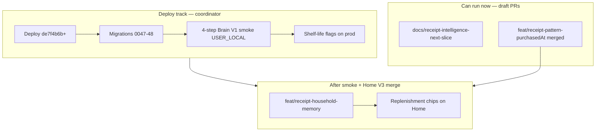

# Receipt Intelligence — Next Slice

**Baseline:** `master` @ `de7f4b6b` (#46–#47 merged; Brain V1 wired, learning flags on in apphosting). **Prod:** `e26408a2` — pending deploy for #46–#47.

**Purpose:** Coordinate the next receipt-signal work after Brain V1 prod smoke. Decision support only — no implementation in this wave.

**Sources:** [`receipt_intelligence_map`](../../.cursor/plans/receipt_intelligence_map_ce2e8094.plan.md), [`coordinator_six_workstreams`](../../.cursor/plans/coordinator_six_workstreams_a79496a6.plan.md), [`LEARNING_ENGINE.md`](./LEARNING_ENGINE.md), [`BRAIN_V1_PRODUCT_INTEGRATION.md`](./BRAIN_V1_PRODUCT_INTEGRATION.md).

---

## Receipt intelligence map

Top 10 signals — data availability, model need, value, and UX surface ([Workstream C audit](../../.cursor/plans/coordinator_six_workstreams_a79496a6.plan.md)):

| Signal | Data today? | New model? | User value | Brain value | UX surface |
|--------|-------------|------------|------------|-------------|------------|
| Replenishment cadence | Yes — `receipt_purchase_line` | No | High | Medium (accept feedback) | Home §2, Inköp |
| Recurring autopilot patterns | Yes — `detectReceiptPatternSuggestions` | No | High | Low | Inköp, Home footnote |
| Finish suggestions (double-buy) | Yes — `detectReceiptFinishSuggestions` | No | Medium | Low | Home footnote |
| Shelf-life at import | Yes — Brain predictors | No | High | **Core** | Receipt review, lager |
| Location at import | Yes — location predictor | No | Medium | **Core** | Receipt review |
| Last paid price | Yes — price memory | No | Medium | Low | Lager chip |
| `purchasedAt` cadence accuracy | Yes (merged) | No | Medium | Medium | Replenishment timing |
| Shopping day-of-week | Partial — lines exist, no aggregate UI | No (pure fn) | Medium | Medium | Home Hushållet one-liner |
| Preferred store | Partial — `storeLabel` on lines | No | Low | Low | Hushållet hint |
| Consumption velocity | **No** — needs consume events model | Yes | Medium | Medium | Deferred — not V1 |

### Smallest valuable next feature

**`feat/receipt-household-memory`** — pure functions `detectHouseholdShoppingDay` + `detectPreferredStore` → one line in Home Hushållet ([Slice 2](#slice-2--household-aggregates-pure-functions-no-migration)). **After** activation deploy + Brain smoke. No migration.

---

## Top 10 Highest-Value Receipt Signals

| # | Signal | Why it matters | Primary surface | Build phase |
|---|--------|----------------|-----------------|-------------|
| 1 | **Purchase cadence + replenishment** | Direct weekly shopping — "buy again now" | Home Skaffu rekommenderar, Inkop | **Shipped today** |
| 2 | **Shelf-life from receipt + correction** | Core Brain V1 — reduces waste | Receipt review, eat-first | **After deploy** (flag on) |
| 3 | **Recurring products / autopilot** | Onboarding to list without manual memory | Inkop, Home footnote | **Shipped today** |
| 4 | **Purchase date for cadence** | Correct "overdue" vs import date | Cadence, price memory | **Shipped** — `purchase-pattern.ts` uses `purchasedAt ?? createdAt` |
| 5 | **Last paid price** | Concrete household memory, not AI showcase | Lager `PriceMemoryChip` | **Shipped today** |
| 6 | **Finish suggestion** (double-buy) | Household sync without nagging | Home receipt footnote | **Shipped today** |
| 7 | **Shopping day-of-week** (household) | "You usually shop Sundays" — Brain feel | Home Hushållet | **Afternoon slice** |
| 8 | **Preferred store** | Store ritual + price-memory context | Hushållet, price chip | **Afternoon slice** |
| 9 | **Location rule** | Right storage for repurchase | Receipt import | **After deploy** (flag on) |
| 10 | **Dedupe at replenishment** | Avoid list spam / double stock | Replenishment chips | **Shipped today** |

---

## Exact Next Slice (After Brain V1 Prod Smoke)

Execute in this order. **Do not change `receipt-import.ts`, `apphosting.yaml`, or migrations before Brain V1 smoke completes.**

### Slice 1 — Domain fix: `purchasedAt` in pattern detection

**Status:** **Merged** (`feat/receipt-pattern-purchasedAt` → master).

**Problem:** [`detectReceiptPatternSuggestions`](../src/lib/domain/purchase-pattern.ts) used `createdAt` for cutoff, `lastPurchasedAt`, and sorting. [`replenishment.ts`](../src/lib/domain/replenishment.ts) already uses `purchasedAt ?? createdAt` via `purchaseDate()`.

**Build (done):**

1. Add `purchaseDate(line)` helper (or inline `line.purchasedAt ?? line.createdAt`) in `detectReceiptPatternSuggestions` only.
2. Replace all cutoff / `lastPurchasedAt` / sort comparisons that use `createdAt`.
3. Add unit test: line with `purchasedAt` older than `createdAt` stays in window when purchase date is within 90d.

**Files:**

| File | Change |
|------|--------|
| `src/lib/domain/purchase-pattern.ts` | `detectReceiptPatternSuggestions` only |
| `src/lib/domain/purchase-pattern.test.ts` | New `purchasedAt` vs `createdAt` case |

**Out of scope:** `detectReceiptFinishSuggestions`, `receipt-import.ts`, hem load.

---

### Slice 2 — Household aggregates (pure functions, no migration)

**Branch:** `feat/receipt-household-memory` (after Home V3 merged + Brain smoke).

**Build:**

1. New module `src/lib/domain/household-receipt-memory.ts`:
   - `detectHouseholdShoppingDay(lines)` — mode weekday from `purchasedAt ?? createdAt`, min 5 receipts.
   - `detectPreferredStore(lines)` — mode `storeLabel`, min 3 receipts.
   - `buildHouseholdMemoryHint(...)` — Swedish/English-ready strings for one-liner.
2. Wire in [`src/routes/(app)/hem/+page.server.ts`](../src/routes/(app)/hem/+page.server.ts): load recent `receipt_purchase_line` rows (reuse repository pattern from replenishment/pattern services), expose `householdMemoryHint` to page data.
3. Render one-liner in [`HomeHouseholdSection.svelte`](../src/lib/components/organisms/HomeHouseholdSection.svelte) (depends on Home V3 Slice 1+2).

**Files:**

| File | Change |
|------|--------|
| `src/lib/domain/household-receipt-memory.ts` | **New** — pure aggregates |
| `src/lib/domain/household-receipt-memory.test.ts` | **New** — unit tests |
| `src/routes/(app)/hem/+page.server.ts` | Load lines, call aggregates |
| `src/lib/components/organisms/HomeHouseholdSection.svelte` | One-liner UI |
| `src/lib/i18n/locales/sv.json`, `en.json` | `householdMemory.*` keys |

**Out of scope pre-smoke:** `receipt-import.ts`, location/shelf-life feedback paths, new DB tables.

---

### Slice 3 — Replenishment evidence chips on Home

**Branch:** same as Home V3 or `feat/receipt-replenishment-chips` after Home V3 merge.

**Build:**

1. Surface cadence/evidence on [`ReplenishmentSection.svelte`](../src/lib/components/organisms/ReplenishmentSection.svelte) when `surface=hem` — cosmetic on existing `reasonMessage` / reason codes from replenishment domain.
2. Optional telemetry: replenishment accept on Home (product_event partial today).

**Files:**

| File | Change |
|------|--------|
| `src/lib/components/organisms/ReplenishmentSection.svelte` | Chips / evidence copy |
| `src/lib/i18n/locales/sv.json`, `en.json` | Chip labels if needed |

---

### Blocked until Brain V1 flags on prod

| Item | Why wait |
|------|----------|
| Shelf-life / location rules in UX | `SHELF_LIFE_LEARNING_ENABLED`, `PUBLIC_SHELF_LIFE_ESTIMATES_IN_RECEIPT` |
| Replenishment learning feedback | `REPLENISHMENT_LEARNING_ENABLED` |
| Location learning feedback | `LOCATION_LEARNING_ENABLED` |
| Memory Explorer V2 facets | Design frozen; Settings route separate track |
| Consumption velocity → shelf-life | Needs finish/expiry link + prod data |

---

## Signals We Should Ignore (V1)

Summary from coordinator audit — do not build in V1:

| Signal | Reason |
|--------|--------|
| Category habits | No stable taxonomy |
| Cross-household benchmarking | Out of scope; privacy + no product wedge |
| LLM receipt parsing tiers | Stubs OFF — `SHELF_LIFE_LLM_ENABLED`, `LOCATION_LLM_ENABLED` |
| Household favorites | Migration `0049` deferred — `HOUSEHOLD_FAVORITES_ENABLED` off |

Detail (parse / privacy noise):

| Signal | Reason |
|--------|--------|
| Payment method, VAT, total, deposit, rounding | Stripped in `preprocessReceiptText`; no food/household signal |
| Org number, receipt number, card number | Privacy + zero product value |
| Line order on receipt | No semantics |
| Single-product purchases (under `RECEIPT_PATTERN_MIN_IMPORTS`) | Too low confidence for "you usually buy" |
| `importBatchId` as visit proxy without `purchasedAt` | Wrong cadence if import days after purchase |
| Specific store address (chain heuristic only) | Chain DQ sufficient; address parse = noise |
| Discount/campaign rows without product link | Noise; hard to tie to `normalizedKey` |
| Non-food (dish soap etc.) | Filtered in prompt/noise patterns |
| `userId` per line for household prefs | Household scope sufficient |
| Raw PDF text (not persisted) | Re-parse V2+; not a V1 signal |
| Barcode from receipt when null | Wait for scan bridge |
| LLM shelf-life tier (`SHELF_LIFE_LLM_ENABLED`) | Stub — not implemented |
| Category/macro-nutrition from name | Low DQ; needs product DB |
| Cross-store "cheapest here" | Multi-store price with current DQ = false precision |

---

## Build Timeline

| Phase | When | Work | Merge gate |
|-------|------|------|------------|
| **Now** | Parallel with Home V3 / Memory Explorer | This doc; `pattern-purchasedAt` **merged** | Docs: low risk anytime |
| **Deploy** | Coordinator | Migrations, smoke, enable shelf-life flags | Prod verified |
| **Afternoon** | After Home V3 + smoke | `householdMemoryHint`, Hushållet one-liner | Home V3 merged, Brain smoke green |
| **Same afternoon** | After aggregates | Replenishment evidence chips on `/hem` | ReplenishmentSection stable |
| **Post-deploy** | Flags on | Location/shelf-life UX, replenishment learning wire | Extra prod smoke |
| **Later** | V2 design | Memory Explorer facets, price trend, consumption velocity | Blocked |

---

## Merge Order (Receipt Track)

1. **`docs/receipt-intelligence-next-slice`** — can merge early (docs-only).
2. **Brain V1 deploy + smoke** — no receipt code merges before this (except docs).
3. **`feat/home-v3-reorder`** — unblocks Hushållet section.
4. **`feat/receipt-pattern-purchasedAt`** — **merged** to master.
5. **`feat/receipt-household-memory`** — hem load + one-liner (requires Home V3 + Brain smoke).
6. **Replenishment chips** — cosmetic on shipped data.

---

## Agent Tags

| Work | Owner |
|------|-------|
| `purchasedAt` fix, household aggregates, Home copy | **COORDINATOR_AGENT** |
| PO review of "från kvitton" copy, mobile screenshots | **USER_LOCAL** |
| Brain V1 prod flags + smoke | **COORDINATOR_AGENT** (deploy chain) |
| Memory Explorer V2 facets | **BLOCKED** |
