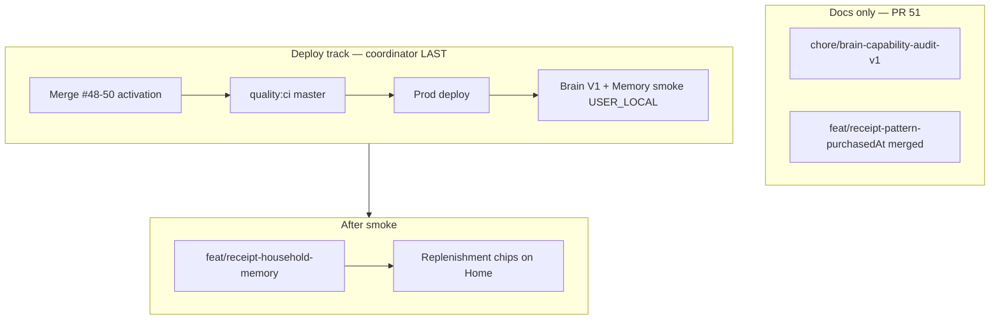

# Receipt Intelligence — Next Slice

**Baseline:** `master` @ `de7f4b6b` (#46–#47 merged; Brain V1 wired, learning flags on in apphosting). **Prod:** `e26408a2` — pending deploy for #46–#47.

**Purpose:** Decision support for receipt-signal work — no new predictors, migrations, or AI models in this wave. Fold into [`chore/brain-capability-audit-v1`](https://github.com/arpi09/grocery-manager/pull/51) (Workstream C).

**Sources:** [`coordinator_six_workstreams`](../../.cursor/plans/coordinator_six_workstreams_a79496a6.plan.md), [`receipt_intelligence_map`](../../.cursor/plans/receipt_intelligence_map_ce2e8094.plan.md), [`LEARNING_ENGINE.md`](./LEARNING_ENGINE.md), [`BRAIN_V1_PRODUCT_INTEGRATION.md`](./BRAIN_V1_PRODUCT_INTEGRATION.md).

---

## Workstream C — Receipt Intelligence Map

**Decision support only — no implementation in this wave.** Codebase audit + prioritization for post-activation deploy.

---

## Top 10 Signals

| Signal | Data today? | New model? | User value | Brain value | UX surface |
|--------|-------------|------------|------------|-------------|------------|
| **Replenishment cadence** | Yes — `receipt_purchase_line` | No | High | Medium (accept feedback) | Home §2 Skaffu rekommenderar, Inköp |
| **Recurring autopilot patterns** | Yes — `detectReceiptPatternSuggestions` | No | High | Low | Inköp, Home footnote |
| **Finish suggestions** (double-buy) | Yes — `detectReceiptFinishSuggestions` | No | Medium | Low | Home footnote |
| **Shelf-life at import** | Yes — Brain predictors | No | High | **Core** | Receipt review, lager |
| **Location at import** | Yes — location predictor | No | Medium | **Core** | Receipt review |
| **Last paid price** | Yes — price memory | No | Medium | Low | Lager `PriceMemoryChip` |
| **`purchasedAt` cadence accuracy** | Yes (merged) | No | Medium | Medium | Replenishment timing |
| **Shopping day-of-week** | Partial — lines exist, no aggregate UI | No (pure fn) | Medium | Medium | Home Hushållet one-liner |
| **Preferred store** | Partial — `storeLabel` on lines | No | Low | Low | Hushållet hint |
| **Consumption velocity** | **No** — needs consume events model | Yes | Medium | Medium | Deferred — not V1 |

---

## Signals We Ignore Today

Summary from coordinator audit — do not build in V1:

| Signal | Reason |
|--------|--------|
| **Category habits** | No stable taxonomy |
| **Cross-household benchmarking** | Out of scope; privacy + no product wedge |
| **LLM receipt parsing tiers** | Stubs OFF — `SHELF_LIFE_LLM_ENABLED`, `LOCATION_LLM_ENABLED` |
| **Household favorites** | Migration `0049` deferred — `HOUSEHOLD_FAVORITES_ENABLED` off |

Detail (parse / privacy noise):

| Signal | Reason |
|--------|--------|
| Payment method, VAT, total, deposit, rounding | Stripped in `preprocessReceiptText`; no food/household signal |
| Org number, receipt number, card number | Privacy + zero product value |
| Line order on receipt | No semantics |
| Single-product purchases (under `RECEIPT_PATTERN_MIN_IMPORTS`) | Too low confidence for "you usually buy" |
| `importBatchId` as visit proxy without `purchasedAt` | Wrong cadence if import days after purchase |
| Specific store address (chain heuristic only) | Chain DQ sufficient; address parse = noise |
| Discount/campaign rows without product link | Noise; hard to tie to `normalizedKey` |
| Non-food (dish soap etc.) | Filtered in prompt/noise patterns |
| `userId` per line for household prefs | Household scope sufficient |
| Raw PDF text (not persisted) | Re-parse V2+; not a V1 signal |
| Barcode from receipt when null | Wait for scan bridge |
| Cross-store "cheapest here" | Multi-store price with current DQ = false precision |

---

## Smallest Valuable Next Feature

**Branch:** `feat/receipt-household-memory`

Pure functions `detectHouseholdShoppingDay` + `detectPreferredStore` → one line in Home Hushållet ([Slice 2](#slice-2--household-aggregates-featreceipt-household-memory)). **No migration.** **After** activation deploy (#48–#50) + Brain V1 prod smoke — not before.

**Owner:** COORDINATOR_AGENT (implementation) · PO review of "från kvitton" copy → USER_LOCAL

---

## Exact Next Slice (Implementation Detail)

Execute in this order after activation deploy + Brain smoke. **Do not change `receipt-import.ts`, `apphosting.yaml`, or migrations before Brain V1 smoke completes.**

### Slice 1 — Domain fix: `purchasedAt` in pattern detection

**Status:** **Merged** (`feat/receipt-pattern-purchasedAt` → master).

**Problem:** [`detectReceiptPatternSuggestions`](../src/lib/domain/purchase-pattern.ts) used `createdAt` for cutoff, `lastPurchasedAt`, and sorting. [`replenishment.ts`](../src/lib/domain/replenishment.ts) already uses `purchasedAt ?? createdAt` via `purchaseDate()`.

**Build (done):**

1. Add `purchaseDate(line)` helper (or inline `line.purchasedAt ?? line.createdAt`) in `detectReceiptPatternSuggestions` only.
2. Replace all cutoff / `lastPurchasedAt` / sort comparisons that use `createdAt`.
3. Add unit test: line with `purchasedAt` older than `createdAt` stays in window when purchase date is within 90d.

**Files:**

| File | Change |
|------|--------|
| `src/lib/domain/purchase-pattern.ts` | `detectReceiptPatternSuggestions` only |
| `src/lib/domain/purchase-pattern.test.ts` | New `purchasedAt` vs `createdAt` case |

**Out of scope:** `detectReceiptFinishSuggestions`, `receipt-import.ts`, hem load.

---

### Slice 2 — Household aggregates (`feat/receipt-household-memory`)

**Branch:** `feat/receipt-household-memory` (after activation deploy + Brain smoke + Home V3 on master).

**Build:**

1. New module `src/lib/domain/household-receipt-memory.ts`:
   - `detectHouseholdShoppingDay(lines)` — mode weekday from `purchasedAt ?? createdAt`, min 5 receipts.
   - `detectPreferredStore(lines)` — mode `storeLabel`, min 3 receipts.
   - `buildHouseholdMemoryHint(...)` — Swedish/English-ready strings for one-liner.
2. Wire in [`src/routes/(app)/hem/+page.server.ts`](../src/routes/(app)/hem/+page.server.ts): load recent `receipt_purchase_line` rows (reuse repository pattern from replenishment/pattern services), expose `householdMemoryHint` to page data.
3. Render one-liner in [`HomeHouseholdSection.svelte`](../src/lib/components/organisms/HomeHouseholdSection.svelte) (depends on Home V3 Slice 1+2).

**Files:**

| File | Change |
|------|--------|
| `src/lib/domain/household-receipt-memory.ts` | **New** — pure aggregates |
| `src/lib/domain/household-receipt-memory.test.ts` | **New** — unit tests |
| `src/routes/(app)/hem/+page.server.ts` | Load lines, call aggregates |
| `src/lib/components/organisms/HomeHouseholdSection.svelte` | One-liner UI |
| `src/lib/i18n/locales/sv.json`, `en.json` | `householdMemory.*` keys |

**Out of scope pre-smoke:** `receipt-import.ts`, location/shelf-life feedback paths, new DB tables.

---

### Slice 3 — Replenishment evidence chips on Home

**Branch:** same as Home V3 or `feat/receipt-replenishment-chips` after Home V3 merge.

**Build:**

1. Surface cadence/evidence on [`ReplenishmentSection.svelte`](../src/lib/components/organisms/ReplenishmentSection.svelte) when `surface=hem` — cosmetic on existing `reasonMessage` / reason codes from replenishment domain.
2. Optional telemetry: replenishment accept on Home (product_event partial today).

---

### Blocked until Brain V1 flags verified on prod

| Item | Why wait |
|------|----------|
| Shelf-life / location rules in UX | `SHELF_LIFE_LEARNING_ENABLED`, `PUBLIC_SHELF_LIFE_ESTIMATES_IN_RECEIPT` |
| Replenishment learning feedback | `REPLENISHMENT_LEARNING_ENABLED` |
| Location learning feedback | `LOCATION_LEARNING_ENABLED` |
| Memory Explorer V2 facets | Design frozen; Settings route separate track |
| Consumption velocity → shelf-life | Needs finish/expiry link + prod data |

---

## Build Timeline

| Phase | When | Work | Merge gate |
|-------|------|------|------------|
| **Now** | Parallel with activation (#48–#50) | This doc update in PR #51; `pattern-purchasedAt` **merged** | Docs-only — low risk |
| **Deploy** | Coordinator — **last** | Activation bundle + Brain flags | Prod verified |
| **Post-deploy** | After smoke | `feat/receipt-household-memory` one-liner | Activation + Brain smoke green |
| **Same wave** | After aggregates | Replenishment evidence chips on `/hem` | ReplenishmentSection stable |
| **Later** | V2 design | Memory Explorer facets, price trend, consumption velocity | Blocked |

---

## Merge Order (Receipt Track)

1. **`chore/brain-capability-audit-v1` (#51)** — docs-only; includes this map refresh.
2. **Activation deploy + smoke** (#48–#50) — no receipt code merges before this.
3. **`feat/receipt-pattern-purchasedAt`** — **merged** to master.
4. **`feat/receipt-household-memory`** — hem load + one-liner (smallest next feature).
5. **Replenishment chips** — cosmetic on shipped data.

---

## Agent Tags

| Work | Owner |
|------|-------|
| Receipt map doc (Workstream C) | **COORDINATOR_AGENT** |
| `purchasedAt` fix, household aggregates, Home copy | **COORDINATOR_AGENT** |
| PO review of "från kvitton" copy, mobile screenshots | **USER_LOCAL** |
| Brain V1 prod smoke + Memory Explorer with data | **USER_LOCAL** |
| Consumption velocity, V2 facets, household favorites engine | **BLOCKED** |
