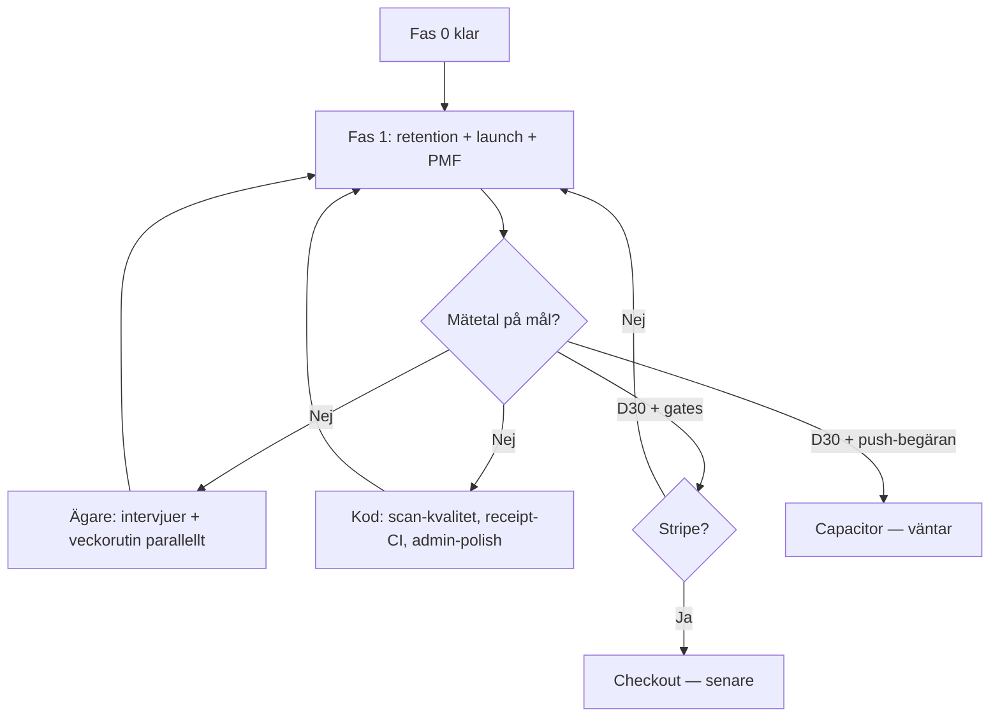

# Produktroadmap — Skaffu

*Master roadmap efter 90-dagarsfasen. Version: 1 jun 2026.*

**Relaterat:** [NEXT_STEPS.md](./NEXT_STEPS.md) (ägare, nästa 30 dagar) · [90_DAY_ROADMAP.md](./90_DAY_ROADMAP.md) (fas 0, arkiv) · [COMPETITIVE_ANALYSIS.md](./COMPETITIVE_ANALYSIS.md) · [DAY_90_DECISION.md](./DAY_90_DECISION.md) · [PRICING.md](./PRICING.md) · [DOMAIN_STRATEGY.md](./DOMAIN_STRATEGY.md)

---

## Status jun 2026

**Fas 0 är i stort sett klar.** **Fas 1 pågår:** retention, launch och PMF-mätning — inte fler Must-features i isolation.

| Område | Status |
|--------|--------|
| **Prod** | [skaffu.com](https://skaffu.com) live (apex + www→apex); intern repo `home-pantry` oförändrat |
| **Varumärke** | Skaffu-rebrand, SSR-optimering (admin + sidor) |
| **Kvitto** | Per-rad plats (AI + heuristik); testpack-infra kvar — ägare fyller riktiga PDF |
| **Aktivering** | Förbättrad onboarding |
| **Plan → lista** | Ett-klicks-flöde plan → inköpslista |
| **AI-kostnad** | Månadstak + guardrails |
| **PMF-rutin** | Dashboard `/admin` + veckovis e-postcron till ägare |
| **E-post** | Resend verifierad; `EMAIL_SENDING_ENABLED`-väg |
| **PWA / push** | Installbanner; web push för utgång (expiry) |
| **Marknad** | Hero A/B + analytics; cookie consent (variant B) |
| **PMF** | **Ej uppnådd** — mätetal fylls och följs; inga påhittade siffror i docs |

**Ägare (parallellt, blockerar inte kod):** användarintervjuer, veckovis PMF-granskning (e-postcron underlättar), metrics-uppföljning i `/admin`, hero A/B-beslut när data räcker, launch i communities. Se [NEXT_STEPS.md](./NEXT_STEPS.md).

**Väntar medvetet:** Stripe/Checkout, Capacitor/App Store — tills PMF-gates och [PRICING.md](./PRICING.md) motiverar.

**Nästa kod (utan Stripe):** Fas 1-svans (kvitto-PDF, SEO, web push *handla idag*, recept-polish) levererad. **Fas 2-kod utan PMF-gate:** svensk scan-kvalitet, receipt-fixtures i CI när ägare fyller testpack, admin/e2e-polish.

---

## Inte klart = produkt

Skaffu är **inte färdig** och har **inte product-market fit** förrän mätetalen i [COMPETITIVE_ANALYSIS.md avsnitt 13](./COMPETITIVE_ANALYSIS.md#13-mätetal-för-product-market-fit) hålls över tid — särskilt:

| Kriterium | Mål | Status (jun 2026) |
|-----------|-----|-------------------|
| Aktivering (24 h) | >40 % | Mät — fyll i `/admin` |
| Median tid till första scan | <3 min | Mät |
| Veckoscan-rate | >30 % | Mät |
| **D30-retention** | >15 % tidigt, >25 % moget | **Primär PMF-gate — ej bevisad** |
| Hushåll 2+ aktiva | >50 % | Mät |
| Smart fill / vecka | >20 % | Mät |
| Sean Ellis / NPS | >40 % "Mycket besviken" | Enkät — ej i dashboard |

Feature-leverans utan retention räknas **inte** som produkt klar. Se [DAY_90_DECISION.md](./DAY_90_DECISION.md) för beslut webb vs Capacitor.

---

## Nuvarande fas: Fas 1 — Retention, launch, PMF-mätning

Prioritet: **bevisa värde och vana** innan Stripe, native eller fler features.

### Ägare — löpande parallellt (inga gates för kod)

| Aktivitet | Frekvens | Anteckning |
|-----------|----------|------------|
| Veckovis PMF-granskning | Varje måndag ~30 min | `/admin` + checklista [PMF_WEEKLY.md](./PMF_WEEKLY.md); **veckovis e-post till ägare** (cron) som påminnelse |
| Användarintervjuer + syntes | Löpande | [USER_INTERVIEWS.md](./USER_INTERVIEWS.md); blockerar inte deploy |
| Metrics vs mål | Löpande | Dashboard; fyll i tabellen ovan när kohort tillåter |
| Launch i communities | Enligt playbook | [LAUNCH_PLAYBOOK.md](./LAUNCH_PLAYBOOK.md) |
| Riktiga kvitto-PDF lokalt | Löpande | [RECEIPT_TEST_PACK.md](./RECEIPT_TEST_PACK.md) |

---

## Fas 0 (klar) — 90 dagar, punkter 1–20

Sammanfattning av [`90_DAY_ROADMAP.md`](./90_DAY_ROADMAP.md). Tekniskt arbete i kod är klart; **ägaruppgifter** (intervjuer, launch, riktiga PDF:er) fortsätter parallellt utan att blockera Fas 1-kod.

| # | Uppgift | Status | Anteckning |
|---|---------|--------|------------|
| 1 | PMF-mätetal i analytics | Klar | `/admin`, `product_event`, WoW-delta |
| 2 | Onboarding scan-first | Klar (+ förbättrad jun 2026) | Kvitto eller 5 streckkoder |
| 3 | Integritet + AI-policy | Klar | `/privacy`, FAQ; cookie consent B |
| 4 | PWA + installguide | Klar | `/install-app`, banner |
| 5 | Utgångspåminnelse (e-post) | Klar | GH Actions cron; Resend + `EMAIL_SENDING_ENABLED` |
| 6 | Prissättningshypotes | Klar | [PRICING.md](./PRICING.md); Stripe **väntar** |
| 7 | Custom domain | **Klar (skaffu.com)** | Live jun 2026; www→apex — [DOMAIN_STRATEGY.md](./DOMAIN_STRATEGY.md) |
| 8 | Landning A/B + jämförelse | Klar | Hero A/B + analytics; ICA/Bring/Matdags |
| 9 | Intervjukit | Klar (kit) | Ägare: samtal + syntes (parallellt) |
| 10 | Kvitto-PDF testpack | Klar (infra) | Per-rad plats; ägare: riktiga PDF |
| 11 | AI rate limits | Klar (+ månadstak jun 2026) | `AiRateLimitService`, budget guardrails |
| 12 | Lista-export (Bring-format) | Klar | Clipboard i inköpslista |
| 13 | Launch playbook | Klar (kit) | Ägare: communities |
| 14 | Veckovis PMF-rutin | Klar (dashboard + e-postcron) | Ägare: faktisk granskning |
| 15 | Beslut dag 90 (dokument) | Klar | [DAY_90_DECISION.md](./DAY_90_DECISION.md) |
| 16 | E2E critical flows | Klar | 23 tester, [E2E.md](./E2E.md) |
| 17 | Scan-kvalitet SV | Klar | Favoriter, senaste, snabb edit |
| 18 | Freemium UI / gränser | Klar | PlanLimits, banners |
| 19 | Recept från lager v2 | Klar | Portioner, saknade → lista |
| 20 | Turnstile prod + CI | Klar | [CAPTCHA.md](./CAPTCHA.md) |

---

## Fas 1.0 — Kvalitet (P0) — gate passerad

Alla punkter gröna; Fas 1 (retention, launch, PMF) är aktiv.

| # | Kriterium | Status |
|---|-----------|--------|
| 1 | Kvitto: PDF/bild → parse → rader → bulk add | ✅ Kod + E2E; per-rad plats jun 2026 |
| 2 | Register/login med Turnstile + tydliga fel | ✅ E2E + [CAPTCHA.md](./CAPTCHA.md) |
| 3 | Scan add (streckkod) | ✅ E2E |
| 4 | Smart fill `/inkop` | ✅ E2E |
| 5 | Inga 500 på kärn-sidor | ✅ |
| 6 | E2E critical flows | ✅ [E2E.md](./E2E.md) |
| 7 | `receipt-parse.test.ts` + fixtures | ✅ |
| 8 | Quality gate CI | ✅ |

---

## Fas 1 (månad 4–6) — Retention, launch, PMF-mätning

### P1 — Retention och återbesök

| Initiativ | Status (jun 2026) | Nästa |
|-----------|-------------------|-------|
| **Veckovis PMF-granskning (ägare)** | Dashboard + **e-postcron till ägare** | Ägare: rutin varje måndag (parallellt) |
| **Intervjusyntes → produkt** | Kit + feedback i app | Ägare: ≥3/10 intervjuer, syntes |
| **E-post utgång** | Levererat; Resend verifierad | Mät opt-in/öppning |
| **Web push (PWA)** | **Utgång (expiry) + handla idag levererat** | Mät opt-in; fler triggers senare |
| **PWA-installation** | Banner + `/install-app` | Mät standalone; copy vid behov |

### P1 — Stripe och paywall — **väntar**

| Initiativ | Gate |
|-----------|------|
| Stripe Checkout + webhook | [PRICING.md §6](./PRICING.md): D30 ≥15 %, rate limits klara, köpvillkor |
| Pro tier enforcement | Efter Checkout |
| Intresse/waitlist | Klar — CTA `/priser` + admin |
| Grace period policy | Beslut i PRICING vid launch |

*Ingen Stripe-arbete i kod förrän gates och PMF-data motiverar.*

### P1 — Recept → lista

| Initiativ | Status (jun 2026) |
|-----------|-------------------|
| **Plan → inköpslista i ett flöde** | ✅ Levererat |
| Färre steg "lägg saknade" | Polish vid intervjufriktion |
| Kvalitet: hallucinationer | Prompt/test mot riktiga lager |

### P1 — Kvitto-PDF i CI

| Initiativ | Status (jun 2026) |
|-----------|-------------------|
| Per-rad plats (AI + heuristik) | ✅ Levererat |
| ≥15 anonymiserade riktiga PDF | Ägare: [RECEIPT_TEST_PACK.md](./RECEIPT_TEST_PACK.md) (parallellt) |
| Parse-regression i CI | Synthetic fixtures; utöka med riktiga PDF |

### P1 — Marknad: differentiering och Skaffu

| Initiativ | Status (jun 2026) | Nästa |
|-----------|-------------------|-------|
| **skaffu.com live** | ✅ | SEO, UTM, copy konsekvent *Skaffu* |
| Launch enligt playbook | Kit klar | Ägare: ≥1 community |
| Messaging: PDF/Kivra, plan+lager, butiksneutral | Copy + jämförelsetabell | Distribution |
| **SEO** | Grund + *skafferi app* / *minska matsvinn* copy | UTM, fler landningssidor vid behov |
| **Hero A/B** | Live + analytics | **Beslut när data räcker** — ägare, inte kod |

### P1 — Prestanda och AI-kostnad

| Initiativ | Status (jun 2026) |
|-----------|-------------------|
| Månadstak OpenAI + alert | ✅ Guardrails |
| Admin: AI-användning | Kompletterar rate limits |
| Billigare modell per endpoint | Utvärdera vid behov |

### P1 — Teknik / trust (jun 2026)

| Initiativ | Status |
|-----------|--------|
| Skaffu-rebrand + SSR-optimering | ✅ |
| Cookie consent (variant B) | ✅ |
| Logout CSRF (hosted.app / prod) | ✅ (om deployad) |

---

## Fas 2 (månad 6–12) — Distribution och djup — **väntar**

Starta **endast** om Fas 1-mätetal eller [DAY_90_DECISION.md](./DAY_90_DECISION.md) motiverar det.

| Initiativ | Trigger | Status jun 2026 |
|-----------|---------|-----------------|
| **Capacitor / App Store** | D30 ≥15 % + kvalitativ push/app-store-begäran | **Väntar** |
| **Native push-notiser** | Efter Capacitor eller TWA | Web push expiry finns |
| Offline-läsning | Retention på mobil utan nät | Senare |
| Svensk produktcache / override | Scan-fel, OFF saknar svenska | **Påbörjad** — locale-namn + kuraterad override-lista |
| Prisjämförelse / affiliate | Tydlig partner | Skip (CA) |
| B2B (BRF, kommuner) | Efter B2C PMF | Senare |

---

## Löpande (alltid)

| Aktivitet | Frekvens | Referens |
|-----------|----------|----------|
| PMF-dashboard + ägar-e-post | Veckovis | `/admin`, cron |
| Intervjuer / feedback-syntes | Parallellt (ägare) | [USER_INTERVIEWS.md](./USER_INTERVIEWS.md) |
| Launch-logg och UTM | Per kampanj | [LAUNCH_PLAYBOOK.md](./LAUNCH_PLAYBOOK.md) |
| Konkurrensbevakning | Kvartalsvis | [COMPETITIVE_ANALYSIS.md](./COMPETITIVE_ANALYSIS.md) |
| AI-kostnad vs användare | Månadsvis | [PRICING.md](./PRICING.md) |
| Dag-90 / kvartalsbeslut | Vid gate | [DAY_90_DECISION.md](./DAY_90_DECISION.md) |

---

## Veckovis PMF-rutin (ägare)

*Varje måndag, ~30 min. Detaljerad checklista: [PMF_WEEKLY.md](./PMF_WEEKLY.md). Veckovis sammanfattning skickas även via e-postcron (påminnelse). Kompletterar [NEXT_STEPS.md §2](./NEXT_STEPS.md#2-etablera-veckorutin-varje-måndag-30-min).*

1. Öppna `/admin` → PMF-dashboard: veckosammanfattning, WoW-delta, metrics vs mål.
2. Välj **en** metric under mål → skriv **en** konkret åtgärd (produkt, copy eller support).
3. Kontrollera **Pro-waitlist** (`/admin#waitlist`) mot [PRICING.md §6](./PRICING.md) (mål ≥50).
4. Logga kort: datum, metric, åtgärd (valfri anteckning).

*Intervjuer och djupare metrics-uppföljning körs parallellt — de blockerar inte veckorutinen eller kodleverans.*

---

## Beslutsträd (förenklat)

---

*Senast uppdaterad: 1 jun 2026. Uppdatera när Fas 1-punkter levereras eller PMF-data ändrar prioritet.*
