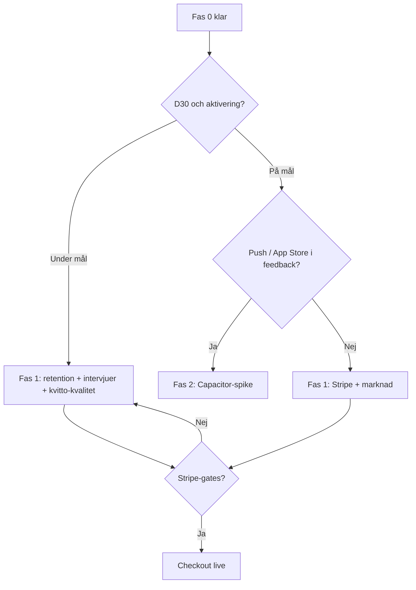

# Produktroadmap — Home Pantry

*Master roadmap efter 90-dagarsfasen. Version: 31 maj 2026.*

**Relaterat:** [NEXT_STEPS.md](./NEXT_STEPS.md) (ägare, nästa 30 dagar) · [90_DAY_ROADMAP.md](./90_DAY_ROADMAP.md) (fas 0, arkiv) · [COMPETITIVE_ANALYSIS.md](./COMPETITIVE_ANALYSIS.md) · [DAY_90_DECISION.md](./DAY_90_DECISION.md) · [PRICING.md](./PRICING.md)

---

## Inte klart = produkt

Home Pantry är **inte färdig** och har **inte product-market fit** förrän mätetalen i [COMPETITIVE_ANALYSIS.md avsnitt 13](./COMPETITIVE_ANALYSIS.md#13-mätetal-för-product-market-fit) hålls över tid — särskilt:

| Kriterium | Mål | Status (31 maj 2026) |
|-----------|-----|----------------------|
| Aktivering (24 h) | >40 % | Mät — fyll i `/admin` |
| Median tid till första scan | <3 min | Mät |
| Veckoscan-rate | >30 % | Mät |
| **D30-retention** | >15 % tidigt, >25 % moget | **Primär PMF-gate — ej bevisad** |
| Hushåll 2+ aktiva | >50 % | Mät |
| Smart fill / vecka | >20 % | Mät |
| Sean Ellis / NPS | >40 % "Mycket besviken" | Enkät — ej i dashboard |

Feature-leverans utan retention räknas **inte** som produkt klar. Se [DAY_90_DECISION.md](./DAY_90_DECISION.md) för beslut webb vs Capacitor.

---

## Fas 0 (klar) — 90 dagar, punkter 1–20

Sammanfattning av [`90_DAY_ROADMAP.md`](./90_DAY_ROADMAP.md). Tekniskt arbete i kod är i stort sett klart; **ägaruppgifter** (intervjuer, launch, riktiga PDF:er, domän, dag-90-beslut) pågår eller väntar data.

| # | Uppgift | Status | Anteckning |
|---|---------|--------|------------|
| 1 | PMF-mätetal i analytics | Klar | `/admin`, `product_event`, WoW-delta |
| 2 | Onboarding scan-first | Klar | Kvitto eller 5 streckkoder |
| 3 | Integritet + AI-policy | Klar | `/privacy`, FAQ |
| 4 | PWA + installguide | Klar | `/install-app`, banner |
| 5 | Utgångspåminnelse (e-post) | Klar | GH Actions cron (mån 07 UTC), opt-in — se [90_DAY § punkt 5](./90_DAY_ROADMAP.md#punkt-5--levererat) |
| 6 | Prissättningshypotes | Klar | [PRICING.md](./PRICING.md); Stripe ej |
| 7 | Custom domain | Klar (kod + docs) | Ägare: Firebase Console |
| 8 | Landning A/B + jämförelse | Klar | Hero variant, ICA/Bring/Matdags |
| 9 | Intervjukit | Klar (kit) | Ägare: 10 samtal + syntes |
| 10 | Kvitto-PDF testpack | Klar (infra) | Ägare: riktiga PDF lokalt; CI = syntetiska |
| 11 | AI rate limits | Klar | `AiRateLimitService` |
| 12 | Lista-export (Bring-format) | Klar | Clipboard i inköpslista |
| 13 | Launch playbook | Klar (kit) | Ägare: 2–3 communities |
| 14 | Veckovis PMF-rutin | Klar (dashboard) | Ägare: faktisk veckogranskning |
| 15 | Beslut dag 90 (dokument) | Klar | Checklista i DAY_90_DECISION |
| 16 | E2E critical flows | Klar | 23 tester, [E2E.md](./E2E.md) |
| 17 | Scan-kvalitet SV | Klar | Favoriter, senaste, snabb edit |
| 18 | Freemium UI / gränser | Klar | PlanLimits, banners |
| 19 | Recept från lager v2 | Klar | Portioner, saknade → lista |
| 20 | Turnstile prod + CI | Klar | [CAPTCHA.md](./CAPTCHA.md) |

---

## Fas 1.0 — Kvalitet (P0)

**Gate:** Alla punkter nedan ska vara gröna innan Fas 1 (retention, launch, Stripe) startar. E2E-detaljer: [E2E.md](./E2E.md).

| # | Kriterium | Status |
|---|-----------|--------|
| 1 | Kvitto: PDF/bild → parse → rader → bulk add (inga tysta fel) | ✅ Kod + E2E |
| 2 | Register/login med Turnstile (vitlista/bypass) + tydliga fel | ✅ E2E + [CAPTCHA.md](./CAPTCHA.md) |
| 3 | Scan add (streckkod manuellt) | ✅ E2E |
| 4 | Smart fill `/inkop` (`fillFromPantry`) | ✅ E2E + fixture |
| 5 | Inga 500 på `/hem`, `/inkop`, `/scan/kvitto`, `/settings` (migrationer 0012–0018) | ✅ init.ts + integration |
| 6 | E2E critical flows (page.route-mocks, ingen OpenAI i CI) | ✅ 23 tester — [E2E.md](./E2E.md) |
| 7 | `receipt-parse.test.ts` + integration + receipt fixtures | ✅ |
| 8 | Quality gate: check, test, integration, e2e, build | ✅ CI Release |

---

## Fas 1 (månad 4–6) — Retention, intäkt, kvalitet

Prioritet: **bevisa värde och vana** innan fler features eller App Store.

### P1 — Retention och återbesök

| Initiativ | Varför | Leverans |
|-----------|--------|----------|
| **Veckovis PMF-granskning (ägare)** | Dashboard utan rutin ger ingen PMF | Varje måndag: `/admin` veckosammanfattning, 1 åtgärd |
| **Intervjusyntes → produkt** | Kvalitativ churn förstår siffror | Uppdatera [USER_INTERVIEWS.md](./USER_INTERVIEWS.md); fixa topp-1 friktion |
| **E-post utgång: opt-in + copy** | Kanal finns; adoption okänd | Mät öppning/klick; A/B ämnesrad; Pro-ingår när Stripe |
| **Web push (PWA)** | E-post räcker inte för alla; billigare än native | Service worker + permission; utgång + "handla idag" — **efter** e-post baseline |
| **PWA-installation** | Matdags vinner via app-ikon | Mät standalone; förbättra banner/copy på `/hem` |

### P1 — Stripe och paywall

| Initiativ | Varför | Gate |
|-----------|--------|------|
| **Stripe Checkout + webhook** | AI-kostnad utan intäkt | [PRICING.md §6](./PRICING.md): D30 ≥15 %, rate limits klara, köpvillkor |
| **Pro tier enforcement** | Gränser finns; alla är Free | `plan_tier` på hushåll; Customer Portal senare |
| **Intresse/waitlist** | Validera pris före full launch | Klar — CTA på `/priser` + Inställningar; admin-lista |
| **Grace period policy** | Befintliga användare vid launch | Beslut dokumenteras i PRICING |

### P1 — Recept → lista (polish)

| Initiativ | Varför |
|-----------|--------|
| **Plan → inköpslista i ett flöde** | Differentiator vs Bring; v2-kärna finns |
| **Färre steg "lägg saknade"** | Minska friktion efter RecipeAssistant |
| **Kvalitet: hallucinationer** | Fortsatt prompt/test mot riktiga lager |

### P1 — Kvitto-PDF i CI

| Initiativ | Varför |
|-----------|--------|
| **≥15 anonymiserade riktiga PDF** | Synthetic fixtures täcker inte ICA/Kivra-layout |
| **Parse-regression i CI** | `receipt-parse.test.ts` + fixtures utan OpenAI där möjligt |
| **Ägare: fyll [RECEIPT_TEST_PACK.md](./RECEIPT_TEST_PACK.md)** | Blockerar prod-kvalitet |

### P1 — Marknad: Matdags-differentiering

| Initiativ | Varför |
|-----------|--------|
| **Launch enligt [LAUNCH_PLAYBOOK.md](./LAUNCH_PLAYBOOK.md)** | Distribution saknas trots copy |
| **Messaging: PDF/Kivra, plan+lager, butiksneutral** | CA §10; inte gamification-paritet |
| **SEO: "skafferi app", "minska matsvinn"** | Långsiktig SV-kanal |
| **Hero A/B utvärdering** | Välj vinnare efter konvertering, inte magkänsla |

### P1 — Prestanda och AI-kostnad

| Initiativ | Varför |
|-----------|--------|
| **Månadstak OpenAI + alert** | Solo; ingen överraskningsfaktura |
| **Admin: AI-användning per hushåll/typ** | Kompletterar rate limits |
| **Billigare modell för enkla jobb** | Kvitto vs foto vs fill — utvärdera per endpoint |

---

## Fas 2 (månad 6–12) — Distribution och djup

Starta **endast** om Fas 1-mätetal eller [DAY_90_DECISION.md](./DAY_90_DECISION.md) motiverar det.

| Initiativ | Trigger | Anteckning |
|-----------|---------|------------|
| **Capacitor / App Store** | D30 ≥15 % + kvalitativ push/app-store-begäran | Spike 1 vecka före full commit |
| **Native push-notiser** | Efter Capacitor eller TWA | Utgång, hushållsaktivitet |
| **Offline-läsning (read-only lager)** | Retention på mobil utan nät | Senare |
| **Svensk produktcache / override** | Scan-fel toppar i intervjuer | Egen DB eller crowd |
| **Prisjämförelse / affiliate** | Endast om tydlig partner | Annars skip (CA) |
| **B2B (BRF, kommuner)** | Efter B2C PMF | Lång sales cycle |

---

## Löpande (alltid)

| Aktivitet | Frekvens | Referens |
|-----------|----------|----------|
| PMF-dashboard granskning | Veckovis | `/admin` |
| Intervjuer / feedback-syntes | Löpande | [USER_INTERVIEWS.md](./USER_INTERVIEWS.md), `/admin` feedback |
| Launch-logg och UTM | Per kampanj | [LAUNCH_PLAYBOOK.md](./LAUNCH_PLAYBOOK.md) |
| Konkurrensbevakning (Matdags, FreshKeeper) | Kvartalsvis | [COMPETITIVE_ANALYSIS.md](./COMPETITIVE_ANALYSIS.md) |
| AI-kostnad vs användare | Månadsvis | [PRICING.md](./PRICING.md) |
| Dag-90 / kvartalsbeslut | Vid gate | [DAY_90_DECISION.md](./DAY_90_DECISION.md) |

---

## Veckovis PMF-rutin (ägare)

*Varje måndag, ~30 min. Detaljerad checklista: [PMF_WEEKLY.md](./PMF_WEEKLY.md). Kompletterar [NEXT_STEPS.md §2](./NEXT_STEPS.md#2-etablera-veckorutin-varje-måndag-30-min).*

1. Öppna `/admin` → PMF-dashboard: veckosammanfattning, WoW-delta, metrics vs mål.
2. Välj **en** metric under mål → skriv **en** konkret åtgärd (produkt, copy eller support).
3. Kontrollera **Pro-waitlist** (`/admin#waitlist`) mot [PRICING.md §6](./PRICING.md) (mål ≥50).
4. Logga kort: datum, metric, åtgärd (valfri anteckning).

---

## Beslutsträd (förenklat)

---

*Senast uppdaterad: 31 maj 2026. Uppdatera när Fas 1-punkter levereras eller PMF-data ändrar prioritet.*
