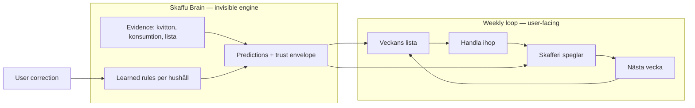

# Skaffu 2026 Product Vision

**Premise:** Skaffu Brain succeeds. Predictors (shelf life, location, replenishment, velocity, favorites) materialize reliable household memory. Users trust suggestions because they understand *why* ([TRUST_LAYER.md](./TRUST_LAYER.md)). Flags graduate to default-on; learning is invisible until it needs correction.

**One-liner:** *Gemensam veckohandel med matkoll — hushållets minne gör listan, skafferiet och matsvinn rätt utan att du tänker på det.*

**What changes:** The product stops feeling like "lista + lager + skanna" and becomes **one weekly rhythm** where Brain is the connective tissue—not a settings panel or badge zoo.

---

## From features to Brain

| Today (feature-first) | 2026 (Brain-first) |
|----------------------|-------------------|
| `/inkop` = shopping list app | `/inkop` = **this week's plan** (list + Brain suggestions + partner presence) |
| `/inventory` = manual pantry DB | **Skafferi** = mirror of reality; Brain fills gaps |
| `/hem` = dashboard of widgets | **Hem** = **household briefing** (what matters this week) |
| `/scan` = input tool | **Lägg till** = feed memory (kvitto, scan, foto) |
| Settings = prefs + flags | **Hushåll** = members + **shared memory** (Förslag, reset, privacy) |
| "Uppskattat" on random rows | Unified **trust ladder** everywhere ([Trust Layer](./TRUST_LAYER.md)) |

---

## Onboarding

**Today:** 3-step guide on lista ([`OnboardingGuide.svelte`](../src/lib/components/organisms/OnboardingGuide.svelte)); post-register → `/inkop` or scan; activation = add to list.

**2026:** Onboarding teaches the **loop + memory seed**, not "how to use a list."

### New narrative (3 beats)

1. **Tillsammans** — "Skaffu är för hushåll som handlar ihop." Prompt: bjud in partner *eller* "Jag handlar själv" (solo path still valid).
2. **Veckans lista** — Add 3 staples (favorites chip, scan shortcut). Brain has **no rules yet** — cold-start copy: *"Vi föreslår när vi sett dina mönster."*
3. **Första minnet** — Soft push: **importera ett kvitto** or scan 1 item. Receipt review framed as *"Hjälper Skaffu förstå ditt hushåll"* — not "fyll skafferiet."

### Activation metrics shift

| Metric | Feature era | Brain era |
|--------|-------------|-----------|
| Primary | First list item | First **shared** list action OR first receipt line accepted |
| Secondary | Partner invite sent | First **learning signal** (correction, accept replenishment, velocity) |
| Celebrate | "Lista startad" | "Skaffu börjar känna ditt hushåll" (after 1 receipt or 3 list checkoffs) |

### Remove / demote

- Scan-first post-register default when email verification off ([`post-register.ts`](../src/lib/navigation/post-register.ts)) → always lista-first unless user explicitly chose scan onboarding path.
- Starter pack as pantry inventory dump → optional "veckans staples" template only.

---

## Home (`/hem`)

**Today:** [`HomeDashboard`](../src/lib/components/organisms/HomeDashboard.svelte) — savings, engagement, duplicate groups, receipt autopilot fragments, weekly ritual teaser.

**2026:** **Household briefing** — one screen that answers: *Vad behöver vi göra denna vecka?*

### Information hierarchy

1. **Veckans fokus** (primary CTA → `/inkop`) — "3 kvar på listan · Anna checkade mjölk"
2. **Ät det först** — Brain-ranked expiry (velocity + shelf-life rules), not raw inventory sort
3. **Brain pulse** (subtle) — "Skaffu har lärt 12 saker om ditt hushåll" → Settings Förslag; only when `sample_count > 0`
4. **Partner activity** — who shopped, who updated list (social proof of shared loop)
5. **Input nudge** — "Senaste kvitto: 5 dagar sedan" if evidence stale (receipt as memory refresh)

### Demote below fold

- PMF/savings hero metrics (Tier C)
- Duplicate pantry cleanup as primary story (utility, not wedge)
- Meal plan / statistik entry points

**Hem is not default home** — [`APP_HOME_PATH`](../src/lib/navigation/app-home.ts) stays `/inkop`. Hem becomes **return visit** and **Sunday planning**, not landing after login.

---

## Navigation

**Today:** Primary tabs Lista · Lager · Hem ([`nav-config.ts`](../src/lib/navigation/nav-config.ts)); Scan, Ät, Stats in secondary/Mer.

**2026:** Nav follows **weekly rhythm + memory input**, not feature inventory.

### Proposed primary tabs (mobile)

| Tab | Route | Role |
|-----|-------|------|
| **Lista** | `/inkop` | Plan + shop (default home) |
| **Skafferi** | `/inventory/fridge` | What we have (Brain-truth mirror) |
| **Lägg till** | `/scan` (hub) | Feed Brain — kvitto, streckkod, foto |
| **Hem** | `/hem` | Briefing |

**Mer:** Ät (eat-first deep dive), Statistik, Inställningar, Pro.

### Header utilities

- Partner avatars + live list presence (keep)
- **Trust indicator** (optional): muted dot when Brain has unreviewed low-confidence predictions this week — tap → filtered "review" on lista or skafferi

### Naming shift

- `nav.inventory` → user-facing **Skafferi** (already partially true)
- Scan tab label → **Lägg till** (action, not technology)

---

## Receipt import

**Today:** Bulk add flow → pantry rows; optional expiry/location predictions behind flags; post-import → `/inkop?from=receipt` for replenishment.

**2026:** Receipt import is **memory ingestion** — the highest-quality Brain signal.

### Reframe the flow

| Step | Feature framing | Brain framing |
|------|-----------------|---------------|
| Upload/PDF | "Importera kvitto" | "Uppdatera hushållets minne" |
| Review rows | Edit pantry items | **Confirm or correct predictions** (trust envelope per row) |
| Finish | "X varor tillagt" | "Skaffu lärde X saker · Y behöver din input" |
| Next | Replenishment fold | **Lista förslag** with evidence explanations |

### UX requirements (from Trust Layer)

- Every predicted field shows: source label + **Uppskattat** when medium/low tier
- Tap badge → explain sheet (primary + facts)
- Correction → implicit `recordFeedback`; toast *"Tack — Skaffu justerar nästa gång"*
- Batch actions: "Godkänn alla uppskattningar" for high-trust rows only

### Pipeline priority

1. Shelf life + location (shipped)
2. Replenishment suggestions on same receipt session (evidence-linked)
3. Favorites auto-promote for high-repeat keys

**Kivra forward** (when enabled) becomes "automatic memory refresh" — not a separate product story.

---

## Shopping list (`/inkop`)

**Today:** [`ShoppingListPanel`](../src/lib/components/organisms/ShoppingListPanel.svelte) + [`ReplenishmentSection`](../src/lib/components/organisms/ReplenishmentSection.svelte) + partner invite banner.

**2026:** Lista is the **operating surface** for the weekly loop — Brain assists; humans decide.

### Sections (top to bottom)

1. **Partner bar** — avatars, "Handla tillsammans", dela länk
2. **Veckans lista** — checked/unchecked; real-time sync; who checked what
3. **Skaffu föreslår** — replenishment cards with `PredictionTrust` explanations (*Från dina kvitton*, cadence facts)
4. **Snabb lägg** — favorites (server-synced [`household_favorite_product`](../drizzle/0049_household_favorite_product.sql)), scan chip
5. **Efter shopping** — subtle "Checka av = uppdaterar skafferi" (checkoff-bridge education)

### Brain behaviors on lista

| Signal | Behavior |
|--------|----------|
| Recurring + not in pantry | Suggest add with evidence |
| Cadence overdue | "Dags igen?" with days since last purchase |
| Dismiss | `ignored` + stop nagging |
| Accept | implicit positive + optional list add |
| Eat-first overlap | "Finns hemma — ät först?" chip on duplicate-risk items |

### Solo vs duo

- Solo: lista still works; Brain copy uses "du" not "ni"; partner CTA persistent but not blocking
- Duo: partner presence is **primary** social proof that Brain is shared household memory

---

## Household

**Today:** Members, roles, pantry switch on `/hem`; Settings has scattered panels; **Förslag** ([`SuggestionsSettingsPanel`](../src/lib/components/organisms/SuggestionsSettingsPanel.svelte)) for shelf-life/location rules.

**2026:** **Hushåll = one brain, many members** — settings reorganized around memory governance.

### Household hub structure

| Section | Content |
|---------|---------|
| **Medlemmar** | Invite, roles, who's active this week |
| **Hushållets minne** | Förslag: all materialized rules + sample counts + per-rule reset |
| **Kvitton & import** | Receipt history, Kivra status, "Senaste minnesuppdatering" |
| **Integritet** | What Brain remembers; export/delete household data |
| **Favoriter** | Shared quick-add (when `HOUSEHOLD_FAVORITES_ENABLED`) |

### Trust / reset (P2 from Trust Layer)

- Per-rule **Återställ** (shipped)
- Bulk: "Glöm alla uppskattningar för mjölk"
- Signal-type reset: "Återställ alla platsförslag"
- **Never delete** append-only `learning_feedback` — user-visible history optional P3

### Member model

- All members share one rule set per `household_id`
- Corrections from any editor feed same Brain (already true in schema)
- UI shows *who* corrected last on Förslag rows (social accountability)

---

## Cross-cutting: Trust Layer as product chrome

Brain success requires **one trust language** everywhere ([`prediction-trust.ts`](../src/lib/domain/learning/prediction-trust.ts)):

- **Uppskattat** = might be wrong, tap to learn
- **Från dina tidigare val** = earned household memory
- **Från dina kvitton** = evidence, not guess
- Never "AI" in consumer UI

Progressive disclosure: badge → sheet → Settings Förslag → reset.

---

## What we do not become (Tier C guardrails)

Even with Brain success, Skaffu 2026 is **not**:

- Meal-planning AI hero ([`skaffu-core-loop.mdc`](../.cursor/rules/skaffu-core-loop.mdc))
- Grannskafferiet social network
- Wrapped/statistik as primary nav story
- "Smart kitchen OS" with 20 dashboards

Brain stays **modular predictors + household memory** — invisible until wrong.

---

## Success criteria (2026)

| Test | Pass |
|------|------|
| 5-second | "App for households shopping together with smart food memory" |
| Post-register | Lista + optional receipt feels continuous |
| Week 4 retention | Users cite "den vet vad vi brukar köpa" not "bra skanner" |
| Correction rate | Declines as `household_rule` sample counts grow |
| Partner loop | 2-member households with shared lista + shared Förslag |

---

**Relaterat:** [SKAFFU_BRAIN_MEMORY.md](./SKAFFU_BRAIN_MEMORY.md) (household memory model) · [TRUST_LAYER.md](./TRUST_LAYER.md) (trust & explanations) · [LEARNING_ENGINE.md](./LEARNING_ENGINE.md) (predictor implementation) · `.cursor/rules/skaffu-core-loop.mdc` (kärnloopen)
