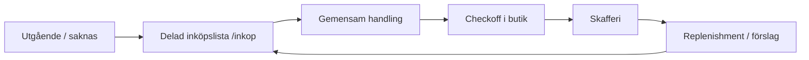

# Skaffu 2026 Vision

> **Anchor doc** for product narrative, copy, and prioritization. Aligns with [Product Narrative Sprint S5](./PRODUCT_NARRATIVE_SPRINT.md) and [skaffu-core-loop](../.cursor/rules/skaffu-core-loop.mdc).

---

## One-liner

**Skaffu är delad veckolista + hushållsminne för hela hushållet.**

A new user should understand this in **60 seconds** — not "pantry scanner app" or "AI food app."

| Locale | One-liner |
|--------|-----------|
| **SV** | Delad veckolista och hushållsminne — handla ihop, checka av, lär er vad ni brukar köpa. |
| **EN** | Shared weekly list and household memory — shop together, check off, learn what you usually buy. |

**Brain positioning (secondary, one sentence):** *Skaffu lär sig när du använder appen* — kvitton och checkoffs bygger minnet i bakgrunden; Brain accelerates the loop, it is not the product.

---

## Main loop

Skaffu builds a **household ritual around weekly shopping**, not a daily inventory chore.

| Phase | User goal | Primary surface | Cadence |
|-------|-----------|-----------------|---------|
| **Plan** | Veckans lista tillsammans | `/inkop` | ~1×/vecka |
| **Execute** | Handla + checka av | `/inkop` (execution mode) | ~1×/vecka |
| **Close loop** | Kvitto/checkoff → skafferi | `/scan` (kvitto), checkoff bridge | Per handel |
| **Brief** | Nästa bästa handling | `/hem` | Veckovis + expiry nudges |
| **Remember** | Vad brukar vi köpa / när går det ut? | Replenishment, eat-first, Brain footnotes | Compounds over weeks |

**Hypothesis (60 days):** 10 hushåll × 2 medlemmar × **1 gemensam handling/vecka** on the shared list.

**Secondary loops (support, not lead):**

- **Daily:** expiry awareness — eat/plan before waste (`/inventory`, hem §3 when engaged)
- **Activation:** first list items or first receipt — lista-first, kvitto as strongest Brain seed
- **Household:** partner invite + shared list token — retention multiplier

---

## Anti-patterns

Do **not** lead with these in copy, onboarding, home, scan hub, or register meta. They confuse the 60-second mental model.

| Anti-pattern | Why it fails | Do instead |
|--------------|--------------|------------|
| **Pantry-scanner first** | Feels like inventory homework before value | Lista-first; skafferi fills via kvitto/checkoff |
| **Photo-as-primary activation** | High friction, weak Brain, blocks onboarding | Kvitto hero on scan; foto secondary |
| **Triple empty dashboard** | Cold start looks broken | One hero CTA on hem; hide empty §2+§3 until engaged |
| **"AI app" / Brain as hero** | Overpromises before data exists | Brain as background memory; visible only when data supports it |
| **Scan-first nav / CTA** | Scan is loop *input*, not the ritual | Inköp + lista outcome language; Skanna reachable but not primary wedge |
| **Skafferi-app SEO on register** | Attracts wrong intent (solo inventory) | Register meta = gemensam veckolista + lär sig |
| **Full logo rebrand mid-sprint** | Distraction, merge conflict risk | Evolution only — shelf stroke tweak, copy alignment |
| **New Brain models for narrative** | Scope creep, deploy risk | Read models + copy only in narrative sprint |
| **Grannskafferiet / Pro / Stripe as wedge** | Tier C — not core loop | Lista + household + kvitto path |

---

## Success criteria (narrative)

- Register → first session: user adds list items without foto as primary CTA
- `/hem` cold: one clear next action, not three empty headings
- `/scan`: kvitto hero first
- Mobile nav: Inköp + Skanna in bottom bar (S4)
- Copy everywhere lista-first matches this doc

---

## Related

- [PRODUCT_NARRATIVE_SPRINT.md](./PRODUCT_NARRATIVE_SPRINT.md) — implementation slices
- [HOUSEHOLD_LOOP_AUDIT.md](./HOUSEHOLD_LOOP_AUDIT.md) — loop definitions and friction map
- [LANDING_STORY_AUDIT.md](./LANDING_STORY_AUDIT.md) — hero/register copy proposals
- [CURRENT_REALITY.md](./CURRENT_REALITY.md) — prod SHA, nav, flags
