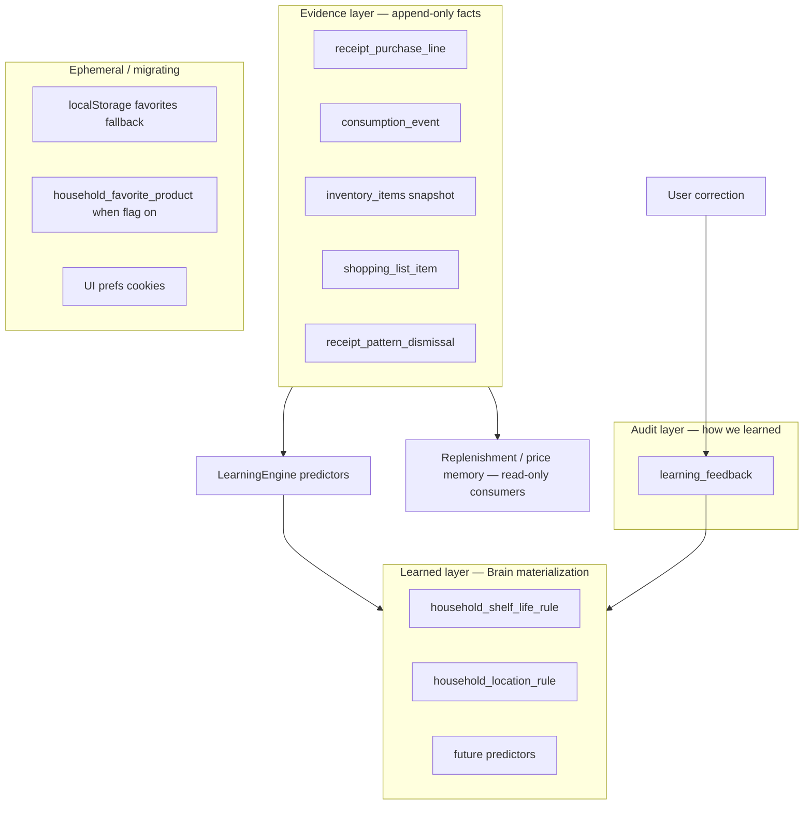

# Skaffu Brain — Household Memory Model

*How Skaffu remembers pantry habits per household. Evidence (what happened) is separate from learned rules (what to suggest next).*

**Relaterat:** [LEARNING_ENGINE.md](./LEARNING_ENGINE.md) (predictor implementation) · [CURRENT_REALITY.md](./CURRENT_REALITY.md) · [SKAFFU_2026_VISION.md](./SKAFFU_2026_VISION.md) (product vision when Brain succeeds) · `.cursor/rules/skaffu-core-loop.mdc`

---

## Household Memory Model

Skaffu does not store one monolithic “brain blob.” Household memory is **three layers**:



**Design rules**

| Rule | Meaning |
|------|---------|
| **Household boundary** | All memory keyed by `household_id`; members share one pantry brain. |
| **Subject key** | Product memory uses `normalized_key` from [`normalizeReceiptProductName`](../src/lib/domain/purchase-pattern.ts)—not raw receipt strings in learned tables. |
| **Evidence ≠ learning** | [`receipt_purchase_line`](../src/lib/infrastructure/db/schema.ts) is purchase *evidence*; [`household_shelf_life_rule`](../src/lib/infrastructure/db/schema.ts) is *learned* shelf life. |
| **Correctable** | Learned values must trace to [`learning_feedback`](../src/lib/infrastructure/db/schema.ts) or explicit user edit. |
| **Rollback** | Disable flags → predictors fall back to heuristics; evidence and rules remain for re-enable. |

---

## Memory catalog (user examples + extensions)

| Memory | Värde | Datakälla idag | Integritetsrisk | Learning potential |
|--------|-------|----------------|-----------------|-------------------|
| **Vanliga inköp** | “Vi köper mjölk ofta” → replenishment, lista | [`receipt_purchase_line`](../src/lib/infrastructure/db/schema.ts) — `normalized_key`, import batches, counts | **Låg–medel** — hushållets matvanor; stannar i household | **Medel** — redan [`detectReplenishmentSuggestions`](../src/lib/domain/replenishment.ts); Brain V2 = feedback på accept/dismiss |
| **Konsumtionshastighet** | “Mjölk tar ~4 dagar” → smart expiry, eat-first timing | [`consumption_event`](../src/lib/infrastructure/db/schema.ts) + `inventory_items.expires_on` / finished state | **Medel** — avslöjar hur snabbt hushållet äter/slänger | **Hög** — ej materialiserad; implicit signal från consumed vs expiry |
| **Favoritprodukter** | Snabb återläggning vid scan/add | [`household_favorite_product`](../src/lib/infrastructure/db/schema.ts) när `HOUSEHOLD_FAVORITES_ENABLED` — annars [`favorite-products.ts`](../src/lib/utils/favorite-products.ts) localStorage | **Låg** — hushållsscope; **ej** cross-household | **Medel** — explicit save vid scan; partners delar samma genvägar |
| **Korrigerade bäst-före** | Personlig hållbarhet per vara | [`household_shelf_life_rule`](../src/lib/infrastructure/db/schema.ts) + [`learning_feedback`](../src/lib/infrastructure/db/schema.ts) | **Låg** — matförvaring, inte identitet | **Kärn-V1** — [`ShelfLifePredictor`](../src/lib/application/predictors/shelf-life-predictor.ts), flag `SHELF_LIFE_LEARNING_ENABLED` |
| **Vanliga förvaringsplatser** | “Kyckling → kyl” per hushåll | [`household_location_rule`](../src/lib/infrastructure/db/schema.ts) + receipt/inventory corrections | **Låg** | **V1+** — `LocationPredictor`; flag `LOCATION_LEARNING_ENABLED`; feedback vid location change i receipt review |
| **Återkommande listor** | Veckolista-mönster, staples | [`shopping_list_item`](../src/lib/infrastructure/db/schema.ts) — checked history implicit via list state; ej historik-tabell | **Låg** | **Medel** — “weekly staples” = derived från list + receipt; V2 list template memory |
| **Senast betalt pris** | Prisminne vid inköp | `receipt_purchase_line.unit_price`, `store_label` → [`PriceMemoryService`](../src/lib/application/price-memory.service.ts) | **Medel** — ekonomisk data i household | **Låg** — evidence display; optional “price wrong” feedback later |
| **Dismissed förslag** | “Sluta föreslå ris” | [`receipt_pattern_dismissal`](../src/lib/infrastructure/db/schema.ts) | **Låg** | **Medel** — negative signal; map to `feedback_type: ignored` |
| **Typisk köp-mängd** | Replenishment qty/unit | Receipt lines + last line per key | **Låg** | **Medel** — part of replenishment aggregate, not separate rule table V1 |
| **Butik/kedja** | Prisminne kontext | `store_label` on purchase lines (PDF/Kivra header) | **Låg** | **Låg** — weak global prior only; not household personality |

---

## Core Memories

Memories that directly support the **60-day core loop** (delad lista → handla → skafferi → nästa vecka):

1. **Purchase evidence per product** (`receipt_purchase_line`) — *already shipped*
   - Enables replenishment, cadence, price memory.
   - Not owned by Brain; Brain reads it.

2. **Learned shelf life per (product, location)** (`household_shelf_life_rule`) — *V1 Brain*
   - Value: fewer wrong expiry alerts, better eat-first.
   - Source: user corrections at receipt review + inventory edit.
   - Migration: `0047_learning_engine_v1.sql`

3. **Learned storage location per product** (`household_location_rule`) — *V1+ Brain*
   - Value: correct fridge/freezer/cupboard on import without re-tapping.
   - Migration: `0048_household_location_rule.sql`

4. **Negative preferences** (`receipt_pattern_dismissal` + future `ignored` feedback)
   - Value: stop nagging on dismissed replenishment patterns.

5. **Shared shopping list state** (`shopping_list_item`) — *product state, not Brain*
   - Value: veckans lista; memory of “what we plan to buy” not “what we learned.”

---

## Nice To Have Memories

Higher leverage later; not blocking wedge:

| Memory | Why nice | Risk if rushed |
|--------|----------|----------------|
| **Consumption velocity** | Better expiry without manual dates | Wrong inference feels creepy (“du slänger ofta”) |
| **Household favorites (server)** | Partner sees same scan shortcuts | Shipped behind `HOUSEHOLD_FAVORITES_ENABLED` (default off); localStorage fallback for anonymous | Device-only fallback until flag on |
| **List templates / recurring list** | “Veckohandling ICA” auto-list | Over-automation vs simple lista |
| **Store preference** | “Vi handlar oftast på X” | Weak signal; marketing feel |
| **Brand loyalty** | Substitute suggestions | Low match quality from receipt names |
| **Meal / recipe affinity** | Meal AI (Tier C frozen) | Scope creep, OpenAI dependency |
| **Global anonymized priors** | Cold-start for new households | Must not leak cross-household detail |
| **Member-level memory** | “Arvid köper alltid X” | Splits household model; partner conflict |

---

## Dangerous Memories To Avoid

| Memory type | Why dangerous | Policy |
|-------------|---------------|--------|
| **Cross-household raw export** | Surveillance / data sale narrative | Global layer = aggregated keys only, k≥50 households |
| **Full receipt image retention** | PII, payment artifacts | Parse → lines; don’t store images in Brain tables |
| **Health/diet inference** | “You eat unhealthy” | No calorie scoring, no medical claims from purchases |
| **Member identity on product keys** | “Who bought alcohol” | Keep `user_id` on events for audit; don’t surface per-person shopping profiles in UI |
| **Location outside home** | GPS, store geolocation history | `store_label` enum/string only; no coordinates |
| **Financial profiling beyond last price** | Spending dashboards as hero | Price memory chip only; no “you spent X on dairy” (Tier C dashboards frozen) |
| **Implicit learning without correction UX** | Trust collapse | Every learned field must be visible as Uppskattat + editable |
| **Permanent memory without delete** | GDPR / user trust | Settings Förslag: view + reset per rule (UX plan P2) |
| **OpenAI as memory store** | Non-deterministic, non-auditable | ChatGPT reasons; Brain stores in Postgres rules + feedback |

---

## V1 Memory Layer

What Skaffu Brain **owns** in codebase today ([LEARNING_ENGINE.md](./LEARNING_ENGINE.md)):

### Tables (learned + audit)

| Table | Memory content | Populated by |
|-------|----------------|--------------|
| `household_shelf_life_rule` | `typical_days`, `sample_count` per `(normalized_key, location)` | `recordFeedback` → median update |
| `household_location_rule` | `location`, `sample_count` per `normalized_key` | Location feedback when `LOCATION_LEARNING_ENABLED` |
| `household_favorite_product` | Scan quick-pick name/qty/unit per `normalized_key` + optional barcode | Explicit save on scan/add when `HOUSEHOLD_FAVORITES_ENABLED` |
| `learning_feedback` | Full audit trail per predictor (`predictor_id`, `subject_key`, `feedback_type`) | accept/correct/reject/ignore |

### Evidence tables (read by Brain, not “Brain tables”)

| Table | Used for |
|-------|----------|
| `receipt_purchase_line` | Replenishment, cadence, price memory, future velocity |
| `consumption_event` | Wrapped stats; future velocity learning |
| `receipt_pattern_dismissal` | Suppress replenishment suggestions |
| `inventory_items` | Current pantry snapshot; expiry source for eat-first |
| `shopping_list_item` | Shared list state (not learned rules) |

### Predictors V1

| Predictor | Input memory | Output | Flag |
|-----------|--------------|--------|------|
| `shelf_life` | shelf rules + heuristics | `expires_on` suggestion | `SHELF_LIFE_LEARNING_ENABLED` |
| `location` | location rules + heuristics | `fridge\|freezer\|cupboard` | `LOCATION_LEARNING_ENABLED` |

### Explicitly **not** V1 memory

- Consumption-speed materialization
- List recurrence templates
- Replenishment accept/ignore in `learning_feedback` (dismissal table only today)
- Global priors table

### V1 household memory API (conceptual)

```
HouseholdMemory {
  householdId
  productRules: {
    normalizedKey
    shelfLife?: { location, typicalDays, sampleCount }
    location?: { location, sampleCount }
  }
  evidenceSummary?: {  // read-only aggregates, not stored as Brain
    lastPurchasedAt, importCount, avgCadenceDays, lastUnitPrice
  }
}
```

Implementation = queries across rule repos + purchase pattern service; **no** `household_memory` JSON column.

### Rollout

- Flags default **off** — memory accumulates only when enabled; evidence (`receipt_purchase_line`) always accumulates on import.
- Partners share memory automatically (household scope)—aligns with delad inköpslista positioning.

### V1 → V2 memory roadmap (ordered)

1. Replenishment feedback → `learning_feedback` (`ignored` / `accepted` on add-to-list)
2. Consumption-implied shelf life (finished before expiry → extend days)
3. ~~Household favorites sync (barcode + normalized key)~~ — shipped behind `HOUSEHOLD_FAVORITES_ENABLED`
4. List staple detection (weekly recurring list items)
5. Global anonymized priors table (cold start)

---

## Summary

**Skaffu remembers the household’s pantry habits, not the user’s psyche.** Core memory is **what you buy, where you store it, how long it lasts, and what you corrected.** Purchase history is evidence; Brain tables are **small, correctable rules** per product key. Favoriter sync per household when the flag is on; anonymous users still use device localStorage.
