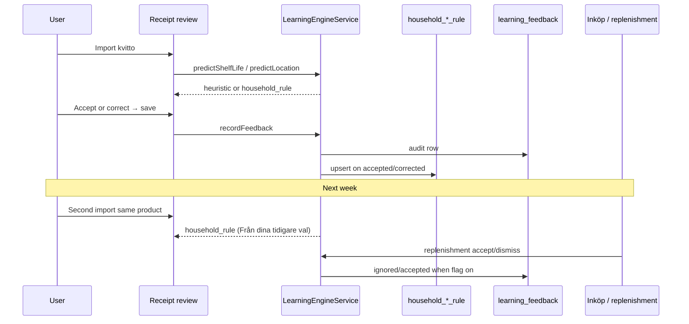
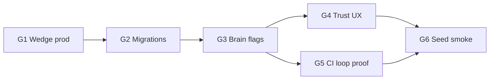

# Skaffu Brain V1 Execution Plan

*Coordinator playbook for closing the household memory loop — evidence → prediction → correction → materialized rule → next prediction.*

**Relaterat:** [LEARNING_ENGINE.md](./LEARNING_ENGINE.md) (predictor wiring) · [SKAFFU_BRAIN_MEMORY.md](./SKAFFU_BRAIN_MEMORY.md) (memory model) · [TRUST_LAYER.md](./TRUST_LAYER.md) (trust UX contract) · [HIGHEST_LEVERAGE.md](./HIGHEST_LEVERAGE.md) (wedge before Brain) · [FOUNDER_SEED_PLAYBOOK.md](./FOUNDER_SEED_PLAYBOOK.md) (seed cohort flags) · [CURRENT_REALITY.md](./CURRENT_REALITY.md) (prod SHA, flags)

**Prod reality (2026-06-13):** Brain code ships on master (`282a551f`); prod (`3961184`) still runs `/hem`-nav with **all Brain flags off**. Master `apphosting.yaml` has seed-cohort Brain flags **on** — effective only after deploy.

---

## Household memory loop (what we are proving)



**Loop succeeds when:** a seed household can demo *import → Uppskattat → correct once → re-import uses household rule → lista shows “Från dina kvitton” suggestion* — on **prod**, with duo share enabled.

---

## Critical path

Order is strict. Parallel tracks must not merge ahead of step 1 without coordinator exception.

| Step | Gate | Owner | Blocks |
|------|------|-------|--------|
| **G1 — Wedge on prod** | Deploy master: `inkop-first`, `PUBLIC_SHOPPING_LIST_SHARE_ENABLED=true`, onboarding tillsammans, duo product events | Coordinator + Track 1 | Shared household scope; Brain story = “ihop”, not solo pantry |
| **G2 — Migrations live** | `0047`–`0049` applied on prod DB (`0050` is enum-only, no DDL) | Coordinator / deploy pipeline | Rules + feedback tables exist |
| **G3 — Brain flags on prod** | Four flags `true` in deployed `apphosting.yaml` (see [Feature flags](#feature-flags)) | Track 2 | Predictors + receipt UX active |
| **G4 — Trust UX complete** | Receipt finish summary, Swedish explanations, explain sheet wired (Tracks 3–5) | Tracks 3–5 | User can understand and correct predictions |
| **G5 — Loop proven in CI** | `learning-engine.integration.test.ts` green; scan-bulk loop if stable (Track 6) | Track 6 | Regression guard for memory loop |
| **G6 — Seed smoke** | [FOUNDER_SEED_PLAYBOOK.md](./FOUNDER_SEED_PLAYBOOK.md#seed-cohort-brain-flags) smoke + [PROD_SMOKE.md](./PROD_SMOKE.md) | Coordinator | Founder DMs safe to send |



**Coordinator rule:** Max **3** feature branches (`feat/*`, `fix/*`) during Brain close-out. Integration owner merges to `master`; one deploy-verify run at end ([CURSOR_COORDINATOR.md](./CURSOR_COORDINATOR.md)).

---

## Parallel agent tasks (8 tracks)

Eight implementation/doc tracks spawned from the coordinator brief. **Only the coordinator creates agents.** Tracks 2–7 may run in parallel **after G1 is merged** (or on master behind flags). Track 8 is coordinator-owned.

| Track | Mission | Primary deliverables | Conflicts / notes |
|-------|---------|----------------------|-------------------|
| **1 — Wedge prerequisite** | “Veckans lista tillsammans” on prod path | `OnboardingGuide`, `onboarding-steps`, `PostOnboardingSharePrompt`, `/lista/[token]` join CTA, `product-events` (`partner_joined`, `list_link_shared`, `shared_checkoff`), `post-register` lista-first | Hot zone: onboarding, inkop, lista. **No** explain sheet or PredictionTrust API |
| **2 — Brain fuel** | Turn on seed cohort learning + light trust copy | `apphosting.yaml` + `.env.example` four Brain flags; receipt bulk i18n memory framing; `ReplenishmentSection` evidence chip; `FOUNDER_SEED_PLAYBOOK` seed flags section | Touches `apphosting.yaml` — sync [CURRENT_REALITY.md](./CURRENT_REALITY.md) same commit |
| **3 — Receipt finish UX** | Close accept path + finish state | Bulk save summary (*Skaffu lärde X saker · Y behöver din input*); row counts estimated/corrected/manual; verify implicit `accepted` on unchanged estimates in `scan/+page.server.ts` | Overlaps Track 2 i18n — coordinate `receiptBulk.*` keys |
| **4 — Swedish templates** | Replace English `explain` dev strings | `buildShelfLifeExplanation`, i18n for `shelf_life.household\|heuristic\|llm`; wire `ShelfLifePredictor` / `learning-engine` user-facing paths | Prerequisite for Track 5 explanation props |
| **5 — Trust explain sheet** | TRUST_LAYER level-2 disclosure | `PredictionExplainSheet.svelte`, extend `EstimatedBadge` with optional `explanation`; wire `ReceiptBulkAddFlow` + `InventoryTableRow` | Depends Track 4 for primary/facts content |
| **6 — Memory loop tests** | Prove loop in CI | Fix `Mjölk` encoding in `learning-engine.integration.test.ts`; strengthen shelf-life + location loop tests; optional `scan-bulk.integration.test.ts` | Test-only; no UI |
| **7 — Eat-first integration** | Connect Brain to waste outcome | Verify `expiresOnSource` / `household_learned` in eat-first sort; flag gating receipt → inventory display; doc section on eat-first + flags | Max 3 product files; no new predictors |
| **8 — Coordinator ops** | Integration + deploy readiness | **This doc**; refresh `CURRENT_REALITY` post-deploy; G0 + deploy + `PROD_SMOKE`; no product code unless P0 blocker | Deploy claim only after green Deploy workflow + agent smoke |

**Explicitly out of scope for all tracks (delay per [HIGHEST_LEVERAGE.md](./HIGHEST_LEVERAGE.md)):** full `PredictionTrust` API envelope on parse responses, LLM tier (`SHELF_LIFE_LLM_ENABLED`), global anonymized priors, hem briefing refactor, `learning_feedback` history UI, bulk forget-all, Tier C surfaces.

---

## Dependencies

| Dependency | Tracks blocked | Mitigation |
|------------|----------------|------------|
| Master not deployed (prod still `/hem`, share off) | 2–7 user-visible value | Track 1 + coordinator deploy first |
| Migration `0047` not on prod DB | 2, 6 | Deploy pipeline runs migrations before traffic |
| `SHELF_LIFE_LEARNING_ENABLED` off | 3, 4, 5, 6 (rule materialization) | Track 2 flags; local `.env.example` uncomment |
| `PUBLIC_SHELF_LIFE_ESTIMATES_IN_RECEIPT` off | 3, 5 receipt rows | Falls back to `SHELF_LIFE_LEARNING_ENABLED` locally only — prod needs explicit flag |
| Track 4 not merged | 5 (empty explanations) | Merge templates before explain sheet |
| `learningEngineService` on `event.locals` | All server tracks | Already wired in `hooks.server.ts` + `di.ts` |
| Duo household (2 members) | Meaningful shared Brain demo | Track 1 invite/share |

**Integration merge order (recommended):** 6 (tests) → 4 (templates) → 2 (flags/copy) → 3 (receipt finish) → 5 (sheet) → 7 (eat-first) → 1 (wedge) if not already on master → 8 (deploy).

---

## Files likely touched

Grouped by layer — parallel agents should stay in their track’s column to reduce conflicts.

| Layer | Track 1 | Track 2 | Track 3 | Track 4 | Track 5 | Track 6 | Track 7 |
|-------|---------|---------|---------|---------|---------|---------|---------|
| **Config** | — | `apphosting.yaml`, `.env.example` | — | — | — | — | — |
| **Domain** | — | — | — | `domain/learning/shelf-life-explanation.ts`, `prediction-trust.ts` | — | — | eat-first sort domain |
| **Application** | `product-events.ts` | — | — | `predictors/shelf-life-predictor.ts`, `learning-engine.service.ts` | — | `learning-engine.integration.test.ts`, `scan-bulk.integration.test.ts` | `inventory.service.ts` (verify only) |
| **Server routes** | `inkop/+page.server.ts`, `lista/[token]/*`, `invite/*` | — | `scan/+page.server.ts`, `receipt-import.ts` | — | — | — | eat-first route loaders |
| **UI** | `OnboardingGuide.svelte`, `ShoppingListPanel.svelte`, `PostOnboardingSharePrompt.svelte` | `ReplenishmentSection.svelte`, `ReceiptBulkAddFlow.svelte` | `ReceiptBulkAddFlow.svelte`, `action-toast.ts` | — | `EstimatedBadge.svelte`, `PredictionExplainSheet.svelte`, `InventoryTableRow.svelte` | — | eat-first components |
| **i18n** | `sv.json`, `en.json` onboarding | `receiptBulk.*`, `learning.sourceReceipts` | `receiptBulk.learnSummary*` | `learning.shelfLife.*` templates | `learning.explain.*` | — | — |
| **Docs** | — | `FOUNDER_SEED_PLAYBOOK.md`, `LEARNING_ENGINE.md` | — | — | — | — | `SKAFFU_BRAIN_V1_EXECUTION.md` § product integration |

**Shared hot files (single integration owner merges):** `ReceiptBulkAddFlow.svelte`, `src/lib/i18n/locales/*.json`, `apphosting.yaml`.

---

## Tests

### G0 before merge to master

```bash
npm run check:locales && npm run check && npm test
```

### Track-specific (must be green before track “done”)

| Suite | Track | Proves |
|-------|-------|--------|
| `learning-engine.service.test.ts` | 4, 6 | Feedback → rule upsert; predictor chain |
| `learning-engine.integration.test.ts` | 6 | Full shelf-life + location loop; encoding |
| `shelf-life-predictor.test.ts` | 4 | Swedish explanation wiring |
| `shelf-life-learning.test.ts` | 6 | Median materialization |
| `household-shelf-life-rule.repository.test.ts` | 6 | Persistence |
| `learning-feedback.repository.test.ts` | 6 | Audit trail |
| `scan-bulk.integration.test.ts` | 3, 6 | Receipt bulk + feedback (skip if PGlite hang — note in PR) |
| `inventory.service.test.ts` | 7 | Expiry/location `recordFeedback` |
| `shelf-life-learning-flag.test.ts`, `location-learning-flag.test.ts`, `replenishment-learning-flag.test.ts` | 2 | Flag readers |
| `onboarding-steps.test.ts`, `post-register.test.ts` | 1 | Wedge routing |
| `action-toast.test.ts` | 3 | Learn summary toast keys |

### Manual seed smoke (post-deploy, coordinator)

Per [FOUNDER_SEED_PLAYBOOK.md](./FOUNDER_SEED_PLAYBOOK.md#seed-cohort-brain-flags):

1. Import kvitto → **Uppskattat** on expiry (and location when `LOCATION_LEARNING_ENABLED`)
2. Save unchanged → implicit accept; edit date → corrected + thanks toast
3. Re-import same product → household-learned hint / shorter explanation
4. **Inköp** → replenishment card with *Från dina kvitton* chip; dismiss → no repeat nag
5. **Inställningar → Förslag** → rule listed with **Återställ**

---

## Rollback

| Action | Effect | Data loss |
|--------|--------|-----------|
| Set four Brain flags to `false` in Firebase App Hosting / `apphosting.yaml` | Household tier skipped; heuristics only; receipt estimates hidden when `PUBLIC_SHELF_LIFE_ESTIMATES_IN_RECEIPT` off | **None** — `household_*_rule` + `learning_feedback` retained |
| Disable `PUBLIC_SHOPPING_LIST_SHARE_ENABLED` only | Lista share UI off; Brain rules remain | None |
| Revert deploy to prior SHA | Previous nav/flags | None for Brain tables |
| Per-rule **Återställ** in Settings | Deletes one materialized rule | Feedback audit kept |

**Never rollback by dropping migrations** on prod — flags are the product rollback lever ([LEARNING_ENGINE.md](./LEARNING_ENGINE.md#rollback)).

---

## Feature flags

| Flag | Scope | Master `apphosting.yaml` | Prod today | Reader |
|------|-------|--------------------------|------------|--------|
| `SHELF_LIFE_LEARNING_ENABLED` | server RUNTIME | **true** | off | `isShelfLifeLearningEnabled()` |
| `PUBLIC_SHELF_LIFE_ESTIMATES_IN_RECEIPT` | BUILD+RUNTIME | **true** | off | `isShelfLifeEstimatesInReceiptEnabled()` |
| `LOCATION_LEARNING_ENABLED` | server RUNTIME | **true** | off | `isLocationLearningEnabled()` |
| `REPLENISHMENT_LEARNING_ENABLED` | server RUNTIME | **true** | off | `isReplenishmentLearningEnabled()` |
| `SHELF_LIFE_LLM_ENABLED` | server RUNTIME | **false** | off | Stub tier — **not V1** |
| `HOUSEHOLD_FAVORITES_ENABLED` | server RUNTIME | **false** | off | Separate track; migration `0049` |
| `PUBLIC_SHOPPING_LIST_SHARE_ENABLED` | BUILD+RUNTIME | **true** | off | Wedge prerequisite (Track 1) |

**Local dev:** uncomment Brain block in [`.env.example`](../.env.example). When `PUBLIC_SHELF_LIFE_ESTIMATES_IN_RECEIPT` unset, falls back to `SHELF_LIFE_LEARNING_ENABLED`.

**Flag behavior summary:**

- `SHELF_LIFE_LEARNING_ENABLED` off → no `household_rule` tier; no rule materialization from feedback
- `PUBLIC_SHELF_LIFE_ESTIMATES_IN_RECEIPT` off → receipt review hides expiry UX; inventory badge unchanged
- `LOCATION_LEARNING_ENABLED` off → location heuristic only in receipt review
- `REPLENISHMENT_LEARNING_ENABLED` off → dismiss still writes `receipt_pattern_dismissal`; skips `learning_feedback`

---

## UX acceptance criteria

Aligned with [TRUST_LAYER.md](./TRUST_LAYER.md) and [SKAFFU_2026_VISION.md](./SKAFFU_2026_VISION.md) receipt/lista framing.

### Receipt review (`ReceiptBulkAddFlow`)

- [ ] Session hint once: dates are estimates — user can fix inline
- [ ] **Uppskattat** badge beside predicted expiry and location; tap expands source tier (Track 5: primary + facts sheet)
- [ ] Save never blocked by reading explanation
- [ ] Hidden fields preserve prediction correlation (`predictedExpiresOn_*`, `predictedLocation_*`, `modelVersion`)
- [ ] Finish state: summary toast or redirect copy with learned vs needs-input counts (Track 3)
- [ ] No “AI” in consumer copy — **Uppskattat**, **Från dina tidigare val**, **Vanlig uppskattning**

### Inventory (`InventoryTableRow`, item edit)

- [ ] **Uppskattat** on `isEstimatedExpirySource` (`heuristic`, `household_learned`, legacy `ai_inferred`)
- [ ] Expiry edit on estimated source → `recordFeedback` + `learning.correctedThanks` toast
- [ ] Location override shows **egen plats** when user changes predicted location

### Lista (`ReplenishmentSection`)

- [ ] Reason line remains primary; evidence chip **Från dina kvitton** when `reasonCode` set
- [ ] **Lägg till** → accept feedback when `REPLENISHMENT_LEARNING_ENABLED`
- [ ] **Inte nu** → dismiss + `ignored` feedback + `receipt_pattern_dismissal`

### Settings → Förslag (`SuggestionsSettingsPanel`)

- [ ] Lists shelf-life + location rules with sample counts
- [ ] Per-row **Återställ** deletes materialized rule; audit retained
- [ ] Visible when learning flag on or `hasRules`

### Eat-first (Track 7)

- [ ] Expiry sort respects dates regardless of source; household-learned dates participate in urgency
- [ ] Optional subtle indicator where source is estimated (no new dashboard)

---

## Definition of done

Brain V1 execution is **done** when all of the following are true:

| Criterion | Evidence |
|-----------|----------|
| **Wedge live** | Prod: `inkop-first`, share on, onboarding tillsammans; [CURRENT_REALITY.md](./CURRENT_REALITY.md) updated |
| **Brain flags live on prod** | Four flags `true` on deployed SHA; seed playbook smoke passes |
| **Memory loop demonstrated** | Manual smoke + green `learning-engine.integration.test.ts` (heuristic → correct → household_rule) |
| **Trust UX tier 1–2** | Badge + explain sheet on receipt + inventory; Swedish templateIds for shelf life |
| **Lista trust** | Replenishment evidence chip + feedback on accept/dismiss |
| **Governance** | Settings Förslag reset works for shelf + location rules |
| **CI G0 green** | `check:locales`, `check`, `npm test` on merge SHA |
| **Deploy claim** | Green **Deploy to production** for target SHA + coordinator [PROD_SMOKE.md](./PROD_SMOKE.md) — not “merged to master” alone |

**Not required for V1 done:** `PredictionTrust` on API responses, LLM tier, global priors, consumption velocity materialization, favorites server sync (`HOUSEHOLD_FAVORITES_ENABLED`), hem briefing, bulk forget-all.

---

## Current state vs gaps

### Already shipped (codebase on master)

| Area | Status | Key artifacts |
|------|--------|---------------|
| **Schema** | Shipped | `0047` `household_shelf_life_rule` + `learning_feedback`; `0048` `household_location_rule`; `0049` `household_favorite_product`; `0050` duo event types (app enum only) |
| **Learning engine core** | Shipped | `LearningEngineService`, `ShelfLifePredictor`, `LocationPredictor`, DI in `di.ts` / `hooks.server.ts` |
| **Receipt → engine** | Shipped | `receipt-import.ts`, `scan/+page.server.ts` predictions + `recordFeedback` / `recordLocationFeedback` on bulk save |
| **Receipt UX baseline** | Shipped | `ReceiptBulkAddFlow`: estimates, badges, hidden prediction fields, location override |
| **Inventory feedback** | Shipped | `inventory.service.ts` expiry/location correction → learning |
| **Replenishment feedback** | Shipped | `/api/replenishment/accept|dismiss` → `recordPredictorFeedback` when flag on |
| **Trust primitives** | Shipped | `prediction-trust.ts` types; `EstimatedBadge.svelte`; `buildShelfLifeExplanation` + Swedish templates (in flight Track 4) |
| **Settings governance** | Shipped | `SuggestionsSettingsPanel`, `household-suggestions.service`, reset actions |
| **Docs** | Shipped | `LEARNING_ENGINE.md`, `SKAFFU_BRAIN_MEMORY.md`, `TRUST_LAYER.md`, `HIGHEST_LEVERAGE.md`, seed playbook flags section |
| **Master flags config** | Shipped | `apphosting.yaml` Brain + share flags **true** |

### Gaps parallel agents are closing

| Gap | Track | User impact if unfixed |
|-----|-------|------------------------|
| Prod not on master wedge | 1, 8 | Brain learns solo households; share/lista story broken |
| Prod Brain flags off | 2, 8 | All learning code inert in production |
| Receipt finish summary missing | 3 | Users don’t feel “Skaffu learned something” |
| English `explain` / no sheet | 4, 5 | Trust ladder stops at badge; TRUST_LAYER level-2 open |
| Integration test encoding / flake | 6 | Loop regression undetected |
| Eat-first not tied to Brain narrative | 7 | Waste outcome disconnected from corrections |
| `PredictionTrust` not on API | — (V2) | Client cannot render structured facts from JSON alone |
| Replenishment without full trust envelope | — (V2) | No unified “Inte rätt” on lista cards |
| `HOUSEHOLD_FAVORITES_ENABLED` off | — (later) | Favorites stay device-local |
| LLM tier | — (explicitly out) | Stub only |
| Bulk reset / dismissed-list UI | — (P2) | Per-rule reset only |

### Migration reference (0047–0050)

| Migration | Purpose |
|-----------|---------|
| `0047_learning_engine_v1.sql` | `household_shelf_life_rule`, `learning_feedback` |
| `0048_household_location_rule.sql` | `household_location_rule` |
| `0049_household_favorite_product.sql` | Server-sync favorites (flag-gated) |
| `0050_duo_wedge_events.sql` | Documents `partner_joined`, `list_link_shared`, `shared_checkoff` event types — no DDL |

---

## Coordinator checklist (copy before spawn)

- [ ] Read [CURRENT_REALITY.md](./CURRENT_REALITY.md) + this doc
- [ ] Confirm WIP ≤ 3 branches
- [ ] Spawn proposal per [coordinator-spawn-budget.mdc](../.cursor/rules/coordinator-spawn-budget.mdc)
- [ ] Assign track ownership + forbidden files
- [ ] Integration owner resolves `ReceiptBulkAddFlow` + i18n conflicts
- [ ] G0 green on integration SHA
- [ ] Deploy + update `CURRENT_REALITY` + seed smoke
- [ ] Do **not** claim “prod is live” until Deploy workflow + `PROD_SMOKE` complete
