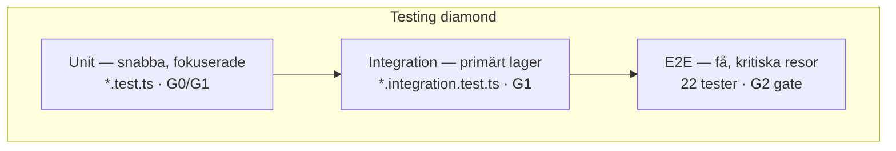

# Teststrategi — Testing Diamond (Home Pantry)

*Senast: 2026-06-01. Operativ testpolicy för agenter och utvecklare.*

Home Pantry följer en **testing diamond** — inte en klassisk testpyramid i blindo.

| Lager | Roll | Kommando |
|-------|------|----------|
| **Unit** | Fokuserade, snabba — men inte överdrivna | `npm test` |
| **Integration** | **Primärt testlager** — verkligt beteende mot PGlite/DB | `npm run test:integration` |
| **E2E** | Färre, men djupa kritiska användarflöden | `npm run test:e2e` |

**Principer:**

- Följ inte testpyramiden blint (för många enhetstester, för få integrationstester).
- Skapa inte överdrivet sköra unit-tester för implementationdetaljer.
- Skapa inte för många långsamma E2E-tester — varje E2E ska vara stabil och högvärd.

**Relaterat:** [`E2E.md`](./E2E.md) · [`RECEIPT_TEST_PACK.md`](./RECEIPT_TEST_PACK.md) · [`CI_CD.md`](./CI_CD.md) · [`.github/workflows/release.yml`](../.github/workflows/release.yml)

---

## Testing diamond (översikt)



CI-kedjan i [`release.yml`](../.github/workflows/release.yml):

| Gate | Testlager | Blockerar deploy |
|------|-----------|------------------|
| **G0** (lokalt) | `npm run check && npm test` | Commit-kvalitet |
| **G1** (quality) | `npm test` + `npm run test:integration` | G2 |
| **G2** (e2e) | `npm run test:e2e` (22 tester, `E2E_MOCK_AI=true`) | G3 |
| **G3** (deploy) | Firebase App Hosting | Produktion |

---

## Unit Tests

Use unit tests for:

- pure functions
- business rules
- validation logic
- utility functions
- edge cases that are hard to trigger through integration tests

**Home Pantry-exempel:**

| Område | Fil(er) | Varför unit |
|--------|---------|-------------|
| Kvitto-schema / parsing | `receipt-parse.test.ts`, `receipt-pdf.test.ts` | Affärsregler utan DB |
| Captcha/Turnstile | `captcha.test.ts`, `turnstile-errors.test.ts` | Validering och felkoder |
| Plan limits / PMF | `plan-limits.test.ts`, `pmf.test.ts` | Ren domänlogik |
| i18n / navigation | `i18n.test.ts`, `is-navigation-active.test.ts` | Utilities och regler |
| Syntetiska kvitto-PDF | `receipt-pdf-fixtures.test.ts` | CI: 3 `synthetic-*.pdf`, ingen OpenAI |

Avoid unit tests for:

- implementation details
- trivial rendering
- simple wrappers
- code that is better covered through integration tests

Unit tests should be:

- fast
- deterministic
- focused
- easy to understand

**Kör:** `npm test` (Vitest, happy-dom där det behövs). Ingår i G0 och G1.

---

## Integration Tests

Integration tests are the primary testing layer.

Use integration tests for:

- API behavior
- service + database interaction
- frontend component + state behavior
- feature workflows below full browser level
- auth/permission behavior
- AI feature boundaries with mocked providers
- validation and error handling

Integration tests should verify real behavior, not internals.

Prefer integration tests when they give confidence across multiple units.

**Home Pantry-exempel:**

| Område | Fil(er) | Vad som verifieras |
|--------|---------|-------------------|
| Inventory / household | `inventory.integration.test.ts`, `household.*.integration.test.ts` | Service + PGlite repository |
| Shopping list | `shopping-list.integration.test.ts` | CRUD + listlogik mot DB |
| Push subscriptions | `push-subscription.repository.integration.test.ts`, `push.integration.test.ts` | Repository + push API routes |
| Auth / admin services | `auth.service.test.ts`, `auth.integration.test.ts`, `admin.service.test.ts` | Unit + PGlite persistence |

**Kör:** `USE_PGLITE=true npm run test:integration` (samma som G1 i CI). Config: `vitest.integration.config.ts`, mönster `**/*.integration.test.ts`.

**Kvitto / AI i CI:** integration + enhet täcker PDF-textextraktion och parse-schema; OpenAI anropas **inte** i CI. Riktiga PDF:er och valfri OpenAI-integration körs lokalt — se [`RECEIPT_TEST_PACK.md`](./RECEIPT_TEST_PACK.md).

---

## E2E Tests

E2E tests should be fewer but high-value.

Use E2E tests for critical user journeys only.

E2E must cover:

- signup/login if applicable
- core onboarding flow
- primary happy path
- most important feature flow
- critical regression flows
- admin-critical flow if admin is production-relevant

**Home Pantry (22 tester, 9 spec-filer):**

| Flöde | Spec |
|-------|------|
| Registrering → `/hem`, login, onboarding | `critical-flows.spec.ts`, `auth.spec.ts` |
| Kvitto PDF/bild → rader → bulk add | `receipt.spec.ts` |
| Streckkod / scan / inventory | `scan-inventory.spec.ts` |
| Inköpslista + smart fill | `shopping.spec.ts` |
| Navigation (desktop + mobil) | `navigation.spec.ts` |
| Marketing smoke | `smoke.spec.ts` |
| Admin dashboard | `z-admin.spec.ts` |
| Riktiga kvitto-PDF (lokal, optional) | `receipt-real-fixtures.spec.ts` |

E2E tests should be:

- stable
- realistic
- focused on user behavior
- run before release
- used as deployment gates for critical flows

Avoid E2E tests for:

- every edge case
- visual details
- small component behavior
- logic better covered by integration tests

**CI-mockning:** `E2E_MOCK_AI=true` stubbar kvittoparse och smart fill; Turnstile bypassas (`TURNSTILE_BYPASS` / `TURNSTILE_SKIP`). Ingen `OPENAI_API_KEY` i G2.

**Turnstile i prod:** manuell smoke på `/register` efter deploy — se [`CAPTCHA.md`](./CAPTCHA.md). E2E och CI använder bypass, inte produktionswidget.

**Detaljer:** [`E2E.md`](./E2E.md).

---

## E2E Policy

The E2E Agent owns:

- E2E structure
- critical flow coverage
- smoke tests
- flaky test reduction
- release-blocking E2E tests

E2E Agent should not create broad E2E suites during active feature churn.

Prefer:

- targeted E2E during feature work
- consolidated E2E batch before release
- smoke tests as CI/CD deployment gates

**Home Pantry:** E2E-agenten äger `e2e/**`, [`AGENTS-E2E.md`](../AGENTS-E2E.md) och [`.cursor/agents/e2e.md`](../.cursor/agents/e2e.md). Coordinator kör E2E **efter feature-freeze**, inte parallellt med flera hot zones — se [`CURSOR_COORDINATOR.md`](./CURSOR_COORDINATOR.md). G2 i [`release.yml`](../.github/workflows/release.yml) är release-blocker för källkodsändringar (docs-only push skippar E2E via paths-filter).

---

## Test Ownership

| Agent | Ansvar |
|-------|--------|
| **Feature Agents** | Lägger till/uppdaterar unit- och integrationstester för sin feature; förlitar sig inte på E2E som enda skyddsnät |
| **E2E Agent** | Äger kritiska user journeys; kan begära testbarhet (`data-testid`, dev hooks); skriver inte om produktkod i bredd |
| **Integration Agent** | Verifierar att relevanta tester finns före merge; blockerar om kritiska paths saknar täckning |
| **Pipeline / Release Agent** | Kör testlager enligt risk — se [`PIPELINE_AGENT.md`](./PIPELINE_AGENT.md), [`CI_CD.md`](./CI_CD.md) |
| **Security Agent** | Säkerställer att auth/behörighet/känsliga flöden har lämpliga tester — se [`SECURITY_AGENT.md`](./SECURITY_AGENT.md) |

**Feature-exempel:** en agent som rör `src/routes/settings/` lägger integrationstester för API/form actions och kör `npm test` i G0; begär E2E endast om navigation/auth påverkas.

---

## Test Requirement By Risk

| Risk | Definition (Home Pantry) | Krav |
|------|--------------------------|------|
| **Low-risk** | Copy, styling, docs, ren refactor utan beteendeändring | Unit eller integration om logik ändrats; ingen E2E om inte kritisk flow påverkas |
| **Medium-risk** | Ny feature-slice, repository-ändring, UI som ändrar användarflöde | Integration test **krävs**; riktad E2E om user-critical flow ändrats (t.ex. login, kvitto, scan) |
| **High-risk** | Auth, `hooks.server.ts`, migrationer, betalning/plan limits, admin, Turnstile prod | Integration **krävs**; security/permission-tester om relevant (`api-guards.test.ts`, captcha); E2E **krävs** om kritisk prod-flow påverkas; kör full `npm run test:e2e` före push |

**Low-risk change:**

- unit or integration test if logic changed
- no E2E required unless critical flow affected

**Medium-risk change:**

- integration test required
- targeted E2E if user-critical flow changed

**High-risk change:**

- integration test required
- security/permission tests if relevant
- E2E required if critical production flow is affected

---

## Definition of Done For Features

A feature is not done unless:

- relevant unit/integration tests are added or updated
- critical behavior is covered
- test gaps are documented
- E2E impact is assessed
- flaky tests are not introduced
- all relevant tests pass

**Home Pantry-checklista:**

1. **G0 grön:** `npm run check && npm test`
2. **Integration** om service/DB/API rörts: `USE_PGLITE=true npm run test:integration`
3. **E2E-bedömning:** auth/UI/nav/kvitto? → `USE_PGLITE=true npm run test:e2e` lokalt; annars dokumentera varför E2E inte behövs
4. **Kvitto:** syntetiska fixtures i CI; riktiga PDF enligt [`RECEIPT_TEST_PACK.md`](./RECEIPT_TEST_PACK.md) lokalt
5. **Migration:** `npm test -- src/lib/infrastructure/db/migrations.test.ts` vid schemaändring
6. **Prod smoke:** manuell checklista efter deploy — [`PROD_SMOKE.md`](./PROD_SMOKE.md) (admin, Turnstile `/register`, push, VAPID GET)

---

## Testing Principle

Test behavior, not implementation.

Prefer confidence over coverage percentage.

Prefer integration tests over brittle unit tests.

Use E2E sparingly, but make the E2E tests that exist highly reliable and focused on the most important user journeys.

---

## Kommandoreferens

```bash
# G0
npm run check && npm test

# G1 (integration)
USE_PGLITE=true npm run test:integration

# G2 (E2E — samma env som CI, se E2E.md)
USE_PGLITE=true npm run test:e2e

# Kvitto-fixtures (unit, CI-säker)
npm test -- src/lib/server/receipt-pdf-fixtures.test.ts
```
