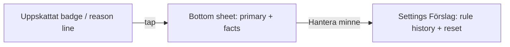
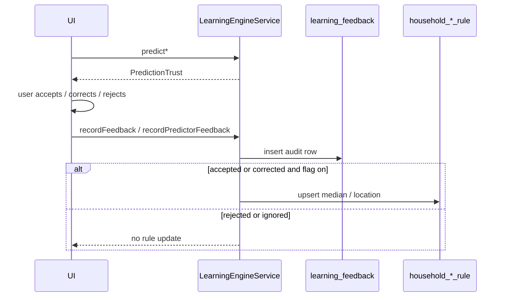

# Trust Layer — Skaffu Brain

*Unified trust, explanation, correction, and reset model for all Brain predictors. Design doc — implementation follows feature flags in [LEARNING_ENGINE.md](./LEARNING_ENGINE.md).*

**Relaterat:** [SKAFFU_BRAIN_MEMORY.md](./SKAFFU_BRAIN_MEMORY.md) (what is remembered) · [LEARNING_ENGINE.md](./LEARNING_ENGINE.md) (predictor wiring) · [SKAFFU_2026_VISION.md](./SKAFFU_2026_VISION.md) (product vision when Brain succeeds) · `src/lib/domain/learning/prediction-trust.ts` (shared types)

---

# Trust Model

Every Brain prediction is wrapped in a **trust envelope** so UI and APIs can answer: *where did this come from, how sure are we, can the user correct it, and what happens if they do?*

## Unified type: `PredictionTrust<T>`

```typescript
interface PredictionTrust<T> {
  kind: PredictorId;           // shelf_life | location | replenishment | future
  value: T;                    // predictor-specific payload
  source: TrustSource;
  confidence: ConfidenceScore; // 0–1 internal; never shown raw in UI by default
  tier: ConfidenceTier;        // high | medium | low — derived from confidence + source
  provenance: ProvenanceMeta;
  explanation: PredictionExplanation;
  feedbackEligible: boolean;
  modelVersion: string;
}
```

Domain stub: `src/lib/domain/learning/prediction-trust.ts`.

### `TrustSource` (user-visible provenance)

| `TrustSource` | When used | Swedish label (default) | Maps from today |
|---------------|-----------|---------------------------|-----------------|
| `household_rule` | Materialized rule (`household_*_rule`) with `sample_count >= 2` | **Från dina tidigare val** | `PredictionSource.household_rule`, `ExpiresOnSource.household_learned` |
| `heuristic` | Keyword / domain table (`shelf-life.ts`, `guessStorageLocation`) | **Uppskattat** (badge) + hint **Vanlig uppskattning** | `PredictionSource.heuristic`, `ExpiresOnSource.heuristic` |
| `evidence` | Read-only aggregate from purchase history (replenishment, cadence) | **Från dina kvitton** | *new* — `ReplenishmentSuggestion.reasonCode` evidence |
| `catalog` | Barcode / product DB lookup (future shelf-life or location prior) | **Från produktkatalog** | *not wired* |
| `llm` | Optional external model tier (`SHELF_LIFE_LLM_ENABLED`) | **Uppskattat** (never “AI” in UI) | `PredictionSource.external_model` → migrate name to `llm` |
| `manual` | User explicitly set value; not a suggestion | *(no badge)* | `ExpiresOnSource.user_set` |
| `default` | System fallback when chain returns nothing | **Standardvärde** | implicit cupboard / no expiry |

**Policy:** Swedish-first copy avoids “AI” and “maskin”. The muted **Uppskattat** badge is the universal “this might be wrong — tap to learn why / fix it” affordance. Household-learned values use a warmer label (“Från dina tidigare val”) to signal earned trust.

### Confidence score and tiers

Internal `confidence` stays on `PredictionResult` for ranking and analytics. UI shows **tier only** unless the user opens “Mer om förslaget”.

| Tier | Numeric range (V1) | Typical sources | UI treatment |
|------|-------------------|-----------------|--------------|
| `high` | ≥ 0.75 | `household_rule` (0.85), strong evidence replenishment | Badge optional; primary line states household memory |
| `medium` | 0.50 – 0.74 | `heuristic` (0.55), `llm` (0.70), cadence-only replenishment | **Uppskattat** badge; tap expands one-line hint |
| `low` | < 0.50 | Cold start, single sample, conflicting signals | Badge + inline “Ändra om det inte stämmer” nudge |

Tier is **not** identical to source: a `household_rule` with `sample_count === 2` stays `high` numerically but explanation should say “baserat på 2 rättelser” (early learning). Future: decay confidence when last feedback was `rejected`.

### `ProvenanceMeta`

Structured, non-PII metadata for explanations and settings:

```typescript
interface ProvenanceMeta {
  normalizedKey: string;
  displayName?: string;
  sampleCount?: number;        // household rules
  lastUpdatedAt?: string;      // rule.updated_at
  evidenceWindowDays?: number; // replenishment: RECEIPT_PATTERN_WINDOW_DAYS
  importCount?: number;
  purchaseCount?: number;
  location?: StorageLocation;  // shelf-life scoped by location
  purchasedAt?: string | null;   // receipt context
  storeLabel?: string | null;
}
```

### `feedbackEligible`

| Source | `feedbackEligible` | Rationale |
|--------|-------------------|-----------|
| `household_rule`, `heuristic`, `llm`, `evidence` | `true` | User can accept, correct, reject, or ignore |
| `manual` | `false` | User already asserted truth; edits are new manual values |
| `catalog`, `default` | `true` on first apply; becomes `manual` after user confirms | Catalog is a suggestion until saved |

Implicit feedback (accept without edit) is preferred; explicit correction always available per [SKAFFU_BRAIN_MEMORY.md](./SKAFFU_BRAIN_MEMORY.md) dangerous-memories policy.

---

# Explanation Model

Explanations use one schema across predictors. Copy is **template-driven** (i18n keys), filled from `ProvenanceMeta` and predictor output.

## Schema: `PredictionExplanation`

```typescript
interface PredictionExplanation {
  primary: string;           // one line — shown on badge expand, card subtitle, receipt row
  facts: string[];           // 0–3 bullets — sheet / “Mer om förslaget”
  learnMore?: string;        // optional paragraph — settings link, advanced only
  templateId: string;        // stable analytics id, e.g. shelf_life.household_rule
}
```

**Rendering rules**

1. **Primary** must stand alone (mobile badge expand, replenishment card).
2. **Facts** are optional; omit when primary is sufficient (low cognitive load on receipt review).
3. **Learn more** links to Settings → Förslag or help copy; never required to complete a flow.
4. Language: Swedish in product; `templateId` and `explain` dev strings in English in logs/tests only.

## Templates by predictor kind

### Shelf life (`kind: shelf_life`)

| Source | `templateId` | Primary (sv) | Facts (sv) |
|--------|--------------|--------------|------------|
| `household_rule` | `shelf_life.household` | `Ca {days} dagar — från dina tidigare val` | `Baserat på {count} köp/rättelser i {location}` · `Senast uppdaterad {date}` |
| `heuristic` | `shelf_life.heuristic` | `Uppskattat hållbarhetsdatum` | `Vanlig hållbarhet för liknande varor i {location}` |
| `llm` | `shelf_life.llm` | `Uppskattat hållbarhetsdatum` | `Kontrollera datumet om du är osäker` |
| `manual` | — | — | — |

**Example (mjölk, kyl, household rule, 5 samples):**

- Primary: *Ca 6 dagar — från dina tidigare val*
- Facts: *Baserat på 5 rättelser i kyl* · *Köpt 2026-06-10 på kvitto*

### Location (`kind: location`)

| Source | `templateId` | Primary (sv) | Facts (sv) |
|--------|--------------|--------------|------------|
| `household_rule` | `location.household` | `{product} brukar ligga i {location}` | `Från {count} tidigare val` |
| `heuristic` | `location.heuristic` | `Föreslagen plats: {location}` | `Vanlig plats för liknande varor` |

**Example (kyckling → kyl):**

- Primary: *Kyckling brukar ligga i kyl*
- Facts: *Från 3 tidigare val*

### Replenishment (`kind: replenishment`)

Replenishment today exposes `reasonCode` only ([`ReplenishmentSection.svelte`](../src/lib/components/organisms/ReplenishmentSection.svelte)). Trust layer wraps evidence as `source: evidence`.

| `reasonCode` | `templateId` | Primary (sv) | Facts (sv) |
|--------------|--------------|--------------|------------|
| `recurring_not_in_pantry` | `replenishment.recurring` | `Du köper {name} ofta — finns inte i skafferiet` | `{count} rader på senaste kvitton` |
| `cadence_overdue` | `replenishment.cadence` | `Dags igen? Senast för {days} dagar sedan` | `Du brukar köpa ungefär var {interval}:e dag` |
| `recurring_and_cadence` | `replenishment.both` | `Vanlig vara — dags att fylla på` | `{count} kvittorader · senast för {days} dagar sedan` |

**Example (mjölk, cadence overdue):**

- Primary: *Dags igen? Senast för 8 dagar sedan*
- Facts: *Du brukar köpa ungefär var 7:e dag* · *Från dina kvitton*

### Future predictors

New predictors (consumption velocity, favorites ranking, price memory hints) **must** register:

1. A `PredictorId` value
2. A `TrustSource` mapping
3. At least one `templateId` with primary + facts
4. Feedback routing to `recordPredictorFeedback` or a dedicated `record*Feedback`

---

# UX Patterns

Mobile-first, progressive disclosure. Reuse **Uppskattat** (`EstimatedBadge`) as the global trust entry point; extend it to carry full `PredictionTrust` rather than raw `source` strings.

## Surfaces

| Surface | What is predicted | Trust entry | Correction |
|---------|-------------------|-------------|------------|
| **Receipt import row** (`ReceiptBulkAddFlow`) | Expiry date, storage location | Badge beside date / location label; hint `Datum är uppskattade — ändra om något ser fel.` | Inline date input; location `<select>`; override clears estimate flag |
| **Inventory list** (`InventoryTableRow`) | Expiry (persisted) | `EstimatedBadge` on expiry cell when `isEstimatedExpirySource` | Row menu → edit item; expiry change → `recordFeedback` + toast `Tack — Skaffu justerar nästa gång` |
| **Replenishment card** (`ReplenishmentSection`) | Shopping list add | Reason line as **primary** (already shipped); add subtle “Från kvitton” chip | **Lägg till** = implicit accept; **Inte nu** = dismiss + `ignored` feedback |
| **Settings → Förslag** (`SuggestionsSettingsPanel`) | Learned rules inventory | Rule summary + sample count | Per-rule **Återställ** (tier-1 confirm) |

## Progressive disclosure ladder



**Level 1 — Badge / inline (default)**  
Muted badge or one-line reason. Tap toggles `primary` (+ existing `sourceHint`). No modal on first interaction.

**Level 2 — Sheet (P1)**  
Optional `PredictionExplainSheet.svelte`: primary, facts, actions **Ändra**, **Inte rätt**, **Glöm för den här varan**. Use on inventory long-press or replenishment “?” icon.

**Level 3 — Settings**  
Household memory catalog: all `household_*_rule` rows with reset. Link from sheet: “Se alla förslag i inställningar”.

## Correction flows

| User action | UX | Backend |
|-------------|-----|---------|
| **Accept implicit** | Save receipt line unchanged; add replenishment to list | `feedbackType: accepted` |
| **Inline edit** | Change date/location/qty before save | `corrected` if value ≠ predicted; else `accepted` |
| **Thumbs down / “Inte rätt”** | Sheet action; optional “sluta föreslå” for replenishment | `rejected` or `ignored`; replenishment also writes `receipt_pattern_dismissal` |
| **Edit in inventory** | Item edit form | `recordFeedback` / `recordLocationFeedback` when estimated source changes |
| **Consume before expiry** | Finish item early | `recordConsumptionVelocityFeedback` (implicit, strong signal only) |

**Receipt bulk** already posts hidden fields (`predictedExpiresOn_*`, `predictedLocation_*`, `modelVersion`) for feedback correlation — preserve this pattern; add optional `predictedConfidence_*` / `explanationTemplateId_*` when envelope is wired.

## Mobile-first consistency

- Touch targets: badge button ≥ 44px (existing `estimated-badge-btn`).
- Never block save on reading explanation.
- Correction thanks: `learning.correctedThanks` toast (shipped).
- Location override badge: `egen plats` when user changes predicted location (shipped).

## i18n keys (existing + proposed)

| Key | sv (today / proposed) |
|-----|------------------------|
| `learning.estimatedExpiry` | Uppskattat |
| `learning.sourceHousehold` | Utifrån ditt hushåll → **Från dina tidigare val** (align copy) |
| `learning.sourceDefault` | Vanlig uppskattning |
| `learning.sourceReceipt` | *new* Från dina kvitton |
| `learning.notRight` | *new* Inte rätt |
| `learning.forgetProduct` | *new* Glöm för {name} |
| `learning.explainMore` | *new* Mer om förslaget |

---

# Reset/Forget Model

Users need granular control: dismiss one suggestion, forget one product rule, or clear a whole signal class. **Audit** (`learning_feedback`) is append-only by default; reset targets **materialized rules** and **suppression lists**.

## Granularity matrix

| Intent | User copy (sv) | Scope | Deletes / writes |
|--------|----------------|-------|------------------|
| **Dismiss once** | Inte nu | Single replenishment suggestion | `receipt_pattern_dismissal`; `learning_feedback` `ignored` when flag on |
| **Forget product rule** | Återställ / Glöm detta | One `(normalized_key)` or `(normalized_key, location)` | `DELETE` from `household_shelf_life_rule` or `household_location_rule` — **shipped** in Settings |
| **Forget all for product** | Återställ alla uppskattningar för mjölk | All rules with same `normalized_key` (all locations + location rule) | *P2*: bulk delete shelf rules for key + location rule |
| **Forget signal type** | Återställ alla hållbarhetsminnen | All shelf-life rules for household | *P2*: `resetAllShelfLifeRules(householdId)` |
| **Household-wide brain reset** | Återställ alla förslag | All rules + dismissals | *P3*: rules + optional `receipt_pattern_dismissal`; **never** delete `receipt_purchase_line` |

## What is *not* deleted on reset

| Data | On per-rule reset | Rationale |
|------|-------------------|-----------|
| `learning_feedback` | **Retained** | Audit trail; re-learning can use history later |
| `receipt_purchase_line` | **Retained** | Evidence layer; replenishment still works |
| `inventory_items` | **Retained** | User pantry truth; only future predictions change |
| `receipt_pattern_dismissal` | **Retained** unless user clears “ignorerade förslag” | Negative preference |

After rule delete, next prediction falls back to `heuristic` / `evidence` — user sees **Uppskattat** again, not an error.

## Admin / settings surfacing

**Shipped (V1):** Settings → **Förslag** lists materialized rules with sample counts and per-row **Återställ** ([`SuggestionsSettingsPanel.svelte`](../src/lib/components/organisms/SuggestionsSettingsPanel.svelte)). Visible when `SHELF_LIFE_LEARNING_ENABLED` or `hasRules`.

**Planned (P2):**

- Section **Ignorerade inköpsförslag** (from `receipt_pattern_dismissal`) with undo
- **Återställ alla** per subsection (hållbarhet / plats / inköpsförslag)
- Link from explain sheet: “Glöm detta” → same as settings reset without navigation

**Flags:** `shouldShowSuggestionsSection` today keys off shelf-life flag; extend to `LOCATION_LEARNING_ENABLED` and replenishment prefs when those surfaces ship.

---

# Integration With Learning Engine

## Trust envelope on predictors

Today `LearningEngineService` returns predictor-specific shapes (`ShelfLifePrediction`, `LocationPrediction`) with `source`, `confidence`, `modelVersion`, optional English `explain` string. Target shape:

```typescript
// Application layer — learning-engine.service.ts
async predictShelfLife(...): Promise<PredictionTrust<ShelfLifePredictionValue> | null>;
async predictLocation(...): Promise<PredictionTrust<LocationPredictionValue> | null>;

// Replenishment — purchase-pattern.service / detectReplenishmentSuggestions
function toReplenishmentTrust(s: ReplenishmentSuggestion): PredictionTrust<ReplenishmentSuggestion>;
```

**Builder (domain):** `buildPredictionTrust(kind, result, provenance, locale)` in `prediction-trust.ts`:

1. Map `PredictionSource` → `TrustSource`
2. Compute `tier` from `confidenceToTier(confidence, source, sampleCount)`
3. Render `PredictionExplanation` from template registry (server-side or i18n keys + params)

Receipt parse API ([`ReceiptParseResult`](../src/lib/domain/receipt-line.ts)) should embed trust envelopes parallel to lines:

```typescript
interface ReceiptShelfLifePrediction {
  expiresOn: string;
  typicalDays: number;
  expiresOnSource: ExpiresOnSource; // legacy; derived from trust.source
  modelVersion: string;
  trust?: PredictionTrust<ShelfLifePredictionValue>; // additive
}
```

Keep `expiresOnSource` for inventory persistence until migration completes.

## Feedback loop



| `feedbackType` | Rule update | Replenishment |
|----------------|-------------|---------------|
| `accepted` | Update materialized median / location | Audit only (V1); future positive prior |
| `corrected` | Update with observed value | — |
| `rejected` | Skip update; future: decay confidence | — |
| `ignored` | Skip update | `receipt_pattern_dismissal` + feedback when `REPLENISHMENT_LEARNING_ENABLED` |

Correction toast (`learning.correctedThanks`) fires on inventory expiry edit when prior source was estimated — extend to location sheet actions.

## Feature flags alignment

| Flag | Trust behavior when off |
|------|-------------------------|
| `SHELF_LIFE_LEARNING_ENABLED` | No `household_rule` tier; heuristic only; no rule materialization |
| `PUBLIC_SHELF_LIFE_ESTIMATES_IN_RECEIPT` | Hide expiry predictions in receipt UI; inventory badge unchanged |
| `LOCATION_LEARNING_ENABLED` | Location heuristic only in receipt review |
| `REPLENISHMENT_LEARNING_ENABLED` | Dismiss still writes `receipt_pattern_dismissal`; skip `learning_feedback` |
| `SHELF_LIFE_LLM_ENABLED` | LLM tier stub returns null; never show LLM-specific copy |

Rollback = flags off; trust degrades to `heuristic` / `evidence`; rules and feedback remain ([LEARNING_ENGINE.md](./LEARNING_ENGINE.md)).

## API shapes (design-only)

```typescript
// GET /api/household/suggestions — extend snapshot
interface HouseholdSuggestionsSnapshot {
  shelfLifeRules: Array<ShelfLifeSuggestionView & { trust: PredictionTrust<{ typicalDays: number }> }>;
  locationRules: Array<LocationSuggestionView & { trust: PredictionTrust<{ location: StorageLocation }> }>;
  dismissedReplenishmentKeys?: string[]; // P2
}

// POST /api/learning/feedback — optional unified endpoint (P2)
interface RecordTrustFeedbackRequest {
  predictorId: PredictorId;
  normalizedKey: string;
  feedbackType: LearningFeedbackType;
  predicted: unknown;
  actual?: unknown;
  contextJson?: Record<string, unknown>;
  modelVersion: string;
}
```

Routes continue to call `event.locals.learningEngineService` only — no direct repo access from UI.

## Links

- **Memory catalog & dangerous memories:** [SKAFFU_BRAIN_MEMORY.md](./SKAFFU_BRAIN_MEMORY.md)
- **Predictor chain, flags, rollout:** [LEARNING_ENGINE.md](./LEARNING_ENGINE.md)
- **Implementation layering:** domain `prediction-trust.ts` → application envelope builders → `EstimatedBadge` / explain sheet → settings reset actions

---

## Current codebase gaps (V1 → trust-complete)

| Gap | Impact |
|-----|--------|
| No `PredictionTrust` on API responses | UI cannot show structured facts/learn-more |
| `explain` is English dev string in predictors | Does not meet Swedish product requirement |
| `ReceiptShelfLifePrediction` lacks `confidence` / explanation | Receipt row trust is source-only |
| Replenishment has `reasonCode` but no `PredictionTrust` wrapper | No unified “Inte rätt” / trust chip |
| `PredictionSource` lacks `evidence`, `catalog`, `manual`, `default` | Replenishment and catalog not in enum |
| Confidence tiers not used in UI | Only binary household vs default hint |
| No explain bottom sheet | Badge expand is level-1 only |
| Reset deletes rules but not linked dismissals | User may still not see replenishment after shelf reset |
| No bulk “forget all for product” or signal-type reset | Settings is per-rule only |
| `learning_feedback` not surfaced in UI | Audit exists but user cannot inspect history |
| i18n `sourceHousehold` copy differs from design target | Minor copy alignment needed |

These are intentional staging gaps behind flags; this doc is the contract for closing them without a monolithic “Brain hero” UI.
